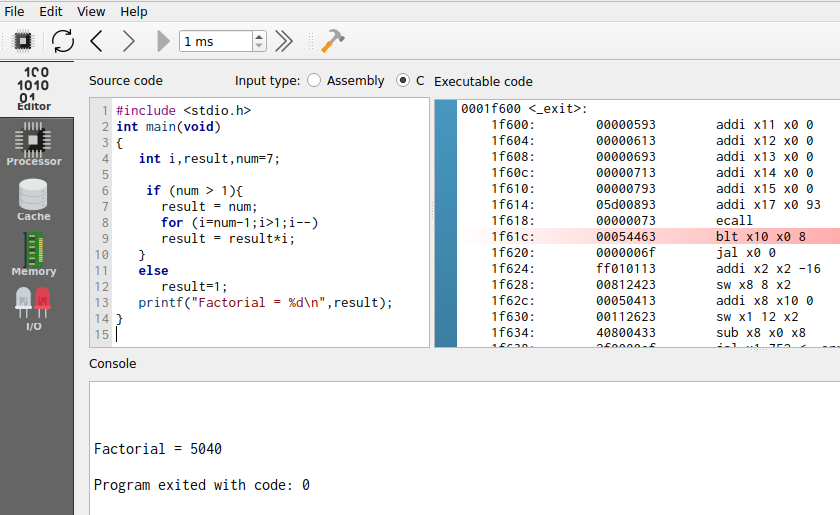
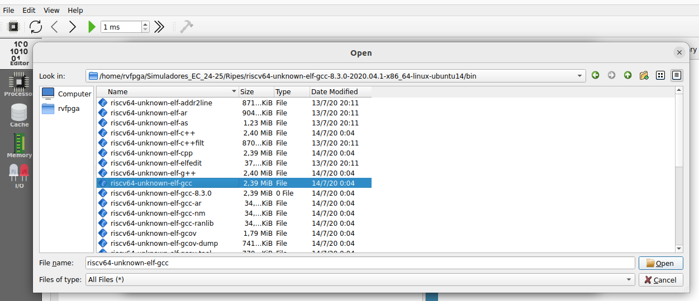
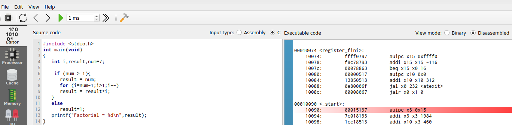

# Computer Fundamentals

This is a second-year course in the Computer Science degree program offered at UCM. You can see the contents of this course at [Computer Organization UCM](http://web.fdi.ucm.es/UCMFiles/pdf/FICHAS_DOCENTES/2024/8704.pdf).

The theoretical part of the course provides an in-depth analysis of the RISC-V architecture and assembly programming, along with single-cycle, multi-cycle, and pipelined processors as described in the Harris&Harris book. Exercises and labs are included to reinforce and deepen understanding of these topics. All these materials are provided through an external webpage, both in Spanish [FC2](https://www.fdi.ucm.es/profesor/mendias/FC2/FC2.html) and in English [FC2](https://www.fdi.ucm.es/profesor/mendias/FC2/FC2-en.html).

In this course, some exercises and labs are not only solved on paper but are also analyzed through simulations using [Ripes](https://github.com/mortbopet/Ripes). Students will use their own laptops or request one from the school. They will install and run Ripes natively on their devices. We next show the steps students must follow to complete the selected exercises, first about RISC-V Architecture (modules 2-4 of the course) and about the RISC-V Processors (modules 5-7 of the course).

*NOTE: This course will be conducted during the second semester of the 2024-2025 academic year (February 2025 to May 2025). During this time, the course materials will continue to be refined and enhanced.*

*NOTE: In case you want to obtain more information about this course (such as the slides, the exercises sheets, the solutions for the labs, etc.), you can contact ```dani02@ucm.es```*


### RISC-V Architecture and Assembly Language

#### Installation

1. Install Ripes: Follow the instructions provided at this link: [RipesInstallation](https://github.com/mortbopet/Ripes?tab=readme-ov-file#downloading--installation). Note that you could build the simulator yourself, but it is easier to use precompiled binaries. Specifically, use the latest version (v2.2.6) of the precompiled binaries available [here](https://github.com/mortbopet/Ripes/releases). Note that you must download the binaries that correspond to your Operating System.

2. Install the RISC-V Toolchain:
    - Follow the instructions provided at this link: [ToolchainInstallation](https://github.com/mortbopet/Ripes/blob/master/docs/c_programming.md#toolchain). Note that you could build the toolchain yourself, but again it is easier to use precompiled binaries. Use the *sifive/freedom-tools* precompiled version, available [here](https://github.com/sifive/freedom-tools/releases/tag/v2020.04.0-Toolchain.Only). Note that you must download the binaries that correspond to your Operating System.
    - Register the toolchain in Ripes following the instructions provided at this link: [ToolchainRegistration](https://github.com/mortbopet/Ripes/blob/master/docs/c_programming.md#toolchain-registration).

3. Read the information provided at this link: [Introduction to Ripes](https://github.com/mortbopet/Ripes/blob/master/docs/introduction.md). Specifically, read the following sections:
    - [Editor](https://github.com/mortbopet/Ripes/blob/master/docs/introduction.md#the-editor-tab)  
    - [Simulation Controls](https://github.com/mortbopet/Ripes/blob/master/docs/introduction.md#controlling-the-simulator)  
    - [Memory Viewer](https://github.com/mortbopet/Ripes/blob/master/docs/introduction.md#the-memory-tab)  

#### Configuration and basic use

1. Start the simulator in your device.

2. Environment:
    - On the left side you can see the different windows that can be displayed: Editor, Processor, Cache, Memory, I/O.
    - Depending on the selected window, the view will change. In the following figure we see the Editor window, in which you can enter code in Assembler or C in the left window, the compiled/assembled code will be displayed in the middle window, and it shows the registers of the simulated processor on the right.

<p align="center">
  
</p>

3. Before simulating the program, select the Single Cycle processor:

<p align="center">
  
</p>

4. To simulate a program, we simply type or copy it into the window on the left. For example, in the following figure you can see the program of Exercise 1 (you can find the code [below](https://github.com/artecs-group/RVfpga-sim-addons/blob/main/Computer_Organization/Lab1/README.md#exercise-1) and try it in your simulator). On the right you can see the disassembled version.

<p align="center">
  
</p>

5. The top menu allows us to control the simulation. By hovering the mouse over each button we are informed about its functionality.

<p align="center">
  
</p>

6. We can execute the code step by step:
    - The “minor” and “major” arrows in the top menu allow us to go forward or backward instruction by instruction.
    - The current instruction is shown highlighted in red (e.g., in the figure ```lw s3, 0(t2)```).

<p align="center">
  
</p>

7. Disassembled/binary code window and registers window:
    - The registers will be updated as we progress through the program.
    - When a register is updated, it will be highlighted in yellow.
    - The middle window shows the disassembled code. Note that, unlike the source, it only includes instructions (not pseudo-instructions).

<p align="center">
  
</p>

8. The Memory window allows us to visualize the different memory sections. The figure shows the .text section, which includes the text of the code. At the bottom you must select, from the “Go to section” menu, the .text section. You can check that the hexadecimal code corresponds to the program instructions in the Editor.

<p align="center">
  
</p>

9. At the bottom, in the “Go to section” menu, we can switch to the .data section. You can check that the data correspond to the vector components in the Editor.

<p align="center">
  
</p>

10. Set up the simulator to compile and run C programs. Follow these steps (the full instructions are available at this [link](https://github.com/mortbopet/Ripes/blob/master/docs/c_programming.md)):

  - Download the RISC-V toolchain:
      - The Ripes simulator webpage recommends to download the pre-built toolchain [here](https://github.com/sifive/freedom-tools/releases/tag/v2020.04.0-Toolchain.Only). This is the procedure we follow here, but you can also download the toolchain sources and compile them yourself.
      - Copy the downloaded file to ```/home/rvfpga/Simuladores_EC_24-25/Ripes/```
      - Unzip the file ```riscv64-unknown-elf-gcc-8.3.0-2020.04.1-x86_64-linux-ubuntu14.tar.gz``` by right-clicking on the file and selecting "Extract Here."

<p align="center">
  
</p>


  - Set the compiler path in Ripes:
      - In the top menu of Ripes, open "Edit-Settings":

      <p align="center">
        
      </p>


      - In the window that opens, go to the "Compiler" tab.

      <p align="center">
        
      </p>


      - In the "Browse" section, select the C compiler (the file named ```riscv64-unknown-elf-gcc```), which is located in the following path (you can copy and paste the path in the "Compiler path"):

      ```
      /home/rvfpga/Simuladores_EC_24-25/Ripes/riscv64-unknown-elf-gcc-8.3.0-2020.04.1-x86_64-linux-ubuntu14/bin/riscv64-unknown-elf-gcc
      ```

      <p align="center">
        
      </p>

      <p align="center">
        
      </p>


  - Set the appropriate arguments:
      - Compiler arguments: ```-O1```
      - Linker arguments: ```-static-libgcc -lm```

      <p align="center">
        
      </p>


11. To simulate a C program, write or copy it into the left window, marking "Input Type" as C language. For example, the program from Exercise 4 (find it [below](https://github.com/artecs-group/RVfpga-sim-addons/blob/main/Computer_Organization/Lab1/README.md#exercise-4)) can be seen in the following figure (you can find the code below):

<p align="center">
  
</p>

12. Next, compile the program by clicking on the hammer icon. If the program is correct, the disassembled version will appear in the central window:

<p align="center">
  
</p>

13. Run the program by clicking the "Fast Execution" button. The result of the factorial calculation will appear in the console:

<p align="center">
  
</p>


### RISC-V Single/Multi-Cycle and Pipelined Processors

To-Do.

