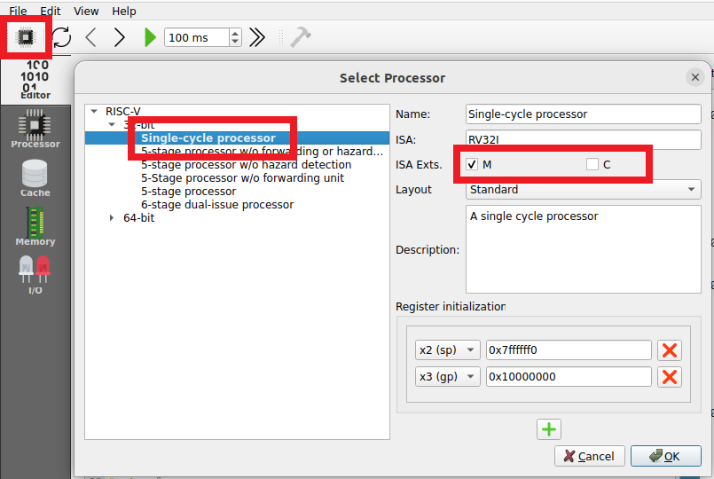
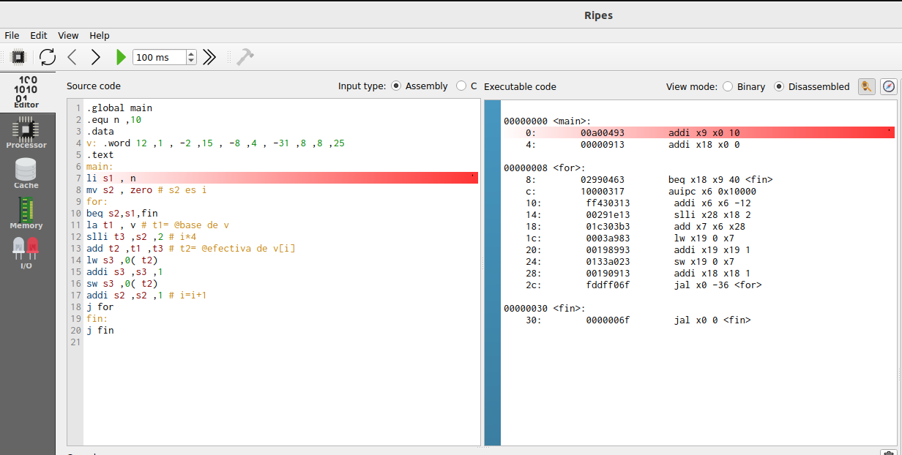
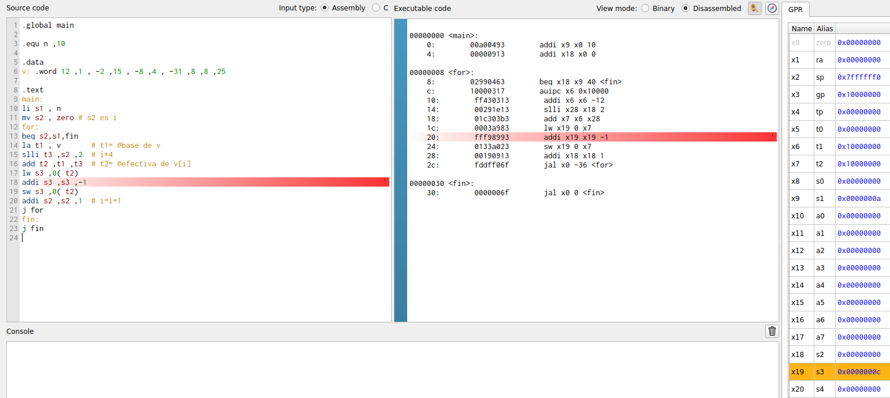
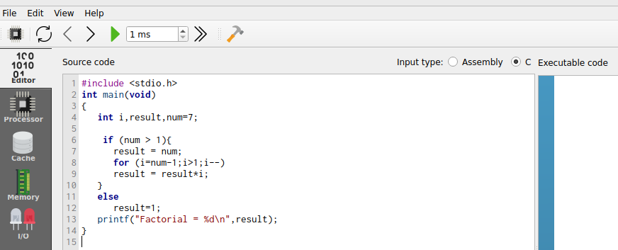
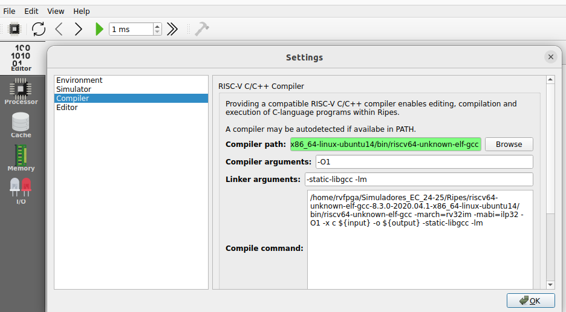
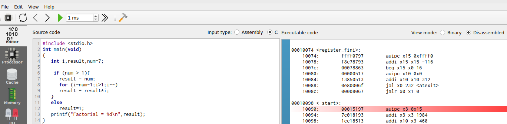
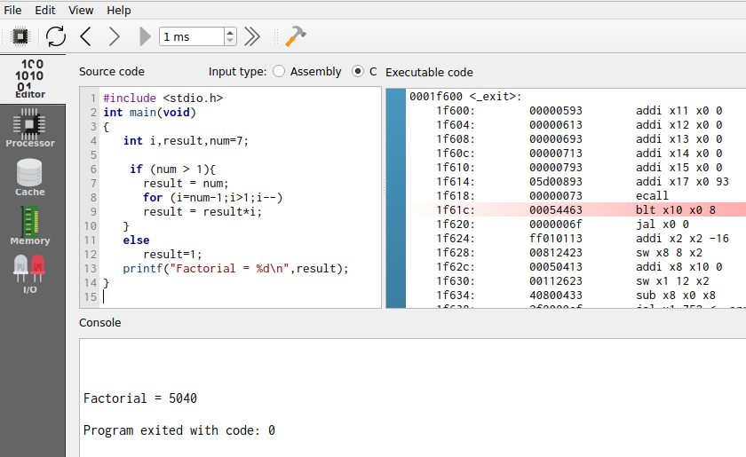

# RISC-V Architecture and Assembly Language
We provide instructions, exercises, and labs to help students learn the RISC-V architecture and program in RISC-V assembly. Specifically, follow these items:
1. Install Ripes following the steps stated below at [InstallRipes](https://github.com/artecs-group/RVfpga-sim-addons/blob/main/Computer_Fundamentals/RiscvArchitectureAssembly/README.md#installation-of-ripes).
2. Start using Ripes following the steps stated below at [UseRipes](https://github.com/artecs-group/RVfpga-sim-addons/blob/main/Computer_Fundamentals/RiscvArchitectureAssembly/README.md#basic-use-of-ripes).
3. Do the initial tests provided below at [InitialTests]().
4. Complete all exercises included below at [Exercises](https://github.com/artecs-group/RVfpga-sim-addons/blob/main/Computer_Fundamentals/RiscvArchitectureAssembly/README.md#exercises-about-risc-v-architecture-and-assembly-in-ripes).
5. Work on the labs as detailed below at [Labs](https://github.com/artecs-group/RVfpga-sim-addons/blob/main/Computer_Fundamentals/RiscvArchitectureAssembly/README.md#labs-about-risc-v-architecture-and-assembly-in-ripes).

## Installation of Ripes

1. Install Ripes: Follow the instructions provided at this link: [RipesInstallation](https://github.com/mortbopet/Ripes?tab=readme-ov-file#downloading--installation). Note that you could build the simulator yourself, but it is easier to use precompiled binaries. Specifically, use the latest version (v2.2.6) of the precompiled binaries available [here](https://github.com/mortbopet/Ripes/releases). Note that you must download the binaries that correspond to your Operating System.

2. Install the RISC-V Toolchain:
    - Follow the instructions provided at this link: [ToolchainInstallation](https://github.com/mortbopet/Ripes/blob/master/docs/c_programming.md#toolchain). Note that you could build the toolchain yourself, but again it is easier to use precompiled binaries. Use the *sifive/freedom-tools* precompiled version, available [here](https://github.com/sifive/freedom-tools/releases/tag/v2020.04.0-Toolchain.Only). Note that you must download the binaries that correspond to your Operating System.
    - Register the toolchain in Ripes following the instructions provided at this link: [ToolchainRegistration](https://github.com/mortbopet/Ripes/blob/master/docs/c_programming.md#toolchain-registration).


## Basic Use of Ripes

1. Start the simulator in your device. Read the information provided at this link: [Introduction to Ripes](https://github.com/mortbopet/Ripes/blob/master/docs/introduction.md). Specifically, read the following sections:
    - [Editor](https://github.com/mortbopet/Ripes/blob/master/docs/introduction.md#the-editor-tab)  
    - [Simulation Controls](https://github.com/mortbopet/Ripes/blob/master/docs/introduction.md#controlling-the-simulator)  
    - [Memory Viewer](https://github.com/mortbopet/Ripes/blob/master/docs/introduction.md#the-memory-tab)  

2. Environment:
    - On the left side you can see the different windows that can be displayed: Editor, Processor, Cache, Memory, I/O.
    - Depending on the selected window, the view will change. In the following figure we see the Editor window, in which you can enter code in Assembler or C in the left window, the compiled/assembled code will be displayed in the middle window, and it shows the registers of the simulated processor on the right.

<p align="center">
  
</p>

#### Configuration

3. Before simulating the program, select the Single Cycle processor, enable the M extension and disable the C extension:

<p align="center">
  
</p>

#### RISC-V Assembly Program

4. The following RISC-V assembly program subtracts 1 to each element of vector ```v```.

```
  .global main
  
  .equ n ,10
  
  .data
  v: .word 12 ,1 , -2 ,15 , -8 ,4 , -31 ,8 ,8 ,25
  
  .text
  main:
    li s1 , n
    mv s2 , zero # s2 es i
    for:
      beq s2,s1,fin
      la t1 , v 		# t1= @base de v
      slli t3 ,s2 ,2 	# i*4
      add t2 ,t1 ,t3 	# t2= @efectiva de v[i]
      lw s3 ,0( t2)
      addi s3 ,s3 ,-1
      sw s3 ,0( t2)
      addi s2 ,s2 ,1 	# i=i+1
      j for
    fin:
    j fin
```

Copy the previous program into the left-most window of the editor tab in your Ripes simulator. The disassembled version will be generated, as shown below.

<p align="center">
  
</p>

5. The top menu allows us to control the simulation. By hovering the mouse over each button we are informed about its functionality.

<p align="center">
  
</p>

6. We can execute the code step by step:
    - The “minor” and “major” arrows in the top menu allow us to go forward or backward instruction by instruction.
    - The current instruction is shown highlighted in red.
    - The registers will be updated as we progress through the program.
    - When a register is updated, it will be highlighted in yellow.
    - The middle window shows the disassembled code. Note that, unlike the source, it only includes instructions (not pseudo-instructions).

<p align="center">
  
</p>

7. The Memory window allows us to visualize the different memory sections. The figure shows the .text section, which includes the text of the code. At the bottom you must select, from the “Go to section” menu, the .text section. You can check that the hexadecimal code corresponds to the program instructions in the Editor.

<p align="center">
  
</p>

8. At the bottom, in the “Go to section” menu, we can switch to the .data section. You can check that the data correspond to the vector components in the Editor.

<p align="center">
  
</p>

#### C Program

9. To simulate a C program, write or copy it into the left window, marking "Input Type" as C language. For example, the next C program can be seen in the following figure (you can test it in your simulator):

<p align="center">
  
</p>

```
int main(void)
{
   int i,result,num=7;

   if (num > 1){
      result = num;
      for (i=num-1;i>1;i--)
      result = result*i;
   }
   else
      result=1;

   printf("Factorial = %d",result);

   while(1);
}
```

10. On the top menu, set the appropriate compiler arguments in ```Edit-Settings```:
    - Compiler arguments: ```-O1``` (you can select other options such as ```-O0```, ```-O2```, ```-O3```, ```-Os```)

  <p align="center">
    
  </p>

11. Next, compile the program by clicking on the hammer icon. If the program is correct, the disassembled version will appear in the central window:

<p align="center">
  
</p>

12. Run the program by clicking the "Fast Execution" button. The result of the factorial calculation will appear in the console:

<p align="center">
  
</p>

13. Recompile the program with different optimization levels (see step 11 above) and compare the assembled programs generated by each of them.

14. Recompile the program with a -O0 optimization level and the following two different scenarios: M extension enabled and M extension disabled (see step 3 above). Compare the assembly code generated for the ```main``` function in each scenario.


## Initial Tests in Ripes
Do the following basic tests to understand some of the instructions in the RISC-V ISA. These examples are based on the slides provided at: [SlidesModule2](https://www.fdi.ucm.es/profesor/mendias/FC2/FC2module2.pdf).


## Exercises about RISC-V Architecture and Assembly in Ripes
We next provide a selection of the exercises proposed in Module 3 ([ExercisesModule3](https://www.fdi.ucm.es/profesor/mendias/FC2/FC2problems3.pdf)). In all cases, before completing the proposed tasks, you should try to implement the programs in RISC-V assembly and then compare your solution with the one provided. The remaining exercises provided in the sheet ([ExercisesModule3](https://www.fdi.ucm.es/profesor/mendias/FC2/FC2problems3.pdf)) should also be resolved and tested by the students in Ripes.

### Exercise 1
Write a RISC-V assembly program that implements the following code.

```
int x = 10, y = 5;
if (x >= y) {
 x = x + 2;
 y = y - 2;
}
```

Once you have completed your version of the program in assembly, compare it with the solution provided below and test the programs in Ripes. Do the following tasks (in this first exercise, we provide an example solution for these tasks, which can serve as a useful reference for completing the remaining exercises in a similar way):
- Analyze the assembled code. Pay special attention to the translation of pseudo-instructions to RISC-V instructions.
- Simulate the program in Ripes step-by-step. Test different values for ```x``` and ```y```.
- Analyze the registrs during the execution.
- Analyze the memory state at the beginning and at the end of the execution. Analyze both the ```.text``` and the ```.data``` sections.


*SOLUTION:*

```
.global main # Hace global la etiqueta " main "

.data # sección de datos iniciados
x: .word 10 # declara una variable de 32 bits de valor 10
y: .word 5

.text # sección de instrucciones
main:
    la t0,x # pseudo instrucción t0=@x
    la t1,y # pseudo instrucción t1=@y
    lw s1,0(t0) # s1 = 10
    lw s2,0(t1) # s2 =5
    blt s1,s2, fin # condición inversa s1 <s2
        addi s1,s1,2 # x=x+2
        addi s2,s2,-2 # y=y -2
    sw s1,0(t0)
    sw s2,0(t1)
fin:
j fin
```

*EXAMPLE SOLUTION FOR THE TASKS:*

**Analyze the assembled code. Pay special attention to the translation of pseudo-instructions to RISC-V instructions.**

On the right window you can see the assembled code generated by Ripes:


You can analyze the translation of each instruction. As an example, the first pseudo-instruction (```la t0,x```) is translated into two RISC-V instructions, where the first instruction (```auipc x5 0x10000```) adds the current PC (0x0) and a 32-bit value with the low 12 bits as 0 and the high 20 bits coming from the U-type immediate (0x10000), and the second instruction (```addi x5 x5 0```) changes nothing in this case. Note that ```t0``` is the alias for ```x5```. Note also that the resulting value is the address where variable x is stored in memory (0x10000000).

**Analyze the registrs during the execution.**

You can analyze the registers after each cycle. As an example, we next show the register file at the end of the ```if``` condition, which is met in this case:


- x9=0xc, which is the result of adding 0x2 to the initial value of x (0xa).
- x18=0x3, which is the result of subtracting 0x2 to the initial value of y (0x5).

**Analyze the memory state at the beginning and at the end of the execution. Analyze both the ```.text``` and the ```.data``` sections.**

This is the .data section at the beginning:


This is the .data section at the end:


Finally, this is the .text section, that includes the assembled program in binary. You can compare it with the one shown in the Editor tab:


### Exercise 2
Write a RISC-V assembly program that implements the following code. 

```
int x = 5, y = 10;
if (x >= y) {
 x = x + 2;
 y = y + 2;
}
else {
 x = x - 2;
 y = y - 2;
}
```

Once you have completed your version of the program in assembly, compare it with the solution provided below and test the programs in Ripes. Do the same tasks as in Exercise 1.

*SOLUTION:*

```
.global main

.data # sección de datos iniciados
x: .word 5
y: .word 10


.text # sección de instrucciones
main:
    la t0,x # pseudoinstrucción t0=@x
    la t1,y # pseudoinstrucción t1=@y
    lw s1,0(t0) # s1 =5
    lw s2,0(t1) # s2 =10
    blt s1,s2, else # condición inversa s1 <s2
        addi s1,s1,2 # x=x+2
        addi s2,s2,2 # y=y+2
    j fin_if
    else:
        addi s1,s1,-2 # x = x -2;
        addi s2,s2,-2 # y = y -2
    fin_if:
    sw s1,0(t0)
    sw s2,0(t1)
fin:
j fin
```


### Exercise 6
The following program calculates the greatest common divisor of two numbers ```a``` and ```b``` according to the Euclidean algorithm. Write a RISC-V assembly program that implements the following code.

```
int a=5, b=15, gcd;
while (a  b) {
 if (a > b)
 a = a - b;
 else
 b = b - a;
}
gcd = a;
```

Once you have completed your version of the program in assembly, compare it with the solution provided below and test the programs in Ripes. Do the same tasks as in Exercise 1.

*SOLUTION:*

```
.global main

.data
a: .word 5
b: .word 15
mcd: .word 0

.text
main:
    la t1,a
    lw s1,0(t1) # s1 es a
    la t2,b
    lw s2,0(t2) # s2 es b
    while:
        beq s1,s2,fin_while
            ble s1,s2,else
                sub s1,s1,s2 # a=a-b
            j fin_if
            else:
                sub s2,s2,s1 # b=b-a
            fin_if:
        j while
    fin_while:
    la t3,mcd # t3 = @mcd
    sw s1,0(t3)
fin:
j fin
```


### Exercise 8
The following code increments the components of a vector with 10 elements. 

```
#define N 10
int V[N] = {12, 1, -2, 15, -8, 4, -31, 8, 8, 25};
for (i = 0; i < N; i++)
 V[i] = V[i] + 1;
```

This is a possible implementation in RISC-V assembly.

```
.global main

.equ n,10

.data
v: .word 12,1,-2,15,-8,4,-31,8,8,25

.text
main:
    li s1,n # s1=n
    mv s2,zero # s2 es i
    for:
    beq s2,s1,fin
        la t1,v # t1= @base de v
        slli t3,s2,2 # i*4
        add t2,t1,t3 # t2= @efectiva de v[i]
        lw s3,0(t2)
        addi s3,s3,1
        sw s3,0(t2)
        addi s2,s2,1 # i=i+1
    j for
fin:
j fin
```

Run the code and answer the following questions. Add screenshots of the execution to complement your answers.

- Briefly explain what the code does.
- Provide examples of the different addressing modes we explained in theory based on the instructions in the program (use examples of instructions, not pseudo-instructions).
- What instruction does the pseudo-instruction ```li s1, n``` translate to?
- What instruction does the pseudo-instruction ```mv s2, zero``` translate to?
- To which machine instruction in hexadecimal does the pseudo-instruction ```mv s2, zero``` translate? Considering the format of RISC-V instructions, explain which fields the machine instruction contains.
- Take a screenshot of the memory viewer clearly identifying, one by one, the instructions that make up the for loop. Are they properly aligned?
- Take a screenshot of the memory viewer at the end of each iteration, showing how the vector evolves.
- In this code, a simple modification can be made to improve its performance. Write modified code, explain why it improves efficiency, and show a screenshot in which the final vector is visible in memory.
- Modify the code so that it subtracts 1 from the components whose stored value is odd and adds 1 to the components whose stored value is even.


### Exercise 9
The following code counts the number of components greater than 0 within a vector with 6 elements. Translate it into RISC-V assembly code. 

```
#define N 6
int V[N] = {14, 1, -2, 7, -8, 4};
int count = 0;
for (i = 0; i < N; i++) {
 if (V[i] > 0)
 count = count + 1;
}
```

Once you have completed your version of the program in assembly, compare it with the solution provided below and test the programs in Ripes. Do the same tasks as in Exercise 1.

*SOLUTION:*

```
.global main

.equ n,6

.data
v: .word -14,1,-2,-7,-8,4
count: .word 0

.text
main:
la t1,v # t1 tiene la dirección base de v
li t2,n # t2=n
li t3,0 # t3 es el índice
li s2,0 # s2 = count =0
for:
   bge t3,t2,fin_for
   slli t5,t3,2 # t5=i*4
   add t5,t5,t1 # @=i*4+ @b
   lw s1,0(t5) # @s1=v[i]
   li t6,0 # t6 =0
   if:
   ble s1,t6,fin_if
       addi s2,s2,1
   fin_if:
   addi t3,t3,1
   j for
fin_for:
la t1,count
sw s2,0(t1)
end:
j end
```


### Exercise 16
Write a C and a RISC-V assembly program to implement a variant of the bubble sort algorithm. This variant sorts the elements of the vector according to the following code. 

```
do {
 swapped = false
 for (i = 0; i <= N-2; i++){
 if (V[i] > V[i+1]){
 swap( V[i], V[i+1] )
 swapped = true
 }
} while swapped
```

*PROGRAM IN C:*

```
#define N 4

int V[N]={5,2,3,1};

void main(void)
{
   int swapped=1, i;

   while(swapped){
       swapped=0;
       for (i=0; i<(N-1); i++){
           if (V[i] > V[i+1]){
               swap(&V[i], &V[i+1]);
               swapped=1;
           }
       }
   }

   while(1);

}

void swap(int *V, int *W){
   int temp;
   temp=*V;
   *V=*W;
   *W=temp;
}
```

*PROGRAM IN RISC-V ASSEMBLY:*

```
.global main
.equ n, 10

.data
V: .word 2,5,6,0,9,4,6,5,-10,-1

.text
main:
li s4,n # s1 =n
addi s4,s4,-1
do:
   mv s3,zero # s3= swapped = false
   mv s5,zero # t1=i
   for:
       bge s5,s4, fin_for
       la t2,V # t2= @base v
       slli t3,s5,2 # i*4
       add a0,t3,t2 # @i
       lw s1,0(a0) # V[i]
       addi a1,a0,4 # @i +1
       lw s2,0(a1) # V[i +1]
       if:
           ble s1,s2,fin_if
           call swap
           li s3,1 # swapped = true
       fin_if:
       addi s5,s5,1
   j for
   fin_for:
   li t4,1
beq s3,t4,do
fin:
j fin

swap:
    addi sp,sp,-8
    sw s1,0(sp)
    sw s2,4(sp)
    lw s1,0(a0)
    lw s2,0(a1)
    sw s1,0(a1)
    sw s2,0(a0)
    lw s1,0(sp)
    lw s2,4(sp)
    addi sp,sp,8
jr ra # también ret
```

Complete the following tasks (do them for the two programs, unless stated differently):
- Test the execution of the programs step-by-step. Take several screenshots during the execution of the program at relevant points, showing the instructions, registers, and memory. For example, you can show the evolution of memory as the data gets sorted.
- Explain the prologue for the ```swap``` function.
- Is the ```swap``` function a leaf or non-leaf subroutine? What is the difference, and how does it affect the prologue?
- Copy the instructions that prepare the input parameters for the ```swap``` subroutine. Are the parameters passed by value or by reference? Why?
- Finally, compile the C code with optimization levels -O0 and -O1, and repeat the previous item. This item can only be tested in Whisper or Ripes, not on the board.


### Exercise 17
Given the following RISC-V assembly code:

```
.global main

.equ n ,5

.data
res: .word 0

.text
main:
  li a1 , n
  la s3 , res
  call factorial
  sw a0 ,0( s3 )
  fin:
  j fin

factorial:
  # prologo
  addi sp , sp , -8
  sw s1 ,0( sp )
  sw s2 ,4( sp )
  # cuerpo
  li s1 ,1
  mv s2 , a1
  li s3 ,1
  for:
    ble s2 , s3 , fin_for
    mul s1 , s1 , s3
    addi s2 , s2 , -1
    j for
  fin_for:
  mv a0 , s1
  # epilogo
  lw s1 ,0( sp )
  lw s2 ,4( sp )
  addi sp , sp ,8
  jr ra
```

Run the code and answer the following questions. Add screenshots to complement your answers.

- The code contains three errors. Identify and correct them. Copy the modified code, explain the corrections, and include a screenshot illustrating its functionality.
- Find examples of each of the formats used in RISCV (R, I, S, B, U, J) and explain these formats in detail based on the examples shown.
- What values does the stack contain, and what is the value of sp during the execution of the subroutine? Justify your answer.
- Suppose the processor did not include the M extension (you can research this extension online). Perform the multiplication in the factorial function by calling a new subroutine that calculates the multiplication through successive additions (within a loop, add the multiplicand as many times as indicated by the multiplier). Show and explain the modifications you made and illustrate their execution. Emphasize the management involved in introducing a new nested subroutine, particularly in terms of saving registers and the evolution of the stack.

### Extension to Exercise 17
The following code is a possible implementation in C of the computation of the factorial of a random integer number. Analyze the assembly functions generated with different optimization levels (-O0, -O1, -O2, -O3, -Os), and explain the differences between them. Analyze the simulation of each scenario in Ripes.

```
#include <stdio.h>
#include <stdlib.h>
#include <time.h>

int main(void)
{
   int i,result,num;

   srand(time(NULL));
   num = (rand() % 10) + 1;

   if (num > 1){
      result = num;
      for (i=num-1;i>1;i--)
      result = result*i;
   }
   else
      result=1;

   printf("Factorial = %d",result);

   while(1);
}
```


### Exercise 18
Given two points ```P1(x1, y1)``` and ```P2(x2, y2)```, their Chebyshev distance can be calculated with the following algorithm: 

```
int chebyshev(int x1, int y1, int x2, int y2)
{
 int d1, d2;
 d1 = abs(x1 - x2)
 d2 = abs(y1 - y2)
 if (d2 > d1)
 d1 = d2;
 return d1;
}
```

Write a RISC-V assembly function, ```chebyshev(x1,x2,y1,y2)```, which will receive the coordinates of two points P1 and P2 and will return their Chebyshev distance. This function will call another function that calculates the absolute value of a given number.

Then, program the following code and test it in Ripes. The program stores (into a vector D) the Chebyshev distances of a point P to each of the points within a vector V with N elements. P, V y D will be global variables. Vector V will contain 2N integers such that the i-th point will have coordinates (x, y) = (V[2*i], V[2*i + 1]) 

```
#define N, ...
int Px, Py; // x , y coordinates of point P
int V[2N]; //Vector with N points V=[x0,y0,x1,y1,...]
int D[N]; //Vector with N distances
void main(void)
{
int i;
for (i = 0; i < N; i++)
 D[i] = chebyshev(Px, Py, V[2*i], V[2*i + 1]);
}
```

Once you have completed your version of the program in assembly, compare it with the solution provided below and test the programs in Ripes. Do the following tasks:
- Analyze and simulate the RISC-V assembly program in Ripes. Pay special attention to the RISC-V calling convention.

*SOLUTION:*

```
.global main
.equ n,5 #nº de puntos a testear (2*n componentes)

.data
P: .word 4,5 # coordenadas x e y del punto P
V: .word 1,2,-3,4,5,9,17,-15,20,12 # Vector de N puntos V=[x0,y0,x1,y1,...]
sol: .word 0,0,0,0,0

.text
main:
mv s1,zero
li s2,n
la s3,V
for:
bge s1,s2,fin_for
la s6,P
lw a0,0(s6)
lw a1,4(s6)
slli s4,s1,1
slli s4,s4,2
add s4,s4,s3
lw a2,0(s4)
lw a3,4(s4)
call chebyshev
la s5,sol
slli s4,s1,2
add s4,s4,s5
sw a0,0(s4)
addi s1,s1,1
j for
fin_for:
j fin_for

chebyshev:
#prólogo
addi sp,sp,-12
sw s1,0(sp)
sw s2,4(sp)
sw ra,8(sp)
# cuerpo
d1:
sub s1,a0,a2 #x1 -x2
mv a0,s1
call abs
mv s1,a0
d2:
sub s2,a1,a3 #y1 -y2
mv a0,s2
call abs
mv s2,a0
if:
ble s2,s1,fin_call
mv s1,s2
fin_call:
mv a0,s1
# epílogo
lw s1,0(sp)
lw s2,4(sp)
lw ra,8(sp)
addi sp,sp,12
ret

abs:
bgez a0,pos
sub a0,zero,a0
pos:
ret
```


## Labs about RISC-V Architecture and Assembly in Ripes

### Lab 1

*NOTE: The script for the RISC-V Eclipse-based simulator is available here: [Lab 1 Spanish](https://drive.google.com/file/d/1vD-dEj_I9e0J7_fJanic2wUBde0CfJug/view?usp=drive_link) and [Lab 1 English](https://drive.google.com/file/d/1uVBFE2tmdGbNSWV2WaadVvWc9HtvPOEh/view?usp=drive_link).*

Test the following C example in Ripes:

```
main(){
   int a = 5 , b = 8;
   int mayor ;
  
   if ( a > b ) mayor = a ;
   else mayor = b ;
}
```

Test the following RISC-V assembly example code in Ripes:

```
.data
A: .word 5
B: .word 8
MAYOR: .word 0

.text
.global main

main:
  la t2 , A
  lw t0 , 0( t2 )
  la t3 , B
  lw t1 , 0( t3 )
  ble t0 , t1 , mayb
    la t4 , MAYOR
    sw t0 , 0( t4 )
    j fin
  mayb:
    la t4 , MAYOR
    sw t1 , 0( t4 )
fin:
j fin
```

Develop a RISC‐V assembly program that implements the following high‐level behavior. Build and debug the project in Ripes, and confirm that the result is correct.

```
#define N 10
int res = 0 ;
for (int i = 0; i < N; i++) {
    res += i;
}
```

Modify the previous program by adding a new output variable, ```res2```, where only the values of ```i``` that are multiples of 4 are accumulated. A number is a multiple of 4 if its two least significant binary bits are 00. To check this, use an ```and``` operation between ```i``` and 3 (which is 11 in binary) and verify if the result is 0 (multiple of 4) or not.

### Lab 2

*NOTE: The script for the RISC-V Eclipse-based simulator is available here: [Lab 2 Spanish](https://drive.google.com/file/d/1Arfs1Qzv8lMRCRRB0M0ugKqZXWSvwogY/view?usp=drive_link) and [Lab 2 English](https://drive.google.com/file/d/1wIz-KVbmyh0cShWmqq17FFPhKjqD4m2V/view?usp=drive_link).*

Develop a RISC‐V assembly program with the high‐level behavior shown next. This program will sort an integer vector V into a target vector W in ascending order. Note that the elements of W will be the elements of V, but sorted from minimum to maximum. The elements of V will be replaced with the value INT_MAX after they have been sorted in W. Build and debug the project in Ripes and confirm that the result is correct.

```
#define N 8
#define INT_MAX 65536

int V[N] = {‐7,3,‐9,8,15,‐16,0,3};
int W[N];
int min , index ;

for (j = 0; j < N; j++) {
    min = INT_MAX ;
    for (i = 0; i < N; i++) {
        if (V[i] < min ) {
            min = V[i];
            index = i ;
        }
    }
    W[j] = V[index];
    V[index] = INT_MAX ;
}
```

Create a new global integer variable called ```NumMay``` initialized to 0. At the end of the execution, this variable should store the number of elements in the vector ```V``` that are greater than or equal to five.

Include a new vector ```C``` where the data is sorted in descending order.

Include two new vectors, ```D``` and ```E```, in the code. The first should store the even elements in ascending order, and the second should store the odd elements in ascending order.

### Lab 3

*NOTE: The script for the RISC-V Eclipse-based simulator is available here: [Lab 3 Spanish](https://drive.google.com/file/d/1h-30tYPEItEp7HP_PFog_on8usOPHAIP/view?usp=drive_link) and [Lab 3 English](https://drive.google.com/file/d/1DG843vUgz7SzUuMzVe_iNZjI7YVk_Oyl/view?usp=drive_link).*

Develop a RISC‐V assembly program to multiply two integer numbers. Obviously, in this case the RISC‐V ```mul``` instruction cannot be used. Build and debug the project in Ripes and confirm that the result is correct.

```
int mul(int a, int b) {
    int res = 0;
    while (b > 0) {
        res += a;
        b‐‐;
    }
    return res;
}
```

Develop a RISC‐V assembly program to calculate the dot product of two vectors. Call the ```mul``` function implemented above. Build and debug the project in Ripes and confirm that the result is correct.

```
int dotprod(int V[], int W[], int n) {
    int acc = 0;
    for (int i = 0; i < n; i++) {
        acc += mul(V[i], W[i]);
    }
    return acc;
}
```

Develop a RISC‐V assembly program, which calls the two previous functions (```mul``` and ```dotprod```), to determine which of two vectors has a greater norm (length).

```
#define N 4
int A[] = {3,5,1,9}
int B[] = {1,6,2,3}
int res;
void main() {
    int normA = dotprod(A, A, N);
    int normB = dotprod(B, B, N);
    if (normA > normB)
        res = 0xa;
    else
        res = 0xb;
}
```

Add the following functionality to the previous program. This new functionality calculates of the weighted average of vector ```A```, using the values of ```B``` as weights. You can base it on the following pseudocode:


Note that the program must use two new functions that you must also implement in assembly:

Function ```idiv:```


Function ```vsum:```


### Lab 4

*NOTE: The script for the RISC-V Eclipse-based simulator is available here: [Lab 4 Spanish](https://drive.google.com/file/d/1HYT762RhUX790BzBcWIhEE_K_vc6RVvk/view?usp=drive_link) and [Lab 4 English](https://drive.google.com/file/d/1njXjxYBLNCVi3pccEehvOG6DSoEcrCL9/view?usp=drive_link).*

Test in Ripes the following C program, that determines which of two vectors is farther from the origin.

```
# define N 5
int U [N ] = {5 , 2, -3 , 7 , 6};
int V [N ] = {6 , -1 , 1 , 0 , 3};
char mayor_u ;


void guardar ( char valor , char * ubicacion) {
   * ubicacion = valor ;
}


int mul (int a , int b) {
   int res = 0 , sign = 0;
   if (a < 0) {
     sign = 1;
     a = -a ;
   }
   while (a --) res += b;
   if ( sign )
     return - res ;
   else
     return res ;
}


int i_sqrt (int a) {
   int root = 0;
   while ( mul ( root , root ) < a ) {
     root ++;
   }
   return root ;
}


int eucl_dist (int w [] , int size ) {
   int acc = 0;
   for ( int i = 0; i < size ; i ++) {
     acc += mul (w[ i] , w[ i ]) ;
   }
   return i_sqrt ( acc );
}


void main () {
   int d_u = eucl_dist (U , N );
   int d_v = eucl_dist (V , N );
   char mayor = d_u > d_v ;
   guardar ( mayor , & mayor_u ) ;
   while (1) ;
}
```

Then, test in Ripes the following program, which combines C and RISC-V assembly languages, and that determines which of two vectors is farther from the origin. Note that this program performs the same functionality as the previous one, but in this case function ```guardar``` is implemented in assembly. 

Once you've tested and understood the program, translate function ```eucl_dist``` into RISC-V assembly in a similar way and debug and run it in Ripes.

```
# define N 5
int U [N ] = {5 , 2, -3 , 7 , 6};
int V [N ] = {6 , -1 , 1 , 0 , 3};
char mayor_u ;


int mul (int a , int b) {
 int res = 0 , sign = 0;
 if (a < 0) {
   sign = 1;
   a = -a ;
 }
 while (a --) res += b;
 if ( sign )
   return - res ;
 else
   return res ;
}


int i_sqrt (int a) {
 int root = 0;
 while ( mul ( root , root ) < a ) {
   root ++;
 }
 return root ;
}


int eucl_dist (int w [] , int size ) {
   int acc = 0;
   for ( int i = 0; i < size ; i ++) {
     acc += mul (w[ i] , w[ i ]) ;
   }
   return i_sqrt ( acc );
}


void main () {
 int d_u = eucl_dist (U , N );
 int d_v = eucl_dist (V , N );
 char mayor = d_u > d_v ;
 guardar ( mayor , & mayor_u ) ;

 asm volatile (
      "j end\n"

      "guardar:\n"
      "sb a0, 0(a1)\n"
      "ret\n"

      "end:\n"
 );

 while (1) ;
}
```

