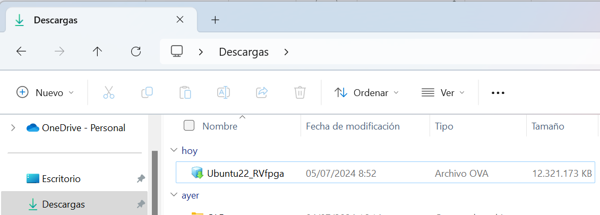

# Lab 0 - Installation

In these labs we are going to work with a Virtual Machine (VM) with Ubuntu 22.04 Linux Operating System (OS). 
This VM can run on any native OS (Windows, Linux, macOS). 
The VM we will use belongs to the RVfpga training package, on which these practices are based. 
It is not necessary to obtain this package for the practices; however, if you are interested in going deeper into the contents that we are going to study in this course, you can request it through the following link: [RVfpga-v3](https://university.imgtec.com/rvfpga-el2-v3-0-english-downloads-page/).

Download the VM from one of the following links. Both refer to the same VM, so use the one that works best for you: 
+ [Virtual Machine 1st link](https://drive.google.com/file/d/1KFnJYq6krB7vYt_AqTB_zTYVmxfATwJF/view)
+ [Virtual Machine 2nd link](https://pvr-sdk-live.s3.amazonaws.com/iup/ubuntu-22-RVfpga.ova)

The file is very large. You must download it with a good Internet connection and you must make sure that the file is downloaded completely, otherwise the VM will not install correctly. 
For example, the following figure shows the downloaded VM on a laptop with Windows 11 OS (note that it occupies more than 12 GB).

  

