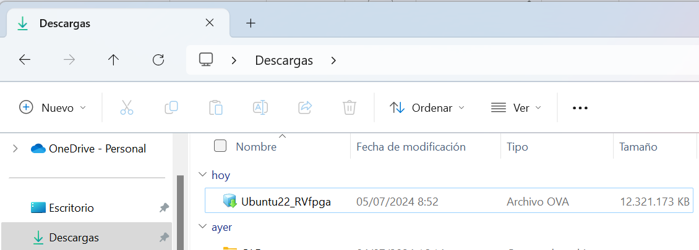
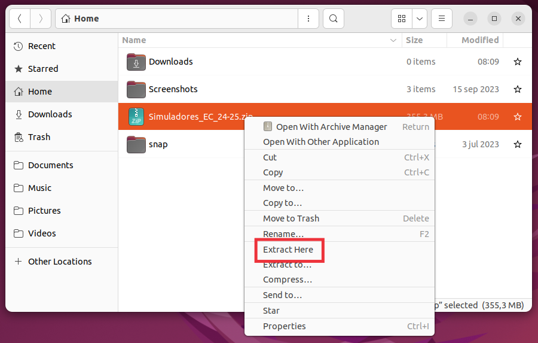
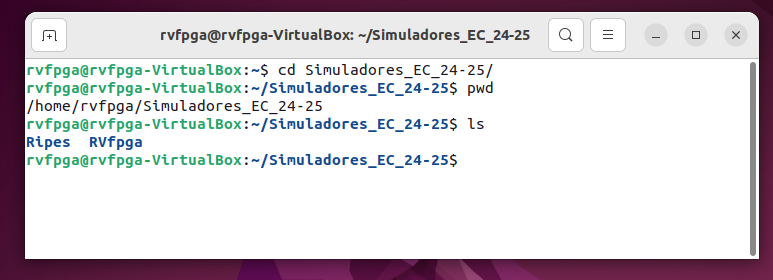

# Lab 0 - Installation and Introduction
This lab aims to prepare our computer to work in the labs of the course and to introduce the RVfpga System and the Tools that we will use in the labs.

## Virtual Machine
In these labs we are going to work with a Virtual Machine (VM) with Ubuntu 22.04 Linux Operating System (OS). 
This VM can run on any native OS (Windows, Linux, macOS). 
The VM we will use belongs to the RVfpga training package, on which these practices are based. 
It is not necessary to obtain this package for the practices; however, if you are interested in going deeper into the contents that we are going to study in this course, you can request it through the following link: [RVfpga-v3](https://university.imgtec.com/rvfpga-el2-v3-0-english-downloads-page/).

Download the VM from one of the following links. Both refer to the same VM, so use the one that works best for you: 
+ [Virtual Machine 1st link](https://drive.google.com/file/d/1KFnJYq6krB7vYt_AqTB_zTYVmxfATwJF/view)
+ [Virtual Machine 2nd link](https://pvr-sdk-live.s3.amazonaws.com/iup/ubuntu-22-RVfpga.ova)

The file is very large. You must download it with a good Internet connection and you must make sure that the file is downloaded completely, otherwise the VM will not install correctly. 
For example, the following figure shows the downloaded VM on a laptop with Windows 11 OS (note that it occupies more than 12 GB).

  

The VM can be installed in the usual virtualization software, such as VirtualBox or VMWare. Install one of those softwares and import the VM (you can follow a tutorial on the Internet). The screenshots in this tutorial are for VirtualBox.

Finally, run the VM, check that the boot is successful, and log into Linux using the user and password **rvfpga**. If the boot gives problems, try changing the USB version of the VM from 2.0 to 1.1, or the memory amount used by the VM.

Ignore all Ubuntu upgrade proposal windows, Guest Additions, PlatformIO, etc. that open automatically on the VM.

## Simulators and Example Projects
Inside the Virtual Machine, download the following file and unzip it in the VM home: [SimulatorsAndProjects](https://drive.google.com/file/d/1hbCSFmjIoGmXq4r5G12_AMUKezHXA6A-/view?usp=sharing).

To do this you can open a file explorer, move the downloaded file to the OS home, and click on the file with the right mouse button and then “Extract Here”.

  

In the following screenshot you can see how RVfpga should be located in the VM. It is important that you respect this location in order to avoid problems with the paths indicated in the labs.

  

At this point your system is ready to run, inside the Virtual Machine, all the exercises from the RVfpga package as well as the Ripes simulator.

## RVfpga
The [RISC-V FPGA](https://university.imgtec.com/rvfpga-el2-v3-0-english-downloads-page/) (RVfpga) course in computer architecture is a freely available course that provides hands-on understanding of a commercial RISC-V processor, a RISC-V system-on-chip (SoC), and the RISC-V ecosystem. These materials bridge the gap between the availability of the open RISC-V ISA and actually being able to use and experiment with a commercial RISC-V processor/SoC and the RISC-V toolchain. 

In addition to providing the VeeR EH1/EL2-based SoC source code in Verilog/SystemVerilog, RVfpga shows how to install and use the RISC-V toolchain to compile, debug, and run C and RISC-V assembly programs on the SoC. RVfpga also shows how to use the peripherals provided with the SoC and add new peripherals. The materials also show how to explore and modify the VeeR core’s microarchitecture, including adding instructions to the core, measuring performance using built-in performance counters, and exploring microarchitectural features, from fundamental pipeline operation, caches, and hazards to more advanced capabilities, such as superscalar execution and scratchpad memories. 

A second package, the RVfpga-SoC course, is a short follow-on course to RVfpga that shows how to build a RISC-V SoC from scratch using building blocks and then run the Zephyr real-time operating system (RTOS) on it. 

The RVfpga courses can be completed in simulation only or, optionally, also in hardware on an FPGA. All software and simulation tools are freely available. Provided simulation tools include a waveform viewer, a virtual FPGA board, and a pipeline viewer. The courses also show how to optionally target the RISC-V SoC to a range of FPGA boards, from lower-cost boards, such as the Basys 3 or Boolean board, to more expensive FPGA boards, such as the Nexys A7 FPGA board.

To understand the RVfpga System and start using it, you can follow the next steps:
+ View this [video](https://www.youtube.com/watch?v=sc_Jn0XSkNw), which introduces the RVfpga materials. The video is in Spanish, but you can enable the subtitles and configure YouTube to automatically translate them into the language that you prefer.
+ Test the different RVfpga Tools in the Virtual Machine:
    + View this [video](https://www.youtube.com/watch?v=Z8QcQRW7F4s), which describes and exemplifies the different RVfpga Tools, from simulators to FPGA boards, that you can use in RVfpga. The video is in Spanish, but you can enable the subtitles and configure YouTube to automatically translate them into the language that you prefer.
    + Perform the tasks described in this [document](https://drive.google.com/file/d/1-VHw5yIs0i6m0S9YQewlzYOIrVKPKxpI/view?usp=sharing).
