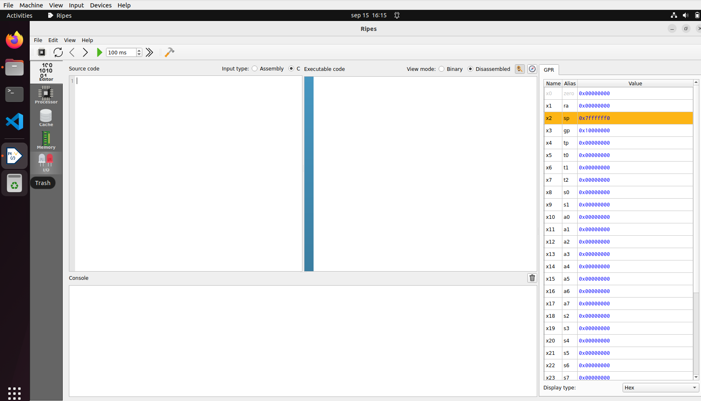

# Lab 1 - The RISC-V ISA
In this second lab we review the RISC-V architecture and complete several exercises in simulation. There are several open-access Instruction Set Simulators (ISSs) available on the Internet that we could use for the lab, such as Whisper (which is the ISS used in RVfpga labs 1-4), Ripes (which is the simulator that we use in this lab), and many others.

## Using RIPES in the virtual machine
[Ripes](https://github.com/mortbopet/Ripes) is a visual computer architecture simulator and assembly code editor created for the RISC-V instruction set architecture. It has the following features:

- RISC-V 32-bit architecture.
- Base repertoire and M and C extensions (in this practice we will use only the M extension).
- Source code viewer, disassembled or binary code, 32 registers and memory regions.
- Possibility of executing the code in the different supported processors. In this practice we will use the Single-Cycle processor.

Follow the steps below to use and finish configuring the Ripes simulator in the VM.

1. Start the simulator inside the VM:
    - Open a terminal in the VM.
    - Enter the “Ripes” directory: ```cd ~/Simuladores_EC_24-25/Ripes```
    - Before you can launch the simulator for the first time, you must install FUSE by means of the following command (it will ask for the root password, which is rvfpga): ```sudo apt-get install fuse libfuse2```
    - Run the simulator: ```./Ripes-v2.2.6-linux-x86_64.AppImage```

2. Environment:
    - On the left side you can see the different windows that can be displayed: Editor, Processor, Cache, Memory, I/O.
    - Depending on the selected window, the view will change. In the following figure we see the Editor window, in which you can enter code in Assembler or C in the left window, the compiled/assembled code will be displayed in the middle window, and it shows the registers of the simulated processor on the right.

<p align="center">
  
</p>

3. Before simulating the program, select the Single Cycle processor:

<p align="center">
  
</p>

4. To simulate a program, we simply type or copy it into the window on the left. For example, in the following figure you can see the program of Exercise 1 (you can find the code below and try it in your simulator). On the right you can see the disassembled version.

<p align="center">
  
</p>
