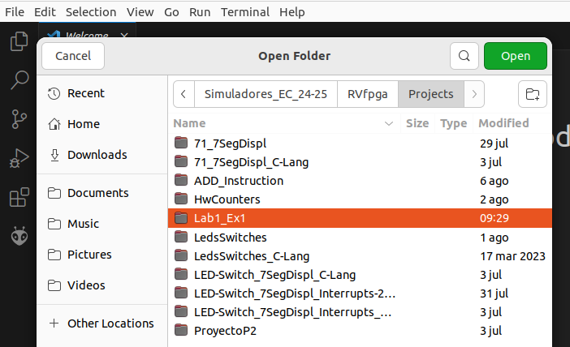
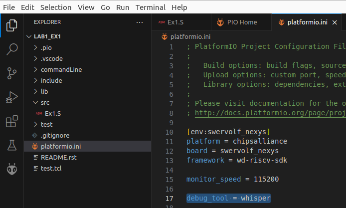
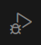
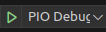
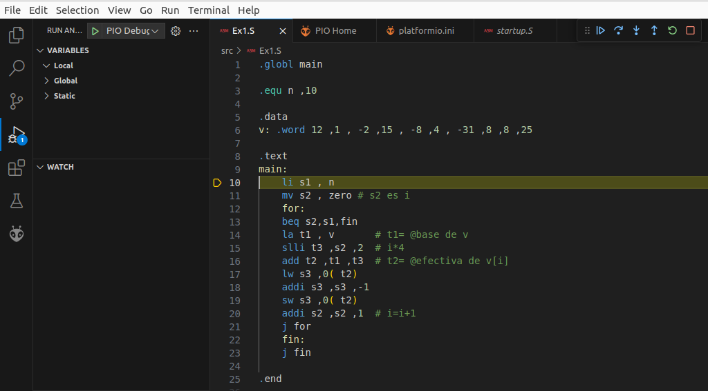
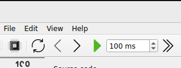
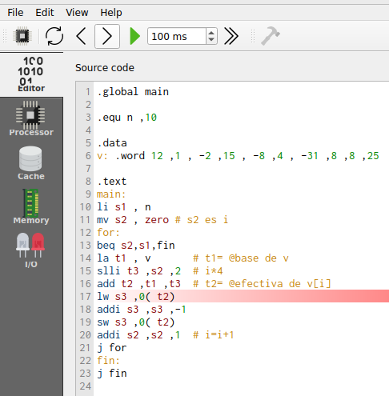
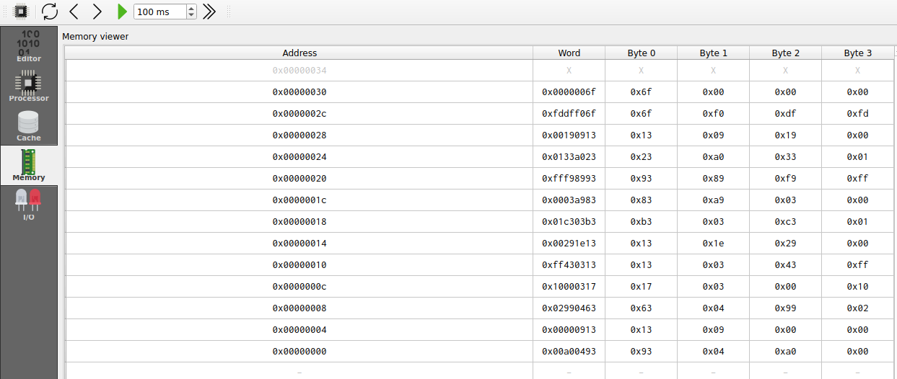
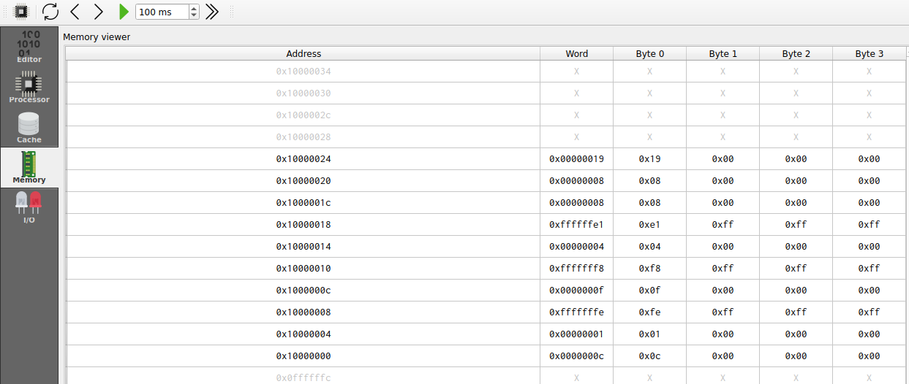

# Lab 1 - The RISC-V ISA
In this lab we review the RISC-V architecture and complete several exercises in simulation. There are several open-access Instruction Set Simulators (ISSs) available on the Internet that we could use for the lab, such as Whisper (which is the ISS used in RVfpga labs 1-4), [Ripes](https://github.com/mortbopet/Ripes) (a visual computer architecture simulator and assembly code editor), and many others that you can find on the Internet.

We next briefly explain how to use Whisper and Ripes in the provided Virtual Machine, and then propose 4 exercises that can be resolved in either of these two simulators or any other simulator available on the Internet.

If you want to obtain the solutions for these exercises, you should request them through the following email: ```dani02@ucm.es```

## Using RVfpga-Whisper in the virtual machine
Section "Simulation in Whisper" of the Getting Started Guide describes the use of the Whisper simulator in RVfpga using different basic examples from the RVfpga package. We next show the steps to simulate Exercise 1 (which you can find below) in Whisper.

1. Open VSCode.
2. Open folder ```/home/rvfpga/Simuladores_EC_24-25/RVfpga/Projects/Lab1_Ex1```

<p align="center">
  
</p>

3. In this project, file ```platformio.ini``` includes line ```debug_tool = whisper```, which makes the program execute on Whisper.

<p align="center">
  
</p>

4. Run and Debug the program on the left bar, clicking on button:

<p align="center">
  
</p>

And then on button:
<p align="center">
  
</p>

5. The program will start running on the simulator. You can run until the end of the program, execute step-by-step, analyze registers and memory, etc.

<p align="center">
  
</p>


## Using RIPES in the virtual machine
[Ripes](https://github.com/mortbopet/Ripes) is a visual computer architecture simulator and assembly code editor created for the RISC-V instruction set architecture. It has the following features:

- RISC-V 32-bit architecture.
- Base repertoire and M and C extensions (in this practice we will use only the M extension).
- Source code viewer, disassembled or binary code, 32 registers and memory regions.
- Possibility of executing the code in the different supported processors. In this practice we will use the Single-Cycle processor.

Follow the steps below to use and finish configuring the Ripes simulator in the VM.

1. Start the simulator inside the VM:
    - Open a terminal in the VM.
    - Enter the “Ripes” directory: ```cd ~/Simuladores_EC_24-25/Ripes```
    - Before you can launch the simulator for the first time, you must install FUSE by means of the following command (it will ask for the root password, which is rvfpga): ```sudo apt-get install fuse libfuse2```
    - Run the simulator: ```./Ripes-v2.2.6-linux-x86_64.AppImage```

2. Environment:
    - On the left side you can see the different windows that can be displayed: Editor, Processor, Cache, Memory, I/O.
    - Depending on the selected window, the view will change. In the following figure we see the Editor window, in which you can enter code in Assembler or C in the left window, the compiled/assembled code will be displayed in the middle window, and it shows the registers of the simulated processor on the right.

<p align="center">
  
</p>

3. Before simulating the program, select the Single Cycle processor:

<p align="center">
  
</p>

4. To simulate a program, we simply type or copy it into the window on the left. For example, in the following figure you can see the program of Exercise 1 (you can find the code below and try it in your simulator). On the right you can see the disassembled version.

<p align="center">
  
</p>

5. The top menu allows us to control the simulation. By hovering the mouse over each button we are informed about its functionality.

<p align="center">
  
</p>

6. We can execute the code step by step:
    - The “minor” and “major” arrows in the top menu allow us to go forward or backward instruction by instruction.
    - The current instruction is shown highlighted in red (e.g., in the figure ```lw s3, 0(t2)```).

<p align="center">
  
</p>

7. Disassembled/binary code window and registers window:
    - The registers will be updated as we progress through the program.
    - When a register is updated, it will be highlighted in yellow.
    - The middle window shows the disassembled code. Note that, unlike the source, it only includes instructions (not pseudo-instructions).

<p align="center">
  
</p>

8. The Memory window allows us to visualize the different memory sections. The figure shows the .text section, which includes the text of the code. At the bottom you must select, from the “Go to section” menu, the .text section. You can check that the hexadecimal code corresponds to the program instructions in the Editor.

<p align="center">
  
</p>

9. At the bottom, in the “Go to section” menu, we can switch to the .data section. You can check that the data correspond to the vector components in the Editor.

<p align="center">
  
</p>

10. Configure the simulator to be able to compile and run programs in C. The instructions are available at the following [link](https://github.com/mortbopet/Ripes/blob/master/docs/c_programming.md)


## Exercise 1
Given the following RISC-V assembly code:

```
  .global main
  
  .equ n ,10
  
  .data
  v: .word 12 ,1 , -2 ,15 , -8 ,4 , -31 ,8 ,8 ,25
  
  .text
  main:
    li s1 , n
    mv s2 , zero # s2 es i
    for:
      beq s2,s1,fin
      la t1 , v 		# t1= @base de v
      slli t3 ,s2 ,2 	# i*4
      add t2 ,t1 ,t3 	# t2= @efectiva de v[i]
      lw s3 ,0( t2)
      addi s3 ,s3 ,-1
      sw s3 ,0( t2)
      addi s2 ,s2 ,1 	# i=i+1
      j for
    fin:
    j fin
```

Run the code in the simulator and answer the following questions. Add screenshots from the simulator to complement your answers.

- Briefly explain what the code does.
- Provide examples of the different addressing modes we explained in theory based on the instructions in the program (use examples of instructions, not pseudo-instructions).
- What instruction does the pseudo-instruction ```li s1, n``` translate to?
- What instruction does the pseudo-instruction ```mv s2, zero``` translate to?
- To which machine instruction in hexadecimal does the pseudo-instruction ```mv s2, zero``` translate? Considering the format of RISC-V instructions, explain which fields the machine instruction contains.
- Take a screenshot of the memory viewer clearly identifying, one by one, the instructions that make up the for loop. Are they properly aligned?
- Take a screenshot of the memory viewer at the end of each iteration, showing how the vector evolves.
- In this code, a simple modification can be made to improve its performance. Write modified code, explain why it improves efficiency, and show a screenshot in which the final vector is visible in memory.
- Modify the code so that it subtracts 1 from the components whose stored value is odd and adds 1 to the components whose stored value is even.
- Imagine the programmer makes a mistake and instead of the store in the code, they use the following instruction: ```sw s3, 1(t2)```. How would this situation be handled in a real system? What happens in the simulator? Justify your answer with screenshots from the simulator.


## Exercise 2
Implement and run the bubble sort algorithm in RISC-V assembly. This simple algorithm sorts the elements of a vector from smallest to largest using a very straightforward procedure: it repeatedly traverses the vector, swapping successive positions if V(i) > V(i+1), until no swaps are made. The following pseudocode is provided as a guide (Note: use a constant, N, to define the length of the vector):

```
do 
  swapped=false 
  for i from 0 to N-2 do: 
    if V[i] > V[i+1] then 
      swap(V[i], V[i+1]) 
      swapped = true 
    end if 
  end for 
while swapped 
```

- Copy the developed program.
- Explain the prologue you have created for the swap function. Is it a leaf or non-leaf subroutine? What is the difference, and how does it affect the prologue?
- Copy the instructions that prepare the input parameters for the swap subroutine. Do you pass the parameters by value or by reference? Why?
- Take several screenshots from the simulator during the execution of the program at relevant points, showing the instructions, registers, and memory. For example, you can show the evolution of memory as the data gets sorted.
- The following code is a possible C implementation of the above pseudocode (random values are assigned to the vector V). Compile the code in Ripes with optimization levels -O0 and -O1, and identify and explain in detail the following code fragments:
    - Optimization Level -O0:
        - Parameter passing and call to swap from main.
        - swap function.
    - Optimization Level -O1:
        - Prologue and epilogue of main.
        - while loop.

```
#include <stdio.h>

#define N 10

int V[N];

void main(void)
{
   int swapped=1, i;

   for (i=0; i<(N); i++)
       V[i]=rand();

   while(swapped){
       swapped=0;
       for (i=0; i<(N-1); i++){
           if (V[i] > V[i+1]){
               swap(V[i], V[i+1]);
               swapped=1;
           }
       }
   }

}

void swap(V,W){
   int temp;
   temp=V;
   V=W;
   W=temp;
}
```

- Finally, step through the C code at the -O1 level and explain the execution with a screenshot of the simulator.


## Exercise 3
Given the following RISC-V assembly code:

```
.global main

.equ n ,5

.data
res: .word 0

.text
main:
  li sp , 0x12000000
  li a1 , n
  la s1 , res
  call factorial
  sw a0 ,0( s1 )
  fin:
  j fin

factorial:
  # prologo
  addi sp , sp , -8
  sw s1 ,0( sp )
  sw s2 ,4( sp )
  # cuerpo
  li s1 ,1
  mv s2 , a1
  li s3 ,1
  for:
    ble s2 , s3 , fin_for
    mul s1 , s1 , s3
    addi s2 , s2 , -1
    j for
  fin_for:
  mv a0 , s1
  # epilogo
  lw s1 ,0( sp )
  lw s2 ,4( sp )
  addi sp , sp ,8
  jr ra

```

Run the code in the simulator and answer the following questions. Add screenshots from the simulator to complement your answers.

- The code contains three errors. Identify and correct them. Copy the modified code, explain the corrections, and include a screenshot illustrating its functionality.
- Find examples of each of the formats used in RISCV (R, I, S, B, U, J) and explain these formats in detail based on the examples shown.
- What values does the stack contain, and what is the value of sp during the execution of the subroutine? Justify your answer through a simulation (include screenshots from the simulator).
- Suppose the processor did not include the M extension (you can research this extension online). Perform the multiplication in the factorial function by calling a new subroutine that calculates the multiplication through successive additions (within a loop, add the multiplicand as many times as indicated by the multiplier). Show and explain the modifications you made and illustrate their execution in the simulator with screenshots. Emphasize the management involved in introducing a new nested subroutine, particularly in terms of saving registers and the evolution of the stack.


## Exercise 4
Given the following C code that computes the factorial of an integer number:

```
#include <stdio.h>
int main(void)
{
   int i,result,num=7;

    if (num > 1){
      result = num;
      for (i=num-1;i>1;i--)
      result = result*i;
   }
   else
      result=1;
   printf("Factorial = %d\n",result);
}
```
Run the code in the simulator and answer the following questions. Add screenshots from the simulator to complement your answers.

- Compile with -O0 (set optimization level in Edit-Settings-Compiler):
    - Identify the for loop in the main function.
    - Identify the if condition.
    - Is the ra register preserved at any point? Why?
    - Of the other registers, which ones are preserved? Why?

- Compile with -O1:
    - The function is very simple. Explain what it does and why it is so simple.

