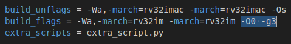

# Lab 1 - The RISC-V ISA
In this lab we review the RISC-V architecture and complete several exercises. You can use either an FPGA board or a simulator. As for the former, here we use the Nexys A7 board, but other options are possible, as explained in the [RVfpga](https://university.imgtec.com/rvfpga-el2-v3-0-english-downloads-page/) course. As for the latter, there are several open-access Instruction Set Simulators (ISSs) available on the Internet that we could use for the lab, such as Whisper (which is the ISS used in RVfpga labs 1-4), [Ripes](https://github.com/mortbopet/Ripes) (a visual computer architecture simulator and assembly code editor), and many others that you can find on the Internet. 

You can follow the next steps:
1. If you are new to Computer Organization, you should start by reading Chapter 6 of the Harris and Harris book (RISC-V Edition).
2. Then, following the detailed instructions provided below, you can test the [RVfpga-Whisper](https://github.com/artecs-group/RVfpga-sim-addons/tree/main/Computer_Organization/Lab1#using-rvfpga-whisper-in-the-virtual-machine) and [Ripes](https://github.com/artecs-group/RVfpga-sim-addons/tree/main/Computer_Organization/Lab1#using-ripes-in-the-virtual-machine) if you do not have an FPGA board, or [RVfpga-Nexys](https://github.com/artecs-group/RVfpga-sim-addons/blob/main/Computer_Organization/Lab1/README.md#rvfpga-nexys) if you have the Nexys A7 FPGA board, to analyze RISC-V assembly and C programs.
3. Then, you can resolve the exercises provided [below](https://github.com/artecs-group/RVfpga-sim-addons/tree/main/Computer_Organization/Lab1#exercise-1) on any of the previous tools.
4. Finally, if you want to continue practicing after completing the proposed exercises, you can find more exercises in [RVfpga](https://university.imgtec.com/rvfpga-el2-v3-0-english-downloads-page/) labs 1 to 4.


## Using RVfpga-Whisper in the virtual machine
Section "Simulation in Whisper" of the Getting Started Guide describes the use of the Whisper simulator in RVfpga using different basic examples from the RVfpga package. 

Moreover, you can visualize the following video from time 21:55 to the end to see an example of the RVfpga-Whisper simulator running a program: [RVfpgaToolsVideo](https://youtu.be/Z8QcQRW7F4s?si=pw63ywHnE7EfQ5e6&t=1315) (the video is in Spanish, but you can watch an AI-translated-to-English version of the video here [RVfpgaToolsEnglishVideo](https://youtu.be/HuAF2XOMQmQ?si=whpN4rKCKX_Q08Z_&t=1315), you can watch an AI-translated-to-Chinese version of the video here [RVfpgaToolsChineseVideo](https://youtu.be/A_c8GACrW9w?si=2PF5bUfPfaN0RdjJ&t=1315), or you can enable the subtitles in the original video).

We next show the steps to simulate Exercise 1 (which you can find [below](https://github.com/artecs-group/RVfpga-sim-addons/blob/main/Computer_Organization/Lab1/README.md#exercise-1) in this same section) in Whisper.

1. Open VSCode.
2. In the "File" menu of VSCode, open folder ```/home/rvfpga/Simuladores_EC_24-25/RVfpga/Projects/Lab1_Ex1```. To open the project, simply navigate to the directory ```/home/rvfpga/Simuladores_EC_24-25/RVfpga/Projects```, select the ```Lab1_Ex1``` directory, and click “Open,” as shown in the following screenshot.


<p align="center">
  
</p>

3. In this project, file ```platformio.ini``` includes line ```debug_tool = whisper```, which makes the program execute on Whisper.

<p align="center">
  
</p>

4. Run and Debug the program on the left bar, clicking on button:

<p align="center">
  
</p>

And then on button:
<p align="center">
  
</p>

5. The program will start running on the simulator. You can run until the end of the program, execute step-by-step, analyze registers and memory, etc. More detailed instructions about the use of the SDK are provided in the [RVfpga](https://university.imgtec.com/rvfpga-el2-v3-0-english-downloads-page/) Getting Started Guide.

<p align="center">
  
</p>

6. Finally close the project in VSCode before you continue.

### C Program
A C program can also be simulated in Whisper. We next show the steps to simulate Exercise 4 (which you can find [below](https://github.com/artecs-group/RVfpga-sim-addons/blob/main/Computer_Organization/Lab1/README.md#exercise-4) in this same section).
1. Open VSCode.
2. Open folder ```/home/rvfpga/Simuladores_EC_24-25/RVfpga/Projects/Lab1_Ex4```
3. Run and Debug the program on the left bar, clicking on button:

<p align="center">
  
</p>

And then on button:
<p align="center">
  
</p>

4. The program will start running on the simulator. You can run until the end of the program, execute step-by-step, analyze registers and memory, view the dissasembly version of the code, etc. In the next figure, you can see the program after its execution, along with the factorial result displayed in the console at the bottom.

<p align="center">
  
</p>

5. You can change the optimization level used by the compiler in file ```platformio.ini```. For example, follow the next steps to compile with a ```-O1``` optimization level:

  a. Open file ```platformio.ini``` and use the following two options for the ```build_flags``` to test two optimization levels (O0 and O1):

  <p align="center">
    
  </p>

  <p align="center">
    
  </p>

  b. *Clean* and *build* the project using the following buttons which you can find at the bottom of VSCode:

  <p align="center">
    
  </p>

   <p align="center">
    
  </p>

  c. You can view the dissasembly code in file ```/home/rvfpga/Simuladores_EC_24-25/RVfpga/Projects/Lab1_Ex4/.pio/build/swervolf_nexys/firmware.dis```. For example, this is the ```main()``` function of our program when a ```-O1``` optimization level is used:

   <p align="center">
    
  </p>

  d. Finally, run the code by selecting first ```PIO Debug (without uploading)``` (see the following figure). This option executes the program on the simulator without compiling it first.

   <p align="center">
    
  </p>


6. Finally close the project in VSCode before you continue.


## RVfpga-Nexys
Section "Running and programming RVfpgaNexys" of the Getting Started Guide describes the use of the RVfpga SoC on the FPGA board using different basic examples.

Moreover, you can visualize the following video from time 19:18 to time 21:55 to see an example of a program running on RVfpga-Nexys: [RVfpgaToolsVideo](https://youtu.be/Z8QcQRW7F4s?si=0Ck4vOSte0I7M5ts&t=1158) (the video is in Spanish, but you can watch an AI-translated-to-English version of the video here [RVfpgaToolsEnglishVideo](https://youtu.be/HuAF2XOMQmQ?si=whpN4rKCKX_Q08Z_&t=1158), you can watch an AI-translated-to-Chinese version of the video here [RVfpgaToolsChineseVideo](https://youtu.be/A_c8GACrW9w?si=2PF5bUfPfaN0RdjJ&t=1158), or you can enable the subtitles in the original video).

We next show the steps to execute an Input/Output program that shows the Swiches state on the LEDs.

1. Connect the board to a USB port in your computer and switch it on. Then, connect the board to your Virtual Machine.

<p align="center">
  
</p>

2. If the board is not detected, you may need to install the drivers in your native Windows or Linux OS (macOS should not need any installation), as described in the Getting Started Guide of the RVfpga course and summarized next:
    - LINUX OS:
      - Connect the Nexys A7 board to your computer and switch it on.
      - Open a terminal in your native OS.
      - Download the drivers from this [link](https://drive.google.com/file/d/1TI3bpHDLTJRTDgm-4gU0CdAK6zO5NRy5/view?usp=sharing)
      - Unzip the downloaded file, go into the new folder and run the installation script:
        - ```chmod 777 *```
        - ```sudo ./install_drivers```
      - Unplug the Nexys A7 board from your computer and restart the computer for the changes to take effect.
    - WINDOWS OS:
      - Connect the Nexys A7 board to your computer and switch it on.
      - Download the Zadig application from this [link](https://zadig.akeo.ie/) and execute it.
      - In Zadig, click on ```Options > List All Devices```.
      - If you click on the drop-down menu, you will see ```Digilent USB Device (Interface 0)``` and ```Digilent USB Device (Interface 1)``` listed. You need to install new drivers only for ```Digilent USB Device (Interface 0)```.
      - Then click on ```Install Driver``` (or ```Replace Driver```) for ```Digilent USB Device (Interface 0)```. You are installing the driver for the Nexys A7 board used by PlatformIO.
      - After some time, typically several minutes, Zadig will indicate the driver was installed correctly. Click Close.
      - Finally, close Zadig and restart Windows.

3. Open VSCode, click on ```File - Open Folder``` and open the folder containing the project for the example that we will use in this section: ```/home/rvfpga/Simuladores_EC_24-25/RVfpga/Projects/LedsSwitches_C-Lang```

4. Open the ```platformio.ini``` file and update the path to the RVfpga-Nexys bitstream as follows:
  ```board_build.bitstream_file = /home/rvfpga/Simuladores_EC_24-25/RVfpga/src/rvfpganexys.bit```

5. You are now ready to download RVfpga-Nexys, the RISC-V SoC that includes a RISC-V processor with support for peripherals, to the Nexys A7 FPGA board.

   - Click on the PlatformIO icon in the left menu ribbon 
.
   - Then expand ```PROJECT TASKS > env:swervolf_nexys > Platform``` and click on ```Upload Bitstream```.

<p align="center">
  
</p>

   - After one or two seconds, the FPGA will be programmed with the RVfpga-Nexys SoC. By default, the processor starts fetching instructions at address 0x80000000, where the Boot ROM is placed in our SoC. The Boot ROM is initialized with a program that blinks the LEDs and the 7-Segment Displays four times and then turns off all the LEDs, writes 0s to the 8 7-Segment Displays and stays in an empty loop.

6. Now that RVfpga-Nexys is downloaded on the Nexys A7 board, you will download the ```LedsSwitches``` program into the memory of RVfpga-Nexys and run/debug the program. Run and Debug the program on the left bar,  clicking on button  and then on button :


<p align="center">
  
</p>

7. The program will first compile and then debugging will start. To control your debugging session, you can use the debugging toolbar which appears near the top of the editor . PlatformIO sets a temporary breakpoint at the beginning of the ```main``` function. Click on the ```Continue``` button  to run the program. Now toggle the switches on the Nexys A7 FPGA board and view as the corresponding LEDs light up.


## Using RIPES in the virtual machine
[Ripes](https://github.com/mortbopet/Ripes) is a visual computer architecture simulator and assembly code editor created for the RISC-V instruction set architecture. It has the following features:

- RISC-V 32-bit architecture.
- Base repertoire and M and C extensions (in this practice we will use only the M extension).
- Source code viewer, disassembled or binary code, 32 registers and memory regions.
- Possibility of executing the code in the different supported processors. In this practice we will use the Single-Cycle processor.

Follow the steps below to use and finish configuring the Ripes simulator in the VM.

1. Start the simulator inside the VM:
    - Open a terminal in the VM.
    - Enter the “Ripes” directory: ```cd ~/Simuladores_EC_24-25/Ripes```
    - Before you can launch the simulator for the first time, you must install FUSE by means of the following command (it will ask for the root password, which is rvfpga): ```sudo apt-get install fuse libfuse2```
    - Run the simulator: ```./Ripes-v2.2.6-linux-x86_64.AppImage```

2. Environment:
    - On the left side you can see the different windows that can be displayed: Editor, Processor, Cache, Memory, I/O.
    - Depending on the selected window, the view will change. In the following figure we see the Editor window, in which you can enter code in Assembler or C in the left window, the compiled/assembled code will be displayed in the middle window, and it shows the registers of the simulated processor on the right.

<p align="center">
  
</p>

3. Before simulating the program, select the Single Cycle processor:

<p align="center">
  
</p>

4. To simulate a program, we simply type or copy it into the window on the left. For example, in the following figure you can see the program of Exercise 1 (you can find the code [below](https://github.com/artecs-group/RVfpga-sim-addons/blob/main/Computer_Organization/Lab1/README.md#exercise-1) and try it in your simulator). On the right you can see the disassembled version.

<p align="center">
  
</p>

5. The top menu allows us to control the simulation. By hovering the mouse over each button we are informed about its functionality.

<p align="center">
  
</p>

6. We can execute the code step by step:
    - The “minor” and “major” arrows in the top menu allow us to go forward or backward instruction by instruction.
    - The current instruction is shown highlighted in red (e.g., in the figure ```lw s3, 0(t2)```).

<p align="center">
  
</p>

7. Disassembled/binary code window and registers window:
    - The registers will be updated as we progress through the program.
    - When a register is updated, it will be highlighted in yellow.
    - The middle window shows the disassembled code. Note that, unlike the source, it only includes instructions (not pseudo-instructions).

<p align="center">
  
</p>

8. The Memory window allows us to visualize the different memory sections. The figure shows the .text section, which includes the text of the code. At the bottom you must select, from the “Go to section” menu, the .text section. You can check that the hexadecimal code corresponds to the program instructions in the Editor.

<p align="center">
  
</p>

9. At the bottom, in the “Go to section” menu, we can switch to the .data section. You can check that the data correspond to the vector components in the Editor.

<p align="center">
  
</p>

10. Set up the simulator to compile and run C programs. Follow these steps (the full instructions are available at this [link](https://github.com/mortbopet/Ripes/blob/master/docs/c_programming.md)):

  - Download the RISC-V toolchain:
      - The Ripes simulator webpage recommends to download the pre-built toolchain [here](https://github.com/sifive/freedom-tools/releases/tag/v2020.04.0-Toolchain.Only). This is the procedure we follow here, but you can also download the toolchain sources and compile them yourself.
      - Copy the downloaded file to ```/home/rvfpga/Simuladores_EC_24-25/Ripes/```
      - Unzip the file ```riscv64-unknown-elf-gcc-8.3.0-2020.04.1-x86_64-linux-ubuntu14.tar.gz``` by right-clicking on the file and selecting "Extract Here."

<p align="center">
  
</p>


  - Set the compiler path in Ripes:
      - In the top menu of Ripes, open "Edit-Settings":

      <p align="center">
        
      </p>


      - In the window that opens, go to the "Compiler" tab.

      <p align="center">
        
      </p>


      - In the "Browse" section, select the C compiler (the file named ```riscv64-unknown-elf-gcc```), which is located in the following path (you can copy and paste the path in the "Compiler path"):

      ```
      /home/rvfpga/Simuladores_EC_24-25/Ripes/riscv64-unknown-elf-gcc-8.3.0-2020.04.1-x86_64-linux-ubuntu14/bin/riscv64-unknown-elf-gcc
      ```

      <p align="center">
        
      </p>

      <p align="center">
        
      </p>


  - Set the appropriate arguments:
      - Compiler arguments: ```-O1```
      - Linker arguments: ```-static-libgcc -lm```

      <p align="center">
        
      </p>


11. To simulate a C program, write or copy it into the left window, marking "Input Type" as C language. For example, the program from Exercise 4 (find it [below](https://github.com/artecs-group/RVfpga-sim-addons/blob/main/Computer_Organization/Lab1/README.md#exercise-4)) can be seen in the following figure (you can find the code below):

<p align="center">
  
</p>

12. Next, compile the program by clicking on the hammer icon. If the program is correct, the disassembled version will appear in the central window:

<p align="center">
  
</p>

13. Run the program by clicking the "Fast Execution" button. The result of the factorial calculation will appear in the console:

<p align="center">
  
</p>


## Exercise 1
Given the following RISC-V assembly code:

```
  .global main
  
  .equ n ,10
  
  .data
  v: .word 12 ,1 , -2 ,15 , -8 ,4 , -31 ,8 ,8 ,25
  
  .text
  main:
    li s1 , n
    mv s2 , zero # s2 es i
    for:
      beq s2,s1,fin
      la t1 , v 		# t1= @base de v
      slli t3 ,s2 ,2 	# i*4
      add t2 ,t1 ,t3 	# t2= @efectiva de v[i]
      lw s3 ,0( t2)
      addi s3 ,s3 ,-1
      sw s3 ,0( t2)
      addi s2 ,s2 ,1 	# i=i+1
      j for
    fin:
    j fin
```

This code should work both on the board (RVfpga-Nexys) and on the Whisper/Ripes simulators. At ```/home/rvfpga/Simuladores_EC_24-25/RVfpga/Projects/Lab1_Ex1``` we provide a project that can be directly used on RVfpga-Whisper. To execute on Ripes, just copy the code in the editor. To execute on RVfpga-Nexys, make sure you comment line ```debug_tool = whisper``` in file ```platformio.ini```.

Run the code and answer the following questions. Add screenshots of the execution to complement your answers.

- Briefly explain what the code does.
- Provide examples of the different addressing modes we explained in theory based on the instructions in the program (use examples of instructions, not pseudo-instructions).
- What instruction does the pseudo-instruction ```li s1, n``` translate to? You can view this in the ```firmware.dis``` file generated by the RISC-V compiler provided with PlatformIO:

  

- What instruction does the pseudo-instruction ```mv s2, zero``` translate to?
- To which machine instruction in hexadecimal does the pseudo-instruction ```mv s2, zero``` translate? Considering the format of RISC-V instructions, explain which fields the machine instruction contains.
- Take a screenshot of the memory viewer clearly identifying, one by one, the instructions that make up the for loop. Are they properly aligned?
- Take a screenshot of the memory viewer at the end of each iteration, showing how the vector evolves.
- In this code, a simple modification can be made to improve its performance. Write modified code, explain why it improves efficiency, and show a screenshot in which the final vector is visible in memory.
- Modify the code so that it subtracts 1 from the components whose stored value is odd and adds 1 to the components whose stored value is even.


## Exercise 2
Implement and run the bubble sort algorithm in RISC-V assembly. This simple algorithm sorts the elements of a vector from smallest to largest using a very straightforward procedure: it repeatedly traverses the vector, swapping successive positions if V(i) > V(i+1), until no swaps are made. The following pseudocode is provided as a guide (Note: use a constant, N, to define the length of the vector):

```
do 
  swapped=false 
  for i from 0 to N-2 do: 
    if V[i] > V[i+1] then 
      swap(V[i], V[i+1]) 
      swapped = true 
    end if 
  end for 
while swapped 
```

- Copy the developed program.
- Explain the prologue you have created for the swap function. Is it a leaf or non-leaf subroutine? What is the difference, and how does it affect the prologue?
- Copy the instructions that prepare the input parameters for the swap subroutine. Do you pass the parameters by value or by reference? Why?
- Take several screenshots during the execution of the program at relevant points, showing the instructions, registers, and memory. For example, you can show the evolution of memory as the data gets sorted.
- The following code is a possible C implementation of the above pseudocode. The code is prepared for the RVfpga-Whisper simulator and at ```/home/rvfpga/Simuladores_EC_24-25/RVfpga/Projects/Lab1_Ex2``` we provide a project that can be directly used on this simulator. If you want to use it in Ripes, remove the initial ```include``` lines and copy the code to the editor. To execute on RVfpga-Nexys, make sure you comment line ```debug_tool = whisper``` in file ```platformio.ini```. Test the execution of the program step-by-step, both in C and in RISC-V assembly. In the latter, identify and explain in detail the obtained ```swap``` and ```main``` functions.
- Finally, compile the code with optimization levels -O0 and -O1, and repeat the previous item. This item can only be tested in Whisper or Ripes, not on the board.

```
#if defined(D_NEXYS_A7)
   #include <bsp_printf.h>
   #include <bsp_mem_map.h>
   #include <bsp_version.h>
#else
   PRE_COMPILED_MSG("no platform was defined")
#endif

#include <psp_api.h>

#define N 4

int V[N]={5,2,3,1};

void main(void)
{
   int swapped=1, i;

   while(swapped){
       swapped=0;
       for (i=0; i<(N-1); i++){
           if (V[i] > V[i+1]){
               swap(&V[i], &V[i+1]);
               swapped=1;
           }
       }
   }

   while(1);

}

void swap(int *V, int *W){
   int temp;
   temp=*V;
   *V=*W;
   *W=temp;
}
```


## Exercise 3
Given the following RISC-V assembly code:

```
.global main

.equ n ,5

.data
res: .word 0

.text
main:
  li a1 , n
  la s3 , res
  call factorial
  sw a0 ,0( s3 )
  fin:
  j fin

factorial:
  # prologo
  addi sp , sp , -8
  sw s1 ,0( sp )
  sw s2 ,4( sp )
  # cuerpo
  li s1 ,1
  mv s2 , a1
  li s3 ,1
  for:
    ble s2 , s3 , fin_for
    mul s1 , s1 , s3
    addi s2 , s2 , -1
    j for
  fin_for:
  mv a0 , s1
  # epilogo
  lw s1 ,0( sp )
  lw s2 ,4( sp )
  addi sp , sp ,8
  jr ra

```

At ```/home/rvfpga/Simuladores_EC_24-25/RVfpga/Projects/Lab1_Ex3``` we provide a project that can be directly used on RVfpga-Whisper. To execute on Ripes, just copy the code in the editor. To execute on RVfpga-Nexys, make sure you comment line ```debug_tool = whisper``` in file ```platformio.ini```.

Run the code and answer the following questions. Add screenshots to complement your answers.

- The code contains three errors. Identify and correct them. Copy the modified code, explain the corrections, and include a screenshot illustrating its functionality.
- Find examples of each of the formats used in RISCV (R, I, S, B, U, J) and explain these formats in detail based on the examples shown.
- What values does the stack contain, and what is the value of sp during the execution of the subroutine? Justify your answer.
- Suppose the processor did not include the M extension (you can research this extension online). Perform the multiplication in the factorial function by calling a new subroutine that calculates the multiplication through successive additions (within a loop, add the multiplicand as many times as indicated by the multiplier). Show and explain the modifications you made and illustrate their execution. Emphasize the management involved in introducing a new nested subroutine, particularly in terms of saving registers and the evolution of the stack.


## Exercise 4
Given the following C code that computes the factorial of an integer number. The code is prepared for the RVfpga-Whisper simulator and at ```/home/rvfpga/Simuladores_EC_24-25/RVfpga/Projects/Lab1_Ex4``` we provide a project that can be directly used on this simulator. If you want to use this program on Ripes, remove the initial ```include``` lines as well as the ```uartInit``` and the ```printfNexys``` functions, and copy the code to the editor. To execute on RVfpga-Nexys, make sure you comment line ```debug_tool = whisper``` in file ```platformio.ini```.

```
#if defined(D_NEXYS_A7)
   #include <bsp_printf.h>
   #include <bsp_mem_map.h>
   #include <bsp_version.h>
#else
   PRE_COMPILED_MSG("no platform was defined")
#endif

#include <psp_api.h>

int main(void)
{
   int i,result,num=7;

   /* Initialize Uart */
   uartInit();

    if (num > 1){
      result = num;
      for (i=num-1;i>1;i--)
      result = result*i;
   }
   else
      result=1;

   printfNexys("Factorial = %d",result);

   while(1);
}
```

Run the code and answer the following questions. Add screenshots to complement your answers.

- Default compilation:
    - Identify the ```for``` loop in the ```main``` function.
    - Identify the ```if``` condition.
    - Is the ```ra``` register preserved at any point? Why?
    - Of the other registers, which ones are preserved? Why?

- Compile with -O0 (this item can only be tested in Whisper or Ripes, not on the board):
    - Identify the ```for``` loop in the ```main``` function.
    - Identify the ```if``` condition.
    - Is the ```ra``` register preserved at any point? Why?
    - Of the other registers, which ones are preserved? Why?

- Compile with -O1 (this item can only be tested in Whisper or Ripes, not on the board):
    - The function is very simple. Explain what it does and why it is so simple.

