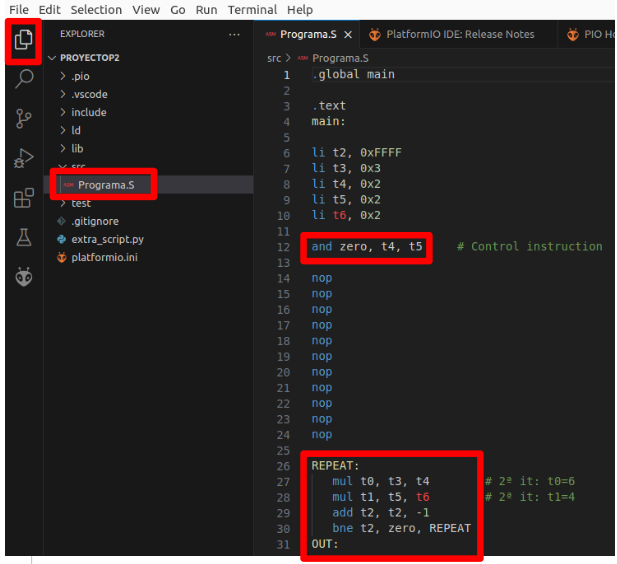
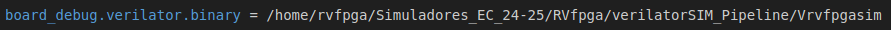
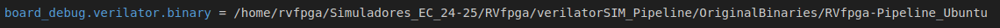
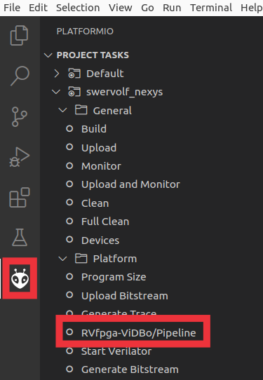
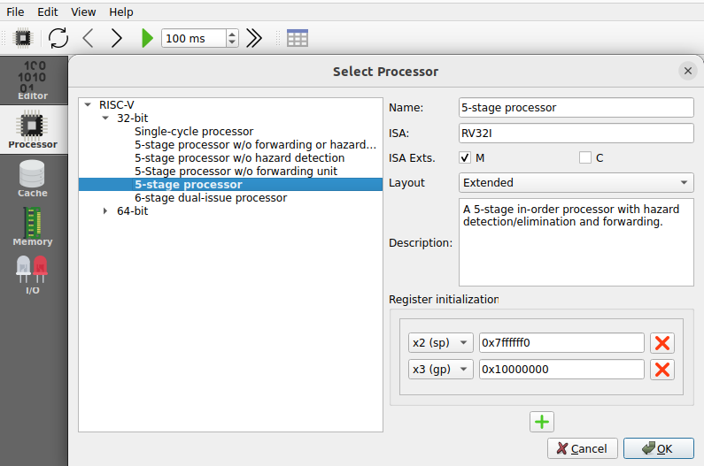
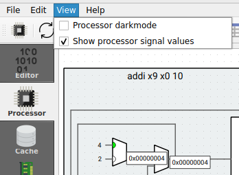

# Lab 2 - The VeeR EH1 core
This practice aims to thoroughly understand the 5-stage pipelined processor in the Ripes simulator, which is almost identical to the H&H processor studied in theory, as well as the VeeR EH1, a 2-way superscalar processor with 9 pipeline stages.

We start this module by providing a detailed introduction to the VeeR EH1 microarchitecture. The presentation can be obtained here: [VeeR-EH1_Microarchitecture](https://drive.google.com/file/d/1rSlwCzcHD4F_S4YFLCFn3L0VNXH_sv7L/view?usp=drive_link). We then provide an introduction to the two simulators that we use, which includes several examples that the students have to repeat on their own. The presentation can be obtained here: [Presentation-Lab2](https://drive.google.com/file/d/1LVfQ7ZxzACyaZoCJrFv6PCeGkGhF5cuW/view?usp=sharing). 

Below, we briefly explain how to use the RVfpga-Pipeline and the Ripes simulator in the provided Virtual Machine. Then, you can find several exercises where we start analyzing simple processors (H&H and Ripes) and then we move to a more complex processor, VeeR EH1, which implements several advanced microarchitectural techniques.

## RVfpga-Pipeline
RVfpga-Pipeline is a simulator of the VeeR EH1 pipeline. The simulator can be used from VSCode - PlatformIO. We will use an existing project, where we will copy the different codes that we will test during the practice:

1. Open VSCode.
2. Open the project (File - Open Folder) located at the following path: ```/home/rvfpga/Simuladores_EC_24-25/RVfpga/Projects/ProyectoP2```

    To open the project, simply navigate to the directory ```/home/rvfpga/Simuladores_EC_24-25/RVfpga/Projects```, select the ```ProyectoP2``` directory, and click “Open,” as shown in the following screenshot.

<p align="center">
  
</p>

3. Open the editor in VSCode to view the assembly code of the project called ```Programa.S```

<p align="center">
  
</p>

4. Open the platformio.ini file and update the path to the RVfpga-Pipeline simulator. To do this, replace the following line:

<p align="center">
  
</p>

    For:

<p align="center">
  
</p>


5. Open the PlatformIO tab and click on the task ```RVfpga-ViDBo/Pipeline```. The simulator will start executing the code (you can see it in the Explorer, inside the ```src``` directory).

<p align="center">
  
</p>

6. The simulator stops execution when it encounters the control instruction ```and zero, t4, t5```. If our program does not have this instruction, we must add it at the point where we want to stop execution. Typically, we will place this instruction before entering the loop where the fragment we want to analyze is located.

7. Execute cycle by cycle by clicking the button and observe how the program's instructions flow through the VeeR EH1 pipeline.

8. Usually, the programs we will use consist of a loop within which the instructions we want to analyze are located. It is important to analyze an iteration that is not the first one, as some processor structures (branch predictor, instruction cache, etc.) have not yet been “trained” and might obscure the situations we want to analyze.

9. To stop the simulator, we must close the simulation window and then, in VSCode, click on the Terminal window located at the bottom of the application and press Ctrl+c three times.

## Ripes
As we saw in the first lab, Ripes allows simulating many aspects of computer organization, structure, and architecture. In this lab, we will use it to visualize the execution of programs in the 5-stage pipeline simulated by Ripes.

Ripes offers different processor models, and we are interested in using the 5-stage pipelined processor, which is very similar to the one studied in theory. To configure Ripes for this processor, follow these steps:

1. Start the simulator as in Lab 1.
2. Open the Processor tab and in the ```Select Processor``` icon, choose the processor with the following characteristics:
        - Fully pipelined 5-stage processor: "5-stage processor".
        - RISC-V base instruction set plus M extension.
        - Extended layout.

<p align="center">
  
</p>

3. Add the signal values view in the ```View``` tab.

<p align="center">
  
</p>
