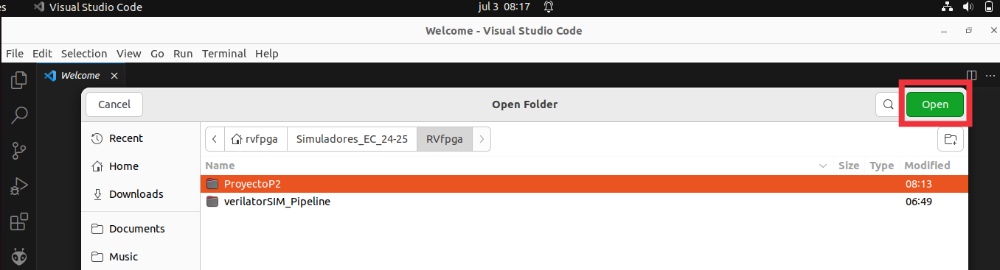

# Lab 2 - The VeeR EH1 core
This practice aims to let the student thoroughly understand the commercial VeeR EH1 core, an advanced 2-way superscalar processor with 9 pipeline stages. For that purpose, we first propose several exercises where a simpler processor is analyzed theoretically (using the 5-stage processor used in the Harris and Harris book - H&H) and practically (using the Ripes simulator).

Students who are new to Computer Organization, should start by reading the H&H book. Then, we provide a detailed introduction to the VeeR EH1 microarchitecture. The presentation can be obtained here: [VeeR-EH1_Microarchitecture](https://drive.google.com/file/d/1rSlwCzcHD4F_S4YFLCFn3L0VNXH_sv7L/view?usp=drive_link). We then provide an introduction to the two simulators that we use in this lab, which includes several examples that the students have to repeat on their own. The presentation can be obtained here: [Presentation-Lab2](https://drive.google.com/file/d/1LVfQ7ZxzACyaZoCJrFv6PCeGkGhF5cuW/view?usp=sharing). 

Below, we briefly explain how to use the RVfpga-Pipeline and the Ripes simulator in the provided Virtual Machine. Then, you can find several exercises where we start analyzing simple processors (H&H and Ripes) and then we move to a more complex processor, VeeR EH1, which implements several advanced microarchitectural techniques.

## RVfpga-Pipeline
RVfpga-Pipeline is a simulator of the VeeR EH1 pipeline. The simulator can be used from VSCode - PlatformIO. We will use an existing project, where we will copy the different codes that we will test during the practice:

1. Open VSCode.
2. Open the project (File - Open Folder) located at the following path: ```/home/rvfpga/Simuladores_EC_24-25/RVfpga/Projects/ProyectoP2```

    To open the project, simply navigate to the directory ```/home/rvfpga/Simuladores_EC_24-25/RVfpga/Projects```, select the ```ProyectoP2``` directory, and click “Open,” as shown in the following screenshot.

<p align="center">
  
</p>

3. Open the editor in VSCode to view the assembly code of the project called ```Programa.S```

<p align="center">
  
</p>

4. Open the platformio.ini file and update the path to the RVfpga-Pipeline simulator. To do this, replace the first line shown below for the second line shown below:

<p align="center">
  
</p>

<p align="center">
  
</p>


5. Open the PlatformIO tab and click on the task ```RVfpga-ViDBo/Pipeline```. The simulator will start executing the code (you can see it in the Explorer, inside the ```src``` directory).

<p align="center">
  
</p>

6. The simulator stops execution when it encounters the control instruction ```and zero, t4, t5```. If our program does not have this instruction, we must add it at the point where we want to stop execution. Typically, we will place this instruction before entering the loop where the fragment we want to analyze is located.

7. Execute cycle by cycle by clicking the button and observe how the program's instructions flow through the VeeR EH1 pipeline.

8. Usually, the programs we will use consist of a loop within which the instructions we want to analyze are located. It is important to analyze an iteration that is not the first one, as some processor structures (branch predictor, instruction cache, etc.) have not yet been “trained” and might obscure the situations we want to analyze.

9. To stop the simulator, we must close the simulation window and then, in VSCode, click on the Terminal window located at the bottom of the application and press Ctrl+c three times.

## Ripes
As we saw in the first lab, Ripes allows simulating many aspects of computer organization, structure, and architecture. In this lab, we will use it to visualize the execution of programs in the 5-stage pipeline simulated by Ripes.

Ripes offers different processor models, and we are interested in using the 5-stage pipelined processor, which is very similar to the one studied in theory. To configure Ripes for this processor, follow these steps:

1. Start the simulator as in Lab 1.
2. Open the Processor tab and in the ```Select Processor``` icon, choose the processor with the following characteristics:
        - Fully pipelined 5-stage processor: "5-stage processor".
        - RISC-V base instruction set plus M extension.
        - Extended layout.

<p align="center">
  
</p>

3. Add the signal values view in the ```View``` tab.

<p align="center">
  
</p>


## Exercise 0
Please reproduce and analyze all the examples provided in the presentation provided above ([Presentation-Lab2](https://drive.google.com/file/d/1LVfQ7ZxzACyaZoCJrFv6PCeGkGhF5cuW/view?usp=sharing)), both in Ripes and RVfpga-Pipeline. Verify that the diagrams and CPIs indicated in the presentation match what you get in the simulations. You need to simulate the following examples:

- Ripes:

    * Program without dependencies
    * Data hazard: consecutive add-add instructions
    * Control hazard

    To simulate the programs in Ripes, you simply need to copy the codes from the presentation into the editor.

- RVfpga-Pipeline:

    * Program without dependencies
    * Structural hazard: consecutive mul-mul instructions
    * Data hazard: consecutive add-add instructions
    * Data hazard - Multi-cycle instructions: mul-add
    * Control hazard

    To simulate the programs in RVfpga-Pipeline, follow these steps:

    1. Open the project called ```ProyectoP2``` in VSCode.
    2. Copy the codes from the presentation into the file ```src/Programa.S```
    3. Set the path for the simulator in the ```platformio.ini``` file. In this lab, we will use the RVfpga-Pipeline simulator. To select it, change the first line shown next for the second one:

       ```board_debug.verilator.binary = /home/rvfpga/Simuladores_EC_24-25/RVfpga/verilatorSIM_Pipeline/Vrvfpgasim```

       ```board_debug.verilator.binary = /home/rvfpga/Simuladores_EC_24-25/RVfpga/verilatorSIM_Pipeline/OriginalBinaries/RVfpga-Pipeline_Ubuntu```

## Exercise 1
Consider the 5-stage pipelined RISC-V processor from Harrys & Harrys book (H&H). The following code is executed on this processor:

```
    .text
    main:
    li x3, 0x4
    li x4, 0x6
    add x2, x3, x4
    sub x5, x2, x3
    or  x6, x2, x5
```

Answer the following questions:

a. Identify the data dependencies that exist in the code and explain how they are resolved in the processor.

b. If there were no forwarding hardware, how could the dependencies be resolved by software?

c. On the figure below (obtained from H&H), indicate the values of the data and control signals in the EX, MEM, and WB stages during the cycle when the ```add``` instruction is in the WB stage.

<p align="center">
  
</p>

d. Simulate the program in Ripes and confirm if your answer to the previous item is correct.


## Exercise 2
Consider the 5-stage pipelined RISC-V processor from Harrys & Harrys book (H&H). The following code is executed on this processor:

```
    .data
    v: .word 1, 10
    .text
    main:
    la x1 , v
    li x2, 0x2
    li x3, 0x4
    lw x2, 4(x1)
    sub x5, x2, x3
    or  x6, x2, x5
```

Answer the following questions:

a. Identify the data dependencies that exist in the code and explain how they are resolved in the processor.

b. If there were no forwarding hardware, how could the dependencies be resolved by software?

c. On the figure below (obtained from H&H), indicate the values of the data and control signals in the 5 pipeline stages during the cycle when the ```lw``` instruction is in the WB stage.

<p align="center">
  
</p>

d. Simulate the program in Ripes and confirm if your answer to the previous item is correct.


## Exercise 3
Consider the 5-stage pipelined RISC-V processor from Harrys & Harrys book (H&H). The following code is executed on this processor:

```
    .text
    main:
    li x1, 0x8
    li x2, 0x8
    li x3, 0x4
    beq x2, x1, ELSE
    IF:	
       sub x5, x2, x3
    	or  x6, x2, x5
    	beq x0, x0, END
    ELSE:
       add x5, x2, x3
    	and x6, x2, x5
    END:
    nop
```

Answer the following questions:

a. Identify the data dependencies that exist in the code and explain how they are resolved in the processor.

b. On the figure below (obtained from H&H), indicate the values of the data and control signals in the 5 pipeline stages during the cycle when the ```beq``` instruction is in the EX stage.

<p align="center">
  
</p>

c. Simulate the program in Ripes and confirm if your answer to the previous item is correct.


## Exercise 4
Given the following code, which calculates the factorial of the number stored in register t0 (it is assumed to always be an integer greater than 1) and stores the result in the same t0 register:

```
    .text
    main:
    
    addi t0, x0, 4
    addi t1, x0, 1
    addi t2, t0, -1
    
    NEXT:
    ble t2, t1, END
    mul t0, t0, t2
    addi t2, t2, -1
    j NEXT
    
    END:
    
    addi t1, x0, 0
    addi t0, x0, 0
```

a. Complete the timing diagram of the program in the 5-stage pipelined RISC-V processor from H&H. Assume that the processor has extended the ALU to perform multiplication with a latency of 1 cycle; that is, the ```mul``` instruction executes just like any other arithmetic-logical instruction.

b. Identify the structural, data, and control hazards on the diagram, clearly marking them and explaining how the processor handles each one.

c. Simulate the program in Ripes and indicate the values of the data and control signals in cycle 5 of the program execution. Also, specify which instruction is in each stage.
