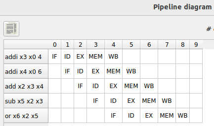
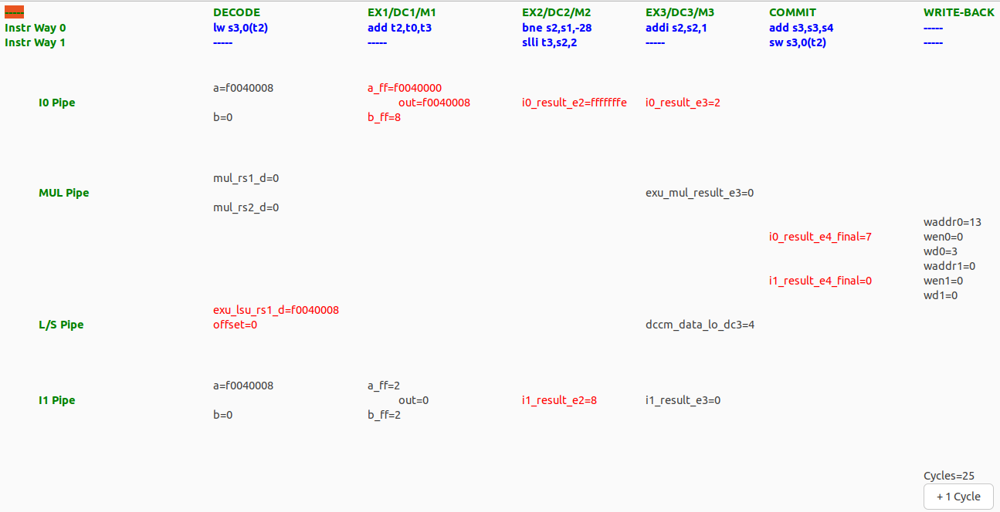
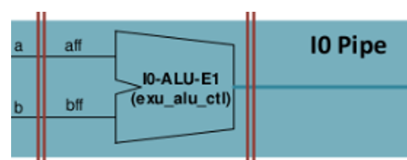

# Lab 2 - The VeeR EH1 core
This practice aims to help students gain a thorough understanding of the commercial VeeR EH1 core, an advanced 2-way superscalar processor with 9 pipeline stages. The processor is explained both theoretically, through a detailed presentation, and practically, using the RVfpga-Pipeline simulator. As a preparatory step, we first focus on the typical academic 5-stage pipelined processor, exploring it theoretically (using the pipelined processor from the Harris and Harris book, H&H) and practically (through the Ripes simulator). 

You can follow the next steps:
1. If you are new to Computer Organization, you should start by reading Chapter 7 of the H&H book.
2. Then, view this video: [VeeReh1Video](https://youtu.be/xVnB6OM00cE?si=0HW333O-oPOXUDZG) (the video is in Spanish, but you can watch an AI-translated-to-English version of the video here [VeeReh1EnglishVideo](https://www.youtube.com/watch?v=Ow_0l47xqV4), you can watch an AI-translated-to-Chinese version of the video here [VeeReh1ChineseVideo](https://www.youtube.com/watch?v=2c4Iaswnz8w), or you can enable the subtitles in the original video). The video describes the VeeR EH1 microarchitecture in detail. You can download the slides [here](https://drive.google.com/file/d/1rSlwCzcHD4F_S4YFLCFn3L0VNXH_sv7L/view?usp=drive_link).
3. Then you can start using Ripes and RVfpga-Pipeline to simulate and analyze the processors: follow the steps shown below in this repo ([Ripes](https://github.com/artecs-group/RVfpga-sim-addons/tree/main/Computer_Organization/Lab2#ripes) and [RVfpga-Pipeline](https://github.com/artecs-group/RVfpga-sim-addons/tree/main/Computer_Organization/Lab2#rvfpga-pipeline)) and look at the presentation provided at: [Presentation-Lab2](https://drive.google.com/file/d/1LVfQ7ZxzACyaZoCJrFv6PCeGkGhF5cuW/view?usp=sharing).
4. Then, you can do the examples shown in the video from item 2 in your own computer, by following the instructions in this [document](https://drive.google.com/file/d/1ltE_sOyaw090Sk49o8gLpa4MJNTl3yZz/view?usp=sharing).
5. Then, you can resolve the exercises included [below](https://github.com/artecs-group/RVfpga-sim-addons/tree/main/Computer_Organization/Lab2#exercise-0), first theoretically and then on the simulators. The initial exercises focus on the 5-stage H&H core and the final exercises focus on the more advanced 9-stage dual-issue VeeR EH1 core. In case you want to obtain the remaining solutions, please contact ```dani02@ucm.es```.
6. Finally, if you want to continue practicing after completing the proposed exercises, you can find more complex exercises in [RVfpga](https://university.imgtec.com/rvfpga-el2-v3-0-english-downloads-page/) labs 11 to 18.

## Ripes
As we saw in the first lab, Ripes allows simulating many aspects of computer organization, structure, and architecture. In this lab, we will use it to visualize the execution of programs in the 5-stage pipeline simulated by Ripes (more details about this simulator are provided in the [Presentation-Lab2](https://drive.google.com/file/d/1LVfQ7ZxzACyaZoCJrFv6PCeGkGhF5cuW/view?usp=sharing) mentioned above).

Ripes offers different processor models, and we are interested in using the 5-stage pipelined processor, which is very similar to the one studied in theory. To configure Ripes for this processor, follow these steps:

1. Start the simulator as in Lab 1.
2. Open the Processor tab and in the ```Select Processor``` icon, choose the processor with the following characteristics:
        - Fully pipelined 5-stage processor: "5-stage processor".
        - RISC-V base instruction set plus M extension.
        - Extended layout.

<p align="center">
  
</p>

3. Add the signal values view in the ```View``` tab.

<p align="center">
  
</p>


## RVfpga-Pipeline
RVfpga-Pipeline is a simulator of the VeeR EH1 pipeline (more details about this simulator are provided in the [Presentation-Lab2](https://drive.google.com/file/d/1LVfQ7ZxzACyaZoCJrFv6PCeGkGhF5cuW/view?usp=sharing) mentioned above and more details about the EH1 core are provided in the [VeeR-EH1_Microarchitecture](https://drive.google.com/file/d/1rSlwCzcHD4F_S4YFLCFn3L0VNXH_sv7L/view?usp=drive_link) also mentioned above). The simulator can be used from VSCode - PlatformIO. We will use an existing project, where we will copy the different codes that we will test during the practice. 

From time 3:12 to time 11:10 of the following video, you can visualize an example of the RVfpga-Pipeline simulator running a program: [RVfpgaToolsVideo](https://youtu.be/Z8QcQRW7F4s?si=8g_GSFpHmIsMQrzI&t=192) (the video is in Spanish, but you can watch an AI-translated-to-English version of the video here [RVfpgaToolsEnglishVideo](https://youtu.be/HuAF2XOMQmQ?si=-LpY-J7f-ng9AYAa&t=192), you can watch an AI-translated-to-Chinese version of the video here [RVfpgaToolsChineseVideo](https://youtu.be/A_c8GACrW9w?si=gst8rw2755R_JtMA&t=192), or you can enable the subtitles in the original video).

Follow the next steps:
*NOTE: The RVfpga-Pipeline simulator provided may differ a bit from the one used in the documents/slides/videos. For example, the latest version specifies, at the Decode Stage, if the operands come from the Register File or the Immediate (text **(RF/Im)** and red color), or from a Bypass Path (text **(Byp)** and green color).*

1. Open VSCode.
2. Open the project (File - Open Folder) located at the following path: ```/home/rvfpga/Simuladores_EC_24-25/RVfpga/Projects/ProyectoP2```

    To open the project, simply navigate to the directory ```/home/rvfpga/Simuladores_EC_24-25/RVfpga/Projects```, select the ```ProyectoP2``` directory, and click “Open,” as shown in the following screenshot.

<p align="center">
  
</p>

3. Open the editor in VSCode to view the assembly code of the project called ```Programa.S```

<p align="center">
  
</p>

4. Open the ```platformio.ini``` file and update the path to the RVfpga-Pipeline simulator. To do this, replace the following line:

```
board_debug.verilator.binary = /home/dani/Simuladores_EC_24-25/RVfpga/verilatorSIM_Pipeline/Vrvfpgasim
```

For this one:

```
board_debug.verilator.binary = /home/rvfpga/Simuladores_EC_24-25/RVfpga/verilatorSIM_Pipeline/OriginalBinaries/RVfpga-Pipeline_Ubuntu
```

5. Open the PlatformIO tab and click on the task ```RVfpga-ViDBo/Pipeline```. The simulator will start executing the code (you can see it in the Explorer, inside the ```src``` directory).

<p align="center">
  
</p>

6. The simulator starts executing the program, and it only stops when instruction ```and zero, t4, t5``` reaches the Decode stage of the pipeline (note that this instruction has no effect at all in the architectural state of the processor and is simply used as a breakpoint). In the program provided in this project (```ProyectoP2```) this instruction is already included before the ```REPEAT``` loop (see the program above). (If the target program does not have the ```and zero, t4, t5``` instruction, you must add it at the point where you want execution to stop; typically, we place this instruction before entering the loop where the fragment we want to analyze is located.) For example, the following figure shows the simulator at the point where it has stopped execution (you can see that instruction ```and zero, t4, t5``` is at the Decode Stage). Note that the second figure shows a simplified version of the VeeR EH1 microarchitecture, which helps understanding the signals included in the simulator (for more details you can look at the presentations provided in this lab: [VeeR-EH1_Microarchitecture](https://drive.google.com/file/d/1rSlwCzcHD4F_S4YFLCFn3L0VNXH_sv7L/view?usp=drive_link) and [Presentation-Lab2](https://drive.google.com/file/d/1LVfQ7ZxzACyaZoCJrFv6PCeGkGhF5cuW/view?usp=sharing)).

<p align="center">
  
</p>

<p align="center">
  
</p>

7. Continue execution cycle by cycle, by clicking the ```+ 1 Cycle``` button on the right bottom corner of the simulator window, and observe how the program's instructions flow through the VeeR EH1 pipeline.

8. Usually, the programs that we simulate will consist of a loop where the instructions we want to analyze are located (specifically, in the program used in this example, which you can see above, we want to analyze two consecutive ```mul``` instructions, which are placed within a ```REPEAT-OUT``` loop). It is important to analyze an iteration that is not the first or the second one, as some processor structures (branch predictor, instruction cache, etc.) have not yet been “trained” and might obscure the situations we want to analyze. For example, the following figure shows the simulator at the point where instructions from the third, fourth and fifth iterations are executing (at this point the cycles count is Cycles=26).

<p align="center">
  
</p>

9. Let's analyze what the simulator shows in the previous figure:

- **WRITE-BACK stage**
	- *Way-0*: Instruction ```mul t0, t3, t4``` (3rd iteration) is writting its result to the Register File (```waddr0=5``` as register ```t0``` corresponds to x5, ```wen0=1``` as writting is enabled, and ```wd0=6``` which is the result of the first multiplication, 3*2).
 	- *Way-1*: Due to the structural hazard between the two subsequent ```mul``` instructions, the second one was delayed one cycle and a bubble was inserted in this way.
- **COMMIT stage**
	- *Way-0*: Instruction ```mul t1, t5, t6``` (3rd iteration) propagates the result in signal ```i0_result_e4_final=4```, which is the result of the second multiplication (2*2).
 	- *Way-1*: Instruction ```addi t2, t2, -1``` (3rd iteration) propagates the result in signal ```i1_result_e4_final=0xFFFC```, which is the result of this instruction in the third iteration of the loop (0xFFFF - 1 - 1 - 1).
- **EX3/DC3/M3 stage**
	- *Way-0*: Instruction ```bne t2, zero, REPEAT``` (3rd iteration).
 	- *Way-1*: Instruction ```mul t0, t3, t4``` (4th iteration) has just obtained the result of the multiplication (```exu_mul_result_e3=6```).
- **EX2/DC2/M2 stage**
	- *Way-0*: Instruction ```mul t1, t5, t6``` (4th iteration).
 	- *Way-1*: Instruction ```addi t2, t2, -1``` (4th iteration).
- **EX1/DC1/M1 stage**
	- *Way-0*: Instruction ```bne t2, zero, REPEAT``` (4th iteration).
 	- *Way-1*: Instruction ```mul t0, t3, t4``` (5th iteration).
- **DECODE stage** (in the Decode stage information about the origin of the operands is provided: RF/Im means that the operand comes from the Register File or the Immediate, whereas Byp menas that the operand comes through a forwarding path)
	- *Way-0*: Instruction ```mul t1, t5, t6``` (5th iteration). Both operands come from the Register File.
 	- *Way-1*: Instruction ```addi t2, t2, -1``` (5th iteration). The first operand comes through forwarding, whereas the second comes from the Immediate.


10. To stop the simulator, we must close the simulation window and then, in VSCode, click on the Terminal window located at the bottom of the application and press Ctrl+c three times.


## Exercise 0
Reproduce and analyze all the examples provided in the presentation provided above ([Presentation-Lab2](https://drive.google.com/file/d/1LVfQ7ZxzACyaZoCJrFv6PCeGkGhF5cuW/view?usp=sharing)), both in Ripes and RVfpga-Pipeline. Verify that the diagrams and CPIs indicated in the presentation match what you get in the simulations. You need to simulate the following examples:

- Ripes:

    * Program without dependencies
    * Data hazard: consecutive add-add instructions
    * Control hazard

    To simulate the programs in Ripes, you simply need to copy the codes from the presentation into the editor.

- RVfpga-Pipeline:

    * Program without dependencies
    * Structural hazard: consecutive mul-mul instructions
    * Data hazard: consecutive add-add instructions
    * Data hazard - Multi-cycle instructions: mul-add
    * Control hazard
    * Example program for the RVfpga-Pipeline that tests the different hazards explained in the [VeeR-EH1_Microarchitecture](https://drive.google.com/file/d/1rSlwCzcHD4F_S4YFLCFn3L0VNXH_sv7L/view?usp=drive_link) presentation (you can find the program in the final slide of the presentation).

    To simulate the programs in RVfpga-Pipeline, follow these steps:

    1. Open the project ```/home/rvfpga/Simuladores_EC_24-25/RVfpga/Projects/ProyectoP2``` in VSCode.
    2. Copy the codes from the presentation into the file ```src/Programa.S```
    3. Set the path for the simulator in the ```platformio.ini``` file. In this lab, we will use the RVfpga-Pipeline simulator. To select it, change the first line shown next for the second one:

       ```board_debug.verilator.binary = /home/rvfpga/Simuladores_EC_24-25/RVfpga/verilatorSIM_Pipeline/Vrvfpgasim```

       ```board_debug.verilator.binary = /home/rvfpga/Simuladores_EC_24-25/RVfpga/verilatorSIM_Pipeline/OriginalBinaries/RVfpga-Pipeline_Ubuntu```

## Exercise 1
Consider the 5-stage pipelined RISC-V processor from Harrys & Harrys book (H&H). The following code is executed on this processor:

```
.text
main:
li x3, 0x4
li x4, 0x6
add x2, x3, x4
sub x5, x2, x3
or  x6, x2, x5
```

Answer the following questions:

a. Identify the data dependencies that exist in the code and explain how they are resolved in the processor. Draw the pipeline diagram.

b. On the figure below (obtained from H&H), indicate the values of the data and control signals in the EX, MEM, and WB stages during the cycle when the ```add``` instruction is in the WB stage.

<p align="center">
  
</p>

c. Analyse the program on the Ripes simulator for the 5-stages processor and answer the following questions:
 - Generate in Ripes the pipeline diagram and compare it with your answer to item *a*.
 - Show screenshots of the pipeline to explain how the different data hazards are handled.
 - Stop the execution in the same cycle analyzed in item *b* and compare the values of the data/control signals on the simulator and on your answer to item *b*.


**SOLUTION:**
We next exceptionally show partial solutions for items b and c as an example. Complete the solutions not provided.

*b. On the figure below (obtained from H&H), indicate the values of the data and control signals in the EX, MEM, and WB stages during the cycle when the ```add``` instruction is in the WB stage.*

<p align="center">
  
</p>

*c. Analyse the program on the Ripes simulator.*

 - Generate in Ripes the pipeline diagram and compare it with your answer to item *a*.

This is the timing diagram obtained with Ripes:

<p align="center">
  
</p>

 - Show screenshots of the pipeline to explain how the different data hazards are handled.

This is a screenshot of the simulator that highlights the forwarding that occurs between the first ```li``` and the ```add```:

<p align="center">
  
</p>

You should explain how the hazard is handled by the pocessor: which multiplexers are used, the stages involved, etc.

 - Stop the execution in the same cycle analyzed in item *b* and compare the values of the data/control signals on the simulator and on your answer to item *b*.

This is a screenshot of the simulator during the cycle when the ```add``` instruction is in the WB stage.

<p align="center">
  
</p>

You should explain the values of the different data/control signals and compare their values with those from the previous item. Most of them should be equal (although a few signals may differ, given that the two processors are not identical).


## Exercise 2
Consider the 5-stage pipelined RISC-V processor from Harrys & Harrys book (H&H). The following code is executed on this processor:

```
.data
v: .word 1, 10
.text
main:
la x1 , v
li x2, 0x2
li x3, 0x4
lw x2, 4(x1)
sub x5, x2, x3
or  x6, x2, x5
```

Answer the following questions:

a. Identify the data dependencies that exist in the code and explain how they are resolved in the processor. Draw the pipeline diagram.

b. On the figure below (obtained from H&H), indicate the values of the data and control signals in the 5 pipeline stages during the cycle when the ```lw``` instruction is in the WB stage.

<p align="center">
  
</p>

c. Analyse the program on the Ripes simulator for the 5-stages processor and answer the following questions:
 - Generate in Ripes the pipeline diagram and compare it with your answer to item *a*.
 - Show screenshots of the pipeline to explain how the different data hazards are handled.
 - Stop the execution in the same cycle analyzed in item *b* and compare the values of the data/control signals on the simulator and on your answer to item *b*.


## Exercise 3
Consider the 5-stage pipelined RISC-V processor from Harrys & Harrys book (H&H). The following code is executed on this processor:

```
.text
main:
li x1, 0x8
li x2, 0x8
li x3, 0x4
beq x2, x1, ELSE
IF:	
   sub x5, x2, x3
    or  x6, x2, x5
    beq x0, x0, END
ELSE:
   add x5, x2, x3
    and x6, x2, x5
END:
nop
```

Answer the following questions:

a. Identify the data dependencies that exist in the code and explain how they are resolved in the processor. Draw the pipeline diagram.

b. On the figure below (obtained from H&H), indicate the values of the data and control signals in the 5 pipeline stages during the cycle when the ```beq``` instruction is in the EX stage.

<p align="center">
  
</p>

c. Analyse the program on the Ripes simulator for the 5-stages processor and answer the following questions:
 - Generate in Ripes the pipeline diagram and compare it with your answer to item *a*.
 - Show screenshots of the pipeline to explain how the different control/data hazards are handled.
 - Stop the execution in the same cycle analyzed in item *b* and compare the values of the data/control signals on the simulator and on your answer to item *b*.


## Exercise 4
Given the following code, which calculates the factorial of the number stored in register t0 (it is assumed to always be an integer greater than 1) and stores the result in the same t0 register:

```
.text
main:

addi t0, x0, 4
addi t1, x0, 1
addi t2, t0, -1

NEXT:
ble t2, t1, END
mul t0, t0, t2
addi t2, t2, -1
j NEXT

END:

addi t1, x0, 0
addi t0, x0, 0
```

a. Complete the pipeline diagram of the program in the 5-stage pipelined RISC-V processor from H&H. Assume that the processor has extended the ALU to perform multiplication with a latency of 1 cycle; that is, the ```mul``` instruction executes just like any other arithmetic-logical instruction.

b. Identify the structural, data, and control hazards on the diagram, clearly marking them and explaining how the processor handles each one.

c. Analyse the program on the Ripes simulator for the 5-stages processor and answer the following questions:
 - Generate in Ripes the pipeline diagram and compare it with your answer to item *a*.
 - Show screenshots of the pipeline to explain how the different data/control hazards are handled.
 - Indicate the values of the data and control signals in cycle 5 of the program execution.


## Exercise 5
Consider the RISC-V VeeR EH1 processor. The processor has all configurable features enabled (pipelined execution, superscalar execution, Gshare branch predictor, etc.), except for the Secondary ALU. The following program is executed on this processor:

```
.globl main

.section .midccm
D: .space 16

.text
main:

li t2, 0x080                  # Disable Secondary ALUs
csrrs t1, 0x7F9, t2

la t0, D

li t1, 0x2					
sw t1, (t0)				# D[0] = 2
li t1, 0x4					
sw t1, 4(t0)				# D[1] = 4
li t1, 0x3					
sw t1, 8(t0)				# D[2] = 3
li t1, 0x5					
sw t1, 12(t0)				# D[3] = 5

li s1, 4
mv s2, zero

and zero,t4,t5

for:
   slli t3 ,s2 ,2
   add t2 ,t0 ,t3
   lw s3 , 0(t2)
   lw s4 , 4(t2)
   add s3 ,s3 ,s4
   sw s3 , 0(t2)
   addi s2 ,s2 ,1
   bne s2,s1,for
end:

REPEAT:
   beq  zero, zero, REPEAT  # Repeat the loop
```

Answer the following questions about the ```for``` loop both theoretically and using the RVfpga-Pipeline simulator (you can use the same project as in Exercise 0). Remember to analyze an iteration from the third one onward, avoiding the first/second iterations where there are instruction cache misses and the branch predictor is not yet properly trained.

a. Identify the hazards that occur and explain how this processor handles them.

b. Draw the pipeline diagram for the second iteration of the loop.

c. Calculate the CPI (Cycles Per Instruction) of the loop.

d. Indicate on the following figure where each instruction is and the values of the various signals of the VeeR EH1 processor in the cycle when the first ```load``` instruction is in the Write-Back stage. Show also a screenshot of the RVfpga-Pipeline simulator in that same cycle.

<p align="center">
  
</p>

e. Show a screenshot of the RVfpga-Pipeline simulator in the cycle when the two ```load``` instructions perform a forwarding to the subsequent ```add``` instruction.

f. Reorder the code to try to improve performance. Calculate the new CPI.

g. Recalculate the CPI of the loop assuming that the Secondary ALU available in the Commit stage is activated and that the code is reordered as per the previous step.


**SOLUTION:**
We next exceptionally show partial solutions for items b, d and e as an example.

*a. Identify the hazards that occur and explain how this processor handles them.*

For example, this figure illustrates the data hazard between the ```slli``` and the ```add```.

<p align="center">
   
</p>

The hazard is handled by:
- Inserting a bubble by the ```slli``` instruction (way-1). We can see that Way 1 in the EX1 Stage is empty (```-----```).
- Performing a forwarding from EX1 to Decode. We can see that: ```out=4 → b=4 (Byp)```.

*b. Draw the pipeline diagram for the second iteration of the loop.*

<p align="center">
   
</p>

*c. Calculate the CPI (Cycles Per Instruction) of the loop.*

To calculate the CPI of the loop, simulate until a given instruction of the loop reaches the Decode stage in two consecutive iterations (e.g., the third and fourth iterations). Then, subtract the cycle numbers of these two iterations and divide this result by the number of instructions in the loop.

For example:

<p align="center">
  
</p>

<p align="center">
  
</p>

In this case, ```CPI = (33-25)/8 = 1```

*d. Indicate on the following figure where each instruction is and the values of the various signals of the VeeR EH1 processor in the cycle when the first load instruction is in the Write-Back stage.*

<p align="center">
  
</p>

<p align="center">
   
</p>

*e. Show a screenshot of the RVfpga-Pipeline simulator in the cycle when the two ```load``` instructions perform a forwarding to the subsequent ```add``` instruction.*

<p align="center">
   
</p>


## Exercise 6
Given the following program, which can be executed in RVfpga-Pipeline (using the first code below) and in Ripes (using the second code below):

**RVfpga-Pipeline:**

```
.globl main

.section .midccm
D: .space 20

.text
main:

li t2, 0x080             # Disable Secondary ALUs
csrrs t1, 0x7F9, t2

la t0, D

li t1, 0x1					
sw t1, (t0)				
li t1, 0x3					
sw t1, 4(t0)				
li t1, 0x5					
sw t1, 8(t0)				
li t1, 0x7					
sw t1, 12(t0)				
li t1, 0x9					
sw t1, 16(t0)				

la   t1 , D
addi s1 ,x0 ,4
addi s2 ,x0 ,0

and zero, t4, t5

for:
	lw   s3, 0(t1)
	lw   s4, 4(t1)
	add  s3, s3, s4
	addi s2 ,s2 ,1
	sub  s3, s3, s2
	sw   s3, 4(t1)
	addi t1, t1, 4
	bne  s2, s1, for

or s2, zero, zero
or s1, zero, zero

fin:
j fin
```

**Ripes:**

```
.globl main

.data
D: .word 1, 3, 5, 7, 9

.text
main:

la   t1 , D
addi s1 ,x0 ,4
addi s2 ,x0 ,0

for:
	lw   s3, 0(t1)
	lw   s4, 4(t1)
	add  s3, s3, s4
	addi s2 ,s2 ,1
	sub  s3, s3, s2
	sw   s3, 4(t1)
	addi t1, t1, 4
	bne  s2, s1, for

or s2, zero, zero
or s1, zero, zero

fin:
j fin
```

a. Draw the execution diagram of the program on the H&H 5-stage pipelined processor, from the beginning of the second iteration of the loop until the cycle in which the ```add``` instruction exits the pipeline in the third iteration. Indicate on the diagram the structural, data, and control dependencies that arise and explain for each one how the processor handles it.

b. Simulate the program in Ripes. How many cycles does it take to execute one iteration?

c. Is it possible to improve the loop's performance by reordering the code? Justify your answer and, if it can be improved, explain how you would modify the code.

d. Indicate the values of all data and control signals in the cycle where the ```add``` instruction is in the execution stage. Also, indicate which instruction is in each stage. Assume that the address of the first instruction is 0.

e. Draw the execution diagram of the program on the VeeR EH1 processor, from the beginning of the second iteration of the loop until the cycle in which the ```add``` instruction exits the pipeline in the third iteration. Indicate on the diagram the structural, data, and control dependencies that arise and explain for each one how the processor handles it.

f. Simulate the program in RVfpga-Pipeline (you can use the same project as in Exercise 0). How many cycles does it take to execute one iteration?

g. Is it possible to improve the loop's performance by reordering the code? Justify your answer and, if it can be improved, explain how you would modify the code.


## Exercise 7
In the VeeR EH1 processor, the following code is to be executed:

```
for ( n = 0; n < 8; n ++ ) {
    for ( k = 0; k < 3; k ++ ) {
    Salida[n] += Filtro[k] * Entrada[n + k];
    }
}
```

To achieve the highest performance in executing this program on the VeeR EH1 processor, the following assembly implementation is decided:

```
.globl main

.section .midccm
Entrada: .space 40
Filtro: .space 12
Salida: .space 32

.text
main:

li t2, 0x488 # Disable Superscalar Exec, Sec. ALUs and Branch Pred.
csrrs t1, 0x7F9, t2

la t0, Entrada
li t1, 0x1   				 
sw t1, (t0)   			 
li t1, 0x3   				 
sw t1, 4(t0)   			 
li t1, 0x5   				 
sw t1, 8(t0)   			 
li t1, 0x7   				 
sw t1, 12(t0)   			 
li t1, 0x9   				 
sw t1, 16(t0)   			 
li t1, 0x1   				 
sw t1, 20(t0)   			 
li t1, 0x3   				 
sw t1, 24(t0)   			 
li t1, 0x5   				 
sw t1, 28(t0)   			 
li t1, 0x7   				 
sw t1, 32(t0)   			 
li t1, 0x9   				 
sw t1, 36(t0)   			 

la t0, Filtro
li t1, 0x2   				 
sw t1, (t0)   			 
li t1, 0x3   				 
sw t1, 4(t0)   			 
li t1, 0x4   				 
sw t1, 8(t0)   			 

la t0, Salida
li t1, 0   				 
sw t1, (t0)   			 
li t1, 0   				 
sw t1, 4(t0)   			 
li t1, 0   				 
sw t1, 8(t0)   			 
li t1, 0   				 
sw t1, 12(t0)   			 
li t1, 0   				 
sw t1, 16(t0)   			 
li t1, 0   				 
sw t1, 20(t0)   			 
li t1, 0   				 
sw t1, 24(t0)   			 
li t1, 0   				 
sw t1, 28(t0)   			 

la   a3 , Entrada
la   a4 , Filtro
la   a5 , Salida

li   a2, 0
li   t1, 3
li   a1, 0
li   t0, 8

nop
nop
nop
nop

and zero, t4, t5

loop_n :
addi a2 , x0 , 0
	loop_k :
    	lw t3 , 0( a3)
    	lw t4 , 0( a4)
    	mul t6 , t3 , t4
    	lw t5 , 0( a5)
    	add t5 , t6 , t5
    	sw t5 , 0( a5)
    	addi a3 , a3 , 4
    	addi a4 , a4 , 4
    	addi a2 , a2 , 1
    	blt a2 , t1 , loop_k
addi a5 , a5 , 4
addi a3 , a3 , -8
addi a4 , a4 , -12
addi a1 , a1 , 1
blt a1 , t0 , loop_n

fin:
j fin
```

Analyze the code in RISC-V assembly. Note that in the assembly program we are initializing the arrays before entering the loops, element-by-element, in the Data ScratchPad, so this needs quite a few instructions. You can ignore those instructions and focus on the nested loop.

Solve the following sections, both theoretically and practically on the RVfpga-Pipeline simulator (you can use the same project as in Exercise 0):

a. Run the assembly program in RVfpga-Pipeline with superscalar execution, the Secondary ALU, and the Gshare branch predictor disabled (this is the default configuration provided in the program above), and stop right at the beginning of iteration n=0, k=1. To get to that iteration, you must skip some cycles after the breakpoint (instruction: and zero, t4, t5). Specifically, you must advance until the point when Cycles=21. At this point, the first instruction of the loop is at the Decode stage. See the following screenshot:

<p align="center">
  
</p>

* Draw the execution diagram.
* Analyze the data/control/structural hazards for this iteration. For that purpose, simulate cycle-by-cycle and analyze and explain how each hazard is handled by the VeeR EH1 core. 
* Calculate the CPI for iteration n=0, k=1, of the loop_k loop. For that purpose, you must stop the simulation at the point shown above, and count the number of cycles until the same point (first load instruction at Decode stage) of the next iteration. Then, you must divide that number by the number of instructions executed in the loop.

b. Repeat the analysis from *item a* but now enable superscalar execution with respect to the configuration used at *item a*.

c. Repeat the analysis from *item a* but now enable the Gshare branch predictor with respect to the configuration used at *item b*.

d. Repeat the analysis from *item a* but now enable the Secondary ALU with respect to the configuration used at *item c*.

e. Finally, with the configuration of *item d*, reorder the code of the loop_k loop to improve performance as much as possible, and repeat the analysis from *item a*.


## Exercise 8
Similarly to what we did in the video for the bypass 10-1 multiplexer, where we found it in the SoC Verilog code, try to find the following elements (in our case, the Verilog files for the VeeR EH1 core are in folder ```/home/rvfpga/Simuladores_EC_24-25/RVfpga/src/SweRVolfSoC/SweRVEh1CoreComplex```):

+ 3-1 multiplexer:

<p align="center">
   
</p>

+ ALU in the I0 Pipe:

<p align="center">
   
</p>

+ Register File:

<p align="center">
   
</p>

+ Multiplier and forwarding path from the load:

<p align="center">
   
</p>
