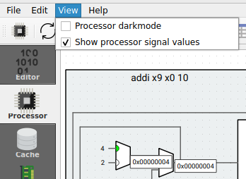
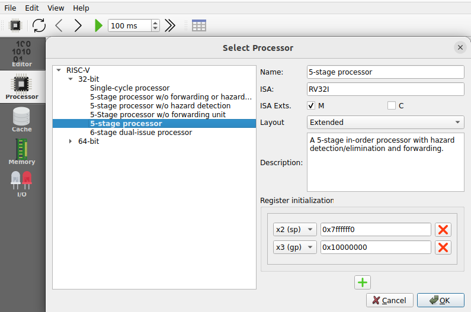
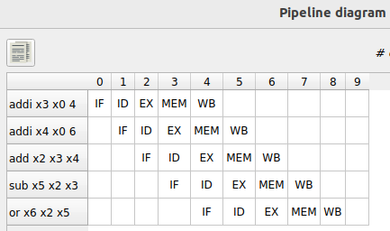

# Ripes processors
Ripes allows simulating many aspects of computer organization, structure, and architecture. In this lab, we will use it to visualize the execution of programs in two of the simulated processors: *Single-Cycle processor* and *Complete 5-stage Pipelined processor*. Specifically, follow these items:
1. Single-Cycle Processor:
   * [Building the processor](https://github.com/artecs-group/RVfpga-sim-addons/tree/main/Computer_Organization/Lab2/Ripes#building-the-single-cycle-processor)
   * [Basic use of the processor](https://github.com/artecs-group/RVfpga-sim-addons/tree/main/Computer_Organization/Lab2/Ripes#basic-use-of-the-single-cycle-processor)
   * [Complete example](https://github.com/artecs-group/RVfpga-sim-addons/tree/main/Computer_Organization/Lab2/Ripes#complete-example-in-the-single-cycle-processor)
   * [Exercises](https://github.com/artecs-group/RVfpga-sim-addons/tree/main/Computer_Organization/Lab2/Ripes#exercise-1)
2. Pipelined Processor:
   * [Building the processor](https://github.com/artecs-group/RVfpga-sim-addons/tree/main/Computer_Organization/Lab2/Ripes#building-the-pipelined-processor)
   * [Basic use of the processor](https://github.com/artecs-group/RVfpga-sim-addons/tree/main/Computer_Organization/Lab2/Ripes#basic-use-of-the-pipelined-processor)
   * [Complete example](https://github.com/artecs-group/RVfpga-sim-addons/tree/main/Computer_Organization/Lab2/Ripes#complete-example-in-the-pipelined-processor)
   * [Data and Control Hazards in the Pipelined processor](https://github.com/artecs-group/RVfpga-sim-addons/tree/main/Computer_Organization/Lab2/Ripes#data-and-control-hazards-in-the-pipelined-processor)
   * [Exercises](https://github.com/artecs-group/RVfpga-sim-addons/tree/main/Computer_Organization/Lab2/Ripes#exercise-4)
3. LABS: Work on the labs as detailed below at [Labs](https://github.com/artecs-group/RVfpga-sim-addons/tree/main/Computer_Organization/Lab2/Ripes#lab-5)
4. Final Exam: After all these exercises and labs, students do the exam provided below at [Exam](https://github.com/artecs-group/RVfpga-sim-addons/tree/main/Computer_Organization/Lab2/Ripes#final-exam)

## Building the *Single-Cycle processor*
Look carefully at the following presentation which shows step-by-step how to build the Ripes Single-Cycle processor and several examples of a subset of instructions executing on it: [BuildingRipesSingleCycle](https://drive.google.com/file/d/1ltiDqyqdh34iVbHx_IfEizBPG4y45GcI/view?usp=sharing).

In addition to the previous slides, the following presentation shows step-by-step and in great detail how to build the Single-Cycle processor from the Harris&Harris (H&H) textbook: [SlidesModule5](https://www.fdi.ucm.es/profesor/mendias/FC2/FC2module5.pdf)


## Basic use of the *Single-Cycle processor*
The construction of the Single-Cycle processor is first explained theoretically using the slides provided above. During this explanation, students must perform the corresponding tests from the list below, executing the instructions and carefully analyzing the processor signals in detail.

To use Ripes for the *Single-Cycle processor*, follow these steps:

1. Start the Ripes simulator.

2. Open the Processor tab and in the ```Select Processor``` icon, choose the processor with the following characteristics:
   - Single-Cycle processor.
   - RISC-V base instruction set plus M extension.
   - Extended layout.


3. Add the signal values view in the ```View``` tab.

<p align="center">
  
</p>

4. Perform the example shown in the above slides for the ```sub``` instruction. Use the following code in Ripes:

```
li x2, 5
li x3, 3
sub x1, x2, x3
```


5. In the previous code, replace the ```sub``` instruction for an arithmetic-logic instruction that operates with an immediate. Explain the differences versus the execution of a ```sub``` instruction.


## Complete example in the *Single-Cycle processor*
Let's perform a simple test in the *Single-Cycle Processor*, extracted from the presentation provided at: [SlidesModule5](https://www.fdi.ucm.es/profesor/mendias/FC2/FC2module5.pdf).

Copy the following program into the Editor tab.

```
.data
xa: .word 10
xb: .word 0
xc: .word 0

.text
la x9, xa
L7:
    lw x6, 0(x9)
    sw x6, 8(x9)
    or x4, x5, x6
    beq x4, x4, L7
```

Analyze and explain the control and data signals highlighted in red in the following figure for each instruction of the first iteration of the loop: ```lw```, ```sw```, ```or``` and ```beq```. First, attempt the analysis on paper on your own, and then compare your results with the provided solution below and with a cycle-by-cycle Ripes simulation.


**SOLUTION:**

1. ```LW``` instruction:


   - ```Instr```= 0x0004a303. You can confirm, using the slides from [Module 4](https://www.fdi.ucm.es/profesor/mendias/FC2/FC2module4.pdf), that this hexadecimal value corresponds to the ```lw``` instruction included in the program.

   - ```Addr``` = 0x8, which is the address where the ```lw``` instruction. See next the instructions in the Ripes memory tab:

     

   - ```PC``` = 0xc, which is the address where the instruction following the ```lw``` is stored in memory and will be fetched in the next cycle.

   - ```R1``` = 0x09, which is the index of the base register (```x9```) used in the ```lw``` instruction to calculate the effective address.

   - ```Reg1``` = ```Op1``` = 0x10000000, which is the value held in the base register used in the ```lw``` instruction.

   - ```Imm``` = ```Op2``` = 0x0, which is the offset used in the ```lw``` instruction to calculate the effective address.

   - ```C2``` = ```REG1```, as the first ALU operand comes from the Register File.

   - ```C3``` = ```IMM```, as the second ALU operand comes from the Immediate.

   - ```C4``` = ```ADD```, as the ALU must perform an addition to compute the load effective address.

   - ```Res``` = 0x10000000, which is the result of the addition of the base register and the offset, and which is provided to the Data Memory through the Address input port.

   - ```Dout``` = 0xa, which is the value read from address 0x10000000 of the Data Memory. See next the data in the Ripes memory tab:

     

   - ```C6``` = ```MEMREAD```, as the value to write in the Register File must come from the Data output port of the Data Memory.

   - ```C1``` = 0x1, as the Register File must be written.

   - ```Wr``` = 0x06, which is the index of the destination register (```x6```) used in the ```lw``` instruction.

   - ```DInRF``` = 0xa, which is the data read from memory that must be saved in the Register File.

2. ```SW``` instruction:


   - ```Instr```= 0x064a423. You can confirm, using the slides from Module 4, that this hexadecimal value corresponds to the ```sw``` instruction included in the program.

   - ```Addr``` = 0xc, which is the address where the ```sw``` instruction.

   - ```PC``` = 0x10, which is the address where the instruction following the ```sw``` is stored in memory and will be fetched in the next cycle.

   - ```R1``` = 0x09, which is the index of the base register (```x9```) used in the ```sw``` instruction to calculate the effective address.

   - ```R2``` = 0x06, which is the index of the register that holds the value to store in memory.

   - ```Reg1``` = ```Op1``` = 0x10000000, which is the value held in the base register used in the ```sw``` instruction.

   - ```Imm``` = ```Op2``` = 0x10, which is the offset used in the ```sw``` instruction to calculate the effective address.

   - ```C2``` = ```REG1```, as the first ALU operand comes from the Register File.

   - ```C3``` = ```IMM```, as the second ALU operand comes from the Immediate.

   - ```C4``` = ```ADD```, as the ALU must perform an addition to compute the load effective address.

   - ```Res``` = 0x10000008, which is the result of the addition of the base register and the offset, and which is provided to the Data Memory through the Address input port.

   - ```Reg2``` = ```DInM``` = 0xa, which is the value to write in address 0x10000008 of the Data Memory. In the next cycle, we can confirm that the Data Memory has been correctly updated:

     

   - ```C1``` = 0x0, as the Register File must not be written in this case.

3. ```OR``` instruction:


   - Look at the example of the ```sub``` instruction shown above, which is identical as this one except for the ALU operation.

4. ```BEQ``` instruction:


   - ```Instr```= 0x10000497. You can confirm, using the slides from Module 4, that this hexadecimal value corresponds to the ```beq``` instruction included in the program.

   - ```Addr``` = 0x14, which is the address where the ```beq``` instruction is stored in memory.

   - ```PC``` = 0x8, which is destination address of the ```beq```. As we explain below, it is a taken branch.

   - ```R1``` = 0x04, which is the index of the first register (```x4```) used in the ```beq``` instruction as its first operand.

   - ```R2``` = 0x04, which is the index of the second register (```x4```) used in the ```beq``` instruction as its second operand.

   - ```Op1``` = 0x14, which is the value held in the PC.

   - ```Imm``` = ```Op2``` = 0xfffffff4, which is the offset that must be added to the PC to compute the destination address. Note that it is a negative number (C2 format), so it is a backward branch.

   - ```C2``` = ```PC```, as the first ALU operand comes from the PC.

   - ```C3``` = ```IMM```, as the second ALU operand comes from the Immediate.

   - ```C4``` = ```ADD```, as the ALU must perform an addition to compute the destination address of the ```beq``` instruction.

   - ```Res``` = 0x8, which is the destination address of the ```beq``` instruction, and which will be stored in the PC at the end of this cycle.

   - ```C1``` = ```C5``` = 0x0, as neither the Register File nor the Data Memory must be written.

   - ```Reg1``` = ```Reg2``` = 0x0a, which are the values read from the Register File. Given that they are equal, the condition is met and the branch is taken.

   - ```C7``` = 0x1, as the condition is met given that the two registers are equal. Note that this signal makes the destination address of the ```beq``` instruction be written to the PC.


## Exercise 1
The following code is executed in Ripes:

```
.text
main:
li x3, 0x4
li x4, 0x6
add x2, x3, x4
sub x5, x2, x3
or  x6, x2, x5
```

What is the value of the signals highlighted in the following figure for the execution of the ```add``` instruction? Try first to reason it out on your own without using the simulator.


Simulate the program cycle-by-cycle, stop when the ```add``` instruction is executing, and confirm your answer. 


## Exercise 2
The following code is executed in Ripes:

```
.data
v: .word 1, 10
.text
main:
la x1 , v
li x2, 0x2
li x3, 0x4
lw x2, 4(x1)
sub x5, x2, x3
or  x6, x2, x5
```

What is the value of the signals highlighted in the figure from Exercise 1 for the execution of the ```lw``` instruction? Try first to reason it out on your own without using the simulator.

Simulate the program cycle-by-cycle, stop when the ```lw``` instruction is executing and confirm your answer. 


## Exercise 3
The following code is executed in Ripes:

```
.text
main:
li x1, 0x8
li x2, 0x8
li x3, 0x4
beq x2, x1, ELSE
IF:	
   sub x5, x2, x3
    or  x6, x2, x5
    beq x0, x0, END
ELSE:
   add x5, x2, x3
    and x6, x2, x5
END:
jal main
nop
```

Answer the following questions for the Single-Cycle Processor, using the figure from Exercise 1:

a. Simulate the program cycle-by-cycle and stop when the first ```beq``` instruction is executing. What is the value of the signals highlighted in the figure? Justify each value obtained.

b. Then, modify the ```x1``` register initialization to 0x7, and analyze the first ```beq``` instruction execution. What is the value of the signals highlighted in the figure? Justify each value obtained.

c. Explain the differences observed between the two cases.

d. Finally, stop when the ```jal``` instruction is executing. Explain the signals from the figure above. How is the destination address computed? What is written to the Register File?

Use the following form to send your answers to the exercise: [Answer Exercise 3](https://docs.google.com/forms/d/e/1FAIpQLSdEqJdbMVdf9yKkLbSgwuTouAhn8Qu6owYOYvf3NHdzciVNCw/viewform?usp=header)

---
## Building the *Pipelined processor*
Look at the following presentation which shows step-by-step how to build the Ripes Pipelined processor and several examples of a subset of instructions executing on it: [BuildingRipesPipelined](https://drive.google.com/file/d/1YEU6boOllnm3OXSRJV4YFuy86CcGv4En/view?usp=sharing).

In addition, the following presentation shows step-by-step and in great detail how to build the Pipelined processor from the Harris&Harris textbook: [SlidesModule7](https://www.fdi.ucm.es/profesor/mendias/FC2/FC2module7.pdf).

At this point, it is also useful to analyze the performance metrics. For that purpose, look at the following presentation from slide 108 to slide 110: [SlidesModule6](https://www.fdi.ucm.es/profesor/mendias/FC2/FC2module6.pdf).


## Basic use of the *Pipelined processor*
The construction of the Pipelined processor is first explained theoretically using the slides provided above. During this explanation, students must perform the corresponding tests from the list below, executing the instructions and carefully analyzing the processor signals in detail.

1. Start the Ripes simulator.

2. Open the Processor tab and in the ```Select Processor``` icon, choose the processor with the following characteristics:
   - 5-stage processor.
   - RISC-V base instruction set plus M extension.
   - Extended layout.

<p align="center">
  
</p>

3. Add the signal values view in the ```View``` tab.

<p align="center">
  
</p>

4. Perform the example shown in the above slides ([BuildingRipesPipelined](https://drive.google.com/file/d/1YEU6boOllnm3OXSRJV4YFuy86CcGv4En/view?usp=sharing)) for the ```sub``` instruction. Use the following code in Ripes:

```
li x2, 5
li x3, 3
nop
nop
nop
nop
sub x1, x2, x3
```

<!--
5. Analyze the ```addi``` instruction in the following example. Highlight the differences with respect to the execution of a ```sub``` instruction.

```
li x2, 5
li x3, 3
nop
nop
nop
nop
addi x1, x2, x3
```

6. Analyze the ```lw``` instruction in the following example.

```
.data
a: .word 5
.text
la x2, a
nop
nop
nop
nop
lw x1, 0(x2)
```

7. Analyze the ```sw``` instruction in the following example.

```
.data
a: .word 0
.text
li x1, 2
la x2, a
nop
nop
nop
nop
sw x1, 0(x2)
```

8. Analyze the ```beq``` instruction in the following example. Test both taken and non-taken branches by modifying the initial values of ```x2``` and ```x3```.

```
li x2, 5
li x3, 5
REPEAT:
nop
nop
nop
nop
beq x3, x2, REPEAT
addi x2, x2, 1
addi x3, x3, 1
```
-->


## Complete example in the *Pipelined processor*
Let's perform a simple test in the *Pipelined Processor*. Copy the following program into the Editor tab.

```
.data
   xa: .word 10
   xb: .word 0
   xc: .word 0

.text
   la x9, xa
   la x8, xc
  L1:
   addi x5, x0, 2
   addi x4, x0, 3
   addi x3, x0, -1
   lw x6, 0(x9)
   beq x0, x5, L1
   add x1, x5, x5
   or x2, x4, x4
   sw x6, 8(x9)
```

Analyze and explain the control and data signals highlighted in red in the following figure, in each cycle of the execution of the program. First, attempt the analysis on paper on your own, and then compare your results with the provided solution below and with a cycle-by-cycle Ripes simulation.


We next include an interesting example: 

#### Analysis of the final cycle: ```lw``` - ```beq``` - ```add``` - ```or``` - ```sw```

This is the state of the processor at the end of the code.


As you can see, five instructions are being executed simultaneously in the processor (in-flight), each at a different stage. 

In the same window, look at the bottom right corner (shown next), where you can see the *Instruction Memory* window, which helps us follow the program's execution step by step, and the *Execution info* window, which displays performance metrics such as cycles, instructions, and CPI/IPC.


Let's analyze a few important signals of the pipeline in this cycle.

   - ```sw``` instruction:
      - ```Addr```= 0x2c, which is the address where the store instruction is placed in the Instruction Memory. Confirm this in the memory tab.
      - ```Instr```= 0x0064a423. You can confirm, using the slides from Module 4, that this hexadecimal value corresponds to the ```sw``` instruction included in the program.

   - ```or``` instruction:
      - ```Reg1```= 0x3. This will be used as the first operand for the OR operation that will be performed next cycle.
      - ```Reg2```= 0x3. This will be used as the second operand for the OR operation that will be performed next cycle.
      - ```C1(d)```= 1. This will be the Register File write enable in the WB stage. The ```or``` instruction must write the result to the RF.
      - ```C2(d)```= ALURES. This will be used to select the data in the 3-1 multiplexer of the WB stage.
      - ```C6(d)```= 0, as it is not a ```jump``` instruction.
      - ```C7(d)```= 0, as it is not a ```branch``` instruction.
      - ```C8(d)```= ```C9(d)```= REG1/2, as the operands are provided from the Register File in this instruction.
      - ```C10(d)```= OR, as the ALU must perform an OR operation.

   - ```add``` instruction:
      - ```Op1```= 0x2. This is the first operand for the ADD operation that is performed this cycle.
      - ```Op2```= 0x2. This is the second operand for the ADD operation that is performed this cycle.
      - ```C1(e)```= 1. This will be the Register File write enable in the WB stage. The ```add``` instruction must write the result to the RF.
      - ```C2(e)```= ALURES. This will be used to select the data in the 3-1 multiplexer of the WB stage.
      - ```C6(e)```= 0, as it is not a ```jump``` instruction.
      - ```C7(e)```= 0, as it is not a ```branch``` instruction.
      - ```C8(e)```= ```C9(e)```= REG1/2, as the operands are provided from the Register File in this instruction.
      - ```C10(e)```= ADD, as the ALU must perform an ADD operation.
      - ```Res```= 0x4, which is the result of the addition.
      - ```C14```= 0, as the next PC after the ```add``` instruction is PC+4.

   - ```beq``` instruction:
      - ```C1(m)```= ```C3(m)```= 0, as neither the Data Memory nor the Register File must be written by this instruction.

   - ```lw``` instruction:
      - ```C1(w)```= 1, as the Register File must be written by this instruction.
      - ```C2(w)```= 0, as the 3-1 multiplexer must select the data read from memory.
      - ```Wr```= 0x6, which is the register idx where the value read from memory must be written.
      - ```DInRF```= 0xa, which is the data read from memory that must be written to the RF.


## Data and Control Hazards in the *Pipelined processor*
Look at the following presentation which shows, from slide 53 to slide 130, how hazards are handled in the Harris&Harris textbook Pipelined processor [SlidesModule7](https://www.fdi.ucm.es/profesor/mendias/FC2/FC2module7.pdf). You must take into account that the processor analyzed in the presentation is very similar to the Pipelined Ripes processor but has some minor differences.

### Example 1 - Insert ```nop``` instructions to avoid data conflicts

For this example, we're using a processor that differs slightly from the ones used in the previous and following examples. Configure the processor as follows:

<p align="center">
  
</p>


Test the next example:

```
.text
main:
xori x2, x0, 5
sub x5, x2, x0
```

Confirm that the ```x2``` register data conflict is handled incorrectly. You can see that the value used for the first operand of the ```sub``` instruction is not the correct one (see the following figure).


Now insert 3 ```nop``` instructions in between the conflicting instructions.

```
.text
main:
xori x2, x0, 5
nop
nop
nop
sub x5, x2, x0
```

Confirm that the ```x2``` register data conflict is now handled correctly (see the following figure).


### Example 2 - Forwarding unit

Go back to the 5-stage pipelined processor that we are typically using.

<p align="center">
  
</p>

Use the same program as in Example 1 and remove the ```nop``` instructions. 

```
.text
main:
xori x2, x0, 5
sub x5, x2, x0
```

Confirm that the ```x2``` register data conflict is now handled correctly (see the following figure).

<p>
  
</p>

You can see that the top 3-1 multiplexer (red square) selects the data forwarded from the MEM stage (0x5) instead of the data read in the previous cycle from the Register File, which holds a stale value (0x7ffffff0).


### Example 3 - Hazard unit for the ```lw``` instruction

Use the following program. 

```
.data
   xa: .word 10

.text
   la x9, xa
  L1:
   lw x6, 0(x9)
   ori x5, x6, 2
   andi x4, x6, 3
   xori x3, x6, -1
   beq x0, x0, L1
   add x1, x5, x5
   or x2, x4, x4
```

Analyze the execution of the ```lw``` instruction. How is the ```x6``` register value forwarded to the following instructions? Is it necessary to insert a bubble at some point? Why?


### Example 4 - Hazard unit for the ```beq``` instruction

Use the following program. 

```
.data
   xa: .word 10
   xb: .word 0
   xc: .word 0

.text
   la x9, xa
   la x8, xc
  L1:
   addi x5, x0, 2
   addi x4, x0, 3
   addi x3, x0, -1
   lw x6, 0(x9)
   beq x0, x5, L1
   add x1, x5, x5
   or x2, x4, x4
   sw x6, 8(x9)
```

Analyze and explain the ```beq``` instruction. Analyze first the *non-taken* ```beq``` provided in the original program and then change it for a *taken* ```beq``` and repeat the same analysis.


**SOLUTION:**

#### Analysis of a *non-taken* ```beq``` instruction.

This is the ```beq``` instruction at the IF stage:


You can see that, by default, the PC+4 is ***speculatively*** used as the next PC. It is speculative as it is not sure that execution will continue through that path.

This is the ```beq``` instruction at the ID stage:


You can see that the next sequential instruction is ***speculatively*** fetched and besides the PC+4 is used as the next PC.

Finally, this is the ```beq``` instruction at the EXE stage, where the condition is evaluated and the target address of the branch is computed:


The output of the Branch module is 0, thus the branch must not be taken and we have proceeded correctly, so execution can continue with no change.

What if the branch must be taken? Let's next analyze that situation.

#### Analysis of a *taken* ```beq``` instruction.

Perform the same analysis but for a taken ```beq``` (in the code above, we can use the same register for Rs1 and Rs2 so that they will for sure be equal). Analyze the cycle when the ```beq``` is at the EXE stage and when it is at the MEM stage.

This is the new ```beq``` instruction at the EXE stage:


Now the output of the Branch module is 1. Thus, we have incorrectly started execution of the two instructions which are sequentially placed after the ```beq``` (i.e. ```add``` and ```or```). Is this a problem? It is not, since these two instructions have not yet modified the Register File or the Data Memory, thus they can be cancelled and execution redirected through the correct path, using the branch target address computed in the ALU.

This is the new ```beq``` instruction at the MEM stage:


The two incorrect instructions have been canceled and the instruction placed at the branch target address is being fetched.

---

## Exercise 4
The following code is executed in Ripes:

```
.text
main:
li x3, 0x4
li x4, 0x6
add x2, x3, x4
sub x5, x2, x3
or  x6, x2, x5
```

Answer the following questions for the Pipelined Processor:

a. Simulate the code in Ripes, obtain the pipeline diagram and explain it.

b. Identify each of the data dependencies that exist in the code and explain how they are resolved in the processor. 

c. Show screenshots of the Ripes pipeline to explain how the different data hazards are handled.

d. Stop the execution during the cycle when the ```add``` instruction is in the WB stage and analyze the data/control signals of each stage. Use the names provided in the following figure for each pipeline signal:


**EXAMPLE SOLUTION:**

*a. Simulate the code in Ripes, obtain the pipeline diagram and explain it.*

This is the timing diagram obtained with Ripes:

<p align="center">
  
</p>

We observe that there are no stalls in the pipeline, meaning that once it is filled, the CPI (Cycles Per Instruction) is 1.

*b. Identify each of the data dependencies that exist in the code and explain how they are resolved in the processor.*

- ```x3``` is written by the first ```li``` instruction (which the assembler transforms into an ```addi``` instruction) and used by the ```add``` instruction. It is obtained through forwarding.
- ```x4``` is written by the second ```li``` instruction (which the assembler transforms into an ```addi``` instruction) and used by the ```add``` instruction. It is obtained through forwarding.
- ```x2``` is written by the ```add``` instruction and used by the ```sub``` instruction. It is obtained through forwarding.
- ```x2``` is written by the ```add``` instruction and used by the ```or``` instruction. It is obtained through forwarding.
- ```x5``` is written by the ```sub``` instruction and used by the ```or``` instruction. It is obtained through forwarding.

*c. Show screenshots of the Ripes pipeline to explain how the different data hazards are handled.*

For example, this is a screenshot of the simulator that highlights the forwarding that occurs between the ```add``` and the ```sub```:


As shown, the highlighted multiplexer selects the value from the Memory stage (the result of the ```add``` instruction) as the ALU's first operand, instead of using the value from the Register File.

Similarly, analyze the remaining data hazards discussed in the previous item using the same approach.


*d. Stop the execution during the cycle when the ```add``` instruction is in the WB stage and analyze the data/control signals of each stage.*

This is a screenshot of the simulator during the cycle when the ```add``` instruction is in the WB stage.


Let's analyze some of the signals in this cycle.

   - ```or``` instruction:
      - ```Op1```= 0xa. This is the first operand for the OR operation that is performed this cycle.
      - ```Op2```= 0x6. This is the second operand for the OR operation that is performed this cycle.
      - ```C1(e)```= 1. This will be the Register File write enable in the WB stage. The ```or``` instruction must write the result to the RF.
      - ```C2(e)```= ALURES. This will be used to select the data in the 3-1 multiplexer of the WB stage.
      - ```C6(e)```= 0, as it is not a ```jump``` instruction.
      - ```C7(e)```= 0, as it is not a ```branch``` instruction.
      - ```C8(e)```= ```C9(e)```= REG1/2, as the operands are provided from the Register File in this instruction.
      - ```C10(e)```= OR, as the ALU must perform an OR operation.
      - ```Res```= 0xe, which is the result of the OR.
      - ```C14```= 0, as the next PC after the ```or``` instruction is PC+4.

   - ```sub``` instruction:
      - ```C1(m)```= 1, as the Register File must be written by this instruction in the next cycle.
      - ```C2(m)```= 1, as the 3-1 multiplexer will select the result of the ALU.
      - ```C3(m)```= 0, as the Data Memory must NOT be written by this instruction.

   - ```add``` instruction:
      - ```C1(w)```= 1, as the Register File must be written by this instruction.
      - ```C2(w)```= 1, as the 3-1 multiplexer must select the data read from the ALU.
      - ```Wr```= 0x2, which is the register idx where the value read from memory must be written.
      - ```DInRF```= 0xa, which is the result of the addition and that must be written to the RF.


## Exercise 5
The following code is executed in Ripes:

```
.data
v: .word 1, 10
.text
main:
la x1 , v
li x2, 0x2
li x3, 0x4
lw x2, 4(x1)
sub x5, x2, x3
or  x6, x2, x5
```

Answer the following questions for the Pipelined Processor:

a. Simulate the code in Ripes, obtain the pipeline diagram and explain it.

b. Identify each of the data dependencies that exist in the code and explain how they are resolved in the processor. 

c. Show screenshots of the Ripes pipeline to explain how the different data hazards are handled.

d. Stop the execution during the cycle when the ```lw``` instruction is in the WB stage and analyze the data/control signals of each stage. Use the names provided in the figure from Exercise 4.


## Exercise 6
The following code is executed in Ripes:

```
.text
main:
li x1, 0x8
li x2, 0x8
li x3, 0x4
beq x2, x1, ELSE
IF:	
   sub x5, x2, x3
    or  x6, x2, x5
    beq x0, x0, END
ELSE:
   add x5, x2, x3
    and x6, x2, x5
END:
nop
```

Answer the following questions for the Pipelined Processor:

a. Simulate the code in Ripes, obtain the pipeline diagram and explain it.

b. Identify each of the hazards that exist in the code and explain how they are resolved in the processor. 

c. Show screenshots of the Ripes pipeline to explain how the different data hazards are handled.

d. Stop the execution during the cycle when the first ```beq``` instruction is in the EX stage and analyze the data/control signals of each stage. Use the names provided in the figure from Exercise 4.


## Exercise 7
Given the following code, which calculates the factorial of the number stored in register t0 (it is assumed to always be an integer greater than 1) and stores the result in the same t0 register:

```
.text
main:

addi t0, x0, 4
addi t1, x0, 1
addi t2, t0, -1

NEXT:
ble t2, t1, END
mul t0, t0, t2
addi t2, t2, -1
j NEXT

END:

addi t1, x0, 0
addi t0, x0, 0
```

Answer the following questions for the Pipelined Processor:

a. Simulate the code in Ripes, obtain the pipeline diagram and explain it.

b. Identify each of the hazards that exist in the code and explain how they are resolved in the processor. 

c. Show screenshots of the Ripes pipeline to explain how the different data hazards are handled.

d. Indicate the values of the data and control signals in cycle 5 of the program execution. Use the names provided in the figure from Exercise 4.


## Exercise 8
Given the following program:

```
.globl main

.data
D: .word 1, 3, 5, 7, 9

.text
main:

la   t1 , D
addi s1 ,x0 ,4
addi s2 ,x0 ,0

for:
	lw   s3, 0(t1)
	lw   s4, 4(t1)
	add  s3, s3, s4
	addi s2 ,s2 ,1
	sub  s3, s3, s2
	sw   s3, 4(t1)
	addi t1, t1, 4
	bne  s2, s1, for

or s2, zero, zero
or s1, zero, zero

fin:
j fin
```

a. Draw the execution diagram of the program on the H&H 5-stage pipelined processor until the cycle in which the ```add``` instruction exits the pipeline in the third iteration. Explain the data, and control dependencies that arise and explain for each one how the processor handles it.

b. Simulate the program in Ripes. How many cycles does it take to execute one iteration of the loop? Calculate the CPI.

c. Is it possible to improve the loop's performance by reordering the code? Justify your answer and, if it can be improved, explain how you would modify the code and recalculate the CPI.

d. Indicate the values of all data and control signals in the cycle where the ```add``` instruction is in the execution stage. Also, indicate which instruction is in each stage. Use the figure from Exercise 4.


---


### Lab 5
The following C code is intended to run on the Ripes Single-Cycle processor (this code is provided for reference only and should not be used in the exercise below):

```
for ( n = 0; n < 8; n ++ ) {
    for ( k = 0; k < 3; k ++ ) {
    Salida[n] += Filtro[k] * Entrada[n + k];
    }
}
```

To achieve the highest performance in executing this program, the following RISC-V assembly implementation is used (this is the code you will use in the lab):

```
.globl main

.data
Entrada: .word 1, 2, 6, 3, 8, 2, 12, 3, 7, 6
Filtro: .word 3, 7, 8
Salida: .word 0, 0, 0, 0, 0, 0, 0, 0

.text
main:
la   a3 , Entrada
la   a4 , Filtro
la   a5 , Salida
li   a2, 0
li   t1, 3
li   a1, 0
li   t0, 8
loop_n:
 addi a2 , x0 , 0
	loop_k:
   	  lw t3 , 0( a3)
   	  lw t4 , 0( a4)
   	  mul t6 , t3 , t4
   	  lw t5 , 0( a5)
   	  add t5 , t6 , t5
   	  sw t5 , 0( a5)
   	  addi a3 , a3 , 4
   	  addi a4 , a4 , 4
   	  addi a2 , a2 , 1
   	  blt a2 , t1 , loop_k
 addi a5 , a5 , 4
 addi a3 , a3 , -8
 addi a4 , a4 , -12
 addi a1 , a1 , 1
blt a1 , t0 , loop_n
fin:
j fin
```

The RISC-V assembly program is executed in the Ripes Single-Cycle processor. Answer the following questions:

1. Explain briefly each instruction in the ```loop_k``` loop.

2. Execute the program and demonstrate that it provides the expected result.

3. Explain the value of the Data/Control signals shown in the next figure for the following instructions, when they are executed for the first time:

	- ```lw t4 , 0 (a4)```:
 		* ```PC``` toma el valor 0x34, porque es la dirección de la siguiente instrucción (```mul```). Aunque dicha instrucción será ejecutada en el siguiente ciclo, la dirección en la que se encuentra guardada en la *Instruction Memory* se calcula durante este ciclo.
		* ```Addr``` toma el valor ……… porque ………
 		* ```Instr``` ………
 		* ```Wr``` ………
 		* ```R1``` ………
 		* ```R2``` ………
 		* ```Reg1``` ………
 		* ```Reg2``` ………
 		* ```Imm``` ………
 		* ```Op1``` ………
 		* ```Op2``` ………
 		* ```Res``` ………
 		* ```DInM``` ………
 		* ```Dout``` ………
 		* ```DInRF``` ………
 		* ```C1``` ………
 		* ```C2``` ………
 		* ```C3``` ………
 		* ```C4``` ………
 		* ```C5``` ………
 		* ```C6``` ………
 		* ```C7``` ………

	- ```addi a3 , a3 , 4```:
 		* ```PC``` ………
		* ```Addr``` ………
 		* ……… (continue with the other signals in the figure)

	- ```blt a2 , t1 , loop_k```:
 		* ```PC``` ………
		* ```Addr``` ………
 		* ……… (continue with the other signals in the figure)


**SOLUTION:** In the following document we provide partial solutions for the lab exercises: [PartialSolutionsLab5](https://drive.google.com/file/d/1fAuQ2WqVfxUf-LGjMsVC159kUP4RURPX/view?usp=sharing)


### Lab 6


---


## FINAL EXAM
