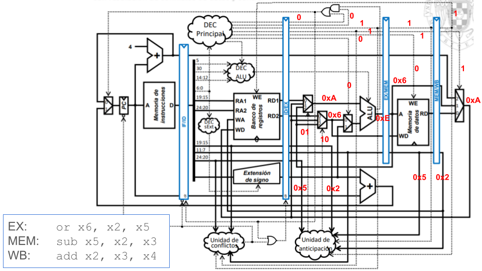

# Ripes processors
Ripes allows simulating many aspects of computer organization, structure, and architecture. In this lab, we will use it to visualize the execution of programs in two of the simulated processors: *Single-Cycle processor* and *Complete 5-stage Pipelined processor*.

## Building the *Single-Cycle processor*
Look carefully at the following presentation which shows step-by-step how to build the Ripes Single-Cycle processor and several examples of a subset of instructions executing on it: [BuildingRipesSingleCycle](https://drive.google.com/file/d/1ltiDqyqdh34iVbHx_IfEizBPG4y45GcI/view?usp=sharing).

In addition to the previous slides, the following presentation shows step-by-step and in great detail how to build the Single-Cycle processor from the Harris&Harris (H&H) textbook: [SlidesModule5](https://www.fdi.ucm.es/profesor/mendias/FC2/FC2module5.pdf)


## Basic use of the *Single-Cycle processor*
The construction of the Single-Cycle processor is first explained theoretically using the slides provided above. During this explanation, students must perform the corresponding tests from the list below, executing the instructions and carefully analyzing the processor signals in detail.

To use Ripes for the *Single-Cycle processor*, follow these steps:

1. Start the Ripes simulator.

2. Open the Processor tab and in the ```Select Processor``` icon, choose the processor with the following characteristics:
   - Single-Cycle processor.
   - RISC-V base instruction set plus M extension.
   - Extended layout.


3. Add the signal values view in the ```View``` tab.

<p align="center">
  
</p>

4. Perform the example shown in the above slides for the ```sub``` instruction. Use the following code in Ripes:

```
li x2, 5
li x3, 3
sub x1, x2, x3
```


5. In the previous code, replace the ```sub``` instruction for an arithmetic-logic instruction that operates with an immediate. Explain the differences versus the execution of a ```sub``` instruction.


## Complete example in the *Single-Cycle processor*
Let's perform a simple test in the *Single-Cycle Processor*, extracted from the presentation provided at: [SlidesModule5](https://www.fdi.ucm.es/profesor/mendias/FC2/FC2module5.pdf).

Copy the following program into the Editor tab.

```
.data
xa: .word 10
xb: .word 0
xc: .word 0

.text
la x9, xa
L7:
    lw x6, 0(x9)
    sw x6, 8(x9)
    or x4, x5, x6
    beq x4, x4, L7
```

Analyze and explain the control and data signals highlighted in red in the following figure for each instruction of the first iteration of the loop: ```lw```, ```sw```, ```or``` and ```beq```. First, attempt the analysis on paper on your own, and then compare your results with the provided solution below and with a cycle-by-cycle Ripes simulation.


**SOLUTION:**

1. ```LW``` instruction:


   - ```Instr```= 0x0004a303. You can confirm, using the slides from [Module 4](https://www.fdi.ucm.es/profesor/mendias/FC2/FC2module4.pdf), that this hexadecimal value corresponds to the ```lw``` instruction included in the program.

   - ```Addr``` = 0x8, which is the address where the ```lw``` instruction. See next the instructions in the Ripes memory tab:

     

   - ```PC``` = 0xc, which is the address where the instruction following the ```lw``` is stored in memory and will be fetched in the next cycle.

   - ```R1``` = 0x09, which is the index of the base register (```x9```) used in the ```lw``` instruction to calculate the effective address.

   - ```Reg1``` = ```Op1``` = 0x10000000, which is the value held in the base register used in the ```lw``` instruction.

   - ```Imm``` = ```Op2``` = 0x0, which is the offset used in the ```lw``` instruction to calculate the effective address.

   - ```C2``` = ```REG1```, as the first ALU operand comes from the Register File.

   - ```C3``` = ```IMM```, as the second ALU operand comes from the Immediate.

   - ```C4``` = ```ADD```, as the ALU must perform an addition to compute the load effective address.

   - ```Res``` = 0x10000000, which is the result of the addition of the base register and the offset, and which is provided to the Data Memory through the Address input port.

   - ```Dout``` = 0xa, which is the value read from address 0x10000000 of the Data Memory. See next the data in the Ripes memory tab:

     

   - ```C6``` = ```MEMREAD```, as the value to write in the Register File must come from the Data output port of the Data Memory.

   - ```C1``` = 0x1, as the Register File must be written.

   - ```Wr``` = 0x06, which is the index of the destination register (```x6```) used in the ```lw``` instruction.

   - ```DInRF``` = 0xa, which is the data read from memory that must be saved in the Register File.

2. ```SW``` instruction:


   - ```Instr```= 0x064a423. You can confirm, using the slides from Module 4, that this hexadecimal value corresponds to the ```sw``` instruction included in the program.

   - ```Addr``` = 0xc, which is the address where the ```sw``` instruction.

   - ```PC``` = 0x10, which is the address where the instruction following the ```sw``` is stored in memory and will be fetched in the next cycle.

   - ```R1``` = 0x09, which is the index of the base register (```x9```) used in the ```sw``` instruction to calculate the effective address.

   - ```R2``` = 0x06, which is the index of the register that holds the value to store in memory.

   - ```Reg1``` = ```Op1``` = 0x10000000, which is the value held in the base register used in the ```sw``` instruction.

   - ```Imm``` = ```Op2``` = 0x10, which is the offset used in the ```sw``` instruction to calculate the effective address.

   - ```C2``` = ```REG1```, as the first ALU operand comes from the Register File.

   - ```C3``` = ```IMM```, as the second ALU operand comes from the Immediate.

   - ```C4``` = ```ADD```, as the ALU must perform an addition to compute the load effective address.

   - ```Res``` = 0x10000008, which is the result of the addition of the base register and the offset, and which is provided to the Data Memory through the Address input port.

   - ```Reg2``` = ```DInM``` = 0xa, which is the value to write in address 0x10000008 of the Data Memory. In the next cycle, we can confirm that the Data Memory has been correctly updated:

     

   - ```C1``` = 0x0, as the Register File must not be written in this case.

3. ```OR``` instruction:


   - Look at the example of the ```sub``` instruction shown above, which is identical as this one except for the ALU operation.

4. ```BEQ``` instruction:


   - ```Instr```= 0x10000497. You can confirm, using the slides from Module 4, that this hexadecimal value corresponds to the ```beq``` instruction included in the program.

   - ```Addr``` = 0x14, which is the address where the ```beq``` instruction is stored in memory.

   - ```PC``` = 0x8, which is destination address of the ```beq```. As we explain below, it is a taken branch.

   - ```R1``` = 0x04, which is the index of the first register (```x4```) used in the ```beq``` instruction as its first operand.

   - ```R2``` = 0x04, which is the index of the second register (```x4```) used in the ```beq``` instruction as its second operand.

   - ```Op1``` = 0x14, which is the value held in the PC.

   - ```Imm``` = ```Op2``` = 0xfffffff4, which is the offset that must be added to the PC to compute the destination address. Note that it is a negative number (C2 format), so it is a backward branch.

   - ```C2``` = ```PC```, as the first ALU operand comes from the PC.

   - ```C3``` = ```IMM```, as the second ALU operand comes from the Immediate.

   - ```C4``` = ```ADD```, as the ALU must perform an addition to compute the destination address of the ```beq``` instruction.

   - ```Res``` = 0x8, which is the destination address of the ```beq``` instruction, and which will be stored in the PC at the end of this cycle.

   - ```C1``` = ```C5``` = 0x0, as neither the Register File nor the Data Memory must be written.

   - ```Reg1``` = ```Reg2``` = 0x0a, which are the values read from the Register File. Given that they are equal, the condition is met and the branch is taken.

   - ```C7``` = 0x1, as the condition is met given that the two registers are equal. Note that this signal makes the destination address of the ```beq``` instruction be written to the PC.


## Exercise 1
The following code is executed in Ripes:

```
.text
main:
li x3, 0x4
li x4, 0x6
add x2, x3, x4
sub x5, x2, x3
or  x6, x2, x5
```

What is the value of the signals highlighted in the following figure for the execution of the ```add``` instruction? Try first to reason it out on your own without using the simulator.


Simulate the program cycle-by-cycle, stop when the ```add``` instruction is executing, and confirm your answer. 


## Exercise 2
The following code is executed in Ripes:

```
.data
v: .word 1, 10
.text
main:
la x1 , v
li x2, 0x2
li x3, 0x4
lw x2, 4(x1)
sub x5, x2, x3
or  x6, x2, x5
```

What is the value of the signals highlighted in the following figure for the execution of the ```lw``` instruction? Try first to reason it out on your own without using the simulator.


Simulate the program cycle-by-cycle, stop when the ```lw``` instruction is executing and confirm your answer. 


## Exercise 3
The following code is executed in Ripes:

```
.text
main:
li x1, 0x8
li x2, 0x8
li x3, 0x4
beq x2, x1, ELSE
IF:	
   sub x5, x2, x3
    or  x6, x2, x5
    beq x0, x0, END
ELSE:
   add x5, x2, x3
    and x6, x2, x5
END:
jal main
nop
```

Answer the following questions for the Single-Cycle Processor, using the following figure:


a. Simulate the program cycle-by-cycle and stop when the first ```beq``` instruction is executing. What is the value of the signals highlighted in the figure? Justify each value obtained.

b. Then, modify the ```x1``` register initialization to 0x7, and analyze the first ```beq``` instruction execution. What is the value of the signals highlighted in the figure? Justify each value obtained.

c. Explain the differences observed between the two cases.

d. Finally, stop when the ```jal``` instruction is executing. Explain the signals from the figure above. How is the destination address computed? What is written to the Register File?

---
## Building the *Pipelined processor*
Look at the following presentation which shows step-by-step how to build the Ripes Pipelined processor and several examples of a subset of instructions executing on it: [BuildingRipesPipelined](https://drive.google.com/file/d/1YEU6boOllnm3OXSRJV4YFuy86CcGv4En/view?usp=sharing).

In addition, the following presentation shows step-by-step and in great detail how to build the Pipelined processor from the Harris&Harris textbook: [SlidesModule7](https://www.fdi.ucm.es/profesor/mendias/FC2/FC2module7.pdf).

At this point, it is also useful to analyze the performance metrics. For that purpose, look at the following presentation from slide 108 to slide 110: [SlidesModule6](https://www.fdi.ucm.es/profesor/mendias/FC2/FC2module6.pdf).


## Basic use of the *Pipelined processor*
The construction of the Pipelined processor is first explained theoretically using the slides provided above. During this explanation, students must perform the corresponding tests from the list below, executing the instructions and carefully analyzing the processor signals in detail.

1. Start the Ripes simulator.

2. Open the Processor tab and in the ```Select Processor``` icon, choose the processor with the following characteristics:
   - 5-stage processor.
   - RISC-V base instruction set plus M extension.
   - Extended layout.

<p align="center">
  
</p>

3. Add the signal values view in the ```View``` tab.

<p align="center">
  
</p>

4. Perform the example shown in the above slides for the ```sub``` instruction. Use the following code in Ripes:

```
li x2, 5
li x3, 3
nop
nop
nop
nop
sub x1, x2, x3
```

5. Analyze the ```addi``` instruction in the following example. Highlight the differences with respect to the execution of a ```sub``` instruction.

```
li x2, 5
li x3, 3
nop
nop
nop
nop
addi x1, x2, x3
```

6. Analyze the ```lw``` instruction in the following example.

```
.data
a: .word 5
.text
la x2, a
nop
nop
nop
nop
lw x1, 0(x2)
```

7. Analyze the ```sw``` instruction in the following example.

```
.data
a: .word 0
.text
li x1, 2
la x2, a
nop
nop
nop
nop
sw x1, 0(x2)
```

<!--
8. Analyze the ```beq``` instruction in the following example. Test both taken and non-taken branches by modifying the initial values of ```x2``` and ```x3```.

```
li x2, 5
li x3, 5
REPEAT:
nop
nop
nop
nop
beq x3, x2, REPEAT
addi x2, x2, 1
addi x3, x3, 1
```
-->


## Complete example in the *Pipelined processor*
Let's perform a simple test in the *Pipelined Processor*. Copy the following program into the Editor tab.

```
.data
   xa: .word 10
   xb: .word 0
   xc: .word 0

.text
   la x9, xa
   la x8, xc
  L1:
   addi x5, x0, 2
   addi x4, x0, 3
   addi x3, x0, -1
   lw x6, 0(x9)
   beq x0, x5, L1
   add x1, x5, x5
   or x2, x4, x4
   sw x6, 8(x9)
```

Analyze and explain the control and data signals highlighted in red in the following figure in each cycle. First, attempt the analysis on paper on your own, and then compare your results with the provided solution below and with a cycle-by-cycle Ripes simulation.


For example, this is the state of the processor at the end of the code.


As you can see, five instructions are being executed simultaneously in the processor (in-flight), each at a different stage. In the bottom right corner, you can see the Instruction Memory, which helps us follow the program's execution step by step. Next to that window, there's another one displaying performance metrics such as cycles, instructions, and CPI/IPC.


## Data and Control Hazards in the *Pipelined processor*
Look at the following presentation which shows, from slide 53 to slide 130, how hazards are handled in the Harris&Harris textbook [SlidesModule7](https://www.fdi.ucm.es/profesor/mendias/FC2/FC2module7.pdf).


## Exercise 4
The following code is executed in Ripes:

```
.text
main:
li x3, 0x4
li x4, 0x6
add x2, x3, x4
sub x5, x2, x3
or  x6, x2, x5
```

Answer the following questions for the Pipelined Processor:

a. Identify the data dependencies that exist in the code and explain how they are resolved in the processor. 

b. Draw the pipeline diagram in paper.

<!--
b. On the figure below (obtained from H&H), indicate the values of the data and control signals in the EX, MEM, and WB stages during the cycle when the ```add``` instruction is in the WB stage.

<p align="center">
  
</p>
-->

c. Analyse the program on the Ripes simulator for the 5-stages processor and answer the following questions:
 - Generate in Ripes the pipeline diagram and compare it with your previous answer.
 - Show screenshots of the pipeline to explain how the different data hazards are handled.
 - Stop the execution during the cycle when the ```add``` instruction is in the WB stage and analyze the data/control signals.


**SOLUTION:**
We next show partial solutions for item c as an example. Complete the solutions not provided.

<!--
*b. On the figure below (obtained from H&H), indicate the values of the data and control signals in the EX, MEM, and WB stages during the cycle when the ```add``` instruction is in the WB stage.*

<p align="center">
  
</p>
-->

*c. Analyse the program on the Ripes simulator.*

*- Generate in Ripes the pipeline diagram and compare it with your previous answer.*

This is the timing diagram obtained with Ripes:

<p align="center">
  
</p>

*- Show screenshots of the pipeline to explain how the different data hazards are handled.*

This is a screenshot of the simulator that highlights the forwarding that occurs between the first ```li``` and the ```add```:

<p align="center">
  
</p>

You should explain how the hazard is handled by the pocessor: which multiplexers are used, the stages involved, etc.

*- Stop the execution during the cycle when the ```add``` instruction is in the WB stage and analyze the data/control signals.*

This is a screenshot of the simulator during the cycle when the ```add``` instruction is in the WB stage.

<p align="center">
  
</p>

You should explain the values of the different data/control signals and compare their values with those from the previous item. Most of them should be equal (although a few signals may differ, given that the two processors are not identical).


## Exercise 5
The following code is executed in Ripes:

```
.data
v: .word 1, 10
.text
main:
la x1 , v
li x2, 0x2
li x3, 0x4
lw x2, 4(x1)
sub x5, x2, x3
or  x6, x2, x5
```

Answer the following questions for the 5-stage Pipelined Processor:

a. Identify the data dependencies that exist in the code and explain how they are resolved in the processor. 

b. Draw the pipeline diagram.

<!--
b. On the figure below (obtained from H&H), indicate the values of the data and control signals in the 5 pipeline stages during the cycle when the ```lw``` instruction is in the WB stage.

<p align="center">
  
</p>
-->

c. Analyse the program on the Ripes simulator for the 5-stages processor and answer the following questions:
 - Generate in Ripes the pipeline diagram and compare it with your previous answer.
 - Show screenshots of the pipeline to explain how the different data hazards are handled.
 - Stop the execution during the cycle when the ```lw``` instruction is in the WB stage and analyze the data/control signals.


## Exercise 6
The following code is executed in Ripes:

```
.text
main:
li x1, 0x8
li x2, 0x8
li x3, 0x4
beq x2, x1, ELSE
IF:	
   sub x5, x2, x3
    or  x6, x2, x5
    beq x0, x0, END
ELSE:
   add x5, x2, x3
    and x6, x2, x5
END:
nop
```

Answer the following questions for the 5-stage Pipelined Processor:

a. Identify the data dependencies that exist in the code and explain how they are resolved in the processor. 

b. Draw the pipeline diagram.

<!--
b. On the figure below (obtained from H&H), indicate the values of the data and control signals in the 5 pipeline stages during the cycle when the first ```beq``` instruction is in the EX stage.

<p align="center">
  
</p>
-->

c. Analyse the program on the Ripes simulator for the 5-stages processor and answer the following questions:
 - Generate in Ripes the pipeline diagram and compare it with your previous answer.
 - Show screenshots of the pipeline to explain how the different data hazards are handled.
 - Stop the execution during the cycle when the first ```beq``` instruction is in the EX stage and analyze the data/control signals.


## Exercise 7
Given the following code, which calculates the factorial of the number stored in register t0 (it is assumed to always be an integer greater than 1) and stores the result in the same t0 register:

```
.text
main:

addi t0, x0, 4
addi t1, x0, 1
addi t2, t0, -1

NEXT:
ble t2, t1, END
mul t0, t0, t2
addi t2, t2, -1
j NEXT

END:

addi t1, x0, 0
addi t0, x0, 0
```

<!--
a. Complete the pipeline diagram of the program in the 5-stage pipelined RISC-V processor from H&H. Assume that the processor has extended the ALU to perform multiplication with a latency of 1 cycle; that is, the ```mul``` instruction executes just like any other arithmetic-logical instruction.
-->

a. Draw the pipeline diagram in paper. Identify the structural, data, and control hazards on the diagram, clearly marking them and explaining how the processor handles each one.

b. Analyse the program on the Ripes simulator for the 5-stages processor and answer the following questions:
 - Generate in Ripes the pipeline diagram and compare it with your answer to item *a*.
 - Show screenshots of the pipeline to explain how the different data/control hazards are handled.
 - Indicate the values of the data and control signals in cycle 5 of the program execution.


---


### Lab 5
Given the following code, simulate it in the Ripes Single-Cycle processor and answer the following questions.

```
CODE (to be shown shortly)
```


### Lab 6
Given the following code, simulate it in the Ripes Pipelined processor and answer the following questions.

```
CODE (to be shown shortly)
```
