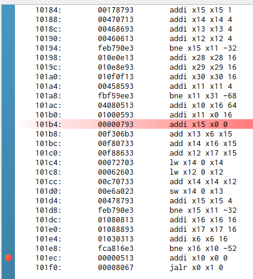
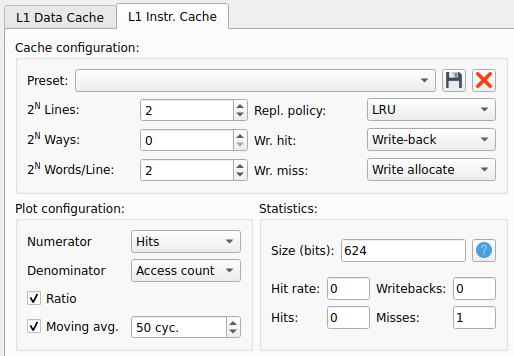

# Lab 3 - The Memory Hierarchy
This practice aims to help students understand the cache memory. You can follow the next steps:

1. If you are new to Computer Organization, you should start by reading Chapter 8 of the H&H book.
2. Then, you should look at the detailed presentation of the Ripes cache simulator provided here: [Presentation_Cache_Ripes](https://drive.google.com/file/d/1ffplxLHiyvC6G4GWyLHEbvgANaIqjZK0/view?usp=sharing).
3. Then, you can read the simulator guide provided [next](https://github.com/artecs-group/RVfpga-sim-addons/tree/main/Computer_Organization/Lab3#cache-simulation-in-ripes) in this repository.
4. Then, you can resolve the exercises included [below](https://github.com/artecs-group/RVfpga-sim-addons/tree/main/Computer_Organization/Lab3#exercise-1) in this repository, using Ripes.
5. Finally, if you want to continue practicing after completing the previous exercises, you can find more complex exercises in [RVfpga](https://university.imgtec.com/rvfpga-el2-v3-0-english-downloads-page/) labs 19 and 20.


## Cache simulation in Ripes
The cache view allows simulating different configurations and management policies for first-level data and instruction caches. In general, and unless stated otherwise, for this practice, we will configure the compiler to work with optimization level -O1 and set the processor to Single-Cycle 32-bit (see the following two figures). Moreover, in most of the exercises, we will not analyze the instruction cache, so its configuration will not affect us, and we can leave it as the default in the simulator.

<p align="center">
  
</p>

<p align="center">
  
</p>

As an example, we next show the steps to simulate Exercise 1-a (provided [below](https://github.com/artecs-group/RVfpga-sim-addons/tree/main/Computer_Organization/Lab3#exercise-1) in this repository), which uses the following program (you just need to copy the code to the Ripes editor):

```
#define N 4

int A[N][N];
int B[N][N];
int C[N][N];

main(){
   int i, j, x;

/* Initialize matrices */
   for (i=0; i < N; i++)
       for (j=0; j < N; j++){
           A[i][j]=i*N+j;
           B[i][j]=i*N+j+3;
           C[i][j]=0;
       }
          
/* Analyze this loop */
   for (i=0; i < N; i++)
       for (j=0; j < N; j++)
       	C[i][j] = A[i][j] + B[i][j];

}
```

1. The Cache window allows configuring the data cache and the instruction cache separately. For example, in this case, we would be configuring a data cache with the following parameters:
- 4 lines (2<sup>N</sup> Lines = 2)
- 4 words per line (2<sup>N</sup> Words/Line = 2)
- 1 way (2<sup>N</sup> Ways = 0)
- LRU replacement policy
- Write-back and Write-allocate write policies

<p align="center">
  
</p>

Given that each word is 4 bytes (32 bits) in the RISC-V architecture used, in this case, we would have a cache size of 4 lines * 4 words * 4 bytes = 64B (2<sup>6</sup>B). At the bottom, we can see the statistics for misses, hits, writebacks, etc.

2. Copy the initial program (provided above) into the editor, compile it, and check that everything works correctly.

<p align="center">
  
</p>

3. Locate the ```main``` function and the loops that make up the function. The ```lw``` and ```sw``` instructions are very helpful for locating these loops. In this case, the loop to analyze is the following:

<p align="center">
  
</p>

4. Set a breakpoint at the beginning of the loop to be analyzed by clicking on the left button over the blue vertical column, next to the instruction where you want to place it.

<p align="center">
  
</p>

5. Run quickly until the breakpoint at the beginning of the loop to be analyzed. Keep in mind that the execution will stop after the instruction where the breakpoint is located is executed.

<p align="center">
  
</p>

6. In the cache tab, write down the number of misses, hits, and writebacks you have at the starting point of the loop to be analyzed, as this will be the initial value from which we will count the misses and accesses of the loop to be analyzed.

<p align="center">
  
</p>

7. Delete the breakpoint and add another one right after the loop:

<p align="center">
  
</p>

8. Run quickly until the breakpoint, and write down again the number of misses, hits, and writebacks.

<p align="center">
  
</p>

9. With this information, we can calculate the hits, misses, and writebacks:

 * Hits = 61 - 61 = 0
 * Misses = 116 - 68 = 48
 * Writebacks = 77 - 61 = 16

10. Finally, analyze step by step and explain the evolution of the cache throughout the execution of the loop, carefully observing the evolution of the blocks. You can progress gradually from the start of the loop, stopping after executing each ```lw``` or ```sw``` instruction and analyzing the cache state. For example, the following figure shows the cache state after the second iteration:

<p align="center">
  
</p>


## Exercise 1
Simulate in Ripes the following program:

```
#define N 4

int A[N][N];
int B[N][N];
int C[N][N];

main(){
   int i, j, x;

/* Initialize matrices */
   for (i=0; i < N; i++)
       for (j=0; j < N; j++){
           A[i][j]=i*N+j;
           B[i][j]=i*N+j+3;
           C[i][j]=0;
       }
          
/* Analyze this loop */
   for (i=0; i < N; i++)
       for (j=0; j < N; j++)
       	C[i][j] = A[i][j] + B[i][j];

}
```

You should analyze and explain the cache's behavior in detail, adding screenshots from the simulator. Analyze misses, hits, and writebacks, as well as the evolution of cache blocks step by step (you can pause execution after each load/store, at the end of each iteration, ..., and show the cache blocks in that moment). 

Also, analyze step by step and explain the evolution of the cache throughout the loop execution, carefully observing the evolution of the blocks. You can progress gradually from the beginning of the loop, pausing after the execution of each lw (load word) or sw (store word) instruction, and analyzing the state of the cache.

Use a small matrix size (N=4) and a small data cache size (keep the instruction cache at the default size provided by the simulator) to easily analyze the behavior of the data cache (later, you can also test a more real cache size). Specifically, analyze the following scenarios:

a. Direct mapping data cache

<p align="center">
  
</p>

b. Two-way set associative data cache:

  - Increase the number of ways to 2: 2<sup>N</sup> Ways = 1
  - Reduce the number of lines to 2, to keep the total data cache size the same: 2<sup>N</sup> Lines = 1
  - Test both write allocation policies: Write Allocate and Write No-Allocate.

c. Modified program:


## Exercise 2
Simulate the following code in Ripes. 

```
int nota[128];	
int media[128];	

main(){
  int i;

  /* Initialize matrices */
  for (i=0; i < 128; i++){
    nota [i] = i;
    media [i] = i+5;
  }
  
  /* Analyze this loop */
  for (i=0; i < 128; i++) {
    if (i > 7 && i < 64)
    		nota[i] = media[i] / 2;
    else
    		nota[i] = nota[i] * media[i];
  }

}
```

You should analyze and explain the cache's behavior in detail, using screenshots from the simulator to assist you.

a. Analyze the changes made to the code compared to the one from the worksheet exercise.

b. Locate the loop to be analyzed in the disassembled code in Ripes. The loop is programmed in a somewhat original way. Explain it in detail. You can use a step-by-step simulation and screenshots to assist in your explanation.

c. Analyze the behavior of the data cache in detail for the configuration of the worksheet exercise and compare the results with those from the current exercise. Perform the analysis section by section: iterations 0 to 7, iterations 8 to 63, and iterations 64 to 127.

d. Analyze one of the code optimizations and explain the results obtained.


## Exercise 3
Simulate the following code in Ripes. 

```
int A[16][16];
int B[32];
int C[16][16];

main(){
int i, j;

   /* Initialize matrices */
   for (i=0; i < 16; i++)
       for (j=0; j < 16; j++){
           A[i][j]=i*16+j;
           C[i][j]=0;
       }
  for (j=0; j < 32; j++)
       	B[j]=j+3;

  /* Analyze this loop */
  for (i=0; i< 16; i++)
     	 C[0][i] = A[0][i] + B[4];
  }
```

a. Simulate the program with a direct-mapped data cache and Write Allocate. The behavior when compiling with -O1 differs from that obtained in the problem sheet. Simulate step by step and justify the results from the simulator.

b. Simulate the program with a data cache similar to the previous section but with 2-way associativity (keeping the total data cache size unchanged). Explain the results.

c. Analyze and explain in detail the evolution of the instruction cache for the loop to be analyzed for the following two configurations, which differ only in the number of lines:

<p align="center">
  
</p>

<p align="center">
  
</p>


## Exercise 4
Consider a computer with a main memory of 4MB, addressable by bytes, equipped with a 2KB cache, with lines of 512B. The cache is direct-mapped and uses write allocation. The following code is to be executed:

```
int A[1024];
int B[1024];
int C[1024];

main(){
int i, j;

   /* Initialize matrices */
   for (i=0; i < 1024; i++){
          A[i]=i;
		B[i]=i+7;
          C[i]=0;
       }

  /* Analyze this loop */
  for (i=0; i< 1024; i++)
     	 C[i] = A[i] - B[1023-i];
}
```

Answer the following questions. You should analyze and explain the behavior of the cache in detail, using screenshots from the simulator to assist you.

a. How many cache misses occur?

b. How many cache misses occur with a direct-mapped cache without write allocation?

c. How many cache misses occur with a two-way associative cache (with the total cache size remaining the same; that is, there will be half as many block frames) with write allocation?

d. Analyze the program for the same cache as in section C but changing the write policy to Write-Through.
