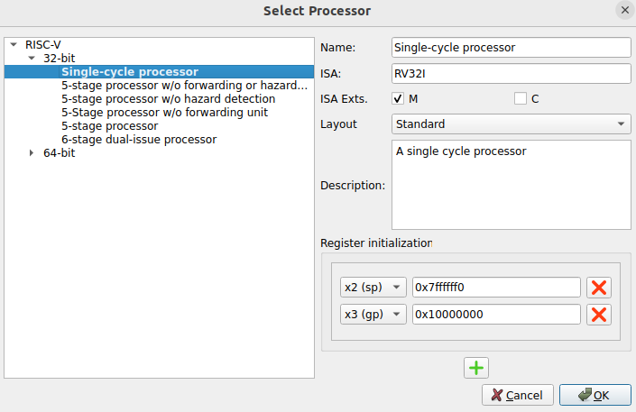

# Lab 3 - The Memory Hierarchy
This practice aims to help students understand the cache memory. You can follow the next steps:

1. If you are new to Computer Organization, you should start by reading Chapter 8 of the H&H book.
2. Then, you should look at the detailed presentation of the Ripes cache simulator provided here: [Presentation_Cache_Ripes](https://drive.google.com/file/d/1ffplxLHiyvC6G4GWyLHEbvgANaIqjZK0/view?usp=sharing).
3. Then, you can read the simulator guided provided [next](https://github.com/artecs-group/RVfpga-sim-addons/tree/main/Computer_Organization/Lab3#cache-simulation-in-ripes) in this repository.
4. Finally, you can resolve the exercises included [below](https://github.com/artecs-group/RVfpga-sim-addons/tree/main/Computer_Organization/Lab3#exercise-1) in this repository.

## Cache simulation in Ripes
The cache view allows simulating different configurations and management policies for first-level data and instruction caches. The Cache window allows configuring the data cache and the instruction cache separately.

For example, in this case, we would be configuring a data cache with the following parameters:
- 4 lines (field "2N Lines = 2")
- 4 words per line (field "2N Words/Lines = 2")
- 1 way (field "2N Ways = 0")
- LRU replacement policy
- Write-back and Write-allocate write policies

  

Given that each word is 4 bytes (32 bits) in the RISC-V architecture used, in this case, we would have a cache size of 4 lines * 4 words * 4 bytes = 64B (26B). At the bottom, we can see the statistics for misses, hits, writebacks, etc.

In general, and unless stated otherwise, for this practice, we will configure the compiler to work with optimization level -O1 and set the processor to Single-Cycle 32-bit (see the following two figures). Moreover, in most of the exercises, we will not analyze the instruction cache, so its configuration will not affect us, and we can leave it as the default in the simulator.

  

  

In the exercises, it should be noted that the simulation results will generally not match exactly with those from the worksheet, due to various side effects: different memory location of the vectors, blocks present in the cache after the initialization of the vectors, etc.

## Exercise 1
