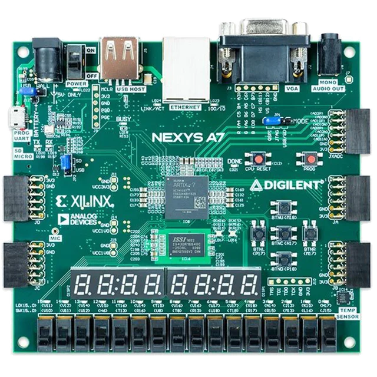
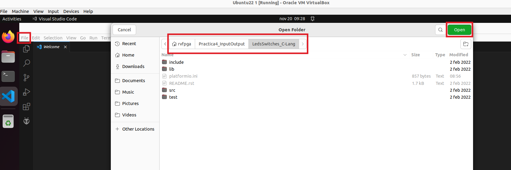
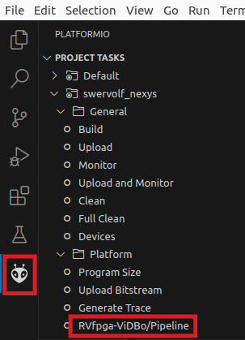
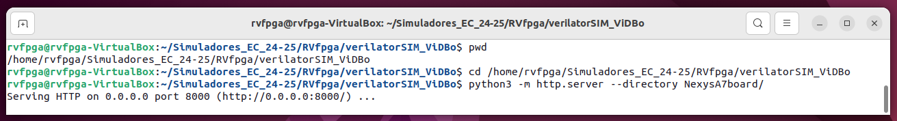
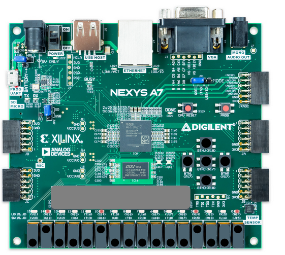

# Lab 4 - The RVfpga I/O System
This practice aims to help students gain a thorough understanding of an Input/Output System. You can follow the next steps:

1. If you are new to Computer Organization, you should start by reading Chapter 9 of the H&H book.
2. Then, you should look at the detailed presentation of the RVfpga I/O System provided here: [Presentation_RVfpga_IO](https://drive.google.com/file/d/1Fv4-I8DwISdqqDpol4i_BMZNzK4QmpOe/view?usp=sharing) (if necessary, you can obtain more information in the [RVfpga: Understanding Computer Architecture](https://university.imgtec.com/rvfpga-el2-v3-0-english-downloads-page/) course).
3. Then, you can perform the guided example for RVfpga-ViDBo, provided [next](https://github.com/artecs-group/RVfpga-sim-addons/blob/main/Computer_Organization/Lab4/README.md#introduction---simulation-of-the-rvfpga-soc) in this repository.
4. Then, you can resolve the exercises included [below](https://github.com/artecs-group/RVfpga-sim-addons/tree/main/Computer_Organization/Lab4#exercise-1) in this repository.
5. Finally, if you want to continue practicing after completing the proposed exercises, you can find more complex exercises in [RVfpga](https://university.imgtec.com/rvfpga-el2-v3-0-english-downloads-page/) labs 5 to 10.

## Introduction - Simulation of the RVfpga SoC
In this lab, we will use the RVfpga-ViDBo simulator. This tool simulates the VeeRwolfX SoC based on the VeeR EH1 core running on the Nexys A7 FPGA board. The simulator allows us to simulate the execution of RISC-V codes on this processor and interact with some of the board’s peripherals. The programs work exactly the same in the simulator as on the actual board.

<p align="center">
  
</p>

In this lab, we will only use the following peripherals among all the available ones:
- 16 LEDs
- 16 Switches
- 8 digits with 7-segment displays

Follow the steps below to launch an example simulation on RVfpga-ViDBo, where the state of the switches is continuously read and displayed on the LEDs.
1. Open Visual Studio Code (VSCode).
2. Click on ```File - Open Folder``` and open the folder containing the project for the example we will work on in this introduction: ```/home/rvfpga/Simuladores_EC_24-25/RVfpga/Projects/LedsSwitches_C-Lang```

<p align="center">
  
</p>

3. Set the path for the simulator in the ```platformio.ini``` file. In this lab, we will use the RVfpga-ViDBo simulator. In this project, the path is already correctly set in the following line, so you do not need to change anything:

```board_debug.verilator.binary = /home/rvfpga/Simuladores_EC_24-25/RVfpga/verilatorSIM_ViDBo/OriginalBinaries/RVfpga-ViDBo_Ubuntu22```

4. Run the simulator:

    a. In the ```PROJECT TASKS``` window of PlatformIO, click on ```RVfpgaEL2-ViDBo/Pipeline```

   <p align="center">
      
   </p>
   
    b. Open a terminal and launch the ViDBo server by running the following commands:

      ```
      cd /home/rvfpga/Simuladores_EC_24-25/RVfpga/verilatorSIM_ViDBo
      python3 -m http.server --directory NexysA7board/
      ```

     <p align="center">
        
     </p>

    c. Finally, open a browser and go to http://localhost:8000/nexys-a7.html, connect to the board, and check the simulation by modifying the switches and viewing the LEDs. This code would behave exactly the same if run on the actual board.

     <p align="center">
        
     </p>

## Exercise 1
Analyze in-depth the program provided in the ```LedsSwitches``` project (located at: ```/home/rvfpga/Simuladores_EC_24-25/RVfpga/Projects/LedsSwitches```), which performs the same functionality as the introductory code but is written in assembly.

Next, describe in detail what the code does. You must clearly explain the purpose and function of each instruction.

Finally, run the code in the RVfpga-ViDBo simulator following the same steps explained in the introduction and include a screenshot showing its operation.


## Exercise 2
Write a RISC-V assembly program that shows a block of four lit LEDs that repeatedly moves from one side of the 16 available LEDs on the board to the other. Also, include two switches to control the speed and direction of the movement. Switch[0] changes the speed, and Switch[1] changes the direction as follows:
- If Switch[0] is ON (high), the lit LEDs should move quickly. Otherwise, the lit LEDs should move slowly. You may define what "quickly" and "slowly" mean, but the difference in speed must be visible and noticeable just by looking at it.
- If Switch[1] is ON (high), the lit LEDs should move repeatedly from right to left (starting again at the right-most LED when reaching the left-most). Otherwise, the lit LEDs should move repeatedly from left to right.

You can use the project from Exercise 1 as a base and simply write your code in the ```LedsSwitches.S``` file instead of the provided one.


## Exercise 3
Analyze the program provided in the ```71_7SegDispl_C-Lang``` project (located at: ```/home/rvfpga/Simuladores_EC_24-25/RVfpga/Projects/71_7SegDispl_C-Lang```).

Next, describe in detail what the code does. You must clearly explain the purpose and function of each instruction.

Finally, run the code in the RVfpga-ViDBo simulator following the same steps explained in the introduction and include a screenshot showing its operation.


## Exercise 4
Write a C program that displays the value of the switches on the four right-most digits of the 7-segment displays.

You can use the project from Exercise 3 as a base and simply write your code in the ```71_7SegDispl_C-Lang.c``` file instead of the provided one.


## Exercise 5
In this exercise, we will work with interrupts. Two codes are provided with the same functionality, but the first uses polling while the second uses interrupts.

- ```/home/rvfpga/Simuladores_EC_24-25/RVfpga/Projects/LED-Switch_7SegDispl_C-Lang```
- ```/home/rvfpga/Simuladores_EC_24-25/RVfpga/Projects/LED-Switch_7SegDispl_Interrupts_C-Lang```

Follow these steps:

- Analyze both provided codes and simulate them. In the interrupt-based code, you must focus on the ```main```, ```GPIO_Initialization```, and ```GPIO_ISR``` functions. Read the following information on each project carefully.

- Modify the interrupt-based code so that each time a 0 to 1 transition is detected on the first switch, the speed at which the count displayed on the 7-segment displays is incremented changes between two clearly different values (e.g., intervals of 1 second and 0.1 seconds).


## Exercise 6
Modify the ```main``` and ```GPIO_ISR``` functions of the interrupt-based code (```/home/rvfpga/Simuladores_EC_24-25/RVfpga/Projects/LED-Switch_7SegDispl_Interrupts_C-Lang```) so that each time a 0 to 1 transition is detected on the first switch, the 7-segment displays invert their on/off state (i.e., if they are off, they turn on and continue displaying the count, and if they are on, they turn off).


## Exercise 7

Modify the interrupt-based code (```/home/rvfpga/Simuladores_EC_24-25/RVfpga/Projects/LED-Switch_7SegDispl_Interrupts_C-Lang```) so that each time a 0 to 1 transition is detected on the first switch, the state of all 16 LEDs is inverted, not just the least significant one as in the provided code.

Note: In C, the following two operators work as explained:
  - ! → Performs boolean inversion; i.e., !0 is 1 and !1 is 0.
  - ~ → Performs logical inversion; i.e., ~0 is 0xffffffff.


## Exercise 8

Modify the interrupt-based code (```/home/rvfpga/Simuladores_EC_24-25/RVfpga/Projects/LED-Switch_7SegDispl_Interrupts_C-Lang```) so that the first switch retains the same functionality as in the original code, and each time a 0 to 1 transition is detected on the second switch, the 7-segment displays invert their on/off state (i.e., if they are off, they turn on and continue displaying the count, and if they are on, they turn off). In this case, you will also need to make changes to the GPIO_Initialization function.
