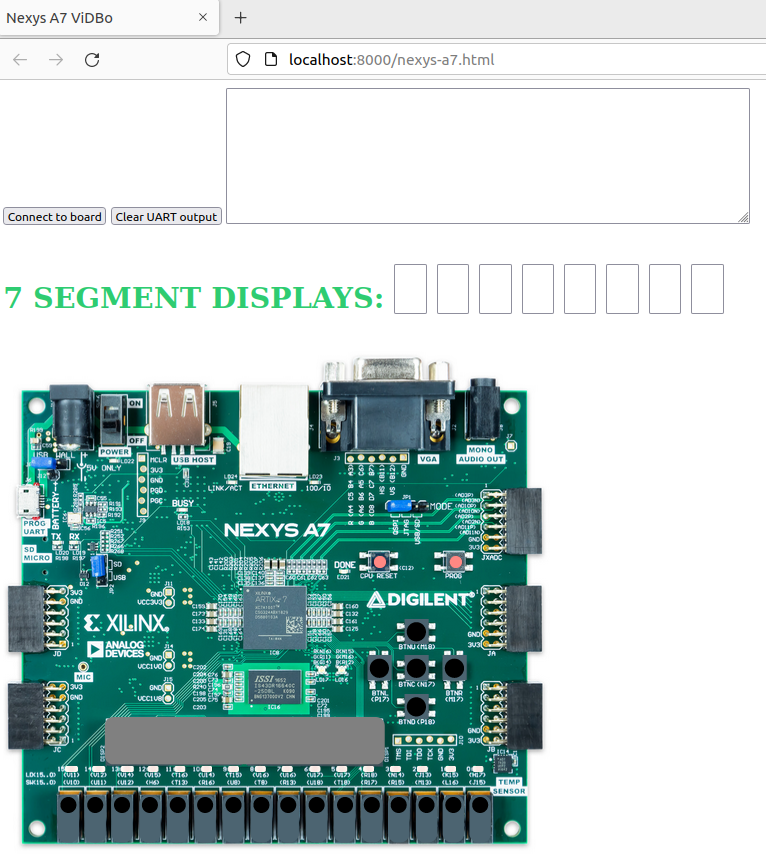
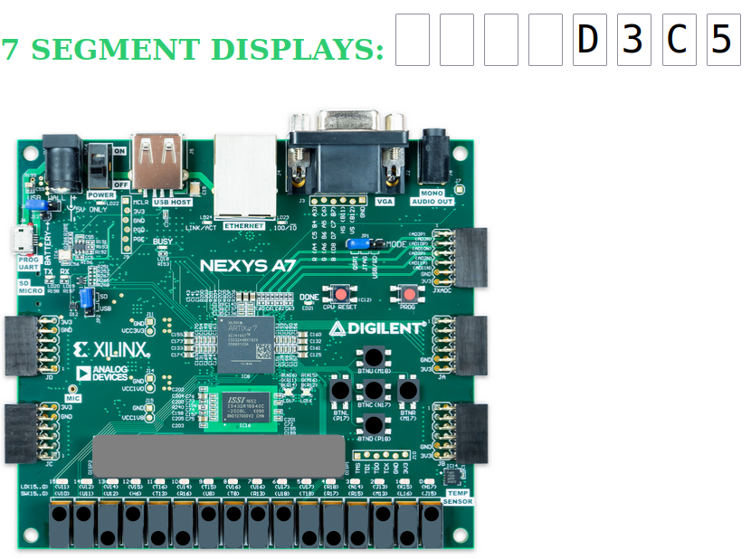

# Lab 4 (Lab 7 of ISA) - The RVfpga I/O System - High Level
This lab aims to help students gain a solid understanding of an **Input/Output (I/O) System** and how it operates within the RVfpga platform. Follow the steps below:

1. **Watch the introductory video**  
   Watch the video [InputOutputVideo](https://www.youtube.com/watch?v=8fK-CoEbo0Y), which provides a detailed explanation of the **RVfpga I/O System**. You can also download the slides [here](https://drive.google.com/file/d/1Fv4-I8DwISdqqDpol4i_BMZNzK4QmpOe/view?usp=sharing).

2. **Run the guided simulation example**  
   Perform the guided example for RVfpga-ViDBo, provided in the section [Simulation of the RVfpga SoC in RVfpga-ViDBo](https://github.com/artecs-group/RVfpga-sim-addons/blob/main/Computer_Organization/Lab4/README.md#simulation-of-the-rvfpga-soc-in-rvfpga-vidbo). *(You do **not** need to include this example in your report.)*

3. **Solve the polling-based exercises**  
   Then, complete the following exercises. Include them in your report by providing the editable source code (so the professor can easily test it) along with RVfpga-ViDBo screenshots demonstrating correct execution, accompanied by a brief caption:  
   - [Exercise 1](https://github.com/artecs-group/RVfpga-sim-addons/blob/main/Computer_Organization/Lab4/README.md#exercise-1)  
   - [Exercise 2](https://github.com/artecs-group/RVfpga-sim-addons/blob/main/Computer_Organization/Lab4/README.md#exercise-2)  
   - [Exercise 3](https://github.com/artecs-group/RVfpga-sim-addons/blob/main/Computer_Organization/Lab4/README.md#exercise-3)

4. **Run the interrupt-based guided test**  
   Perform the guided test provided in the section [Interrupts – Guided Test](https://github.com/artecs-group/RVfpga-sim-addons/blob/main/Computer_Organization/Lab4/README.md#interrupts--guided-test) to learn how interrupts are managed in RVfpga. *(You do **not** need to include this example in your report.)*

5. **Solve the interrupt-based exercises**  
   Finally, complete the following exercises. Include them in your report by providing the editable source code (so the professor can easily test it) along with RVfpga-ViDBo screenshots demonstrating correct execution, accompanied by a brief caption:  
   - [Exercise 4](https://github.com/artecs-group/RVfpga-sim-addons/blob/main/Computer_Organization/Lab4/README.md#exercise-4)  
   - [Exercise 5](https://github.com/artecs-group/RVfpga-sim-addons/blob/main/Computer_Organization/Lab4/README.md#exercise-5)  
   - [Exercise 6](https://github.com/artecs-group/RVfpga-sim-addons/blob/main/Computer_Organization/Lab4/README.md#exercise-6)

---

## Simulation of the RVfpga SoC in RVfpga-ViDBo
From **minute 16:36 to 19:16** of the following video, you can watch an example of the **RVfpga-ViDBo simulator** running a program: [RVfpgaToolsVideo](https://youtu.be/Z8QcQRW7F4s?si=99ybjtqrBAa5-r8K&t=996).

This tool simulates the **VeeRwolfX SoC**, which is based on the **VeeR EH1** core running on the **Nexys A7 FPGA** board. It allows you to execute RISC-V programs and interact with several board peripherals directly from your computer. Programs executed in the simulator behave **exactly the same** as on the actual FPGA board.

<p align="center">
  
</p>

In this lab, we will use only the following peripherals:
- **16 LEDs**
- **16 Switches**
- **8 digits with 7-segment displays**

Follow the steps below to launch an example simulation on RVfpga-ViDBo, where the state of the switches is continuously read and displayed on the LEDs.

1. **Open Visual Studio Code (VS Code).**

2. **Open the project folder**  
   Go to `File → Open Folder` and open the folder containing the example project for this introduction:  
   ```/home/rvfpga/Simuladores_EC_24-25/RVfpga/Projects/LedsSwitches_C-Lang```

<p align="center">
  
</p>

3. **Check the simulator path**  
   Open the `platformio.ini` file. In this lab, we will use the **RVfpga-ViDBo** simulator, so set the path as follows: 
```board_debug.verilator.binary = /home/rvfpga/Simuladores_EC_24-25/RVfpga/verilatorSIM_ViDBo/OriginalBinaries/RVfpga-ViDBo_Ubuntu22```

4. **Run the simulator**

a. In the **PROJECT TASKS** panel of PlatformIO, click on ```RVfpgaEL2-ViDBo / Pipeline```

<p align="center">
   
</p>

b. **Launch the ViDBo server**  
   Open a terminal and run the following commands:
   ```
   cd /home/rvfpga/Simuladores_EC_24-25/RVfpga/verilatorSIM_ViDBo
   python3 -m http.server --directory NexysA7board/
   ```

  <p align="center">
     
  </p>

c. **Open the web interface**  
   In your browser, go to **http://localhost:8000/nexys-a7.html**, and click the **“Connect to board”** button.

  <p align="center">
     
  </p>

5. **Test the simulation**  
Move the switches and observe how the LEDs change accordingly. This behavior is identical to how the program would run on the actual FPGA board. For example:

<p align="center">
   
</p>

---

## Exercise 1

Write a C program that displays the **inverse** of the switches on the LEDs.

For example:  
- If the switches are (in binary): `0101010101010101`, then the LEDs should display: `1010101010101010`  
- If the switches are: `1111000011110000`, then the LEDs should display: `0000111100001111`

You can use the project **`LedsSwitches_C-Lang`** as a base. Make sure you understand how the program reads the switch states, writes to the LEDs, and how the GPIO registers are accessed.


## Exercise 2

Write a C program that displays the **value of the switches** on the **four right-most digits** of the 7-segment displays. You can use the project **`71_7SegDispl_C-Lang.c`** as a base (make sure you understand this program first).

When running the program in **RVfpga-ViDBo**, you should see the switch value appear on the 7-segment display. Note that this peripheral is shown **outside** the FPGA board in the simulator.

<p align="center">
  
</p>


## Exercise 3

Write a C program that shows the string **“0-1-2-3-4-5-6-7-8”** moving from right to left across the 8-digit 7-segment display.

- The character 0 should first appear on the right-most digit.
- Every approximately one second, all digits should shift one position to the left. At the same time, the next character in the sequence (1, then 2, 3, …) should enter on the right-most digit, replacing the empty position created by the shift.
- Whenever a character moves out of the display on the left, the next character in the sequence enters on the right, producing a continuous scrolling effect from right to left.

For example (each step separated by ~1 s):
```
.......0
......01
.....012
....0123
...01234
..012345
.0123456
01234567
12345670   ← the ‘0’ has exited on the left and it has entered on the right.
```

You can base your code on the same **`71_7SegDispl_C-Lang`** project, modifying it to implement the scrolling behavior.

---

## Interrupts – Guided Test

In this guided test, you will learn how to manage **interrupt-driven I/O** in RVfpga. Two example projects are provided — both implement the same functionality, but one uses **polling**, while the other uses **interrupts**:

- `/home/rvfpga/Simuladores_EC_24-25/RVfpga/Projects/LED-Switch_7SegDispl_C-Lang`  
- `/home/rvfpga/Simuladores_EC_24-25/RVfpga/Projects/LED-Switch_7SegDispl_Interrupts_C-Lang`

#### Programmed I/O version

The first example (**`LED-Switch_7SegDispl_C-Lang`**) demonstrates **polling-based I/O**. It performs two independent tasks:

1. Inverts the **right-most LED** every time a **0→1 transition** occurs on the **right-most switch**. Note that when a **1→0 transition** occurs on the **right-most switch** nothing changes.
2. Displays an **incrementing counter** on the **8-digit 7-segment display**, increasing roughly once per second.

After initialization, the program enters an **infinite loop** that:
- Reads the current switch state.  
- Compares it with the previous state to detect transitions.  
- Inverts the LED if a 0→1 transition is detected.  
- Updates the displayed count and generates a delay through a software loop.

However, this approach has a **limitation**: if a switch transition happens during the delay loop (for instance, when the switch is toggled quickly), the program might **miss** the event. This limitation motivates the use of **interrupt-driven I/O**.

> **Test:** Open the project, analyze its structure, and run it in **RVfpga-ViDBo**. Try toggling the switch quickly in the simulator — you will notice that some transitions are not detected. 

#### Interrupt-driven I/O version

The second example (**`LED-Switch_7SegDispl_Interrupts_C-Lang`**) solves this problem using **hardware interrupts**.

Here, the switch input is configured to **trigger an interrupt** whenever a **0→1 transition** occurs. When that happens:
- The processor suspends the main program and jumps to the **`GPIO_ISR`** function.  
- Inside the ISR, the switch state is read and the LED state is inverted.  
- Once finished, control returns to the main loop.

In this version:
- The `main` function performs the necessary initializations, then enters a loop that periodically updates the 7-segment display and creates a software delay.  
- The switch is **not** read explicitly in the main loop; all event handling occurs inside the **interrupt service routine (ISR)**.  
- As a result, **no switch transitions are missed**, even if they occur during the delay.

> **Test:** Open the project and analyze its structure (focus especially on the following functions: `main`, `GPIO_Initialization`, and `GPIO_ISR`). Then, run it in **RVfpga-ViDBo**. Try toggling the switch quickly in the simulator. Using interrupt-driven I/O ensures that the processor can react to external events immediately, without wasting time polling the device.

---

## Exercise 4

Modify the function `GPIO_ISR` in the interrupt-based code `/home/rvfpga/Simuladores_EC_24-25/RVfpga/Projects/LED-Switch_7SegDispl_Interrupts_C-Lang` so that each time a 0→1 transition is detected on the first switch, the state of all 16 LEDs is inverted — not just the least significant one as in the original program.

Hint: In the interrupt service routine (ISR), replace the line that toggles only one LED with a bitwise inversion of the entire 16-bit LED output register. Remember that in C:
- ! is logical NOT (returns 0 or 1)
- is bitwise NOT (inverts all bits).


## Exercise 5

Modify the functions `main`, `GPIO_Initialization`, and `GPIO_ISR` in the interrupt-based project `/home/rvfpga/Simuladores_EC_24-25/RVfpga/Projects/LED-Switch_7SegDispl_Interrupts_C-Lang` so that the program uses the **two least significant switches** (SW0 and SW1).

**Required behavior**
- **SW0**: keep the original functionality — toggle the LED state on each **0→1** transition.  
- **SW1**: toggle the visibility of the 7-segment display. When the display is turned off, the counter continues running internally, but its value is not shown. When the display is turned back on, it resumes showing the updated counter value, continuing from where it would have been if it had remained visible.

**Hint**: Use `RGPIO_INTS` to determine which switch triggered the interrupt. In the ISR, check **both** switch bits (handle each independently) and clear the served source(s).


## Exercise 6

Modify the functions `main`, `GPIO_Initialization`, and `GPIO_ISR` in the interrupt-based project `/home/rvfpga/Simuladores_EC_24-25/RVfpga/Projects/LED-Switch_7SegDispl_Interrupts_C-Lang` to implement the following behavior using **SW0 and SW1**.

**Required behavior**
- SW0: toggle between two counting speeds in the 7-segment display (fast / slow) each time the switch generates an interrupt.
- SW1: toggle the counting direction in the 7-segment display (increment / decrement) each time the switch generates an interrupt.
- LEDs: must remain off at all times (the program must not write to the LED output register).

**Guidance**:
- Enable interrupts only for SW0 and SW1 (bits 16 and 17).
- In the ISR, read RGPIO_INTS to determine which switch triggered the interrupt.
- Update only the program state inside the ISR (speed and direction), and then clear the served interrupt source(s).
- Maintain global variables for:
   - current speed (delay value)
   - counting direction
   - the 32-bit counter value
- In the main loop:
   - update the 7-segment display
   - increment or decrement the counter depending on the direction selected with SW1
   - wait using a delay whose length depends on the speed selected with SW0
