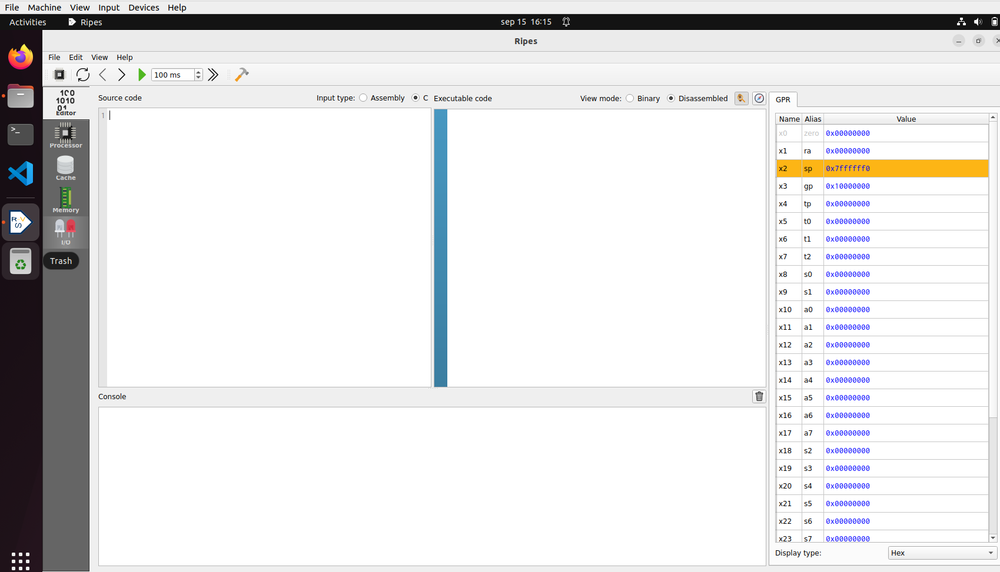
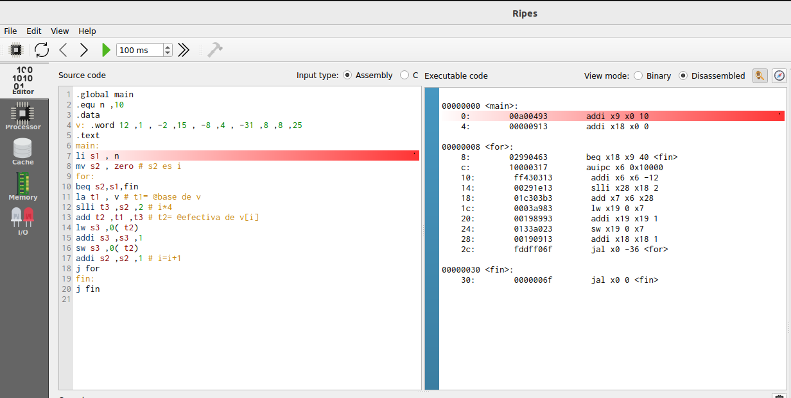
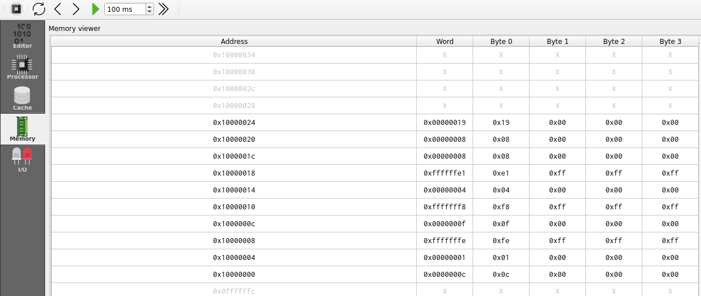

# Lab 1 - The RISC-V ISA
In this lab we review the RISC-V architecture and complete several exercises. We will use the [Ripes](https://github.com/mortbopet/Ripes), a visual computer architecture simulator and assembly code editor created for the RISC-V instruction set architecture. It has the following features:

- RISC-V 32-bit architecture.
- Base repertoire and M and C extensions (in this practice we will use only the M extension).
- Source code viewer, disassembled or binary code, 32 registers and memory regions.
- Possibility of executing the code in the different supported processors. In this practice we will use the Single-Cycle processor.

Follow the next steps:
1. Read the instructions provided at [Ripes_Introduction](https://github.com/mortbopet/Ripes/blob/master/docs/introduction.md).
2. Replicate the instructions provided below in section [Using RIPES in the virtual machine](https://github.com/artecs-group/RVfpga-sim-addons/tree/main/Computer_Organization_25-26/Lab1#using-ripes-in-the-virtual-machine).
3. Then, complete the [Exercises](https://github.com/artecs-group/RVfpga-sim-addons/tree/main/Computer_Organization_25-26/Lab1#exercise-1) provided below. These are the exercises you will include in the report, so make sure to write everything down as you work through them.


## Using RIPES in the virtual machine
Follow the steps below to use and finish configuring the Ripes simulator in the VM.

1. Start the simulator inside the VM:
    - Open a terminal in the VM.
    - Enter the “Ripes” directory: ```cd ~/Simuladores_EC_24-25/Ripes```
    - Before you can launch the simulator for the first time, you must install FUSE by means of the following command (it will ask for the root password, which is rvfpga): ```sudo apt-get install fuse libfuse2```
    - Run the simulator: ```./Ripes-v2.2.6-linux-x86_64.AppImage```

2. Environment:
    - On the left side you can see the different windows that can be displayed: Editor, Processor, Cache, Memory, I/O.
    - Depending on the selected window, the view will change. In the following figure we see the Editor window, in which you can enter code in Assembler or C in the left window, the compiled/assembled code will be displayed in the middle window, and it shows the registers of the simulated processor on the right.

<p align="center">
  
</p>

3. Before simulating the program, select the Single Cycle processor, enable the M extension and disable the C extension:

<p align="center">
  
</p>

4. The following RISC-V assembly program subtracts 1 to each element of vector ```v```.

```
  .global main
  
  .equ n ,10
  
  .data
  v: .word 12 ,1 , -2 ,15 , -8 ,4 , -31 ,8 ,8 ,25
  
  .text
  main:
    li s1 , n
    mv s2 , zero # s2 es i
    for:
      beq s2,s1,fin
      la t1 , v 		# t1= @base de v
      slli t3 ,s2 ,2 	# i*4
      add t2 ,t1 ,t3 	# t2= @efectiva de v[i]
      lw s3 ,0( t2)
      addi s3 ,s3 ,-1
      sw s3 ,0( t2)
      addi s2 ,s2 ,1 	# i=i+1
      j for
    fin:
    j fin
```

To simulate the program, type or copy it into the window on the left. For example, in the following figure you can see the previous program (which we also use in Exercise 1 below). On the right you can see the disassembled version.

<p align="center">
  
</p>

5. The top menu allows us to control the simulation. By hovering the mouse over each button we are informed about its functionality.

<p align="center">
  
</p>

6. We can execute the code step by step:
    - The “minor” and “major” arrows in the top menu allow us to go forward or backward instruction by instruction.
    - The current instruction is shown highlighted in red.

<p align="center">
  
</p>

7. Disassembled/binary code window and registers window:
    - The registers will be updated as we progress through the program.
    - When a register is updated, it will be highlighted in yellow.
    - The middle window shows the disassembled code. Note that, unlike the source, it only includes instructions (not pseudo-instructions).

<p align="center">
  
</p>

8. The Memory window allows us to visualize the different memory sections. The figure shows the .text section, which includes the text of the code. At the bottom you must select, from the “Go to section” menu, the .text section. You can check that the hexadecimal code corresponds to the program instructions in the Editor.

<p align="center">
  
</p>

9. At the bottom, in the “Go to section” menu, we can switch to the .data section. You can check that the data correspond to the vector components in the Editor.

<p align="center">
  
</p>

10. Set up the simulator to compile and run C programs. Follow these steps (the full instructions are available at this [link](https://github.com/mortbopet/Ripes/blob/master/docs/c_programming.md)):

  - Download the RISC-V toolchain:
      - The Ripes simulator webpage recommends to download the pre-built toolchain from [here](https://github.com/sifive/freedom-tools/releases/tag/v2020.04.0-Toolchain.Only). Download file *riscv64-unknown-elf-gcc-8.3.0-2020.04.1-x86_64-linux-ubuntu14.tar.gz*.
      - Once downloaded, copy that file to ```/home/rvfpga/Simuladores_EC_24-25/Ripes/```
      - Unzip the file ```riscv64-unknown-elf-gcc-8.3.0-2020.04.1-x86_64-linux-ubuntu14.tar.gz``` by right-clicking on the file and selecting "Extract Here."

<p align="center">
  
</p>


  - Set the compiler path in Ripes:
      - In the top menu of Ripes, open "Edit-Settings":

      <p align="center">
        
      </p>


      - In the window that opens, go to the "Compiler" tab.

      <p align="center">
        
      </p>


      - In the "Browse" section, select the C compiler (the file named ```riscv64-unknown-elf-gcc```), which is located in the following path (you can copy and paste the path in the "Compiler path"):

      ```
      /home/rvfpga/Simuladores_EC_24-25/Ripes/riscv64-unknown-elf-gcc-8.3.0-2020.04.1-x86_64-linux-ubuntu14/bin/riscv64-unknown-elf-gcc
      ```

      <p align="center">
        
      </p>

      <p align="center">
        
      </p>


  - Set the appropriate arguments:
      - Compiler arguments: ```-O1```
      - Linker arguments: ```-static-libgcc -lm```

      <p align="center">
        
      </p>


11. To simulate a C program, write or copy it into the left window, marking "Input Type" as C language. For example, try the next C program (which we use later in an exercise):

```
int main(void)
{
   int i,result,num=7;

   if (num > 1){
      result = num;
      for (i=num-1;i>1;i--)
      result = result*i;
   }
   else
      result=1;

   printf("Factorial = %d",result);

   while(1);
}
```

12. Next, compile the program by clicking on the hammer icon. If the program is correct, the disassembled version will appear in the central window:

<p align="center">
  
</p>

13. Run the program by clicking the "Fast Execution" button. The result of the factorial calculation will appear in the console:

<p align="center">
  
</p>


## Exercise 1
Given the following RISC-V assembly code:

```
  .global main
  
  .equ n ,10
  
  .data
  v: .word 12 ,1 , -2 ,15 , -8 ,4 , -31 ,8 ,8 ,25
  
  .text
  main:
    li s1 , n
    mv s2 , zero # s2 es i
    for:
      beq s2,s1,fin
      la t1 , v 		# t1= @base de v
      slli t3 ,s2 ,2 	# i*4
      add t2 ,t1 ,t3 	# t2= @efectiva de v[i]
      lw s3 ,0( t2)
      addi s3 ,s3 ,-1
      sw s3 ,0( t2)
      addi s2 ,s2 ,1 	# i=i+1
      j for
    fin:
    j fin
```

Run the code in Ripes (you can simply copy the previous code in the editor) and answer the following questions.

a. Briefly explain what the code does.

b. Provide examples of the different addressing modes we explained in theory based on the instructions in the program (use examples of instructions, not pseudo-instructions).

c. What instruction does the pseudo-instruction ```li s1, n``` translate to?

d. What instruction does the pseudo-instruction ```mv s2, zero``` translate to?

e. To which machine instruction in hexadecimal does the pseudo-instruction ```mv s2, zero``` translate? Considering the format of RISC-V instructions, explain which fields the machine instruction contains.

f. Identify in the memory viewer, one by one, the instructions that make up the for loop. Are they properly aligned?

g. Analyze in the memory viewer how the vector changes after each iteration.

h. Modify the code so that it subtracts 1 from the components whose stored value is odd and adds 1 to the components whose stored value is even.


## Exercise 2
Given the following RISC-V assembly code:

```
.global main

.equ n ,5

.data
res: .word 0

.text
main:
  li a1 , n
  la s3 , res
  call factorial
  sw a0 ,0( s3 )
  fin:
  j fin

factorial:
  # prologo
  addi sp , sp , -8
  sw s1 ,0( sp )
  sw s2 ,4( sp )
  # cuerpo
  li s1 ,1
  mv s2 , a1
  li s3 ,1
  for:
    ble s2 , s3 , fin_for
    mul s1 , s1 , s3
    addi s2 , s2 , -1
    j for
  fin_for:
  mv a0 , s1
  # epilogo
  lw s1 ,0( sp )
  lw s2 ,4( sp )
  addi sp , sp ,8
  jr ra

```

Run the code in Ripes and answer the following questions.

a. The code contains three errors. Identify and correct them until the program works correctly.

b .Find examples of each of the formats used in RISCV (R, I, S, B, U, J) and explain these formats in detail based on the examples shown.

c. What values does the stack contain, and what is the value of sp during the execution of the subroutine? Justify your answer.

d. Suppose the processor did not include the M extension (you can research this extension online). Perform the multiplication in the factorial function by calling a new subroutine that calculates the multiplication through successive additions (within a loop, add the multiplicand as many times as indicated by the multiplier).


## Exercise 3
This C program compares two integer vectors, U and V, to determine which one is farther from the origin. Instead of using built-in operators, it implements multiplication and integer square root manually. The program computes the Euclidean distance of each vector (rounded up to an integer) and stores the result of the comparison (1 if U is farther, 0 otherwise) in the global variable mayor_u.

```c
# define N 5
int U [N ] = {5 , 2, -3 , 7 , 6};
int V [N ] = {6 , -1 , 1 , 0 , 3};
char mayor_u ;


void guardar ( char valor , char * ubicacion) {
   * ubicacion = valor ;
}


int mul (int a , int b) {
   int res = 0 , sign = 0;
   if (a < 0) {
     sign = 1;
     a = -a ;
   }
   while (a --) res += b;
   if ( sign )
     return - res ;
   else
     return res ;
}


int i_sqrt (int a) {
   int root = 0;
   while ( mul ( root , root ) < a ) {
     root ++;
   }
   return root ;
}


int eucl_dist (int w [] , int size ) {
   int acc = 0;
   for ( int i = 0; i < size ; i ++) {
     acc += mul (w[ i] , w[ i ]) ;
   }
   return i_sqrt ( acc );
}


void main () {
   int d_u = eucl_dist (U , N );
   int d_v = eucl_dist (V , N );
   char mayor = d_u > d_v ;
   guardar ( mayor , & mayor_u ) ;
}
```

Configure the simulator and compile the program as follows:

1. Select the Single-Cycle processor and disable the M and C extensions (```Select processor``` button: ).

  

2. Select a ```-O1``` optimization level (```Edit - Settings - Compiler```).

  

3. Compile the program (```Compile C program``` button: ).


Run the code in Ripes and answer the following questions.

a. Confirm that the final result is correct.

b. This is the ```main``` function obtained after compiling the program.

i. Explain the two invocations of the ```eucl_dist``` function from the point of view of the RISC-V Calling Convention (analyze both the input and output parameters).

ii. Indentify clearly the prologue/epilogue and explain them.

        ```asm
        00010264 <main>:
            10264:        ff010113        addi x2 x2 -16
            10268:        00112623        sw x1 12 x2
            1026c:        00812423        sw x8 8 x2
            10270:        00912223        sw x9 4 x2
            10274:        00011537        lui x10 0x11
            10278:        70850493        addi x9 x10 1800
            1027c:        00500593        addi x11 x0 5
            10280:        70850513        addi x10 x10 1800
            10284:        f79ff0ef        jal x1 -136 <eucl_dist>
            10288:        00050413        addi x8 x10 0
            1028c:        00500593        addi x11 x0 5
            10290:        01448513        addi x10 x9 20
            10294:        f69ff0ef        jal x1 -152 <eucl_dist>
            10298:        00852533        slt x10 x10 x8
            1029c:        c6a18c23        sb x10 -904 x3
            102a0:        00c12083        lw x1 12 x2
            102a4:        00812403        lw x8 8 x2
            102a8:        00412483        lw x9 4 x2
            102ac:        01010113        addi x2 x2 16
            102b0:        00008067        jalr x0 x1 0
        ```

c. This is the ```i_sqrt``` function obtained after compiling the program.

i. Indentify clearly the prologue/epilogue and explain them.
       
ii. Explain each instruction in the body of this function and what it is used for.

        ```asm
        000101b4 <i_sqrt>:
            101b4:        ff010113        addi x2 x2 -16
            101b8:        00112623        sw x1 12 x2
            101bc:        00812423        sw x8 8 x2
            101c0:        00912223        sw x9 4 x2
            101c4:        00050493        addi x9 x10 0
            101c8:        00000413        addi x8 x0 0
            101cc:        00040593        addi x11 x8 0
            101d0:        00040513        addi x10 x8 0
            101d4:        f79ff0ef        jal x1 -136 <mul>
            101d8:        00955663        bge x10 x9 12
            101dc:        00140413        addi x8 x8 1
            101e0:        fedff06f        jal x0 -20
            101e4:        00040513        addi x10 x8 0
            101e8:        00c12083        lw x1 12 x2
            101ec:        00812403        lw x8 8 x2
            101f0:        00412483        lw x9 4 x2
            101f4:        01010113        addi x2 x2 16
            101f8:        00008067        jalr x0 x1 0
        ```


