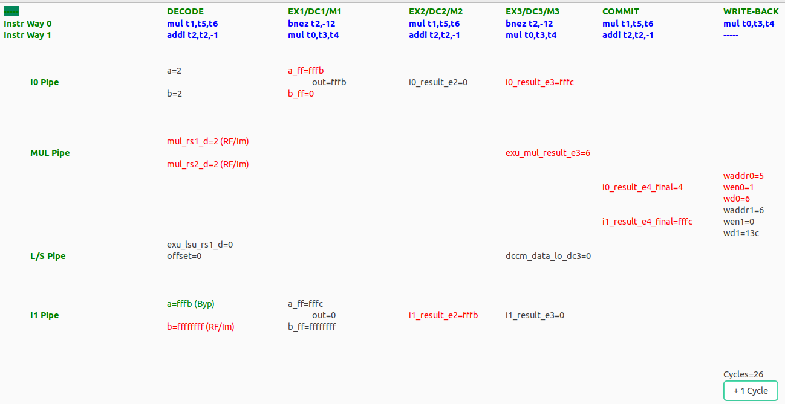
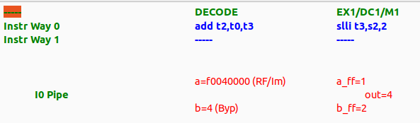

# Lab 2 - The Ripes core and the VeeR EH1 core
This practice aims to help students gain a thorough understanding of the commercial VeeR EH1 core, an advanced 2-way superscalar processor with 9 pipeline stages. The processor is explained both theoretically, through a detailed presentation, and practically, using the RVfpga-Pipeline simulator. As a preparatory step, we first focus on the typical academic 5-stage pipelined processor, exploring it theoretically (using the pipelined processor from the Harris and Harris book, H&H) and practically (through the Ripes simulator). 

Follow the next steps:

1. **Ripes core:** You can start using Ripes to simulate and analyze a 5-stage processor that is almost identical to the one described in the H&H textbook.

    * Read again the instructions provided at [Ripes_Introduction](https://github.com/mortbopet/Ripes/blob/master/docs/introduction.md).
    * Replicate the instructions provided below in section [Basic use of the Ripes Pipelined Processor](https://github.com/artecs-group/RVfpga-sim-addons/tree/main/Computer_Organization_25-26/Lab2#basic-use-of-the-ripes-pipelined-processor).
    * Analyze the example exercise provided below in section [Exercise 1 - Guided Exercise in Ripes](https://github.com/artecs-group/RVfpga-sim-addons/blob/main/Computer_Organization_25-26/Lab2/README.md#exercise-1---guided-exercise-in-ripes).
    * Analyze the example exercise provided below in section [Exercise 2 - Guided Exercise in Ripes](https://github.com/artecs-group/RVfpga-sim-addons/blob/main/Computer_Organization_25-26/Lab2/README.md#exercise-2---guided-exercise-in-ripes).
    * Finally, complete the exercise provided below in section [Exercise 3 in Ripes](https://github.com/artecs-group/RVfpga-sim-addons/blob/main/Computer_Organization_25-26/Lab2/README.md#exercise-3-in-ripes).

2. **VeeR EH1 core:** Once you have a clear understanding of the 5-stage processor used in the textbook and the one used in Ripes, you will start your analysis of a more complex processor, the VeeR EH1 core.

    * Start by, watching this video: [VeeReh1Video](https://youtu.be/xVnB6OM00cE?si=0HW333O-oPOXUDZG) (the video is in Spanish, but you can watch an AI-translated-to-English version of the video here [VeeReh1EnglishVideo](https://www.youtube.com/watch?v=Ow_0l47xqV4), you can watch an AI-translated-to-Chinese version of the video here [VeeReh1ChineseVideo](https://www.youtube.com/watch?v=2c4Iaswnz8w), or you can enable the subtitles in the original video). The video describes the VeeR EH1 microarchitecture in detail. You can download the slides used in the video [here](https://drive.google.com/file/d/1rSlwCzcHD4F_S4YFLCFn3L0VNXH_sv7L/view?usp=drive_link).
    * Replicate the instructions provided below in section *RVfpga-Pipeline*.
    * Analyze the example exercise provided below in section *Exercise 4 - Guided Exercise in RVfpga-Pipeline*.
    * Finally, complete the exercise provided below in section *Exercise 5 in RVfpga-Pipeline*.


## Basic use of the *Ripes Pipelined Processor*
The construction of the Pipelined processor is first explained theoretically using the slides provided above. During this explanation, students must perform the corresponding tests from the list below, executing the instructions and carefully analyzing the processor signals in detail.

1. Start the Ripes simulator.

2. Open the Processor tab and in the ```Select Processor``` icon, choose the processor with the following characteristics:
   - 5-stage processor.
   - RISC-V base instruction set plus M extension.
   - Extended layout.

<p align="center">
  
</p>

3. Add the signal values view in the ```View``` tab.

<p align="center">
  
</p>

4. Copy the following program into the Editor tab.

```
.data
   xa: .word 10
   xb: .word 0
   xc: .word 0

.text
   la x9, xa
   la x8, xc
  L1:
   addi x5, x0, 2
   addi x4, x0, 3
   addi x3, x0, -1
   lw x6, 0(x9)
   beq x0, x5, L1
   add x1, x5, x5
   or x2, x4, x4
   sw x6, 8(x9)
```

#### Analysis of the final cycle: ```lw``` - ```beq``` - ```add``` - ```or``` - ```sw```

Advance step-by-step until the final cycle. This is the processor in that cycle. As you can see, five instructions are being executed simultaneously in the processor (in-flight), each at a different stage. 


We'll use the signal names provided in the following figure.


In the same window, look at the bottom right corner (shown next), where you can see the *Instruction Memory* window, which helps us follow the program's execution step by step, and the *Execution info* window, which displays performance metrics such as cycles, instructions, and CPI/IPC.


Let's analyze a few important signals of the pipeline in this cycle.

   - ```sw``` instruction:
      - ```Addr```= 0x2c, which is the address where the store instruction is placed in the Instruction Memory. Confirm this in the memory tab.
      - ```Instr```= 0x0064a423. You can confirm, using the slides from Module 4, that this hexadecimal value corresponds to the ```sw``` instruction included in the program.

   - ```or``` instruction:
      - ```Reg1```= 0x3. This will be used as the first operand for the OR operation that will be performed next cycle.
      - ```Reg2```= 0x3. This will be used as the second operand for the OR operation that will be performed next cycle.
      - ```C1(d)```= 1. This will be the Register File write enable in the WB stage. The ```or``` instruction must write the result to the RF.
      - ```C2(d)```= ALURES. This will be used to select the data in the 3-1 multiplexer of the WB stage.
      - ```C6(d)```= 0, as it is not a ```jump``` instruction.
      - ```C7(d)```= 0, as it is not a ```branch``` instruction.
      - ```C8(d)```= ```C9(d)```= REG1/2, as the operands are provided from the Register File in this instruction.
      - ```C10(d)```= OR, as the ALU must perform an OR operation.

   - ```add``` instruction:
      - ```Op1```= 0x2. This is the first operand for the ADD operation that is performed this cycle.
      - ```Op2```= 0x2. This is the second operand for the ADD operation that is performed this cycle.
      - ```C1(e)```= 1. This will be the Register File write enable in the WB stage. The ```add``` instruction must write the result to the RF.
      - ```C2(e)```= ALURES. This will be used to select the data in the 3-1 multiplexer of the WB stage.
      - ```C6(e)```= 0, as it is not a ```jump``` instruction.
      - ```C7(e)```= 0, as it is not a ```branch``` instruction.
      - ```C8(e)```= ```C9(e)```= REG1/2, as the operands are provided from the Register File in this instruction.
      - ```C10(e)```= ADD, as the ALU must perform an ADD operation.
      - ```Res```= 0x4, which is the result of the addition.
      - ```C14```= 0, as the next PC after the ```add``` instruction is PC+4.

   - ```beq``` instruction:
      - ```C1(m)```= ```C3(m)```= 0, as neither the Data Memory nor the Register File must be written by this instruction.

   - ```lw``` instruction:
      - ```C1(w)```= 1, as the Register File must be written by this instruction.
      - ```C2(w)```= 0, as the 3-1 multiplexer must select the data read from memory.
      - ```Wr```= 0x6, which is the register idx where the value read from memory must be written.
      - ```DInRF```= 0xa, which is the data read from memory that must be written to the RF.


### Exercise 1 - Guided Exercise in Ripes
The following code is executed in Ripes:

```
.text
main:
li x3, 0x4
li x4, 0x6
add x2, x3, x4
sub x5, x2, x3
or  x6, x2, x5
```

Answer the following questions for the Pipelined Processor:

a. Simulate the code in Ripes, obtain the pipeline diagram and explain it.

b. Identify each of the data dependencies that exist in the code and explain how they are resolved in the processor. 

c. Show screenshots of the Ripes pipeline to explain how the different data hazards are handled.

d. Stop the execution during the cycle when the ```add``` instruction is in the WB stage and analyze the data/control signals of each stage. Use the names provided in the following figure for each pipeline signal:


**SOLUTION:**

*a. Simulate the code in Ripes, obtain the pipeline diagram and explain it.*

This is the timing diagram obtained with Ripes:

<p align="center">
  
</p>

We observe that there are no stalls in the pipeline, meaning that once it is filled, the CPI (Cycles Per Instruction) is 1.

*b. Identify each of the data dependencies that exist in the code and explain how they are resolved in the processor.*

- ```x3``` is written by the first ```li``` instruction (which the assembler transforms into an ```addi``` instruction) and used by the ```add``` instruction. It is obtained with a forwarding from WB to EX.
- ```x4``` is written by the second ```li``` instruction (which the assembler transforms into an ```addi``` instruction) and used by the ```add``` instruction. It is obtained with a forwarding from MEM to EX.
- ```x2``` is written by the ```add``` instruction and used by the ```sub``` instruction. It is obtained with a forwarding from MEM to EX.
- ```x2``` is written by the ```add``` instruction and used by the ```or``` instruction. It is obtained with a forwarding from WB to EX.
- ```x5``` is written by the ```sub``` instruction and used by the ```or``` instruction. It is obtained with a forwarding from MEM to EX.

*c. Show screenshots of the Ripes pipeline to explain how the different data hazards are handled.*

For example, this is a screenshot of the simulator that highlights the forwarding that occurs between the ```add``` and the ```sub```:


As shown, the highlighted multiplexer selects the value from the Memory stage (the result of the ```add``` instruction) as the ALU's first operand, instead of using the value from the Register File.

Similarly, analyze the remaining data hazards discussed in the previous item using the same approach.


*d. Stop the execution during the cycle when the ```add``` instruction is in the WB stage and analyze the data/control signals of each stage.*

This is a screenshot of the simulator during the cycle when the ```add``` instruction is in the WB stage.


Let's analyze some of the signals in this cycle.

   - ```or``` instruction:
      - ```Op1```= 0xa. This is the first operand for the OR operation that is performed this cycle.
      - ```Op2```= 0x6. This is the second operand for the OR operation that is performed this cycle.
      - ```C1(e)```= 1. This will be the Register File write enable in the WB stage. The ```or``` instruction must write the result to the RF.
      - ```C2(e)```= ALURES. This will be used to select the data in the 3-1 multiplexer of the WB stage.
      - ```C6(e)```= 0, as it is not a ```jump``` instruction.
      - ```C7(e)```= 0, as it is not a ```branch``` instruction.
      - ```C8(e)```= ```C9(e)```= REG1/2, as the operands are provided from the Register File in this instruction.
      - ```C10(e)```= OR, as the ALU must perform an OR operation.
      - ```Res```= 0xe, which is the result of the OR.
      - ```C14```= 0, as the next PC after the ```or``` instruction is PC+4.

   - ```sub``` instruction:
      - ```C1(m)```= 1, as the Register File must be written by this instruction in the next cycle.
      - ```C2(m)```= 1, as the 3-1 multiplexer will select the result of the ALU.
      - ```C3(m)```= 0, as the Data Memory must NOT be written by this instruction.

   - ```add``` instruction:
      - ```C1(w)```= 1, as the Register File must be written by this instruction.
      - ```C2(w)```= 1, as the 3-1 multiplexer must select the data read from the ALU.
      - ```Wr```= 0x2, which is the register idx where the value read from memory must be written.
      - ```DInRF```= 0xa, which is the result of the addition and that must be written to the RF.


### Exercise 2 - Guided Exercise in Ripes
Given the following program:

```
.globl main

.data
D: .word 1, 3, 5, 7, 9

.text
main:

la   t1 , D
addi s1 ,x0 ,4
addi s2 ,x0 ,0

for:
	lw   s3, 0(t1)
	lw   s4, 4(t1)
	add  s3, s3, s4
	addi s2 ,s2 ,1
	sub  s3, s3, s2
	sw   s3, 4(t1)
	addi t1, t1, 4
	bne  s2, s1, for

or s2, zero, zero
or s1, zero, zero

fin:
j fin
```

a. Draw the execution diagram of the program on the H&H 5-stage pipelined processor until the cycle in which the ```add``` instruction exits the pipeline in the second iteration of the loop. Explain the data, and control dependencies that arise and explain for each one how the processor handles it.

b. Simulate the program in Ripes. How many cycles does it take to execute one iteration of the loop? Calculate the CPI.

c. Is it possible to improve the loop's performance by reordering the code? Justify your answer and, if it can be improved, explain how you would modify the code and recalculate the CPI.

d. Indicate the values of all data and control signals in the cycle where the ```add``` instruction is in the execution stage in the first iteration of the loop. Also, indicate which instruction is in each stage and explain the signals. Use the figure from Exercise 1.


**SOLUTION:**
In the following document you can find the complete solution for this exercise: [SolutionExercise8](https://drive.google.com/file/d/15VYkzeFB2zKBXFk5xNL5ffFj5DtK2j1V/view?usp=sharing)


### Exercise 3 in Ripes
The following C code is intended to run on the Ripes Pipelined processor (this code is provided for reference only and should not be used in the exercise below):

```
for ( n = 0; n < 8; n ++ ) {
    for ( k = 0; k < 3; k ++ ) {
    Salida[n] += Filtro[k] * Entrada[n + k];
    }
}
```

To achieve the highest performance in executing this program, the following RISC-V assembly implementation is used (this is the code you will use in the lab):

```
.globl main

.data
Entrada: .word 1, 2, 6, 3, 8, 2, 12, 3, 7, 6
Filtro: .word 3, 7, 8
Salida: .word 0, 0, 0, 0, 0, 0, 0, 0

.text
main:
la   a3 , Entrada
la   a4 , Filtro
la   a5 , Salida
li   a2, 0
li   t1, 3
li   a1, 0
li   t0, 8
loop_n:
 addi a2 , x0 , 0
	loop_k:
   	  lw t3 , 0( a3)
   	  lw t4 , 0( a4)
   	  mul t6 , t3 , t4
   	  lw t5 , 0( a5)
   	  add t5 , t6 , t5
   	  sw t5 , 0( a5)
   	  addi a3 , a3 , 4
   	  addi a4 , a4 , 4
   	  addi a2 , a2 , 1
   	  blt a2 , t1 , loop_k
 addi a5 , a5 , 4
 addi a3 , a3 , -8
 addi a4 , a4 , -12
 addi a1 , a1 , 1
blt a1 , t0 , loop_n
fin:
j fin
```

The RISC-V assembly program is executed in the Ripes Pipelined processor. Answer the following questions:

1. Draw in Ripes the execution diagram at the end of the first iteration of the inner loop (loop_k) and explain the execution of the instructions within the loop, highlighting the data and control hazards that occur and how they are handled.

2. Calculate the CPI of the loop_k loop.

3. Reorder the program, confirm if the result is the same, and recalculate the CPI.

4. Explain, for the original program, the Data/Control signals when the following instructions are at the given stage during the first iteration of the loop_k loop in the original program (not in the reordered one).

 	* lw t4, 0(a4) at the EX stage
 	* lw t4, 0(a4) at the WB stage
 	* blt a2, t1, loop_k at the EX stage


---


## RVfpga-Pipeline
RVfpga-Pipeline is a simulator of the VeeR EH1 pipeline. The simulator can be used from VSCode - PlatformIO. Follow the next steps to simulate an example running on the RVfpga-Pipeline simulator:

*NOTE: The RVfpga-Pipeline simulator provided may differ a bit from the one used in the documents/slides/videos. For example, the latest version specifies, at the Decode Stage, if the operands come from the Register File or the Immediate (text **(RF/Im)** and red color), or from a Bypass Path (text **(Byp)** and green color).*

1. Start by watching the following video from time 3:12 to time 11:13, to see the RVfpga-Pipeline simulating the same program that we use in the subsequent steps: [RVfpgaToolsVideo](https://youtu.be/Z8QcQRW7F4s?si=8g_GSFpHmIsMQrzI&t=192) (the video is in Spanish, but you can watch an AI-translated-to-English version of the video here [RVfpgaToolsEnglishVideo](https://youtu.be/HuAF2XOMQmQ?si=-LpY-J7f-ng9AYAa&t=192), you can watch an AI-translated-to-Chinese version of the video here [RVfpgaToolsChineseVideo](https://youtu.be/A_c8GACrW9w?si=gst8rw2755R_JtMA&t=192), or you can enable the subtitles in the original video). ***NOTE:** The video uses a different directory name than the one we are using in the examples and exercises below; however, the contents of the diretories are the identical. Specifically, the ```RVfpga_MasterUCLM/``` directory name used in the video and the ```Simuladores_EC_24-25/RVfpga/``` directory name used below include the same contents.*

2. Open VSCode. Open the project (File - Open Folder) located at the following path: ```/home/rvfpga/Simuladores_EC_24-25/RVfpga/Projects/ProyectoP2```

    To open the project, simply navigate to the directory ```/home/rvfpga/Simuladores_EC_24-25/RVfpga/Projects```, select the ```ProyectoP2``` directory, and click “Open,” as shown in the following screenshot.

<p align="center">
  
</p>

3. Open the editor in VSCode to view the assembly code of the project called ```Programa.S```

<p align="center">
  
</p>

4. Open the ```platformio.ini``` file and update the path to the RVfpga-Pipeline simulator. To do this, replace the following line:

```
board_debug.verilator.binary = /home/dani/Simuladores_EC_24-25/RVfpga/verilatorSIM_Pipeline/Vrvfpgasim
```

For this one:

```
board_debug.verilator.binary = /home/rvfpga/Simuladores_EC_24-25/RVfpga/verilatorSIM_Pipeline/OriginalBinaries/RVfpga-Pipeline_Ubuntu
```

5. Open the PlatformIO tab and click on the task ```RVfpga-ViDBo/Pipeline```. The simulator will start executing the code (you can see it in the Explorer, inside the ```src``` directory).

<p align="center">
  
</p>

6. The simulator starts executing the program, and it only stops when instruction ```and zero, t4, t5``` reaches the Decode stage of the pipeline (note that this instruction has no effect at all in the architectural state of the processor and is simply used as a breakpoint). In the program provided in this project (```ProyectoP2```) this instruction is already included before the ```REPEAT``` loop (see the program above). (If the target program does not have the ```and zero, t4, t5``` instruction, you must add it at the point where you want execution to stop; typically, we place this instruction before entering the loop where the fragment we want to analyze is located.) For example, the following figure shows the simulator at the point where it has stopped execution (you can see that instruction ```and zero, t4, t5``` is at the Decode Stage). Note that the second figure shows a simplified version of the VeeR EH1 microarchitecture, which helps understanding the signals included in the simulator.

<p align="center">
  
</p>

<p align="center">
  
</p>

7. Continue execution cycle by cycle, by clicking the ```+ 1 Cycle``` button on the right bottom corner of the simulator window, and observe how the program's instructions flow through the VeeR EH1 pipeline.

8. Usually, the programs that we simulate will consist of a loop where the instructions we want to analyze are located (specifically, in the program used in this example, which you can see above, we want to analyze two consecutive ```mul``` instructions, which are placed within a ```REPEAT-OUT``` loop). It is important to analyze an iteration that is not the first or the second one, as some processor structures (branch predictor, instruction cache, etc.) have not yet been “trained” and might obscure the situations we want to analyze. For example, the following figure shows the simulator at the point where instructions from the third, fourth and fifth iterations are executing (at this point the cycles count is Cycles=26).

<p align="center">
  
</p>

9. Let's analyze what the simulator shows in the previous figure:

- **WRITE-BACK stage**
	- *Way-0*: Instruction ```mul t0, t3, t4``` (3rd iteration) is writting its result to the Register File (```waddr0=5``` as register ```t0``` corresponds to x5, ```wen0=1``` as writting is enabled, and ```wd0=6``` which is the result of the first multiplication, 3*2).
 	- *Way-1*: Due to the structural hazard between the two subsequent ```mul``` instructions, the second one was delayed one cycle and a bubble was inserted in this way.
- **COMMIT stage**
	- *Way-0*: Instruction ```mul t1, t5, t6``` (3rd iteration) propagates the result in signal ```i0_result_e4_final=4```, which is the result of the second multiplication (2*2).
 	- *Way-1*: Instruction ```addi t2, t2, -1``` (3rd iteration) propagates the result in signal ```i1_result_e4_final=0xFFFC```, which is the result of this instruction in the third iteration of the loop (0xFFFF - 1 - 1 - 1).
- **EX3/DC3/M3 stage**
	- *Way-0*: Instruction ```bne t2, zero, REPEAT``` (3rd iteration).
 	- *Way-1*: Instruction ```mul t0, t3, t4``` (4th iteration) has just obtained the result of the multiplication (```exu_mul_result_e3=6```).
- **EX2/DC2/M2 stage**
	- *Way-0*: Instruction ```mul t1, t5, t6``` (4th iteration).
 	- *Way-1*: Instruction ```addi t2, t2, -1``` (4th iteration).
- **EX1/DC1/M1 stage**
	- *Way-0*: Instruction ```bne t2, zero, REPEAT``` (4th iteration).
 	- *Way-1*: Instruction ```mul t0, t3, t4``` (5th iteration).
- **DECODE stage** (in the Decode stage information about the origin of the operands is provided: RF/Im means that the operand comes from the Register File or the Immediate, whereas Byp menas that the operand comes through a forwarding path)
	- *Way-0*: Instruction ```mul t1, t5, t6``` (5th iteration). Both operands come from the Register File.
 	- *Way-1*: Instruction ```addi t2, t2, -1``` (5th iteration). The first operand comes through forwarding, whereas the second comes from the Immediate.

10. To stop the simulator, we must close the simulation window and then, in VSCode, click on the Terminal window located at the bottom of the application and press Ctrl+c three times.


## Exercise 4 - Guided Exercise in RVfpga-Pipeline
Consider the RISC-V VeeR EH1 processor. The processor has all configurable features enabled (pipelined execution, superscalar execution, Gshare branch predictor, etc.), except for the Secondary ALU. The following program is executed on this processor:

```
.globl main

.section .midccm
D: .space 16

.text
main:

li t2, 0x080                  # Disable Secondary ALUs
csrrs t1, 0x7F9, t2

la t0, D

li t1, 0x2					
sw t1, (t0)				# D[0] = 2
li t1, 0x4					
sw t1, 4(t0)				# D[1] = 4
li t1, 0x3					
sw t1, 8(t0)				# D[2] = 3
li t1, 0x5					
sw t1, 12(t0)				# D[3] = 5

li s1, 4
mv s2, zero

and zero,t4,t5

for:
   slli t3 ,s2 ,2
   add t2 ,t0 ,t3
   lw s3 , 0(t2)
   lw s4 , 4(t2)
   add s3 ,s3 ,s4
   sw s3 , 0(t2)
   addi s2 ,s2 ,1
   bne s2,s1,for
end:

REPEAT:
   beq  zero, zero, REPEAT  # Repeat the loop
```

Answer the following questions about the ```for``` loop both theoretically and using the RVfpga-Pipeline simulator. Remember to analyze an iteration from the third one onward, avoiding the first/second iterations where there are instruction cache misses and the branch predictor is not yet properly trained. You can use the project located at ```/home/rvfpga/Simuladores_EC_24-25/RVfpga/Projects/ProyectoP2``` and simply replace the program in file ```src/Programa.S``` for the new one.

a. Identify the hazards that occur and explain how this processor handles them.

b. Draw the pipeline diagram for the second iteration of the loop.

c. Calculate the CPI (Cycles Per Instruction) of the loop.


**SOLUTION:**
We next show partial solutions for this exercise as an example. Complete the solutions not provided.

*a. Identify the hazards that occur and explain how this processor handles them.*

For example, this figure illustrates the data hazard between the ```slli``` and the ```add```.

<p align="center">
   
</p>

The hazard is handled by:
- Inserting a bubble by the ```slli``` instruction (way-1). We can see that Way 1 in the EX1 Stage is empty (```-----```).
- Performing a forwarding from EX1 to Decode. We can see that: ```out=4 → b=4 (Byp)```.

*b. Draw the pipeline diagram for the second iteration of the loop.*

<p align="center">
   
</p>

*c. Calculate the CPI (Cycles Per Instruction) of the loop.*

To calculate the CPI of the loop, simulate until a given instruction of the loop reaches the Decode stage in two consecutive iterations (e.g., the third and fourth iterations). Then, subtract the cycle numbers of these two iterations and divide this result by the number of instructions in the loop.

For example:

<p align="center">
  
</p>

<p align="center">
  
</p>

In this case, ```CPI = (33-25)/8 = 1```


## Exercise 5 in RVfpga-Pipeline
In the VeeR EH1 processor, the following code is to be executed:

```
for ( n = 0; n < 8; n ++ ) {
    for ( k = 0; k < 3; k ++ ) {
    Salida[n] += Filtro[k] * Entrada[n + k];
    }
}
```

To achieve the highest performance in executing this program on the VeeR EH1 processor, the following assembly implementation is decided:

```
.globl main

.section .midccm
Entrada: .space 40
Filtro: .space 12
Salida: .space 32

.text
main:

li t2, 0x488 # Disable Superscalar Exec, Sec. ALUs and Branch Pred.
csrrs t1, 0x7F9, t2

la t0, Entrada
li t1, 0x1   				 
sw t1, (t0)   			 
li t1, 0x3   				 
sw t1, 4(t0)   			 
li t1, 0x5   				 
sw t1, 8(t0)   			 
li t1, 0x7   				 
sw t1, 12(t0)   			 
li t1, 0x9   				 
sw t1, 16(t0)   			 
li t1, 0x1   				 
sw t1, 20(t0)   			 
li t1, 0x3   				 
sw t1, 24(t0)   			 
li t1, 0x5   				 
sw t1, 28(t0)   			 
li t1, 0x7   				 
sw t1, 32(t0)   			 
li t1, 0x9   				 
sw t1, 36(t0)   			 

la t0, Filtro
li t1, 0x2   				 
sw t1, (t0)   			 
li t1, 0x3   				 
sw t1, 4(t0)   			 
li t1, 0x4   				 
sw t1, 8(t0)   			 

la t0, Salida
li t1, 0   				 
sw t1, (t0)   			 
li t1, 0   				 
sw t1, 4(t0)   			 
li t1, 0   				 
sw t1, 8(t0)   			 
li t1, 0   				 
sw t1, 12(t0)   			 
li t1, 0   				 
sw t1, 16(t0)   			 
li t1, 0   				 
sw t1, 20(t0)   			 
li t1, 0   				 
sw t1, 24(t0)   			 
li t1, 0   				 
sw t1, 28(t0)   			 

la   a3 , Entrada
la   a4 , Filtro
la   a5 , Salida

li   a2, 0
li   t1, 3
li   a1, 0
li   t0, 8

nop
nop
nop
nop

and zero, t4, t5

loop_n :
addi a2 , x0 , 0
	loop_k :
    	lw t3 , 0( a3)
    	lw t4 , 0( a4)
    	mul t6 , t3 , t4
    	lw t5 , 0( a5)
    	add t5 , t6 , t5
    	sw t5 , 0( a5)
    	addi a3 , a3 , 4
    	addi a4 , a4 , 4
    	addi a2 , a2 , 1
    	blt a2 , t1 , loop_k
addi a5 , a5 , 4
addi a3 , a3 , -8
addi a4 , a4 , -12
addi a1 , a1 , 1
blt a1 , t0 , loop_n

fin:
j fin
```

Analyze the code in RISC-V assembly. Note that in the assembly program we are initializing the arrays before entering the loops, element-by-element, so this needs quite a few instructions.

**NOTE**: Remember that we can configure the core in order to enable/disable different features, as explained in the corresponding video and reminded next.


Solve the following sections, both theoretically and practically on the RVfpga-Pipeline simulator. You can use the project located at ```/home/rvfpga/Simuladores_EC_24-25/RVfpga/Projects/ProyectoP2``` and simply replace the program in file ```src/Programa.S``` for the new one:

a. Run the assembly program in RVfpga-Pipeline with superscalar execution, the Secondary ALU, and the Gshare branch predictor disabled (this is the default configuration provided in the program above), and stop right at the beginning of iteration n=0, k=1. To get to that iteration, you must skip some cycles after the breakpoint (instruction: and zero, t4, t5). Specifically, you must advance until the point when Cycles=21. At this point, the first instruction of the loop is at the Decode stage. See the following screenshot:

<p align="center">
  
</p>

* Draw the execution diagram.
* Analyze the data/control/structural hazards for this iteration. For that purpose, simulate cycle-by-cycle and analyze and explain how each hazard is handled by the VeeR EH1 core. 
* Calculate the CPI for iteration n=0, k=1, of the loop_k loop. For that purpose, you must stop the simulation at the point shown above, and count the number of cycles until the same point (first load instruction at Decode stage) of the next iteration. Then, you must divide that number by the number of instructions executed in the loop.

b. Repeat the analysis from *item a* but now enable superscalar execution with respect to the configuration used at *item a*.

c. Repeat the analysis from *item a* but now enable the Gshare branch predictor with respect to the configuration used at *item b*.

d. Repeat the analysis from *item a* but now enable the Secondary ALU with respect to the configuration used at *item c*.

e. Finally, with the configuration of *item d*, reorder the code of the loop_k loop to improve performance as much as possible, and repeat the analysis from *item a*.

