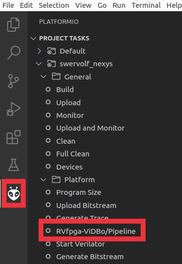
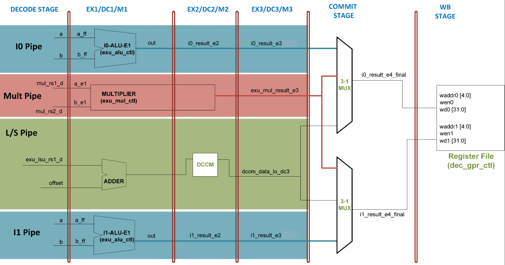

# Lab 2 - The Ripes core and the VeeR EH1 core (new RVfpga-Pipeline simulator)
This practice aims to help students gain a thorough understanding of the commercial VeeR EH1 core, an advanced 2-way superscalar processor with 9 pipeline stages. The processor is explained both theoretically, through a detailed presentation, and practically, using the RVfpga-Pipeline simulator. As a preparatory step, we first focus on the typical academic 5-stage pipelined processor, exploring it theoretically (using the pipelined processor from the Harris and Harris book, H&H) and practically (through the Ripes simulator). 

Follow the next steps:

1. **Ripes core:** You can start using Ripes to simulate and analyze a 5-stage processor that is almost identical to the one described in the H&H textbook.

    * Read again the instructions provided at [Ripes_Introduction](https://github.com/mortbopet/Ripes/blob/master/docs/introduction.md).
    * Replicate the instructions provided below in section [Basic use of the Ripes Pipelined Processor](https://github.com/artecs-group/RVfpga-sim-addons/tree/main/Computer_Organization_25-26/Lab2_25-26#basic-use-of-the-ripes-pipelined-processor).
    * Analyze the example exercise provided below in section [Exercise 1 - Guided Exercise in Ripes](https://github.com/artecs-group/RVfpga-sim-addons/blob/main/Computer_Organization_25-26/Lab2_25-26/README.md#exercise-1---guided-exercise-in-ripes).
    * Analyze the example exercise provided below in section [Exercise 2 - Guided Exercise in Ripes](https://github.com/artecs-group/RVfpga-sim-addons/blob/main/Computer_Organization_25-26/Lab2_25-26/README.md#exercise-2---guided-exercise-in-ripes).
    * Finally, complete the exercise provided below in section [Exercise 3 in Ripes](https://github.com/artecs-group/RVfpga-sim-addons/blob/main/Computer_Organization_25-26/Lab2_25-26/README.md#exercise-3-in-ripes). **This is the first exercise you will include in the report, so make sure to write everything down as you work through it.**

2. **VeeR EH1 core:** Once you have a clear understanding of the 5-stage processor used in the textbook and the one used in Ripes, you will start your analysis of a more complex processor, the VeeR EH1 core.

    * Start by watching this video: [VeeReh1Video](https://youtu.be/xVnB6OM00cE?si=0HW333O-oPOXUDZG). The video describes the VeeR EH1 microarchitecture in detail. You can download the slides used in the video [here](https://drive.google.com/file/d/1rSlwCzcHD4F_S4YFLCFn3L0VNXH_sv7L/view?usp=drive_link). Please note that some of the concepts presented in the video are either beyond the scope of this course or will be introduced later, such as the memory hierarchy (in our exercises, instruction and data memory latency will always be assumed to be 1 cycle) or the Verilog implementation of the core, so you may simply skip those parts.
    * The following table shows all forwarding paths and penalties in the VeeR EH1 core: [FwdPen_EH1](https://drive.google.com/file/d/1owNZUEw-2AZw2-El_mBu4-WpZ1HhYVNo/view?usp=sharing). It is very useful to resolve the exercises.
    * Replicate the instructions provided below in section [RVfpga-Pipeline](https://github.com/artecs-group/RVfpga-sim-addons/blob/main/Computer_Organization_25-26/Lab2_25-26/README.md#rvfpga-pipeline).
    * Analyze the example exercise provided below in section [Exercise 4 - Guided Exercise in RVfpga-Pipeline](https://github.com/artecs-group/RVfpga-sim-addons/blob/main/Computer_Organization_25-26/Lab2_25-26/README.md#exercise-4---guided-exercise-in-rvfpga-pipeline).
    * Complete the exercise provided below in section [Exercise 5 in RVfpga-Pipeline](https://github.com/artecs-group/RVfpga-sim-addons/blob/main/Computer_Organization_25-26/Lab2_25-26/README.md#exercise-5-in-rvfpga-pipeline). **This is the second exercise you will include in the report, so make sure to write everything down as you work through it.**
    * **Finally, you can optionally simulate the three extra exercises provided in the following document: [ExtraExercises](https://drive.google.com/file/d/1bz953GYCdeKZ29ZFqEpg-SoI1Hf1J2is/view?usp=sharing).** These exercises are presented with theoretical solutions, and your task is to solve them using the RVfpga-Pipeline simulator. For example, you may verify the pipeline timing diagram, calculate the CPI, or analyze how hazards are handled. You are encouraged to include simulator screenshots together with your explanations.


## Basic use of the *Ripes Pipelined Processor*
The following video shows the demo presented in class on how to use the Ripes processor: [RipesProcessorDemo](https://youtu.be/ZvwZP8gnR1Y).

Follow the next steps to test a program in the Ripes Pipelined Processor:

1. Start the Ripes simulator.

2. Open the Processor tab and in the ```Select Processor``` icon, choose the processor with the following characteristics:
   - 5-stage processor.
   - RISC-V base instruction set plus M extension.
   - Extended layout.

<p align="center">
  
</p>

3. Add the signal values view in the ```View``` tab.

<p align="center">
  
</p>

4. Copy the following program into the Editor tab.

```
.data
   xa: .word 10
   xb: .word 0
   xc: .word 0

.text
   la x9, xa
   la x8, xc
  L1:
   addi x5, x0, 2
   addi x4, x0, 3
   addi x3, x0, -1
   lw x6, 0(x9)
   beq x0, x5, L1
   add x1, x5, x5
   or x2, x4, x4
   sw x6, 8(x9)
```

5. Advance step-by-step until the final cycle. This is the processor state in that cycle. As you can see, five instructions are being executed simultaneously in the processor (in-flight), each at a different stage. 


6. In the same window, look at the bottom right corner (shown next), where you can see the *Instruction Memory* window, which helps us follow the program's execution step by step, and the *Execution info* window, which displays performance metrics such as cycles, instructions, and CPI/IPC.


### Exercise 1 - Guided Exercise in Ripes
The following code is executed in Ripes:

```
.text
main:
li x3, 0x4
li x4, 0x6
add x2, x3, x4
sub x5, x2, x3
or  x6, x2, x5
```

Answer the following questions for the Pipelined Processor:

a. Simulate the code in Ripes, obtain the pipeline diagram and explain it.

b. Identify each of the data dependencies that exist in the code and explain how they are resolved in the processor. 

c. Show a screenshot from Ripes that illustrates how the data hazard between the ```add``` and the ```sub``` are handled.


**SOLUTION:**

*a. Simulate the code in Ripes, obtain the pipeline diagram and explain it.*

This is the timing diagram obtained with Ripes:

<p align="center">
  
</p>

We observe that there are no stalls in the pipeline, meaning that once it is filled, the CPI (Cycles Per Instruction) is 1.

*b. Identify each of the data dependencies that exist in the code and explain how they are resolved in the processor.*

- ```x3``` is written by the first ```li``` instruction (which the assembler transforms into an ```addi``` instruction) and used by the ```add``` instruction. It is obtained with a forwarding from WB to EX.
- ```x4``` is written by the second ```li``` instruction (which the assembler transforms into an ```addi``` instruction) and used by the ```add``` instruction. It is obtained with a forwarding from MEM to EX.
- ```x2``` is written by the ```add``` instruction and used by the ```sub``` instruction. It is obtained with a forwarding from MEM to EX.
- ```x2``` is written by the ```add``` instruction and used by the ```or``` instruction. It is obtained with a forwarding from WB to EX.
- ```x5``` is written by the ```sub``` instruction and used by the ```or``` instruction. It is obtained with a forwarding from MEM to EX.

<div align="center">


</div>

*c. Show a screenshot from Ripes that illustrates how the data hazard between the ```add``` and the ```sub``` are handled.*

<div align="center">


</div>

As shown, the multiplexer within the red square selects the value that comes from the Memory stage (the result of the ```add``` instruction, provided through the yellow wire) as the ALU's first operand (*0x0000000a*), instead of using the value from the Register File.


### Exercise 2 - Guided Exercise in Ripes
Given the following program:

```
.globl main

.data
D: .word 1, 3, 5, 7, 9

.text
main:

la   t1 , D
addi s1 ,x0 ,4
addi s2 ,x0 ,0

for:
	lw   s3, 0(t1)
	lw   s4, 4(t1)
	add  s3, s3, s4
	addi s2 ,s2 ,1
	sub  s3, s3, s2
	sw   s3, 4(t1)
	addi t1, t1, 4
	bne  s2, s1, for

or s2, zero, zero
or s1, zero, zero

fin:
j fin
```

a. Simulate the code in Ripes, obtain the pipeline diagram and explain the hazards and how they are resolved.

b. How many cycles does it take to execute one iteration of the loop? Calculate the CPI.

c. Is it possible to improve the loop's performance by reordering the code? Justify your answer and, if it can be improved, explain how you would modify the code and recalculate the CPI.


**SOLUTION:**
In the following document you can find the complete solution for this exercise: [SolutionExercise8](https://drive.google.com/file/d/15VYkzeFB2zKBXFk5xNL5ffFj5DtK2j1V/view?usp=sharing)


### Exercise 3 in Ripes
The following C code is intended to run on the Ripes Pipelined processor (this code is provided for reference only and should not be used in the exercise below):

```
for ( n = 0; n < 8; n ++ ) {
    for ( k = 0; k < 3; k ++ ) {
    Salida[n] += Filtro[k] * Entrada[n + k];
    }
}
```

To achieve the highest performance in executing this program, the following RISC-V assembly implementation is used (this is the code you will use in the lab):

```
.globl main

.data
Entrada: .word 1, 2, 6, 3, 8, 2, 12, 3, 7, 6
Filtro: .word 3, 7, 8
Salida: .word 0, 0, 0, 0, 0, 0, 0, 0

.text
main:
la   a3 , Entrada
la   a4 , Filtro
la   a5 , Salida
li   a2, 0
li   t1, 3
li   a1, 0
li   t0, 8
loop_n:
 addi a2 , x0 , 0
	loop_k:
   	  lw t3 , 0( a3)
   	  lw t4 , 0( a4)
   	  mul t6 , t3 , t4
   	  lw t5 , 0( a5)
   	  add t5 , t6 , t5
   	  sw t5 , 0( a5)
   	  addi a3 , a3 , 4
   	  addi a4 , a4 , 4
   	  addi a2 , a2 , 1
   	  blt a2 , t1 , loop_k
 addi a5 , a5 , 4
 addi a3 , a3 , -8
 addi a4 , a4 , -12
 addi a1 , a1 , 1
blt a1 , t0 , loop_n
fin:
j fin
```

The RISC-V assembly program is executed in the Ripes Pipelined processor. Answer the following questions:

1. Draw in Ripes the execution diagram at the end of the first iteration of the inner loop (loop_k) and explain the execution of the instructions within the loop, highlighting the data and control hazards that occur and how they are handled.

2. Calculate the CPI of the loop_k loop.

3. Reorder the program, confirm if the result is the same, and recalculate the CPI.


---


## RVfpga-Pipeline
RVfpga-Pipeline is a simulator of the VeeR EH1 pipeline that can be run from VSCode using PlatformIO. Follow the steps below to simulate an example program with the RVfpga-Pipeline simulator.

0. In the Virtual Machine, replace the old RVfpga-Pipeline simulator with the new one. Follow the next steps:
	- Download the following file: [RVfpga-Pipeline_Ubuntu](https://drive.google.com/file/d/1BL0q855YaTkhN_DlRYuHOySHIImBWaNW/view?usp=sharing).
	- Open a terminal.
	- Replace the old simulator with the new one: ```cp /home/rvfpga/Downloads/RVfpga-Pipeline_Ubuntu /home/rvfpga/Simuladores_EC_24-25/RVfpga/verilatorSIM_Pipeline/OriginalBinaries/RVfpga-Pipeline_Ubuntu```
	- Assign execution permissions to the new binary: ```chmod +x /home/rvfpga/Simuladores_EC_24-25/RVfpga/verilatorSIM_Pipeline/OriginalBinaries/RVfpga-Pipeline_Ubuntu```

1. Start by watching one of the following videos, which show the **RVfpga-Pipeline** simulating the same program used in the subsequent steps:

   - **(a) Using the previous version of the simulator:**  
     Watch from **3:12 to 11:13** in the following video: [RVfpgaToolsVideo](https://youtu.be/Z8QcQRW7F4s?si=8g_GSFpHmIsMQrzI&t=192).  
       - ***NOTE:** The video uses a different directory name than the one used in the examples and exercises below. However, the directory contents are identical. In particular, the directory named ```RVfpga_MasterUCLM/``` in the video corresponds exactly to the directory ```Simuladores_EC_24-25/RVfpga/``` used in this guide.*  
       - ***NOTE:** The video was recorded with the **old RVfpga-Pipeline simulator**. The procedure is exactly the same; only the simulator’s appearance differs.*

   - **(b) Using the new version of the simulator:**  
     Watch the following video, which shows the demo presented in class on how to use the VeeR EH1 processor: [VeerEH1ProcessorDemo](https://youtu.be/1_O1ikjSIyM).

2. Open VSCode and load the project folder located at ```/home/rvfpga/Simuladores_EC_24-25/RVfpga/Projects/ProyectoP2```. To do this, go to ```File - Open Folder```, navigate to ```/home/rvfpga/Simuladores_EC_24-25/RVfpga/Projects```, select the ```ProyectoP2``` directory, and click ```Open``` (as shown in the screenshot).

<p align="center">
  
</p>

3. In VSCode, open the editor to view the assembly source code of the project. The file is named ```Programa.S``` and is located inside the ```src``` directory of the project.

<p align="center">
  
</p>

4. Open the ```platformio.ini``` file and update the path to the RVfpga-Pipeline simulator as shown next:

```
board_debug.verilator.binary = /home/rvfpga/Simuladores_EC_24-25/RVfpga/verilatorSIM_Pipeline/OriginalBinaries/RVfpga-Pipeline_Ubuntu
```

5. Open the PlatformIO tab in VSCode and click on the task ```RVfpga-ViDBo/Pipeline```. The simulator will then start executing the program. You can follow the execution in the Explorer, inside the ```src``` directory of the project.

<p align="center">
  
</p>

6. The simulator starts executing the program and stops only when the instruction `and zero, t4, t5` reaches the Decode stage of the pipeline. Note that this instruction has no effect on the architectural state of the processor; it is simply used as a breakpoint. In the program provided in this project (`ProyectoP2`), this instruction is already included before the `REPEAT` loop (see the program above). If the target program does not include the `and zero, t4, t5` instruction, you must add it at the point where you want execution to stop. Typically, this instruction is placed just before entering the loop that contains the fragment to be analyzed. For example, the following figure shows the simulator paused at the point where the instruction `and zero, t4, t5` is in the Decode stage. The second figure presents a simplified version of the VeeR EH1 microarchitecture, which helps in understanding the signals displayed by the simulator.

<table border="3">
  <tr>
    <td align="center">
      
    </td>
  </tr>
</table>

<table border="3" align="center">
  <tr>
    <td align="center">
      
    </td>
  </tr>
</table>

7. Continue the execution cycle by cycle by clicking the `+ 1 Cycle` button located at the bottom-right corner of the simulator window, and observe how the program instructions flow through the VeeR EH1 pipeline.

8. In most cases, the programs we simulate consist of a loop containing the instructions to be analyzed. Specifically, in the example program shown above, the focus is on two consecutive `mul` instructions placed within a `REPEAT-OUT` loop. It is important to analyze an iteration other than the first or the second one, since some processor structures (e.g., the branch predictor or the instruction cache) have not yet been “trained” and might obscure the behavior we want to study. For example, the following figure shows the simulator at the point where instructions from the third, fourth, and fifth iterations are executing (at this moment the cycle count is `Cycles = 26`).

<table border="3">
  <tr>
    <td align="center">
      
    </td>
  </tr>
</table>

9. Let's analyze what the simulator shows in the previous figure:

- **WRITE-BACK stage**
  - *Way-0*: Instruction `mul t0, t3, t4` (3rd iteration) is writing its result to the Register File (`waddr0=5` as register `t0` corresponds to x5, `wen0=1` as writing is enabled, and `wd0=6` which is the result of the first multiplication, 3*2).
  - *Way-1*: Due to the structural hazard between the two consecutive `mul` instructions, the second one was delayed by one cycle and a bubble was inserted.

- **COMMIT stage**
  - *Way-0*: Instruction `mul t1, t5, t6` (3rd iteration) propagates the result in signal `i0_result_e4_final=4`, which corresponds to the second multiplication (2*2).
  - *Way-1*: Instruction `addi t2, t2, -1` (3rd iteration) propagates the result in signal `i1_result_e4_final=0xFFFC`, which is the value obtained in the third iteration of the loop (0xFFFF - 1 - 1 - 1).

- **EX3/DC3/M3 stage**
  - *Way-0*: Instruction `bne t2, zero, REPEAT` (3rd iteration).
  - *Way-1*: Instruction `mul t0, t3, t4` (4th iteration) has just obtained the result of the multiplication (`exu_mul_result_e3=6`).

- **EX2/DC2/M2 stage**
  - *Way-0*: Instruction `mul t1, t5, t6` (4th iteration).
  - *Way-1*: Instruction `addi t2, t2, -1` (4th iteration).

- **EX1/DC1/M1 stage**
  - *Way-0*: Instruction `bne t2, zero, REPEAT` (4th iteration).
  - *Way-1*: Instruction `mul t0, t3, t4` (5th iteration).

- **DECODE stage**  
  In this stage, information about the source of the operands is provided:  
  - *Way-0*: Instruction `mul t1, t5, t6` (5th iteration). Both operands come from the Register File.  
  - *Way-1*: Instruction `addi t2, t2, -1` (5th iteration). The first operand comes through forwarding (see the line with the arrow), while the second comes from the Immediate.

10. To stop the simulator, close the simulation window.


## Exercise 4 - Guided Exercise in RVfpga-Pipeline
The following video shows the demo presented in class on how to explain this exercise: [Exercise4Demo](https://youtu.be/hqxG4cUnDfs).

Consider the RISC-V VeeR EH1 processor. The processor has all configurable features enabled (pipelined execution, superscalar execution, Gshare branch predictor, etc.), except for the Secondary ALU. The following program is executed on this processor:

```
.globl main

.section .midccm
D: .space 16

.text
main:

li t2, 0x080                  # Disable Secondary ALUs
csrrs t1, 0x7F9, t2

la t0, D

li t1, 0x2					
sw t1, (t0)				# D[0] = 2
li t1, 0x4					
sw t1, 4(t0)				# D[1] = 4
li t1, 0x3					
sw t1, 8(t0)				# D[2] = 3
li t1, 0x5					
sw t1, 12(t0)				# D[3] = 5

li s1, 4
mv s2, zero

and zero,t4,t5

for:
   slli t3 ,s2 ,2
   add t2 ,t0 ,t3
   lw s3 , 0(t2)
   lw s4 , 4(t2)
   add s3 ,s3 ,s4
   sw s3 , 0(t2)
   addi s2 ,s2 ,1
   bne s2,s1,for
end:

REPEAT:
   beq  zero, zero, REPEAT  # Repeat the loop
```

Answer the following questions about the ```for``` loop both theoretically and using the RVfpga-Pipeline simulator. Remember to analyze an iteration from the third one onward, avoiding the first/second iterations where there are instruction cache misses and the branch predictor is not yet properly trained. You can use the project located at ```/home/rvfpga/Simuladores_EC_24-25/RVfpga/Projects/ProyectoP2``` and simply replace the program in file ```src/Programa.S``` for the new one.

a. Draw the pipeline diagram for the third iteration of the loop. Unlike Ripes, the RVfpga-Pipeline simulator does not generate this diagram automatically. Therefore, you must create it manually, either on paper or with a tool such as Excel or PowerPoint. Nevertheless, you can still rely on the RVfpga-Pipeline simulation to analyze the program’s behavior cycle by cycle within the loop.

b. Identify the hazards that occur and explain how this processor handles them. You may include screenshots from the RVfpga-Pipeline simulator while executing the program.

c. Calculate the CPI (Cycles Per Instruction) of the loop.


**SOLUTION:**
We next show partial solutions for this exercise as an example. Complete the solutions not provided.

*a. Draw the pipeline diagram for the second iteration of the loop. Unlike Ripes, the RVfpga-Pipeline simulator does not generate this diagram automatically. Therefore, you must create it manually, either on paper or with a tool such as Excel or PowerPoint. Nevertheless, you can still rely on the RVfpga-Pipeline simulation to analyze the program’s behavior cycle by cycle within the loop.*

**First cycle of third iteration**. The first instruction of the loop (```slli```) is at the Decode Stage, on the second way (Way-1):

<p align="center">
  
</p>

**Sixth cycle of third iteration**. The first instruction of the loop (```slli```) is at the WB Stage:

<p align="center">
  
</p>

**Ninth cycle of third iteration**. The first instruction of the loop (```slli```) is again at the Decode Stage:

<p align="center">
  
</p>


**Pipeline diagram:**

<p align="center">
  
</p>

*b. Identify the hazards that occur and explain how this processor handles them. You may include screenshots from the RVfpga-Pipeline simulator while executing the program.*


Existing dependencies:

- Data hazards highlighted with colors.

  - They are resolved through forwarding, mostly from a stage after E1 to Decode, and the second way cannot be used in all those cases.
  - Forwarding of the add with the sw is done in E2.
  - In the hazard between the second lw and the add, since the lw is a multicycle operation, it is resolved with 2 stalls and then with forwarding.

- Structural hazard between the two lw. The second one stalls in Decode and executes in the next cycle.
- Control hazard in the bne. When the gshare predictor is enabled, there is no stall on predictor hits, which occurs in almost all iterations (miss in the first and the last).

This figure illustrates the data hazard between the ```slli``` and the ```add``` in the RVfpga-Pipeline simulator. The hazard is resolved by performing a forwarding from EX1 to Decode. We can see that: ```out=8 → b=8```.

<p align="center">
  
</p>


This figure illustrates the data hazard between the ```add``` and the first ```lw``` in the RVfpga-Pipeline simulator. The hazard is resolved by inserting a bubble after the ```add``` and performing a forwarding from EX1 to Decode. We can see that: ```out=0xF0040008 → exu_lsu_rs1_d=0xF0040008```.

<p align="center">
  
</p>


This figure illustrates the data hazard between the ```add``` and the second ```lw``` in the RVfpga-Pipeline simulator. The hazard is resolved by performing a forwarding from EX2 to Decode. We can see that: ```i0_result_e2=0xF0040008 → exu_lsu_rs1_d=0xF0040008```. Note also that the second ```lw``` must be delayed 1 cycle due to the structural hazard.

<p align="center">
  
</p>


This figure illustrates the data hazard between the two ```lw``` instructions and the ```add```. The hazard is resolved by performing a forwarding from Commit to Decode and from EX3 to Decode. Note also that the ```add``` must be delayed 2 cycles.

<p align="center">
  
</p>


This figure illustrates the data hazard between the ```addi``` and the subsequent two instructions. The hazard is resolved by inserting a bubble after the ```addi``` and performing two forwardings from EX1 to Decode. In this same cycle, at EX2, there is a forwarding form the ```add``` and the ```sw```. 

<p align="center">
  
</p>


*c. Calculate the CPI (Cycles Per Instruction) of the loop.*

To calculate the CPI of the loop, simulate until the first instruction of the loop reaches the Decode stage in two consecutive iterations (e.g., the third and fourth iterations). Then, subtract the cycle numbers of these two iterations and divide this result by the number of instructions in the loop.

Looking at the first and last RVfpga-Pipeline screenshots shown in item *a*, we can determine that in this case, ```CPI = (31-23)/8 = 1```


## Exercise 5 in RVfpga-Pipeline
In the VeeR EH1 processor, the following code is to be executed:

```
for ( n = 0; n < 8; n ++ ) {
    for ( k = 0; k < 3; k ++ ) {
    Salida[n] += Filtro[k] * Entrada[n + k];
    }
}
```

To achieve the highest performance in executing this program on the VeeR EH1 processor, the following assembly implementation is decided:

```
.globl main

.section .midccm
Entrada: .space 40
Filtro: .space 12
Salida: .space 32

.text
main:

li t2, 0x488 # Disable Superscalar Exec, Sec. ALUs and Branch Pred.
csrrs t1, 0x7F9, t2

la t0, Entrada
li t1, 0x1   				 
sw t1, (t0)   			 
li t1, 0x3   				 
sw t1, 4(t0)   			 
li t1, 0x5   				 
sw t1, 8(t0)   			 
li t1, 0x7   				 
sw t1, 12(t0)   			 
li t1, 0x9   				 
sw t1, 16(t0)   			 
li t1, 0x1   				 
sw t1, 20(t0)   			 
li t1, 0x3   				 
sw t1, 24(t0)   			 
li t1, 0x5   				 
sw t1, 28(t0)   			 
li t1, 0x7   				 
sw t1, 32(t0)   			 
li t1, 0x9   				 
sw t1, 36(t0)   			 

la t0, Filtro
li t1, 0x2   				 
sw t1, (t0)   			 
li t1, 0x3   				 
sw t1, 4(t0)   			 
li t1, 0x4   				 
sw t1, 8(t0)   			 

la t0, Salida
li t1, 0   				 
sw t1, (t0)   			 
li t1, 0   				 
sw t1, 4(t0)   			 
li t1, 0   				 
sw t1, 8(t0)   			 
li t1, 0   				 
sw t1, 12(t0)   			 
li t1, 0   				 
sw t1, 16(t0)   			 
li t1, 0   				 
sw t1, 20(t0)   			 
li t1, 0   				 
sw t1, 24(t0)   			 
li t1, 0   				 
sw t1, 28(t0)   			 

la   a3 , Entrada
la   a4 , Filtro
la   a5 , Salida

li   a2, 0
li   t1, 3
li   a1, 0
li   t0, 8

nop
nop
nop
nop

and zero, t4, t5

loop_n :
addi a2 , x0 , 0
	loop_k :
    	lw t3 , 0( a3)
    	lw t4 , 0( a4)
    	mul t6 , t3 , t4
    	lw t5 , 0( a5)
    	add t5 , t6 , t5
    	sw t5 , 0( a5)
    	addi a3 , a3 , 4
    	addi a4 , a4 , 4
    	addi a2 , a2 , 1
    	blt a2 , t1 , loop_k
addi a5 , a5 , 4
addi a3 , a3 , -8
addi a4 , a4 , -12
addi a1 , a1 , 1
blt a1 , t0 , loop_n

fin:
j fin
```

Analyze the code in RISC-V assembly. Note that the arrays are initialized element by element before entering the loops, which requires a number of additional instructions.

You can use the project located at ```/home/rvfpga/Simuladores_EC_24-25/RVfpga/Projects/ProyectoP2``` and simply replace the program in file ```src/Programa.S``` with the new one:

a. Run the assembly program in RVfpga-Pipeline with superscalar execution, the Secondary ALU, and the Gshare branch predictor disabled (this is the default configuration provided in the program above).

* Draw the pipeline execution diagram for this ```loop_k``` iteration (n=0, k=1). To get to that point, you must skip some cycles after the breakpoint (instruction: ```and zero, t4, t5```). Specifically, you must advance until the point when Cycles=21. At this point, the first instruction of the ```loop_k``` loop is at the Decode stage. See the following screenshot:

<p align="center">
  
</p>

* Briefly explain how data, control, and structural hazards are handled by the VeeR EH1 core. You may include screenshots from the RVfpga-Pipeline simulator while executing the program.
* Compute the CPI for iteration n=0, k=1 of ```loop_k```. Explain how you used the simulator to obtain it.

b. Repeat the analysis from item a, now enabling superscalar execution.

*Configuration note:* The presentation provided above (available [here](https://drive.google.com/file/d/1rSlwCzcHD4F_S4YFLCFn3L0VNXH_sv7L/view?usp=drive_link)) explains that the VeeR EH1 allows enabling/disabling features such as dual-issue (superscalar execution), branch predictor, pipelining, and the Secondary ALU through the ```mfdc``` register (CSR 0x7F9). Configure the processor as indicated in the presentation (see the *VeeR EH1 SW configuration* table). In this case, make sure to enable dual-issue (do not set the disable bit) while keeping the other options as required in the exercise.

c. Repeat the analysis from *item a*, starting from the configuration in *item b* and also enabling the Gshare branch predictor.

d. Repeat the analysis from *item a*, starting from the configuration in *item c* and also enabling the Secondary ALU.

e. Finally, with the configuration from *item d*, reorder the code of the ```loop_k``` loop to improve performance as much as possible, and repeat the analysis from *item a*.

