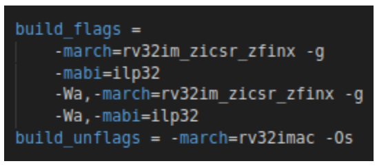

# Lab 3 - Performance of the VeeR EH1 core
In this lab we continue the analysis of the VeeR EH1 core.

You can follow the next steps:

1. At time 16:36 of the following video, you can visualize an example of the RVfpga-ViDBo simulator running a program: [RVfpgaViDBoVideo](https://www.youtube.com/watch?v=Z8QcQRW7F4s) (the video is in Spanish, but you can watch an AI-translated-to-English version of the video here [RVfpgaViDBoEnglishVideo](https://www.youtube.com/watch?v=HuAF2XOMQmQ), or you can enable the subtitles in the original video).

2. Then, you can perform the guided example for RVfpga-ViDBo, provided [here](https://github.com/artecs-group/RVfpga-sim-addons/blob/main/Computer_Organization/Lab4/README.md#introduction---simulation-of-the-rvfpga-soc) in this repository. Please note that this example is hosted on a separate webpage. Once you finish, make sure to return here and continue with item 3.

3. View this video [PerformanceBenchmarkingVideo](https://www.youtube.com/watch?v=GqaDEW3W4X0) (the video is in Spanish, but you can watch an AI-translated-to-English version of the video here: [PerformanceBenchmarkingEnglishVideo](https://www.youtube.com/watch?v=DXB7jl1iGq8), or you can enable the subtitles in the video in Spanish). You can download the [slides](https://drive.google.com/file/d/146nEyUkGkXn85cS15EiUM7R0Bv1nKyoT/view?usp=sharing). The video illustrates the following items:
    * How to measure performance in the RVfpga System (description of the VeeR EH1 Performance Counters is at time 0:10 and an example running on RVfpga-ViDBo is at time 2:14).
    * How to extend the VeeR EH1 processor with new instructions and how we can improve its peformance using them (a description of how to add new instructions to VeeR EH1 is at time 6:29 and an example running on RVfpga-ViDBo is at time 14:49).
    * How to run the CoreMark benchmark in the RVfpga System (at time 24:18).

4. Perform the following exercises.


## Exercise 1
*→ View the above [video](https://www.youtube.com/watch?v=GqaDEW3W4X0) at time 0:10 for the description of VeeR EH1 Performance Counters and at time 2:14 to see an example running on RVfpga-ViDBo.*

Download from the following link the program used for this example: [HwCounters_Example.zip](https://drive.google.com/file/d/1OEnGku9_uccNFXdFMkXveIQuQzTUIfsJ/view?usp=sharing)

Do the following steps:
   * Open the downloaded project in VSCode.
   * Run the program in RVfpga-ViDBo. If needed, set the path for the simulator in the ```platformio.ini``` file as follows:

```board_debug.verilator.binary = /home/rvfpga/Simuladores_EC_24-25/RVfpga/verilatorSIM_ViDBo/OriginalBinaries/RVfpga-ViDBo_Ubuntu22```

   * Analyze the results displayed in the UART console. Please note that the output may take some time to appear. Are they what you’d expect from the analyzed code?

**TASK:**
Measure other events in the Hardware Counters for the provided program. For this purpose, you must change in file ```Test.c``` the configuration of the events to be measured with function ```pspPerformanceCounterSet```. Note that the different events (shown in the table in the video) can be configured using the macros defined in WD’s PSP file:

```/home/rvfpga/.platformio/packages/framework-wd-riscv-sdk/psp/api_inc/psp_performance_monitor_eh1.h```

For example, to measure the number of I$ misses instead of the number of branch prediction misses, you must substitute in file ```Test.c``` line: 

```pspPerformanceCounterSet(D_PSP_COUNTER3, E_BRANCHES_MISPREDICTED);```

for line: 

```pspPerformanceCounterSet(D_PSP_COUNTER3, E_I_CACHE_MISSES);```

Are the results for I$ misses reasonable?


## Exercise 2
Measure the CPI using the Performance Counters for the program provided below, that was used in a previous lab, with all VeeR EH1 core features enabled. Compare the result with the one you obtained in the previous lab for the same situation.

Then, test the program both in the RVfpga-ViDBo simulator. We next copy the code that you must use, which is slightly modified with respect to the one used in the previous lab. Use the project downloaded in the previous exercise (HwCounters_Example) and placed in your home directory, and simply substitute the program for the one provided below. Note that, in this program and unlike the previous lab, we repeat the same code a high number of times, in order to reduce undesired effects such as I$ misses. You can calculate the average CPI by dividing the total number of cycles by the total number of instructions executed.

```
   .globl Test_Assembly
   
   .section .midccm
   Entrada: .space 40
   Filtro: .space 12
   Salida: .space 32
   
   .text
   
   Test_Assembly:
   li t2, 0x0 # Enable all VeeR EH1 features
   csrrs t1, 0x7F9, t2
   
   la t0, Entrada
   li t1, 0x1   				 
   sw t1, (t0)   			 
   li t1, 0x3   				 
   sw t1, 4(t0)   			 
   li t1, 0x5   				 
   sw t1, 8(t0)   			 
   li t1, 0x7   				 
   sw t1, 12(t0)   			 
   li t1, 0x9   				 
   sw t1, 16(t0)   			 
   li t1, 0x1   				 
   sw t1, 20(t0)   			 
   li t1, 0x3   				 
   sw t1, 24(t0)   			 
   li t1, 0x5   				 
   sw t1, 28(t0)   			 
   li t1, 0x7   				 
   sw t1, 32(t0)   			 
   li t1, 0x9   				 
   sw t1, 36(t0)   			 
   
   la t0, Filtro
   li t1, 0x2   				 
   sw t1, (t0)   			 
   li t1, 0x3   				 
   sw t1, 4(t0)   			 
   li t1, 0x4   				 
   sw t1, 8(t0)   			 
   
   la t0, Salida
   li t1, 0   				 
   sw t1, (t0)   			 
   li t1, 0   				 
   sw t1, 4(t0)   			 
   li t1, 0   				 
   sw t1, 8(t0)   			 
   li t1, 0   				 
   sw t1, 12(t0)   			 
   li t1, 0   				 
   sw t1, 16(t0)   			 
   li t1, 0   				 
   sw t1, 20(t0)   			 
   li t1, 0   				 
   sw t1, 24(t0)   			 
   li t1, 0   				 
   sw t1, 28(t0)   			 
   
   la   a3 , Entrada
   la   a4 , Filtro
   la   a5 , Salida
   
   li   a2, 0
   li   t1, 3
   li   a1, 0
   li   t0, 8
   
   nop
   nop
   nop
   nop
   
   and zero, t4, t5
   
   li t2, 0x0
   add a6, a6, 0x240

   REPEAT:
      loop_n :
      addi a2 , x0 , 0
   	loop_k :
       	lw t3 , 0( a3)
       	lw t4 , 0( a4)
       	mul t6 , t3 , t4
       	lw t5 , 0( a5)
       	add t5 , t6 , t5
       	sw t5 , 0( a5)
       	addi a3 , a3 , 4
       	addi a4 , a4 , 4
       	addi a2 , a2 , 1
       	blt a2 , t1 , loop_k
      addi a5 , a5 , 4
      addi a3 , a3 , -8
      addi a4 , a4 , -12
      addi a1 , a1 , 1
      blt a1 , t0 , loop_n
   addi t2, t2, 1
   bne t2, a6, REPEAT # Repeat the loop

   .end
```


## Exercise 3
*→ View the above [video](https://www.youtube.com/watch?v=GqaDEW3W4X0) at time 18:00 to see an example running on RVfpga-ViDBo.*

Follow the instructions explained in the slides and the video in order to test the extended core with the simple example that does a floating point addition. 

Note that you do not need to modify the core sources nor recompile the simulator binary, as we provide the binary through the following link: [Vrvfpgasim](https://drive.google.com/file/d/1PtQBGKW1Z3E_h3deqgwIjjDKWUeLiDrq/view?usp=sharing). Once downloaded, move it to your home directory inside the Virtual Machine and give it execution rights: ```chmod 777 Vrvfpgasim```. In case you want to analyze the core sources and create the binary/bitstream yourself, you can download the extended core sources here: [src_FPU](https://drive.google.com/file/d/1199soZSgC8ZiqvnQjMRLNSkZAyRviOb5/view?usp=sharing).

In addition, download the project that uses the new instructions from this link: [Project_RVfpgaViDBo_FPU_Example.zip](https://drive.google.com/file/d/1uo8-gNwMsI5FdqHA_IdATUjjIipB3zYw/view?usp=drive_link), and move it to your home directory inside the Virtual Machine.

**TASK:**
Do the same tests for a multiplication and a division instead of an addition. Analyze the results obtained for the operations and for the HW counter events.

These are the 32-bit formats for these two FP instructions:

<p align="center">
  
</p>


## Exercise 4
In this exercise you will test a program with floating point operations on the board, using the extended SoC. Follow the next steps:

   1. Download the following program, which computes the dot product of two vectors: [DotProduct](https://drive.google.com/file/d/1FxCZzNDfhHamieTfrMSGTSZLJr-9cMYl/view?usp=sharing). Unzip the file and move the obtained folder to the home directory.
   2. Open the project in VSCode and analyze the program in detail.
   3. Execute the program on the ViDBo simulator that you downloaded in the previous exercise and explain the results obtained.


## Exercise 5
*→ View the above [video](https://www.youtube.com/watch?v=GqaDEW3W4X0) at time 25:58 to see an example of CoreMark running on the board.*

Analyze the provided PlatformIO project for the CoreMark benchmark. You can download the sources here: [CoreMark](https://drive.google.com/file/d/1WRujundTKyU3CuQxuAvV4vfe-B04-_QB/view?usp=drive_link). 

Then, analyze the execution of the benchmark in RVfpga-ViDBo for the following two configurations: 

- Using a ```-g``` compiler optimization level. For that purpose, set the three final lines of file platformio.ini as follows:

  ```
   build_unflags = -Wa,-march=rv32imac -march=rv32imac -Os
   build_flags = -Wa,-march=rv32im -march=rv32im -g
   extra_scripts = extra_script.py
  ```

- Using a ```-O2``` compiler optimization level. For that purpose, set the three final lines of file platformio.ini as follows:

  ```
   build_unflags = -Wa,-march=rv32imac -march=rv32imac -Os
   build_flags = -Wa,-march=rv32im -march=rv32im -O2
   extra_scripts = extra_script.py
  ```


## Exercise 6
In this exercise you will upgrade the gcc simulator in PlatformIO to a version that supports the Zfinx extension. Follow the next steps:

- Download this simple project, that computes a FP addition and move it to the home directory: [Project_RVfpgaViDBo_FPU_Example_NewCompiler.zip](https://drive.google.com/file/d/1CGB2MIz0s7XzF475xfu6WPXIkpyvQ8lF/view?usp=sharing)

- Replace the following file (keep a backup copy of this file before replacing it): ```~/.platformio/platforms/chipsalliance/builder/main.py``` for the one that you can download here: [main.py](https://drive.google.com/file/d/1dlx2YjdlljqLzgwz1vNzZ9FJVIOsBjbs/view?usp=sharing)
  
Then, do the following tasks:

1. Execute the provided program in RVfpga-ViDBo using the extended SoC (you should have the simulator binary in the home directory, as you used it in the previous tasks).

<p align="center">
  
</p>

   - First test it with Zfinx extension enabled (this is the default).
      - Check the number of cycles needed to execute the addition.
      - Analyze the disassembly code generated by the compiler. The floating point addition in C should have been transformed to an ```fadd``` instruction by the compiler.
   - Then, disable the Zfinx extension in file platformio.ini by removing the ```_zfinx``` text in the two places where it’s found in that file:
      - Check the number of cycles needed to execute the addition.
      - Analyze the disassembly code generated by the compiler. The floating point addition in C should have been transformed to an emulation of the operation.
   - Compare and explain the number of cycles that are obtained in the two cases.

2. Do the same tests for the other floating point instructions implemented in the extended SoC: ```fmul``` and ```fdiv```.
