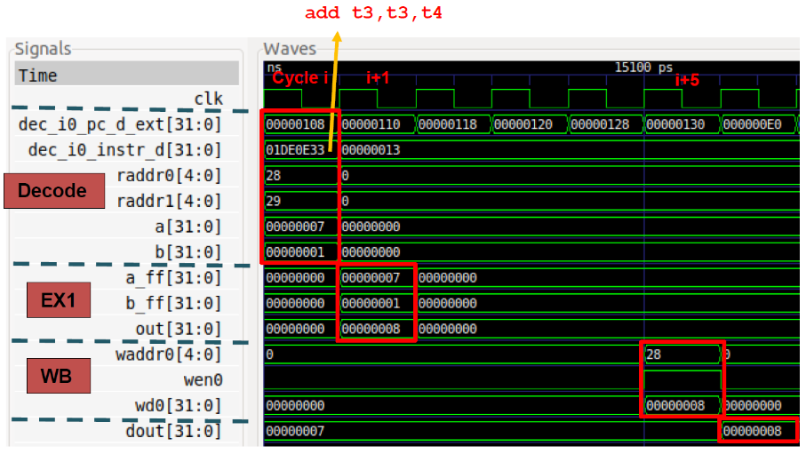
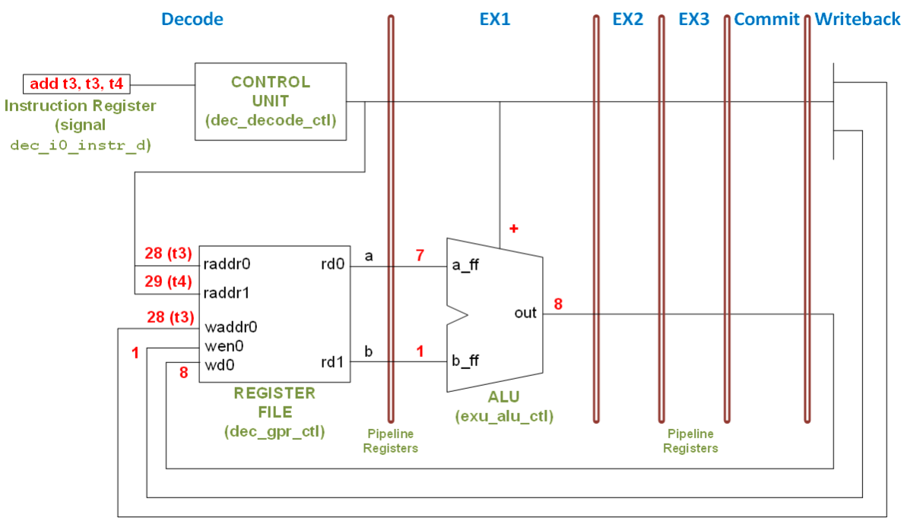
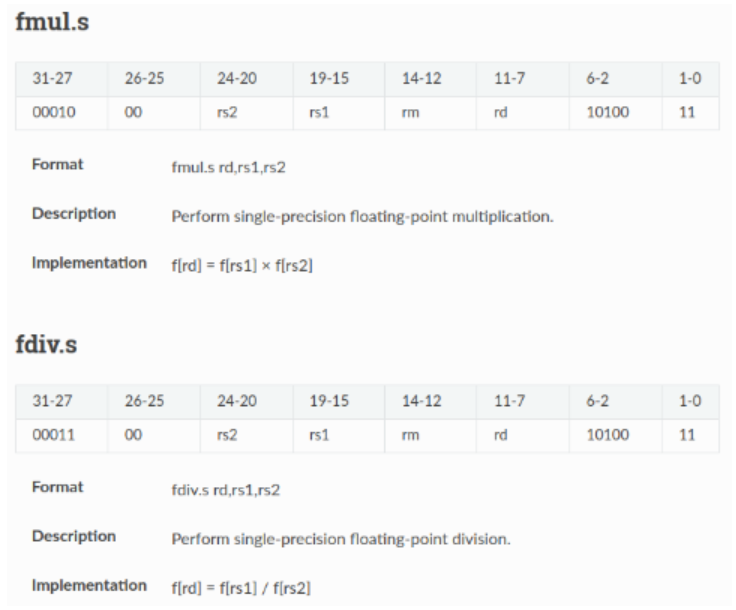
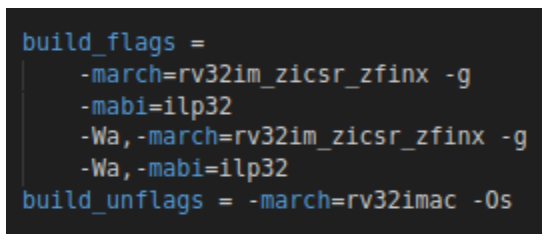

# Lab 4 - Execution of basic instructions and adding new instructions on the VeeR EH1 core
In this lab we continue the analysis of the VeeR EH1 core, analyzing the execution of basic instructions and adding new instructions to the core. The exercises proposed can be performed both in simulation and on the FPGA board.

Follow the next steps:

1. From time 11:12 to time 16:35 of the following video, you can visualize an example of the RVfpga-Trace simulator running a program: [RVfpgaToolsVideo](https://youtu.be/Z8QcQRW7F4s?si=8g_GSFpHmIsMQrzI&t=672) (the video is in Spanish, but you can watch an AI-translated-to-English version of the video here [RVfpgaToolsEnglishVideo](https://youtu.be/HuAF2XOMQmQ?si=-LpY-J7f-ng9AYAa&t=672), you can watch an AI-translated-to-Chinese version of the video here [RVfpgaToolsChineseVideo](https://youtu.be/A_c8GACrW9w?si=gst8rw2755R_JtMA&t=672), or you can enable the subtitles in the original video).

2. Perform Exercise 1, that analyzes the execution of an ```add``` instruction on the VeeR EH1 pipeline with the help of an RVfpga-Trace simulation.

3. View, from time 6:29 to time 24:18, this video [PerformanceBenchmarkingVideo](https://youtu.be/GqaDEW3W4X0?si=yf1rObPveS-RB-We&t=388) (the video is in Spanish, but you can watch an AI-translated-to-English version of the video here: [PerformanceBenchmarkingEnglishVideo](https://youtu.be/DXB7jl1iGq8?si=GODI7vlY9WCXIMny&t=388), you can watch an AI-translated-to-Chinese version of the video here: [PerformanceBenchmarkingChineseVideo](https://youtu.be/d5-0sNLW7wg?si=6P5wM8ruumOQuSnD&t=388) or you can enable the subtitles in the video in Spanish) (you can download the [slides](https://drive.google.com/file/d/146nEyUkGkXn85cS15EiUM7R0Bv1nKyoT/view?usp=sharing)). The video describes how to extend the VeeR EH1 processor with new instructions and how we can improve its peformance using them.

4. Perform exercises 2 to 4.

5. Finally, if you want to continue practicing after completing the proposed exercises, you can find more complex exercises in [RVfpga](https://university.imgtec.com/rvfpga-el2-v3-0-english-downloads-page/) labs 11 to 18.


## Exercise 1
In this exercise we analyse an ```add``` instruction from the Decode to Writeback stage, when it writes the result to the Register File. Throughout this section we will work with the example shown next, which executes an ```add``` instruction contained within a loop that repeats forever. Folder ```/home/rvfpga/Simuladores_EC_24-25/RVfpga/Projects/ADD_Instruction``` provides the PlatformIO project so that you can analyse, simulate and change the program as desired. For the sake of simplicity, in this project we disable the use of compressed instructions. Moreover, for convenience, we insert the ```add``` instruction in an infinite loop, which allows us to inspect it with no Instruction Cache (I$) misses if we avoid the first iteration for our analysis. This also makes it easy to find the region of interest in the simulation. Finally, the add instruction is surrounded by several ```nop``` (no-operation) instructions in order to isolate it from preceding/subsequent add instructions that belong to other iterations of the loop. 

```
.globl main 
main: 

li t3, 0x4                 # t3 = 4 
li t4, 0x1                 # t4 = 1 

REPEAT: 
   INSERT_NOPS_10 
   add t3, t3, t4          # t3 = t3 + t4 
   INSERT_NOPS_10 
   beq  zero, zero, REPEAT # Repeat the loop 

.end
```

If you open the project in PlatformIO, build it, and open the disassembly file (available at ```/home/rvfpga/Simuladores_EC_24-25/RVfpga/Projects/ADD_Instruction/.pio/build/swervolf_nexys/firmware.dis```) you will see that the ```add``` instruction (```0x01de0e33```) is placed at address ```0x00000108``` in this program. 

      0x00000108:        01de0e33         	add	t3,t3,t4

The following figure shows the Verilator simulation of the program above for the execution of the ```add``` instruction in the fourth iteration of the loop, which happens at time 15ns. The figure includes some signals associated with the Decode, EX1 and Writeback (WB) stages. The values highlighted in red correspond to the ```add``` instruction as it traverses these three stages through the I0 Pipe. Note that the signals shown in the figure correspond to the I0 Pipe. 

<p align="center">
  
</p>

The following figure shows a simplified diagram of the VeeR EH1 pipeline executing the ```add``` instruction during the fourth iteration of the loop through the I0 Pipe. Note that the figure merges the state of the processor in different cycles: 

<p align="center">
  
</p>

We follow the ```add``` instruction through the pipeline by analysing the previous waveform and diagram at the same time, and as described below. 

- Cycle i: 	**Decode**: Signal ```dec_i0_instr_d``` contains the 32-bit machine instruction ```0x01DE0E33```. You can easily verify that ```0x01DE0E33``` corresponds to: ```add t3, t3, t4```. During this stage, control signals are generated and the Register File is read. In the next stage (EX1), the operands will be sent to the ALU in the I0 pipe. Signals ```raddr0``` and ```raddr1``` (shown in decimal in the figures) contain the two source register numbers of the add instruction, and signals ```a``` and ```b``` contain the values that will be sent to the ALU in the next (EX1) stage. In this case, ```a``` and ```b``` are the values read from the Register File. For other instructions, ```a``` and ```b``` may be different values; for example, ```b``` could be an immediate. We will analyse other instructions in later labs. 

- Cycle i+1: 	**EX1**: The ```add``` instruction is executed. Signals ```a_ff``` and ```b_ff``` contain the inputs to the ALU (in this case, 7 and 1, respectively), whereas signal ```out``` contains the result of the addition (8). 

- Cycle i+5:	**Writeback**: Finally, 4 cycles later, the result of the addition is written-back to the Register File through signal ```wd0 = 0x8```, which contains the data to write. Given that ```wen0 = 1``` (write enable) in this cycle, the result of the addition is written at the end of the cycle into register ```x28``` (shown in decimal, ```waddr0 = 28```). You can observe that, in the following cycle (last cycle shown in the figure), register ```x28``` has been updated with the new value (```dout = 8```). 


**TASK 1:**
Replicate the previous simulation in your own computer. You can follow the same procedure as the one illustrated in the video from step 1. Here are the summarized steps to run an RVfpga-Trace simulation:
   * Open VSCode.
   * Click on ```File - Open Folder``` and open the folder containing the project: ```/home/rvfpga/Simuladores_EC_24-25/RVfpga/Projects/ADD_Instruction```.
   * Open the ```platformio.ini``` file and update the path to the RVfpga-Pipeline simulator, if necessary: ```board_debug.verilator.binary = /home/rvfpga/Simuladores_EC_24-25/RVfpga/verilatorSIM_Trace/OriginalBinaries/RVfpga-Trace_Ubuntu```.
   * In the ```PROJECT TASKS``` window of PlatformIO, click on ```Generate Trace```. This first compiles the program and then launches the Verilator simulation of the RVfpga SoC running this program.

        

   * After a few seconds, the program is compiled and file ```trace.vcd``` is generated inside folder ```/home/rvfpga/Simuladores_EC_24-25/RVfpga/Projects/ADD_Instruction/.pio/build/swervolf_nexys```. For analyzing the trace in the next step it may be useful to visualize the disassembly program that has been generated at: ```/home/rvfpga/Simuladores_EC_24-25/RVfpga/Projects/ADD_Instruction/.pio/build/swervolf_nexys/firmware.dis```.
   * Visualize the trace for the AL_Operations program:
      * Open the trace with GTKWave by executing the following command in a terminal: ```gtkwave /home/rvfpga/Simuladores_EC_24-25/RVfpga/Projects/ADD_Instruction/.pio/build/swervolf_nexys/trace.vcd```.
      * Add the signals to the trace. For that purpose, click on ```File > Read Tcl Script File``` and select the ```/home/rvfpga/Simuladores_EC_24-25/RVfpga/Projects/ADD_Instruction/test_1.tcl``` file.

        

      * Once the signals are added in GTKWave, Zoom Fit by clicking on the magnifying glass with a checkmark button  and then Zoom In by clicking on the magnifying glass with a plus sign button  at any point of the simulation (skip the initial instructions in order to analyze the loop containing the three arithmetic-logic instructions; for example, select a point around 20ns), in order to analyze the execution of the ```add``` instruction.

**TASK 2:**
Do the same analysis for the following logical instructions supported by the VeeR core: ```and```, ```or```, ```xor```.

**TASK 3:**
Do the same analysis for the following shift instructions supported by the VeeR core: ```srl```, ```sra```, ```sll```.

**TASK 4:**
Do the same analysis for the following set-less-than instructions supported by the VeeR core: ```slt```, ```sltu```.

**TASK 5:**
Do the same analysis for the following immediate instructions supported by the VeeR core: ```addi```, ```andi```, ```ori```, ```xori```, ```srli```, ```srai```, ```slli```, ```slti```, ```sltui```.

**TASK 6:**
Analyse and explain the Verilog implementation of the adder/subtractor implemented in module ```exu_alu_ctl```.


## Exercise 2
Follow the instructions explained at time 18:20 of the video provided in step 3 above ([PerformanceBenchmarkingVideo](https://youtu.be/GqaDEW3W4X0?si=yf1rObPveS-RB-We&t=1100)) in order to test on the FPGA board the extended core with the simple example that does a floating point addition (note that in the video the example is tested in RVfpga-ViDBo). 
   - You can download the project with the program from this link: [Project_RVfpgaViDBo_FPU_Example.zip](https://drive.google.com/file/d/1uo8-gNwMsI5FdqHA_IdATUjjIipB3zYw/view?usp=drive_link). Once downloaded and uncompressed, move it to your home directory inside the Virtual Machine.
   - You can download the bitstream of the extended SoC from this link: [ExtendedSoC](https://drive.google.com/file/d/1DwSW22Nk8Ef6UOMWIHgC7AB96AzB-yJI/view?usp=sharing). Once downloaded, move it to your home directory inside the Virtual Machine.
   - In case you do not have the board and you want to test the program in simulation, you can download the RVfpga-ViDBo binary of the extended SoC from this link: [ExtendedViDBo](https://drive.google.com/file/d/1PtQBGKW1Z3E_h3deqgwIjjDKWUeLiDrq/view?usp=sharing). Once downloaded, move it to your home directory inside the Virtual Machine and give it execution rights.

**TASK 1:**
Do the same tests for a multiplication and a division instead of an addition. Analyze the results obtained for the operations and for the HW counter events.

These are the 32-bit formats for these two FP instructions:

<p align="center">
  
</p>

**TASK 2:**
Compare the Verilog code for the extended SoC ([src_FPU](https://drive.google.com/file/d/1199soZSgC8ZiqvnQjMRLNSkZAyRviOb5/view?usp=sharing)) with the original SoC (available at /home/rvfpga/Simuladores_EC_24-25/RVfpga/src/SweRVolfSoC/SweRVEh1CoreComplex). You can view the instructions explained at time 6:29 of the video provided in step 3 above ([PerformanceBenchmarkingVideo](https://youtu.be/GqaDEW3W4X0?si=yf1rObPveS-RB-We&t=388)) about how to add instructions to the VeeR core.


## Exercise 3
In this exercise you will test a program with floating point operations, using the extended SoC. Follow the next steps:

   1. Download the following program, which computes the dot product of two vectors: [DotProduct](https://drive.google.com/file/d/1FxCZzNDfhHamieTfrMSGTSZLJr-9cMYl/view?usp=sharing). Unzip the file and move the obtained folder to the home directory.
   2. Open the project in VSCode and analyze the program in detail.
   3. Execute the program on the FPGA or on the RVfpga-ViDBo simulator:
      * Compare the results obtained for the dot product in FP emulation vs FP implementation.
      * Compare performance of the dot product in FP emulation vs FP implementation.


## Exercise 4
In this exercise you will upgrade the gcc compiler in PlatformIO to a version that supports the Zfinx extension. Follow the next steps:

- Download this simple project, that computes a FP addition and move it to the home directory: [Project_RVfpgaViDBo_FPU_Example_NewCompiler.zip](https://drive.google.com/file/d/1CGB2MIz0s7XzF475xfu6WPXIkpyvQ8lF/view?usp=sharing). File ```platformio.ini``` selects a new version of the RISC-V toolchain (line ```platform_packages = platformio/toolchain-riscv@^1.130200.2```), thus the old toolchain will be replaced with the new one as soon as we open the project.

- Replace the following file (keep a backup copy of this file before replacing it): ```~/.platformio/platforms/chipsalliance/builder/main.py``` for the one that you can download here: [main.py](https://drive.google.com/file/d/1dlx2YjdlljqLzgwz1vNzZ9FJVIOsBjbs/view?usp=sharing)
  
Then, do the following tasks:

1. Execute the provided program on the FPGA board or in RVfpga-ViDBo using the extended SoC (which you obtained in the previous tasks). In file ```platformio.ini``` you can see the ```build_flags``` set as follows, which enable the Zfinx extension in the compiler:

<p align="center">
  
</p>

   - First test it with Zfinx extension enabled (the default option shown in the figure).
      - Check the number of cycles needed to execute the addition.
      - Analyze the disassembly code generated by the compiler. The floating point addition in C should have been transformed to an ```fadd``` instruction by the compiler.
   - Then, disable the Zfinx extension in file platformio.ini by removing the ```_zfinx``` text in the two places where it’s found in that file:
      - Check the number of cycles needed to execute the addition.
      - Analyze the disassembly code generated by the compiler. The floating point addition in C should have been transformed to an emulation of the operation.
   - Compare and explain the number of cycles that are obtained in the two cases.

2. Do the same tests for the other floating point instructions implemented in the extended SoC: ```fmul``` and ```fdiv```.

To go back to the previous compiler, follow the next steps:

1. Close the Project_RVfpgaViDBo_FPU_Example_NewCompiler project.
2. Go into the Extensions tab in VSCode and uninstall the PlatformIO IDE. Close VSCode.
3. Open a terminal, go into the home directory, and delete directory ```.platformio``` using the following command: ```rm -rf .platformio```
4. Open VSCode, reinstall the PlatformIO IDE extension and test a program from a previous task.
