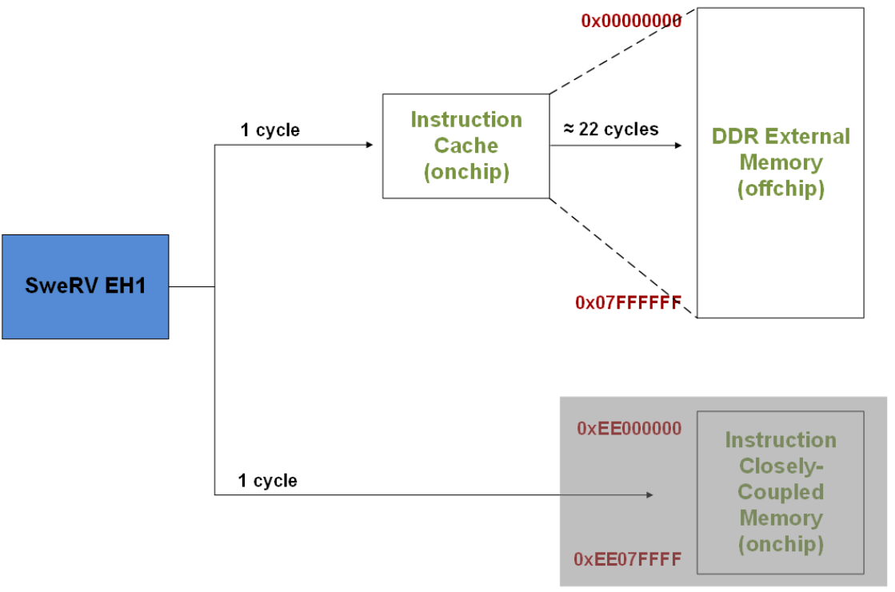
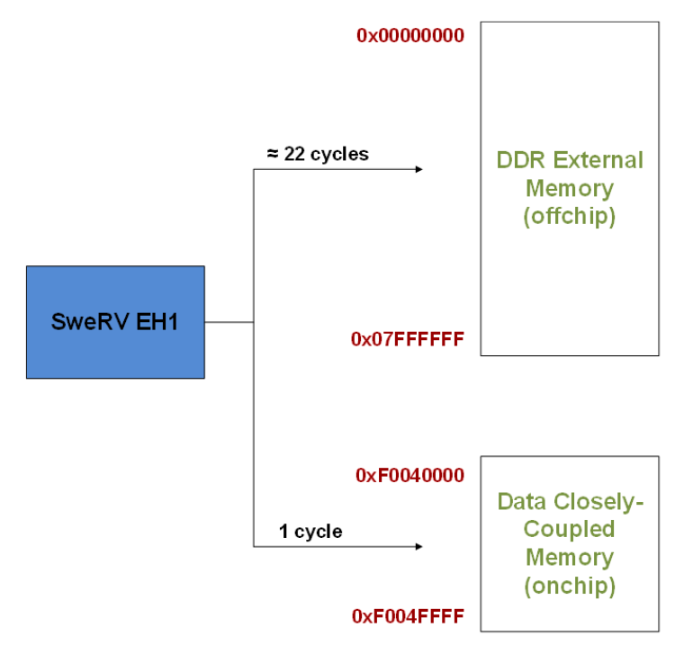

# Lab 6 - The Memory Hierarchy in VeeR EH1
In this lab, we analyse the memory hierarchy of the RVfpga SoC, focusing in the scratchpad memories (ICCM and DCCM) available in the VeeR EH1 processor and we provide some benchmarking examples and exercises. Some of these tests and exercises can be done in simulation, but it's preferable to use an FPGA board. Remember that you can get all information concerning the creation of the bitstream in Vivado, the configuration and programming of the board, etc., in the complete [RVfpga](https://university.imgtec.com/rvfpga-el2-v3-0-english-downloads-page/) course. 

Follow the next steps:

1. Visualize the following video from time 19:16 to time 21:55 to see an example of the Nexys A7 FPGA board running a program: [RVfpgaToolsVideo](https://youtu.be/Z8QcQRW7F4s?si=mP2EX5TRlPe8WD-O&t=1156) (the video is in Spanish, but you can watch an AI-translated-to-English version of the video here [RVfpgaToolsEnglishVideo](https://youtu.be/HuAF2XOMQmQ?si=whpN4rKCKX_Q08Z_&t=1156), you can watch an AI-translated-to-Chinese version of the video here [RVfpgaToolsChineseVideo](https://youtu.be/A_c8GACrW9w?si=2PF5bUfPfaN0RdjJ&t=1156), or you can enable the subtitles in the original video).
   
2. We recommend the students to do some reading about ScrathPad memories, such as Sections 1 and 3 of paper [On-chip vs. off-chip memory: the data partitioning problem in embedded processor-based systems](https://dl.acm.org/doi/10.1145/348019.348570). We also recommend some reading about the [CoreMark](https://www.eembc.org/coremark/) benchmark. 

3. Then, if you have an FPGA board, you can test an example, following the steps shown below in this repo [RVfpga-Nexys](https://github.com/artecs-group/RVfpga-sim-addons/blob/main/Integrated_Systems_Architecture/Lab6/README.md#rvfpga-nexys).
   
4. Then, read the theory about the RVfpga SoC memory hierarchy, provided [below](https://github.com/artecs-group/RVfpga-sim-addons/blob/main/Integrated_Systems_Architecture/Lab6/README.md#the-memory-hierarchy-on-the-rvfpga-soc).

5. Finally, you can resolve the exercises provided [below](https://github.com/artecs-group/RVfpga-sim-addons/blob/main/Integrated_Systems_Architecture/Lab6/README.md#exercise-1).


## RVfpga-Nexys
We next show the steps to run the program from the previous section on the Nexys A7 board.

1. Connect the board to a USB port in your computer and switch it on. Then, connect the board to your Virtual Machine. If the board is not detected, you may need to install the drivers in your native Windows or Linux OS (macOS should not need any installation), as described in the complete RVfpga course.

2. Open VSCode and click on ```File - Open Folder``` and open the folder containing the project for the example we will use in this section: ```/home/rvfpga/Simuladores_EC_24-25/RVfpga/Projects/LedsSwitches_C-Lang```

3. Open the ```platformio.ini``` file and update the path to the RVfpga-Nexys bitstream as follows:
  ```board_build.bitstream_file = /home/rvfpga/Simuladores_EC_24-25/RVfpga/src/rvfpganexys.bit```

4. You are now ready to download RVfpga-Nexys, the RISC-V SoC that includes a RISC-V processor with support for peripherals, to the Nexys A7 FPGA board.

   - Click on the PlatformIO icon in the left menu ribbon.
   - Then expand ```PROJECT TASKS > env:swervolf_nexys > Platform``` and click on ```Upload Bitstream```. After one or two seconds, the FPGA will be programmed with the RVfpga-Nexys SoC. By default, the processor starts fetching instructions at address 0x80000000, where the Boot ROM is placed in our SoC. The Boot ROM is initialized with a program that blinks the LEDs and the 7-Segment Displays four times and then turns off all the LEDs, writes 0s to the 8 7-Segment Displays and stays in an empty loop.

6. Now that RVfpga-Nexys is downloaded on the Nexys A7 board, you will download the ```LedsSwitches``` program into the memory of RVfpga-Nexys and run/debug the program. Run and Debug the program on the left bar, clicking on the two following buttons.

<p align="center">
  
</p>

6. The program will first compile and then debugging will start. To control your debugging session, you can use the debugging toolbar which appears near the top of the editor. PlatformIO sets a temporary breakpoint at the beginning of the ```main``` function. Click on the ```Continue``` button  to run the program. Now toggle the switches on the Nexys A7 FPGA board and view as the corresponding LEDs light up.


## The memory hierarchy on the RVfpga SoC
The next figures illustrate the RVfpga System Address Space for the Instruction Memory and for the Data Memory. The Instruction Memory includes two levels: a low-latency first level Instruction Cache and a high-latency second level Main Memory. The ICCM is disabled by default, but we could enable and use it by recompiling the simulator or regenerating the bitstream.

<p align="center">
  
</p>

The Data Memory includes a single level divided into two memories, each mapped to different address ranges: a low-latency DCCM and a high-latency Main Memory.

<p align="center">
  
</p>


## Exercise 1
Download the sources for the CoreMark benchmark here: [CoreMark](https://drive.google.com/file/d/1WRujundTKyU3CuQxuAvV4vfe-B04-_QB/view?usp=drive_link). The follow the next steps:
-	Open file ```src/Test.c```, which includes the main function of our program:
      -	The ```main``` function first configures the HW Counters for measuring four events: number of cycles, number of instructions, D-bus transactions (ld/st instructions) and I-bus transactions (instructions). For this purpose, function ```pspPerformanceCounterSet()``` is used.
      -	It then configures the different features of the SweRV EH1 processor, using two assembly instructions (```li``` and ```csrrs```). In this case, all features are left to their default values.
      -	The program then executes a loop that is only exited when any of the switches on the board is inverted. The purpose of this loop is to allow the user to open the serial monitor before the benchmark executes and outputs its results.
      -	The program then invokes function ```main_cmark()```, which implements the CoreMark benchmark itself, which is implemented in file ```src/cmark.c```.
      -	It finally prints the four events using function ```printfNexys()```.
-	Briefly analyse the functions from the CoreMark benchmark implemented in file ```src/cmark.c```. Note that the HW Counters are started and stopped inside the ```main_cmark()``` function, and that the benchmark itself is executed inbetween.
-	Run the program on the board. Then open the serial monitor. After opening the serial monitor, you will first see a repeating message that asks you to invert a switch in the board for executing the CoreMark benchmark. Once you invert a switch, the benchmark executes and outputs the results. CoreMark runs multiple iterations of a loop (you can easily modify the number of iterations by means of a parameter called ```ITERATIONS``` and defined in file ```src/cmark.c```). The number of iterations it completes per second is called the CoreMark score (CM). The number of iterations per MHz is CM/MHz. The benchmark provides the CM/MHz – also called Iterat/Sec/MHz (iterations/second/MHz). At the end, you can view the values provided by the hardware counters: number of cycles, number of instructions, D-bus transactions (ld/st instructions) and I-bus transactions (instructions). Using the first two events, compute the CPI of the benchmark under this configuration.


## Exercise 2
Now we enable the DCCM in the RVfpga System so that most data accesses use the DCCM (instead of the external DDR memory). As we will see, this change increases performance, as expected. Follow the next steps to run CoreMark on a version of the RVfpga system that uses the DCCM:
- The default linker script that we have used so far in most labs is available at ```.platformio/packages/framework-wd-riscv-sdk/board/nexys_a7_eh1/link.lds```. However, in order to use the DCCM to store some data of the program, we make use of a specific linker script that is provided as part of the PlatformIO project that you are using and which is available at: ```CoreMark/ld/link_DCCM.ld. Open this file and inspect it. Specifically, you can see that the file defines one memory section for the DCCM (called ```dccm```), which corresponds to the address space defined previously for this memory: ```dccm (wxa!ri) : ORIGIN = 0xf0040000, LENGTH = 64K```.
- Open file ```platformio.ini``` and uncomment line 18 so that the program uses the new linker script. This way, most data will be accessed in the fast DCCM instead of the slow DDR memory.
- Run the program on the board and open the serial monitor. Then invert a switch on the board. Explain the results and compare them with the ones obtained in the previous exercise.


## Exercise 3
Finally, we add another way to improve performance: compiler optimizations. As in the previous section, we use the DCCM to store most of the data sections of the application – but now we also enable compiler optimizations. Up until this point, we have executed programs in debug mode with no compiler optimizations. To enable compiler optimizations, follow the next steps:
- Using a different procedure than previously used, run the program on the board: Upload the usual bitstream but then use option ```Upload and Monitor``` available in the Project Tasks of PlatformIO.
- This option will compile the program, execute it on the board and open the serial monitor. This option compiles using the optimization flags determined by the ```build_flags``` option in ```platformio.ini```. Test both -g, -O1, -O2 and -O3.
- Once the program starts executing, as usual, invert a switch on the board. Then, explain the results and compare them with the previous exercises.


## Exercise 4
Repeat the previous tests but use other configurations of the VeeR EH1 core: enable/disable superscalar execution, pipelined execution, Secondary ALU, etc.
