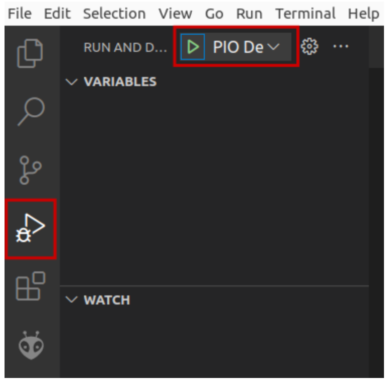

# Lab 6 - The Memory Hierarchy in VeeR EH1
In this lab, we analyse the memory hierarchy of the RVfpga SoC, focusing in the scratchpad memories (ICCM and DCCM) available in the VeeR EH1 processor and we provide some benchmarking examples and exercises. Some of these tests and exercises can be done in simulation, but it's preferable to use an FPGA board. Remember that you can get all information concerning the creation of the bitstream in Vivado, the configuration and programming of the board, etc., in the complete [RVfpga](https://university.imgtec.com/rvfpga-el2-v3-0-english-downloads-page/) course. 

Follow the next steps:

1. Visualize the following video from time 19:16 to time 21:55 to see an example of the Nexys A7 FPGA board running a program: [RVfpgaToolsVideo](https://youtu.be/Z8QcQRW7F4s?si=mP2EX5TRlPe8WD-O&t=1156) (the video is in Spanish, but you can watch an AI-translated-to-English version of the video here [RVfpgaToolsEnglishVideo](https://youtu.be/HuAF2XOMQmQ?si=whpN4rKCKX_Q08Z_&t=1156), you can watch an AI-translated-to-Chinese version of the video here [RVfpgaToolsChineseVideo](https://youtu.be/A_c8GACrW9w?si=2PF5bUfPfaN0RdjJ&t=1156), or you can enable the subtitles in the original video).
   
2. We recommend the students to do some reading about ScrathPad memories, such as Sections 1 and 3 of paper [On-chip vs. off-chip memory: the data partitioning problem in embedded processor-based systems](https://dl.acm.org/doi/10.1145/348019.348570). We also recommend some reading about the [CoreMark](https://www.eembc.org/coremark/) and [Dhrystone](https://www.eembc.org/techlit/datasheets/dhrystone_wp.pdf) benchmarks. 

3. Then, if you have an FPGA board, you can test an example, following the steps shown below in this repo ([RVfpga-Nexys](https://github.com/artecs-group/RVfpga-sim-addons/blob/main/Integrated_Systems_Architecture/Lab6/README.md#rvfpga-nexys).

4. Finally, you can resolve the exercises provided [below]().


## RVfpga-Nexys
We next show the steps to run the program from the previous section on the Nexys A7 board.

1. Connect the board to a USB port in your computer and switch it on. Then, connect the board to your Virtual Machine. If the board is not detected, you may need to install the drivers in your native Windows or Linux OS (macOS should not need any installation), as described in the complete RVfpga course.

2. Open VSCode and click on ```File - Open Folder``` and open the folder containing the project for the example we will use in this section: ```/home/rvfpga/Simuladores_EC_24-25/RVfpga/Projects/LedsSwitches_C-Lang```

3. Open the ```platformio.ini``` file and update the path to the RVfpga-Nexys bitstream as follows:
  ```board_build.bitstream_file = /home/rvfpga/Simuladores_EC_24-25/RVfpga/src/rvfpganexys.bit```

4. You are now ready to download RVfpga-Nexys, the RISC-V SoC that includes a RISC-V processor with support for peripherals, to the Nexys A7 FPGA board.
   a. Click on the PlatformIO icon in the left menu ribbon.
   b. Then expand PROJECT TASKS > env:swervolf_nexys > Platform and click on Upload Bitstream. After one or two seconds, the FPGA will be programmed with the RVfpga-Nexys SoC. By default, the processor starts fetching instructions at address 0x80000000, where the Boot ROM is placed in our SoC. The Boot ROM is initialized with a program that blinks the LEDs and the 7-Segment Displays four times and then turns off all the LEDs, writes 0s to the 8 7-Segment Displays and stays in an empty loop.

5. Now that RVfpga-Nexys is downloaded on the Nexys A7 board, you will download the ```LedsSwitches``` program into the memory of RVfpga-Nexys and run/debug the program. Run and Debug the program on the left bar, clicking on the two following buttons.

<p align="center">
  
</p>

6. The program will first compile and then debugging will start. To control your debugging session, you can use the debugging toolbar which appears near the top of the editor. PlatformIO sets a temporary breakpoint at the beginning of the ```main``` function. Click on the ```Continue``` button  to run the program. Now toggle the switches on the Nexys A7 FPGA board and view as the corresponding LEDs light up.


## Exercise 1
