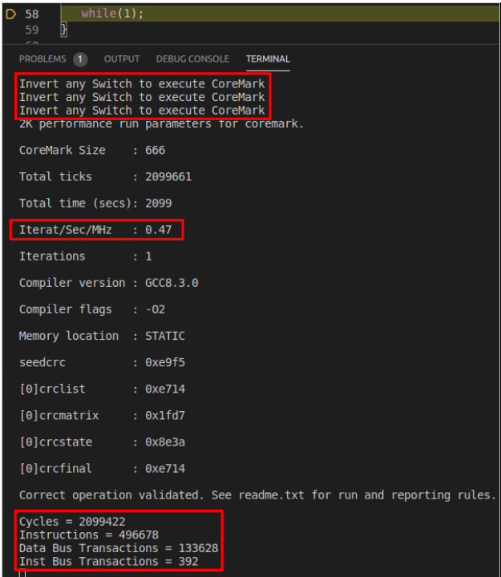

# Lab 6 - The Memory Hierarchy in VeeR EH1
In this lab, we analyse the memory hierarchy of the RVfpga SoC, focusing in the scratchpad memories (ICCM and DCCM) available in the VeeR EH1 processor and we provide some benchmarking examples and exercises. Some of these tests and exercises can be done in simulation, but it's preferable to use an FPGA board. Remember that you can get all information concerning the creation of the bitstream in Vivado, the configuration and programming of the board, etc., in the complete [RVfpga](https://university.imgtec.com/rvfpga-el2-v3-0-english-downloads-page/) course. 

Follow the next steps:

1. Visualize the following video from time 19:16 to time 21:55 to see an example of the Nexys A7 FPGA board running a program: [RVfpgaToolsVideo](https://youtu.be/Z8QcQRW7F4s?si=mP2EX5TRlPe8WD-O&t=1156) (the video is in Spanish, but you can watch an AI-translated-to-English version of the video here [RVfpgaToolsEnglishVideo](https://youtu.be/HuAF2XOMQmQ?si=whpN4rKCKX_Q08Z_&t=1156), you can watch an AI-translated-to-Chinese version of the video here [RVfpgaToolsChineseVideo](https://youtu.be/A_c8GACrW9w?si=2PF5bUfPfaN0RdjJ&t=1156), or you can enable the subtitles in the original video).
   
2. We recommend the students to do some reading about ScrathPad memories, such as Sections 1 and 3 of paper [On-chip vs. off-chip memory: the data partitioning problem in embedded processor-based systems](https://dl.acm.org/doi/10.1145/348019.348570). We also recommend some reading about the [CoreMark](https://www.eembc.org/coremark/) benchmark. 
   
3. Then, read the theory about the RVfpga SoC memory hierarchy, provided [below](https://github.com/artecs-group/RVfpga-sim-addons/blob/main/Integrated_Systems_Architecture/Lab6/README.md#the-memory-hierarchy-on-the-rvfpga-soc).

4. Then, you can resolve the exercises provided [below](https://github.com/artecs-group/RVfpga-sim-addons/blob/main/Integrated_Systems_Architecture/Lab6/README.md#exercise-1).

5. Finally, if you want to continue practicing after completing the previous exercises, you can find more complex exercises in [RVfpga](https://university.imgtec.com/rvfpga-el2-v3-0-english-downloads-page/) labs 19 and 20.


## The memory hierarchy on the RVfpga SoC
The next figures illustrate the RVfpga System Address Space for the Instruction Memory and for the Data Memory. The Instruction Memory includes two levels: a low-latency first level Instruction Cache and a high-latency second level Main Memory. The ICCM is disabled by default, but we could enable and use it by recompiling the simulator or regenerating the bitstream.

<p align="center">
  
</p>

The Data Memory includes a single level divided into two memories, each mapped to different address ranges: a low-latency DCCM and a high-latency Main Memory.

<p align="center">
  
</p>


## Exercise 1
Download the sources for the CoreMark benchmark here: [CoreMark](https://drive.google.com/file/d/1WRujundTKyU3CuQxuAvV4vfe-B04-_QB/view?usp=drive_link). The follow the next steps:
-	Open the project in VSCode.
-	Analyze file ```src/Test.c```, which includes the main function of our program:
      -	The ```main``` function first configures the HW Counters for measuring four events: number of cycles, number of instructions, D-bus transactions (ld/st instructions) and I-bus transactions (instructions). For this purpose, function ```pspPerformanceCounterSet()``` is used.
      -	It then configures the different features of the SweRV EH1 processor, using two assembly instructions (```li``` and ```csrrs```). In this case, all features are left to their default values.
      -	The program then executes a loop that is only exited when any of the switches on the board is inverted. The purpose of this loop is to allow the user to open the serial monitor before the benchmark executes and outputs its results.
      -	The program then invokes function ```main_cmark()```, which implements the CoreMark benchmark itself, which is implemented in file ```src/cmark.c```.
      -	It finally prints the four events using function ```printfNexys()```.
-	Briefly analyse the functions from the CoreMark benchmark implemented in file ```src/cmark.c```. Note that the HW Counters are started and stopped inside the ```main_cmark()``` function, and that the benchmark itself is executed inbetween.
-	Measure performance of the CoreMark benchmark:
      -	Run the program on the board following the instructions described above.
      -	Open the serial monitor. For that purpose, right after the program stops at the ```main``` function, click on the button highlighted next in red, which you can find at the bottom of VSCode.

         <p align="center">
           
         </p>

      -	After opening the serial monitor, continue execution. You will first see a repeating message that asks you to invert a switch in the board for executing the CoreMark benchmark. Invert a switch on the board. Once you invert a switch, the benchmark executes and outputs the results.

         <p align="center">
           
         </p>

      -	CoreMark runs multiple iterations of a loop (you can easily modify the number of iterations by means of a parameter called ```ITERATIONS``` and defined in file ```src/cmark.c```). This is some of the information provided in the output:
         -	The number of iterations it completes per second is called the CoreMark score (CM). The number of iterations per MHz is CM/MHz. The output provides the CM/MHz – also called Iterat/Sec/MHz (iterations/second/MHz).
         -	Besides, at the end of the statistics, you can view the values provided by the hardware counters: number of cycles, number of instructions, D-bus transactions (ld/st instructions) and I-bus transactions (instructions).
      -	Using these metrics, compute the CPI of the benchmark under this processor configuration.


## Exercise 2
Enable the DCCM in the RVfpga SoC so that most data is mapped to the DCCM, instead of the external DDR memory. As we will see, this increases performance, as expected. Follow the next steps to run CoreMark on an RVfpga SoC that uses the DCCM:
- The default linker script that we have used so far in most labs is available at ```.platformio/packages/framework-wd-riscv-sdk/board/nexys_a7_eh1/link.lds```. However, in order to use the DCCM to store some data of the program, we make use of a specific linker script that is provided as part of the PlatformIO project that you are using and which is available at: ```CoreMark/ld/link_DCCM.ld```. Open this file and inspect it. Specifically, you can see that the file defines one memory section for the DCCM (called ```dccm```), which corresponds to the address space defined previously for this memory: ```dccm (wxa!ri) : ORIGIN = 0xf0040000, LENGTH = 64K```. If you go down the file, you can see that several sections are mapped to the dccm, using ```> dccm : dccm_load```. We next show some screenshots of this file.

<p align="center">
  
</p>

<p align="center">
  
</p>

- Open file ```platformio.ini``` and uncomment line 18 so that the program uses the new linker script. This way, most data will be accessed in the fast DCCM instead of the slow DDR memory.

<p align="center">
  
</p>

- Run the program on the board and open the serial monitor. Then invert a switch on the board. Explain the results and compare them with those obtained in the previous exercise.


## Exercise 3
In this exercise, we'll examine another way to improve performance: compiler optimizations. As in the previous section, we use the DCCM to store most of the data sections of the application – but now we also enable compiler optimizations. Up until this point, we have executed programs in debug mode with no compiler optimizations. To enable compiler optimizations, follow the next steps:
- Using a different procedure than previously, run the program on the board as follows:
   - Click on ```Upload Bitstream```, to program the FPGA with the RVfpga SoC as usual.
   - Then click on ```Upload and Monitor```, which is also available in the ```Project Tasks``` of PlatformIO. See the following figure.
      <p align="center">
        
- The program will compile, executed on the board and the serial monitor will open. This option compiles using the optimization flags determined by the ```build_flags``` option in ```platformio.ini```. Test different options (-g, -O1, -O2 and -O3). For example, you can see how to compile with -O2 in the following figure.

<p align="center">
  
</p>

- Once the program starts executing, as usual, invert a switch on the board. Then, explain the results and compare them with the previous exercises.


## Exercise 4
Repeat the previous exercises but using other configurations of the VeeR EH1 core: enable/disable superscalar execution, pipelined execution, Secondary ALU, Gshare branch preditro, etc.
