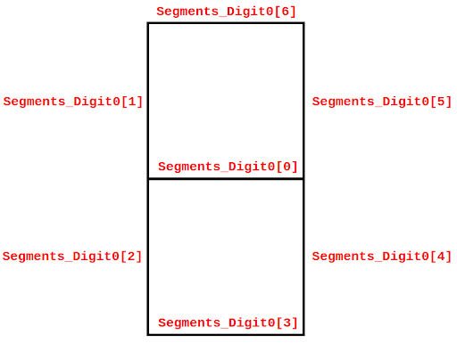

# Lab 8 - The RVfpga I/O System - Low Level
This practice aims to let the students continue with the analysis of the RVfpga Input/Output System. 

1. Complete the following exercises to modify and test the 8-digit 7-Segment displays controller.

2. Finally, if you want to continue practicing after completing the proposed exercises, you can find more complex exercises in [RVfpga](https://university.imgtec.com/rvfpga-el2-v3-0-english-downloads-page/) labs 5 to 10.


## Exercise 1
The current 8-digit 7-segment displays controller (implemented in module ```SevSegDisplays_Controller```), can only show the 16 hexadecimal digits. Modify the 8-digit 7-segment displays controller so that it can show any combination of ON/OFF LEDs. 

Note that you only need to make changes in file ```/home/rvfpga/Simuladores_EC_24-25/RVfpga/src/SweRVolfSoC/Peripherals/SystemController/swervolf_syscon.sv```. Specifically, within that file, you must modify the module that handles the 7-segment displays device (```SevSegDisplays_Controller```).

+ You can use as a baseline this [file](https://drive.google.com/file/d/19QDLbpinb2exxjfZP2S4pQ8HS-l7iQGT/view?usp=drive_link), which is already partially completed. In that file, look for comment ```/* COMPLETE THE CODE WITH THE NEW FUNCTIONALITY */``` and implement the new controller at that point of the code.

+ Instead of an ```Enables_Reg``` and a ```Digits_Reg```, the new controller needs eight 7-bit registers: ```Segments_Digit0 – Segments_Digit7```. Each of these 8 registers is associated with each of the eight 7-segment displays. These new registers are already included in the file provided in the previous item.

+ In each of these registers, each bit indicates if the corresponding segment is ON (0) or OFF (1). Specifically, for register ```Segments_Digit0``` (the same applies to the other seven registers), connections are as follows:

<p align="center">
  
</p>

+ So, for example:
  * If all the bits of the first register (```Segments_Digit0```) are 0, all segments in the rightmost digit will be ```ON```.
  * If all the bits of the first register (```Segments_Digit0```) are 1, all segments of the rightmost digit will be ```OFF```.
  * If all bits of the eighth register (```Segments_Digit7```) are 0 except ```Segments_Digit7[6]``` and ```Segments_Digit7[3]```, an ```H``` will be shown on the leftmost digit. 

+ Given that each of the eight registers only has 7 bits, we can map them to the same address range that we used before (```0x80001038``` and ```0x8000103C```); specifically:
  * ```Segments_Digit0 → Address 0x80001038```
  * ```Segments_Digit1 → Address 0x80001039```
  * ```Segments_Digit2 → Address 0x8000103A```
  * ```Segments_Digit3 → Address 0x8000103B```
  * ```Segments_Digit4 → Address 0x8000103C```
  * ```Segments_Digit5 → Address 0x8000103D```
  * ```Segments_Digit6 → Address 0x8000103E```
  * ```Segments_Digit7 → Address 0x8000103F```

+ Note that we do not need the 4-7 decoder anymore (module ```SevenSegDecoder```), as the information provided by the program is already decoded.

+ The outputs of the controller are the same as before:
  * The 8-bit ```AN``` output from the controller connects with ```AN0 … AN7```.
  * The 7-bit ```Digits_Bits``` output from the controller connects with ```CA … CG``` (```DP``` is left unconnected on the board).

Once you’ve made and checked all the changes in the ```SevSegDisplays_Controller``` module, you will test the modified version in the RVfpga-ViDBo simulator. Follow the next steps:

+ Replace the following file: ```/home/rvfpga/Simuladores_EC_24-25/RVfpga/src/SweRVolfSoC/Peripherals/SystemController/swervolf_syscon.sv``` for the modified one.

+ Open a terminal and go into directory ```/home/rvfpga/Simuladores_EC_24-25/RVfpga/verilatorSIM_ViDBo```.

+ Type the following commands to compile the simulator (note that the recompilation will use the modified swervolf_syscon.sv file):

```
    make clean
    make -j
```

+ When compilation ends, the simulator binary should have been created at: ```/home/rvfpga/Simuladores_EC_24-25/RVfpga/verilatorSIM_ViDBo/Vrvfpgasim```


## Exercise 2
Use the extended SoC for printing the following message on the 8-digit 7-segment displays of the RVfpga-ViDBo simulator: 

<p align="center">
  
</p>

Note that, in order to use the new simulator, you must update the path set for ```board_debug.verilator.binary``` in file ```platformio.ini``` to: 
```/home/rvfpga/Simuladores_EC_24-25/RVfpga/verilatorSIM_ViDBo/Vrvfpgasim```

The virtual board simulates the same behavior for the 7-segment displays available on the board, thus it receives the same inputs from the SoC: signals ```AN[7:0]``` and ```CA-CG```. However, there are some things that you must take into account when using RVfpga-ViDBo:

+ The physical board supports any combination of LEDs in the 7-segment displays. However, the virtual board only supports the hexadecimal digits plus the following characters:

<p align="center">
  
</p>

+ Any other 7-segment display combination generated by the controller will show an off digit.

+ A space can be shown by simply setting the 7 segments of a digit off.


## Exercise 3
Repeat exercises 1 and 2 on the FPGA board. 

+ For that purpose, you must first install Vivado as described in the Getting Started Guide of the [RVfpga](https://university.imgtec.com/rvfpga-el2-v3-0-english-downloads-page/) course.
+ You then have to generate a new bitstream for the SoC, following the instructions explained in Lab 5 of the [RVfpga](https://university.imgtec.com/rvfpga-el2-v3-0-english-downloads-page/) course.
+ Finally, test the new bitstream on the FPGA board.
