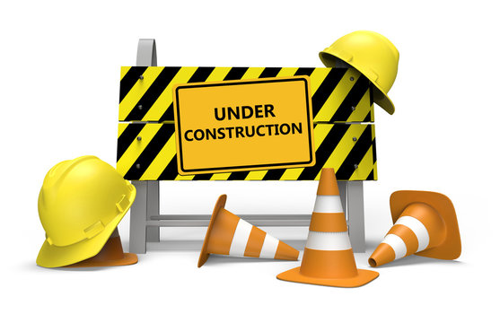

# Integrated Systems Architecture
This is a fourth-year course in the Electronics and Communication Engineering degree that we offer at UCM. You can see the contents of this course at [Integrated Systems Architecture UCM](https://fisicas.ucm.es/data/cont/docs/18-2021-09-01-2021-22%20Gu%C3%ADa%20Docente%20GIEC%20v1.1-157-16091.pdf). 

  

