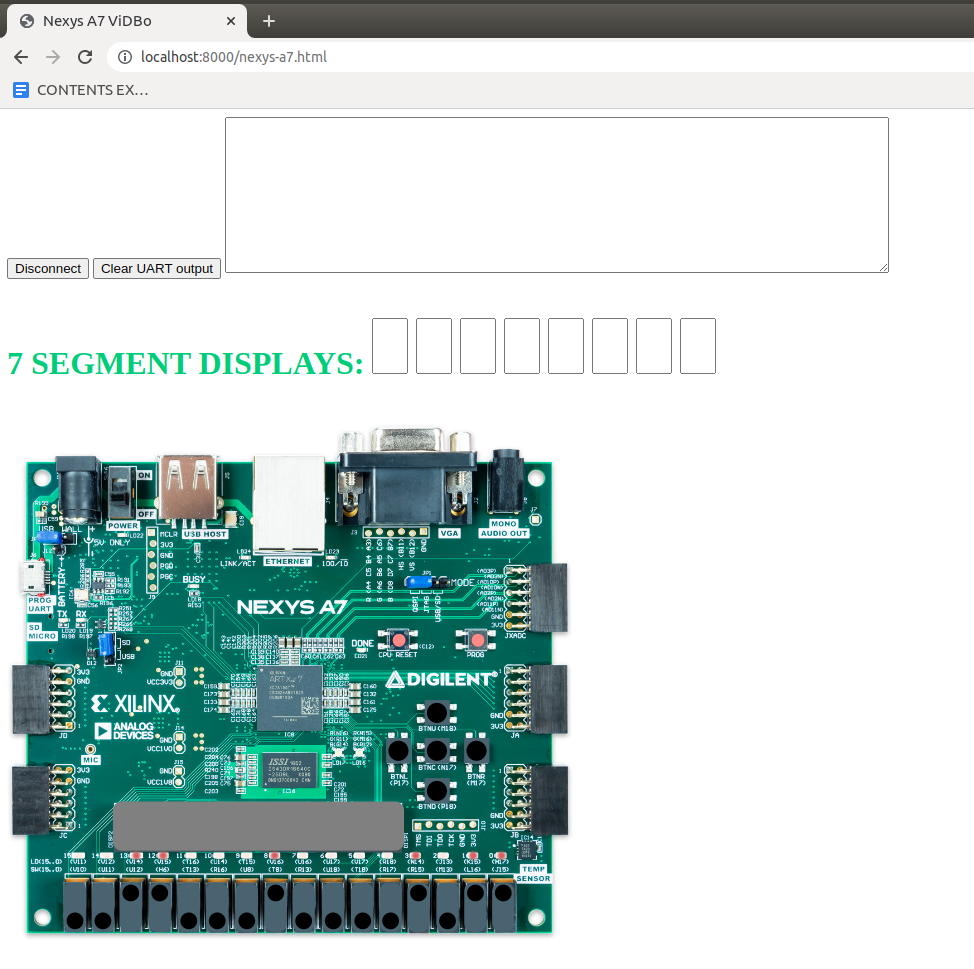
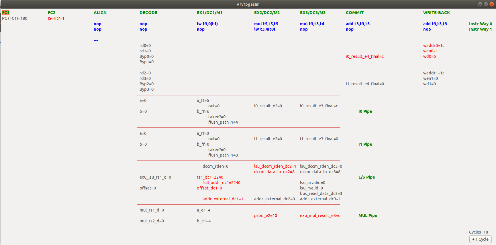

# RVfpga
We provide two new simulation tools that can be used in conjunction with the [“RVfpga: Understanding Computer Architecture”](https://university.imgtec.com/rvfpga-el2-v3-0-english-downloads-page/) course provided by Imagination Technologies.

+ RVfpga_ViDBo: It performs a Verilator-based simulation of the RVfpga System and connects it with a Nexys A7 simulated board based on [ViDBo](https://github.com/olofk/vidbo) that allows you to communicate with some simulated peripherals on the board (at this moment the following peripherals are supported: 16 switches, 16 LEDs, UART, 5 pushbuttons, 8 7-Segment Displays). This new simulation tool is especially useful for RVfpga labs 6-10.

  

+ RVfpga_PipelineSimulator: It performs a Verilator-based simulation of the RVfpga System that allows you to visualize different signals of the SweRV EH1 pipeline. This new simulation tool is especially useful for RVfpga labs 11-20.

  

Binary beta versions of the two simulators are provided as a release in this repository. We include both Windows and Ubuntu versions.

In folders RVfpga_ViDBo and RVfpga_PipelineSimulator you can find detailed instructions on how to run each simulator in your own OS (either Ubuntu or Windows) as well as useful example videos. The example programs that are tested in the simulators are also included, both with a source file and a .vh file. We also explain how to simulate other programs. Finally, we also include the sources of the two simulators as well as instructions on how to compile them.
