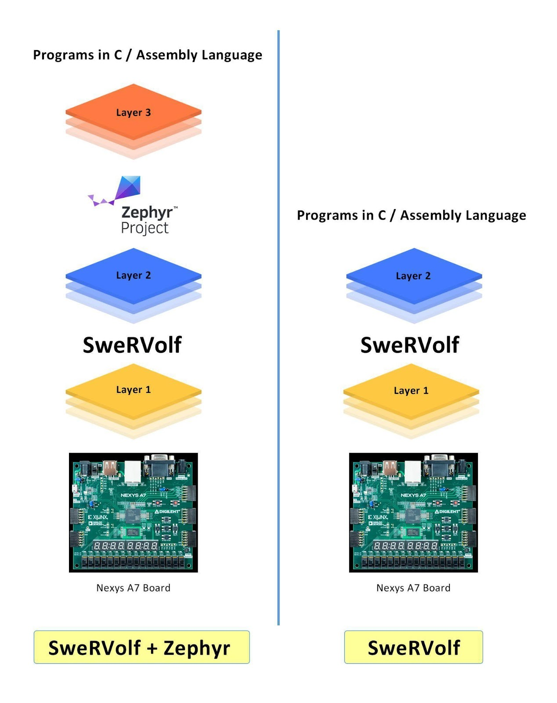
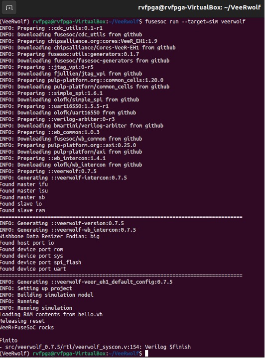
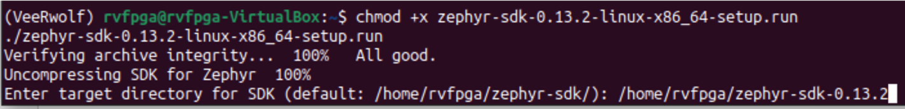
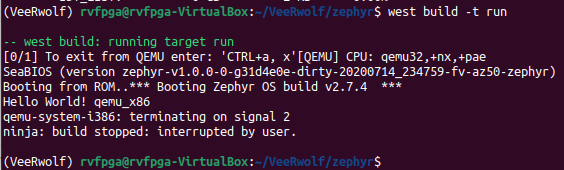
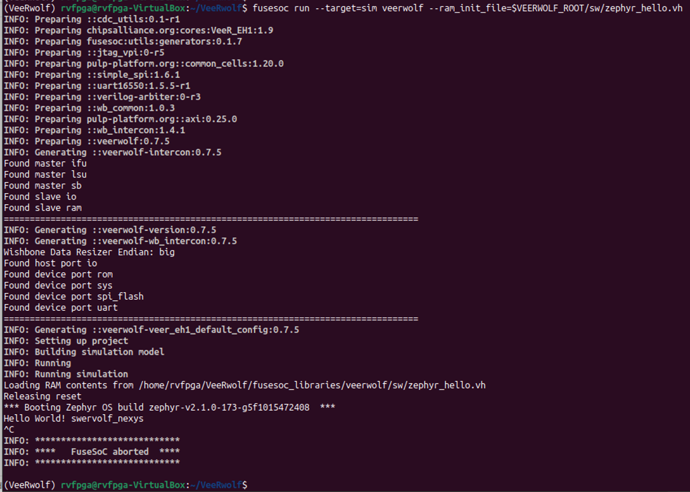
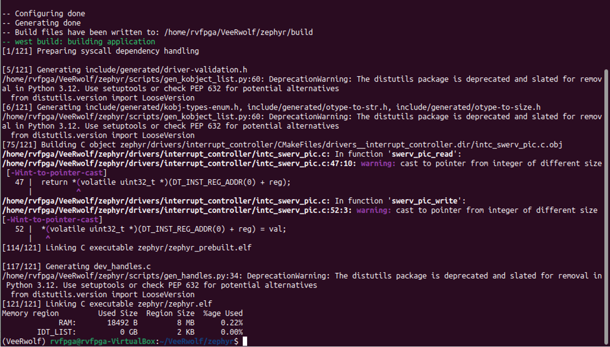
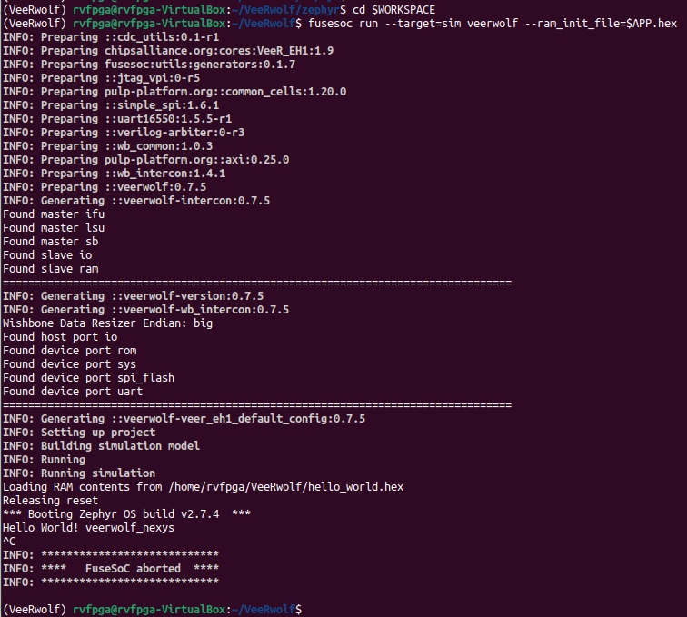
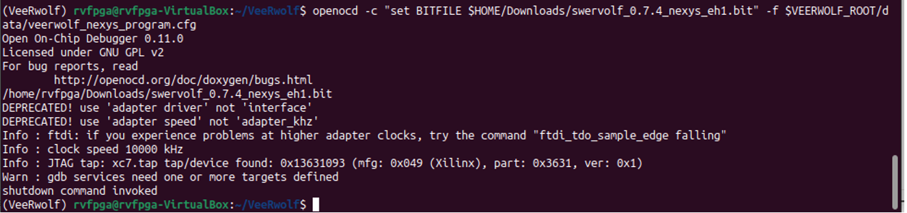
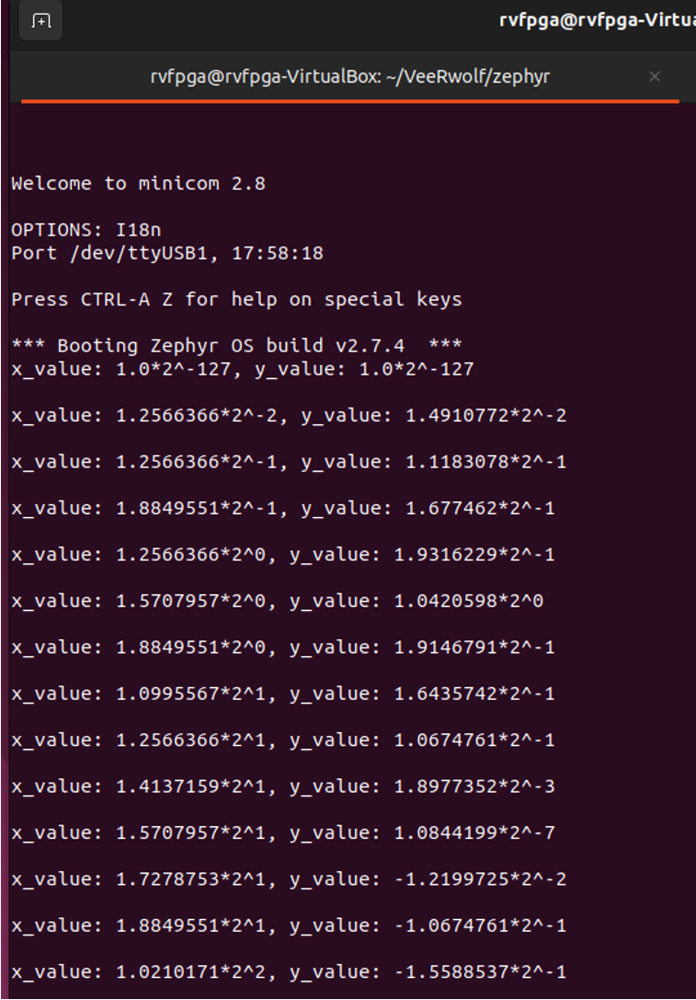

# Running Zephyr on VeeRwolf

## 1. Introduction

In this Lab, we show how to run the Zephyr real-time operating system (RTOS) on the original VeeRwolf (https://github.com/chipsalliance/VeeRwolf), the SoC used in the RVfpga course. A real-time operating system (RTOS) is an operating system intended to serve real-time applications that process data as it comes in, mostly without buffer delay. In practical applications, an SoC will almost always be running an operating system, and applications will be running on top of the operating system.

Two overall categories of operating systems for embedded systems exist: embedded Linux-based operating systems and real-time operating systems (RTOS). When an SoC is designed with a particular CPU, the design is usually tuned to use one or the other type of operating system. VeeRwolf was built with the intention of running a real-time operating system. The VeeR EH1 CPU does not have a memory management unit and would, thus, struggle to run embedded Linux.

Figure 1 shows an illustration of the different hardware/software layers in the overall system. The figure appears to be outdated, as it references the old SweRVolf name for the SoC instead of the updated VeeRwolf designation; updating this to reflect the new VeeRwolf name would make the figure consistent with the latest terminology.



**Figure 1. Layers on the top of FPGA Boards**

The Zephyr Project ([http://docs.zephyrproject.org](http://docs.zephyrproject.org/)) is a scalable real-time operating system supporting multiple hardware architectures, optimized for resource-constrained devices, and built with security in mind. The Zephyr OS is based on a small-footprint kernel designed for use on resource-constrained systems: from simple embedded environmental sensors and LED wearables to sophisticated smart watches and IoT wireless gateways.

Zephyr offers a high number of familiar services for development: Multi-threading, Interrupts, Memory Allocation, Inter-thread Synchronization, Inter-thread Data Passing, and Power Management. Zephyr supports a wide variety of boards with different CPU architectures and developer tools. Contributors have added support for an increasing number of SoCs, platforms, and drivers. The Zephyr kernel supports multiple architectures, including RISC-V (32- and 64-bit).

In this lab, we first show how to add Zephyr to our Workspace. Then we will build the code for a few sample examples that come with Zephyr.

## 2. VeeRwolf: Installation and Test

Instead of using the RVfpga SoC as before, we now utilize the baseline FuseSoC-based VeeRwolf SoC. Its source code and documentation are available on the following GitHub repository: https://github.com/chipsalliance/VeeRwolf.

**TASK:** Take a close look at the documentation available in the webpage mentioned above and compare the VeeRwolf SoC with the RVfpga SoC used in the previous labs.

We next show the steps to download, install and test VeeRwolf in the Ubuntu 22.04 Virtual Machine.

1. Launch the Virtual Machine and open a terminal.

2. Create a new directory for the SoC

   ```sh
   cd /home/rvfpga
   mkdir VeeRwolf
   cd VeeRwolf/
   ```

3. Run the following commands to create and activate a virtual environment in Python, isolating dependencies and making the environment's Python interpreter and package manager the default for the session.  

   ```sh
   python3 -m venv .
   source bin/activate
   ```
   *Remember:* You’ll need to activate this environment each time you want to work with *Zephyr* or *fusesoc* by using the following commands (unless it is already activated):
   ```sh
   cd /home/rvfpga/VeeRwolf
   source bin/activate
   ```

4. Download the VeeRwolf SoC.

   ```sh
   pip install fusesoc==2.4.2
   fusesoc library add fusesoc-cores https://github.com/fusesoc/fusesoc-cores
   export WORKSPACE=$(pwd)
   fusesoc library add veerwolf https://github.com/chipsalliance/VeeRwolf
   export VEERWOLF_ROOT=$WORKSPACE/fusesoc_libraries/veerwolf
   ```

5. Add the environment variables permanently to your system. For that purpose, add at the end of the `~/.bashrc` file the following lines:

   ```sh
   export WORKSPACE=/home/rvfpga/VeeRwolf
   export VEERWOLF_ROOT=$WORKSPACE/fusesoc_libraries/veerwolf
   ```

6. Test a program running on the VeeRwolf SoC with a Verilator simulation:

   ```sh
   fusesoc run --target=sim veerwolf
   ```

   If everything went smoothly, you should see the output shown in the next figure.

   

   **Figure 2. Simulation of VeeRwolf**

## 3. Zephyr: Installation and Test

In this section we will install the Zephyr RTOS in the Virtual Machine and then we’ll test it on simulation.

**TASK:** Take a close look at the documentation available at: [http://docs.zephyrproject.org](http://docs.zephyrproject.org/).

We next show the steps to download and install Zephyr and the Zephyr SDK 0.13.2 on the Virtual Machine, and then to test Zephyr.

1. Install Zephyr:

   ```sh
   cd /home/rvfpga/VeeRwolf 
   sudo apt update 
   sudo apt install cmake
   sudo apt install ninja-build
   pip install west
   west init
   west config manifest.path fusesoc_libraries/veerwolf
   west update
   west zephyr-export
   pip install -r zephyr/scripts/requirements.txt
   ```

2. Install the Zephyr SDK 0.13.2 in your home directory:

   ```sh
   cd /home/rvfpga
   wget https://github.com/zephyrproject-rtos/sdk-ng/releases/download/v0.13.2/zephyr-sdk-0.13.2-linux-x86_64-setup.run
   chmod +x zephyr-sdk-0.13.2-linux-x86_64-setup.run
   ./zephyr-sdk-0.13.2-linux-x86_64-setup.run
   ```

   When asked about the directory where the SDK must be installed, select `/home/rvfpga/zephyr-sdk-0.13.2` as shown in the following figure:

   

   Finally, run the following command: 

   ```sh
   export ZEPHYR_SDK_INSTALL_DIR=$HOME/zephyr-sdk-0.13.2
   ```

   As in the previous section, you should add this line at the end of the `~/.bashrc` file to make it permanent.

3. Test Zephyr with qemu_x86:

   ```sh
   cd /home/rvfpga/VeeRwolf/zephyr
   west build -p always -b qemu_x86 samples/hello_world
   west build -t run
   ```

   If everything went smoothly, after the last command you should see the output shown in the next figure (note that you must stop execution with: ^C).

   

   **Figure 3. Test Zephyr with qemu_x86**

4. Test a precompiled Zephyr HelloWorld program on simulation:

   ```sh
   cd /home/rvfpga/VeeRwolf
   fusesoc run --target=sim veerwolf --ram_init_file=$VEERWOLF_ROOT/sw/zephyr_hello.vh
   ```

   If everything went smoothly, you should see the output shown in the next figure (note that you must stop execution with: ^C).

   

   **Figure 4. Result of simulation**

**TASK:** Following the same procedure as in item 4, analyse the precompiled Zephyr Philosophers program on simulation. In this case, you must use the following command: 

   ```sh
   fusesoc run --run --target=sim veerwolf --ram_init_file=$VEERWOLF_ROOT/sw/zephyr_philosophers.vh
   ```

## 4. Zephyr: Compile new applications and test in simulation and on the board

In this section we show how to create new applications with Zephyr and run them in simulation and on the FPGA board (in case you have it).

1. Compile the Zephyr HelloWorld application:

   ```sh
   cd $WORKSPACE/zephyr
   west build -p always -b veerwolf_nexys samples/hello_world
   ```

   If everything went smoothly, you should see the output shown in the next figure.

   

   **Figure 5. Compilation of Zephyr HelloWorld application**

2. Convert to hex and run the Zephyr HelloWorld application in a Verilator simulation:

   ```sh
   cd $WORKSPACE/zephyr
   export APP=hello_world
   python3 $VEERWOLF_ROOT/sw/makehex.py build/zephyr/zephyr.bin > $WORKSPACE/$APP.hex
   cd $WORKSPACE
   fusesoc run --target=sim veerwolf --ram_init_file=$APP.hex
   ```

   If everything went smoothly, you should see the output shown in the next figure (note that you must stop execution with: ^C).

   

   **Figure 6. Simulation of Zephyr HelloWorld application**

3. Compile and run the Zephyr Blinky application on the FPGA board:

   **TASK:** Analyze the Zephyr Blinky program provided at `$WORKSPACE/zephyr/samples/basic/blinky/src/main.c` and then compile it as in step 1.

   After compiling the Blinky application, execute it on the Nexys A7 FPGA board, in case you have it, following the next steps:

   *i) Connect the board to the VM and download the VeeRwolf bitstream:*

   ```sh
   cd $WORKSPACE
   wget https://github.com/chipsalliance/VeeRwolf/releases/download/v0.7.4/swervolf_0.7.4_nexys_eh1.bit
   sudo apt install openocd
   openocd -c "set BITFILE $WORKSPACE/swervolf_0.7.4_nexys_eh1.bit" \
   -f $VEERWOLF_ROOT/data/veerwolf_nexys_program.cfg
   ```

   If everything went smoothly, you should see the output shown in the next figure and you will see the DONE LED on the board switch on after a few seconds.

   

   **Figure 7. Download the bitstream to the FPGA board.**

   *ii) Load the Zephyr Blinky program on the board:*

   The OpenOCD version installed by default does not support all commands included in the .cfg file that you will use in the next steps. So, before proceeding, comment line 25 (riscv set_mem_access abstract) of the following file: 

   ```sh
   /home/rvfpga/VeeRwolf/fusesoc_libraries/veerwolf/data/veerwolf_nexys_debug.cfg
   ```

   Then, run the following commands:

   ```sh
   cd $WORKSPACE
   openocd -f $VEERWOLF_ROOT/data/veerwolf_nexys_debug.cfg \
   -c "reset halt" \
   -c "load_image $WORKSPACE/zephyr/build/zephyr/zephyr.elf 0x0 elf" \
   -c "resume 0x0" \
   -c shutdown
   ```

   If everything went smoothly, you should see the right-most LED on the board blinking with a frequency of around 1 second.

   **TASK:** Analyze and run other examples provided at: `$WORKSPACE/zephyr/samples/` in particular: `synchronization`, `philosophers`, and most of the examples in the following folders `posix/*`, `subsys/console*`.

## 5. TensorFlow Lite for Microcontrollers in Zephyr

This section demonstrates how to use TensorFlow Lite for Microcontrollers in Zephyr. For more information see reference documentation [here](https://docs.zephyrproject.org/latest/samples/modules/tflite-micro/hello_world/README.html#tflite-hello-world).

- This sample TensorFlow application replicates a sine wave and demonstrates the absolute basics of using TensorFlow Lite Micro.
- The model included with the sample is trained to replicate a sine function and generates x values to print alongside the y values predicted by the model. The x values iterate from 0 to an approximation of 2π.
- The sample also includes a full end-to-end workflow of training a model and converting it for use with TensorFlow Lite Micro for running inference on a microcontroller.
- The sample comes in two flavors. One with TensorFlow Lite Micro reference kernels and one with CMSIS-NN optimized kernels.

We are going to show how to build it and run it on the Nexys A7 board, but it can also be simulated using Verilator as seen previously.

Follow the next steps to build the program that we will run:

1. If you are not yet in the virtual environment in Python, run the following commands:

   ```sh
   cd /home/rvfpga/VeeRwolf
   python3 -m venv .
   source bin/activate
   ```

2. Set the environment variables:

   ```sh
   export WORKSPACE=$(pwd)
   export VEERWOLF_ROOT=$WORKSPACE/fusesoc_libraries/veerwolf
   export ZEPHYR_SDK_INSTALL_DIR=$HOME/zephyr-sdk-0.13.2
   export BUILD_DIR=$WORKSPACE/zephyr/build
   ```

3. Add the tflite-micro module to your West manifest and pull it:

   ```sh
   cd zephyr
   west config manifest.project-filter -- +tflite-micro
   west update
   ```

4. Build using West:

   ```sh
   west build -p always -b veerwolf_nexys samples/modules/tflite-micro/hello_world
   ```

Follow the next steps to run the program on the FPGA:

1. Program the FPGA board:

   ```sh
   openocd -c "set BITFILE $WORKSPACE/swervolf_0.7.4_nexys_eh1.bit" \
   -f $VEERWOLF_ROOT/data/veerwolf_nexys_program.cfg
   ```

2. Open a serial port in another terminal:

   ```sh
   sudo apt install minicom
   minicom -D /dev/ttyUSB1
   ```

3. Run the program on the board:

   ```sh
   openocd -f $VEERWOLF_ROOT/data/veerwolf_nexys_debug.cfg \
   -c "reset halt" \
   -c "load_image $BUILD_DIR/zephyr/zephyr.elf 0x0 elf" \
   -c "resume 0x0" -c shutdown
   ```

   If everything goes well, you will obtain the following output:

   

The folder `samples/modules/tflite-micro/hello_world` contains information on how to train the model. For reference information please see official TFLite repo example [here](https://github.com/tensorflow/tflite-micro/tree/main/tensorflow/lite/micro/examples/hello_world) and [Google's documentation](https://ai.google.dev/edge/litert/microcontrollers/overview).
