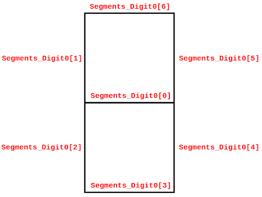

# Module 2 - Low-Level Input/Output in the RVfpga SoC

## Previous work to complete between May 25 and 28:

<!--
1. Understand in detail the 8-Digit 7-Segment-Displays Verilog controller implemented in file */home/rvfpga/RVfpga_MasterUCLM/src/SweRVolfSoC/Peripherals/SystemController/swervolf_syscon.sv*. Use a simulation in RVfpga-Trace to help you understand the module. Note that the scanning frequency of the displays controller in the baseline SoC is prepared for running on the board, so we must significantly decrease its period to work in simulation. Follow these steps to run a simulation in RVfpga-Trace:

    * Download the following project, which writes the value 1-3-5-7-2-4-6-8 in the 8-digit 7-Segment displays, and move it to the home of the Virtual Machine: [Project_RVfpgaTrace_7SegDisplays](https://drive.google.com/file/d/1WIYOgUAcneO_M4VfKQ0ZhYQ7s_tyD-tS/view?usp=sharing).
    * Note that the project includes a new version of the RVfpga-Trace simulator, provided inside the project itself (file ```Vrvfpgasim```), in which the scanning frequency of the displays controller has been significantly reduced.
    * This is the RVfpga-Trace simulation that you should obtain, using the signals included in the ```test.tcl``` provided file. 

      

    * Later, when you need to regenerate the binary of the simulator to debug your changes in *Exercise-1_InputOutput_LowLevel*, you can follow the instructions provided in Chapter 7 of the Getting Started Guide of the complete RVfpga package (document ```RVfpgaEH1/RVfpga/Documents/RVfpga_GettingStartedGuide.pdf```). Specifically, in the Virtual Machine:

        * Go into ```/home/rvfpga/RVfpga_MasterUCLM/src``` and perform the changes you consider to the 7-Segment displays controller.
        * In a terminal, go into ```/home/rvfpga/RVfpga_MasterUCLM/verilatorSIM_Trace``` and regenerate the simulator binary by typing ```make```. Remember to decrease the scanning frequency of the displays controller.
        * Using the new binary (```/home/rvfpga/RVfpga_MasterUCLM/verilatorSIM_Trace/Vrvfpgasim```), run the project provided above in this item to debug your implementation.

2. In case you need it, you can find more theoretical details about the RVfpga I/O System in Labs 6 to 10 of the full package.

3. Install Vivado in your computer. To install Vivado in Windows, follow these instructions (in the GSG of the RVfpga course you can find more detailed instructions):
  * Go into the [Vivado Download Website](https://www.xilinx.com/support/download/index.html/content/xilinx/en/downloadNav/vivado-design-tools/archive.html). You will be asked to log in to your Xilinx account before you can download the installer; if you don’t already have an account, you will need to create one.
  * Select the Vivado version that you wish to download (we recommend version 2022.2, but version 2019.2 is also verified for RVfpga and more modern versions should also work). For example, in Windows, click on *Xilinx Unified Installer 2022.2: Windows Self Extracting Web Installer*.
  * The Vivado installer will walk you through the installation process. Important notes:
    * Select *Vivado* as the Product to install.
    * Select version *Vivado ML Standard* (not *Vivado ML Enterprise*), as this is the no-cost version.
    * Set all the I Agree boxes.
    * Otherwise, defaults should be selected.
    * When you are creating a Vivado project, at the point where you must select the board (in our case Nexys A7 or Nexys 4 DDR), you first need to click on the *Refresh* button to add these boards. If this does not work, you can also manually install the Board Files:
      * Download the archive [vivado-boards](https://github.com/Digilent/vivado-boards/archive/master.zip?_ga=2.158467251.828100773.1587959567-2022567073.1577108610) and extract it.
      * Open the folder extracted from the archive and navigate to its ```new/board_files``` directory. Select this directory and copy it.
      * Open the folder that Vivado was installed in your system. Under this folder, navigate to its ```<version>/data/boards``` directory, then paste the ```board_files``` into this directory.


---


## To complete on May 29:

<!--
## Exercise 1 (Mandatory)
The current 8-digit 7-segment displays controller (implemented in module ```SevSegDisplays_Controller```), can only show the 16 hexadecimal digits. Modify the 8-digit 7-segment displays controller so that it can show any combination of ON/OFF LEDs. 

Note that you only need to make changes in file ```/home/rvfpga/RVfpga_MasterUCLM/src/SweRVolfSoC/Peripherals/SystemController/swervolf_syscon.sv```. Specifically, within that file, you must modify the module that handles the 7-segment displays device (```SevSegDisplays_Controller```).

+ You can use as a baseline this [file](https://drive.google.com/file/d/19QDLbpinb2exxjfZP2S4pQ8HS-l7iQGT/view?usp=drive_link), which is already partially completed. In that file, look for comment ```/* COMPLETE THE CODE WITH THE NEW FUNCTIONALITY */``` and implement the new controller at that point of the code.

+ Instead of an ```Enables_Reg``` and a ```Digits_Reg```, the new controller needs eight 7-bit registers: ```Segments_Digit0 – Segments_Digit7```. Each of these 8 registers is associated with each of the eight 7-segment displays. These new registers are already included in the file provided in the previous item.

+ In each of these registers, each bit indicates if the corresponding segment is ON (0) or OFF (1). Specifically, for register ```Segments_Digit0``` (the same applies to the other seven registers), connections are as follows:

<p align="center">
  
</p>

+ So, for example:
  * If all the bits of the first register (```Segments_Digit0```) are 0, all segments in the rightmost digit will be ```ON```.
  * If all the bits of the first register (```Segments_Digit0```) are 1, all segments of the rightmost digit will be ```OFF```.
  * If all bits of the eighth register (```Segments_Digit7```) are 0 except ```Segments_Digit7[6]``` and ```Segments_Digit7[3]```, an ```H``` will be shown on the leftmost digit. 

+ Given that each of the eight registers only has 7 bits, we can map them to the same address range that we used before (```0x80001038``` and ```0x8000103C```); specifically:
  * ```Segments_Digit0 → Address 0x80001038```
  * ```Segments_Digit1 → Address 0x80001039```
  * ```Segments_Digit2 → Address 0x8000103A```
  * ```Segments_Digit3 → Address 0x8000103B```
  * ```Segments_Digit4 → Address 0x8000103C```
  * ```Segments_Digit5 → Address 0x8000103D```
  * ```Segments_Digit6 → Address 0x8000103E```
  * ```Segments_Digit7 → Address 0x8000103F```

+ Note that we do not need the 4-7 decoder anymore (module ```SevenSegDecoder```), as the information provided by the program is already decoded.

+ The outputs of the controller are the same as before:
  * The 8-bit ```AN``` output from the controller connects with ```AN0 … AN7```.
  * The 7-bit ```Digits_Bits``` output from the controller connects with ```CA … CG``` (```DP``` is left unconnected on the board).

Once you’ve made and checked all the changes in the ```SevSegDisplays_Controller``` module, you will test the modified version in the RVfpga-ViDBo simulator or on the FPGA board (if you have it). Follow the next steps:

#### RVfpga-Nexys (FPGA board)
+ Replace the following file: ```/home/rvfpga/RVfpga_MasterUCLM/src/SweRVolfSoC/Peripherals/SystemController/swervolf_syscon.sv``` for the modified one.

+ Generate a new bitstream in Vivado following the instructions of the next document: [RVfpga-Lab5](https://drive.google.com/file/d/13-Ddob_eq9GVMZcJfMHKvY5x9aaYKvlJ/view?usp=sharing). Note that, in Step 4 (*Select Nexys A7 as target board*), you may need to ```Refresh``` the catalogue for the Nexys A7 board to appear, and then ```Install``` it.
  

#### RVfpga-ViDBo
+ Replace the following file: ```/home/rvfpga/RVfpga_MasterUCLM/src/SweRVolfSoC/Peripherals/SystemController/swervolf_syscon.sv``` for the modified one with the new functionality explained above.

<!--
+ Download file [exu.sv](https://drive.google.com/file/d/1z-vSw92ARXCYgOxQ3lMxxfRTMfvy3MeD/view?usp=drive_link) and file [lsu_lsc_ctl.sv](https://drive.google.com/file/d/1dfDoiMu9vO7qPI3UR9hErW_D5zCqnIZX/view?usp=drive_link) and replace them in your SoC:

```
    cp /home/rvfpga/Downloads/exu.sv /home/rvfpga/RVfpga_MasterUCLM/src/SweRVolfSoC/SweRVEh1CoreComplex/exu
    cp /home/rvfpga/Downloads/lsu_lsc_ctl.sv /home/rvfpga/RVfpga_MasterUCLM/src/SweRVolfSoC/SweRVEh1CoreComplex/lsu
```
-->

+ Open a terminal and go into directory ```/home/rvfpga/RVfpga_MasterUCLM/verilatorSIM_ViDBo```.

+ Type the following commands to compile the simulator (note that the recompilation will use the modified swervolf_syscon.sv file):

```
    make clean
    make -j
```

+ When compilation ends, the simulator binary should have been created at: ```/home/rvfpga/RVfpga_MasterUCLM/verilatorSIM_ViDBo/Vrvfpgasim```


## Exercise 2 (Mandatory)
Use the extended SoC for printing the following message on the 8-digit 7-segment displays of the RVfpga-ViDBo simulator or the FPGA board: 

<p align="center">
  
</p>

You can use as a baseline, for example, the PlatformIO project provided at: ```/home/rvfpga/RVfpga_MasterUCLM/Projects/71_7SegDispl_C-Lang```. Then, depending on the tool you are using, follow the next steps:

#### RVfpga-Nexys (FPGA board)
+ In order to use the new bitstream created in the previous exercise, you must update the path set for ```board_build.bitstream_file``` in file ```platformio.ini``` to the new bitstream generated by Vivado in the previous exercise.

+ Then, follow the usual steps to run a program on RVfpga-Nexys.

#### RVfpga-ViDBo
+ In order to use the new simulator created in the previous exercise, you must update the path set for ```board_debug.verilator.binary``` in file ```platformio.ini``` to: 
```/home/rvfpga/RVfpga_MasterUCLM/verilatorSIM_ViDBo/Vrvfpgasim```.

+ Then, follow the usual steps to run a program in RVfpga-ViDBo.

+ NOTE: The virtual board simulates the same behavior for the 7-segment displays available on the board, thus it receives the same inputs from the SoC: signals ```AN[7:0]``` and ```CA-CG```. However, there are some things that you must take into account when using RVfpga-ViDBo:

    * A space can be shown by simply setting the 7 segments of a digit off.

    * The physical board supports any combination of LEDs in the 7-segment displays. However, the virtual board only supports the hexadecimal digits plus the following characters (any other 7-segment display combination generated by the controller will show an off digit):

<p align="center">
  
</p>


## Other Exercises (Optional)
You can continue practicing after completing the previous exercises. You can find more exercises at [RVfpga](https://university.imgtec.com/rvfpga-el2-v3-0-english-downloads-page/) labs 5 to 10. For example, you can try to complete the following exercises (the programs must be developed for VeeR EH1, but in this case we refer to the VeeR EL2 documentation, as it is more up-to-date and the instructions are identical for both cores):
   * Exercises 2 and 3 of ```RVfpga/RVfpgaEL2/RVfpga_NexysA7-DDR/Labs/Lab06/RVfpga_Lab06_VeeR-EL2_NexysA7-DDR.pdf```, which extend the SoC with support to communicate with the buttons included in the Nexys A7 board.
   * Exercises 2 and 3 of ```RVfpga/RVfpgaEL2/RVfpga_NexysA7-DDR/Labs/Lab08/RVfpga_Lab08_VeeR-EL2_NexysA7-DDR.pdf```, which work with the PTC and specifically use the PWM tri-color LED included in the Nexys A7 board.
   * Exercises 2 and 3 of ```RVfpga/RVfpgaEL2/RVfpga_NexysA7-DDR/Labs/Lab09/RVfpga_Lab09_VeeR-EL2_NexysA7-DDR.pdf```.

-->
