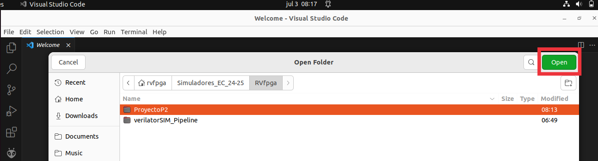
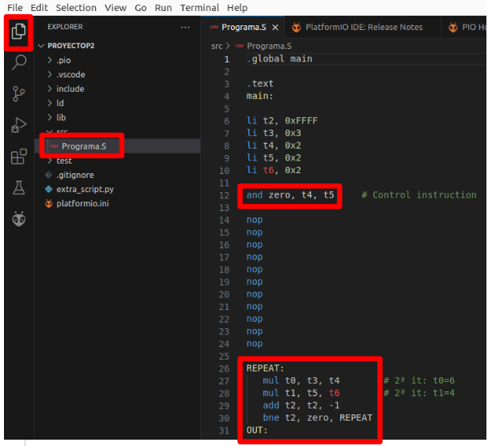
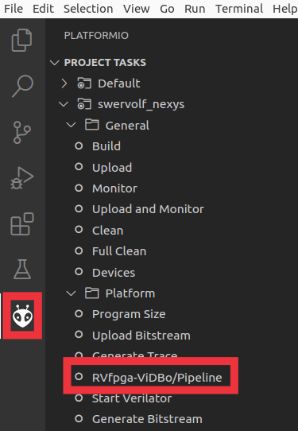
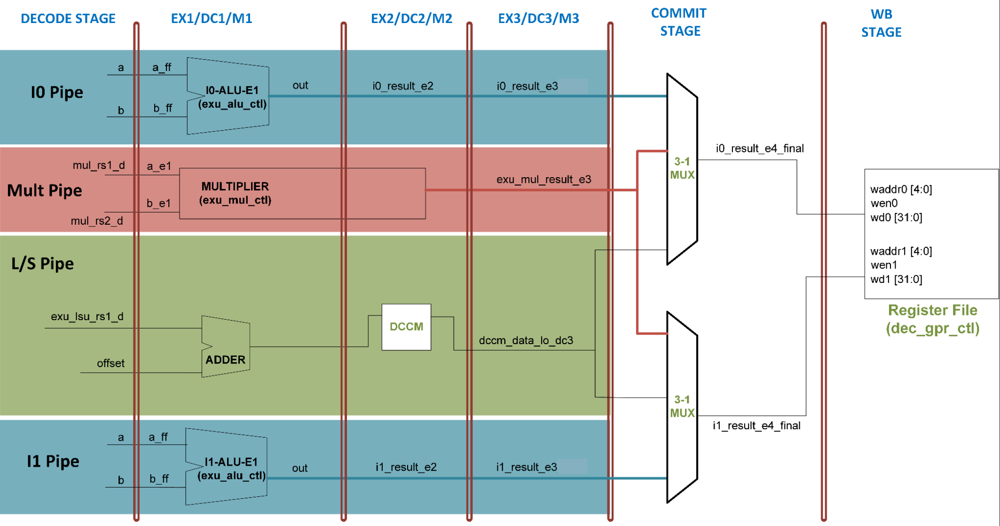
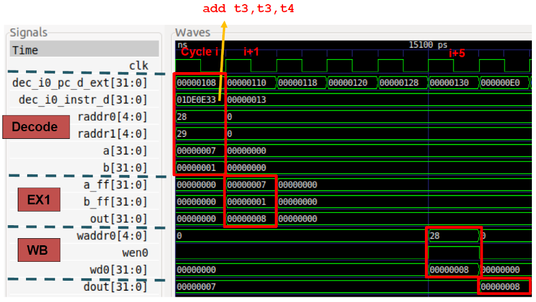
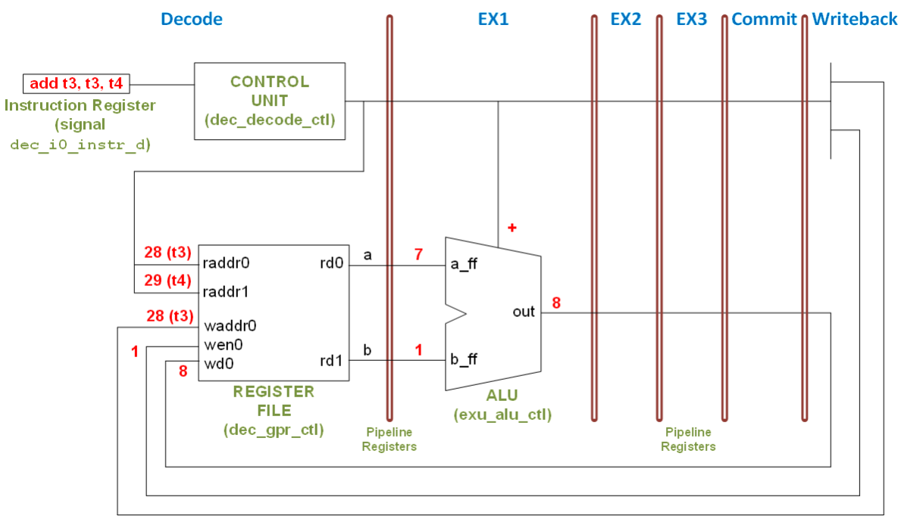

## General Contents

In this module, students will explore the internal microarchitecture of the VeeR EH1 (and EL2 in less detail) RISC-V processor. The activities focus on understanding pipelined execution, superscalar architectures, performance evaluation, and memory hierarchy concepts.

Students will analyze instruction execution using RVfpga visualization and tracing tools, evaluate processor performance through hardware counters and benchmarks, and study how architectural features such as branch prediction, caches, and custom instructions affect performance. The module also includes practical exercises extending the processor with floating-point hardware support and comparing hardware versus software execution of floating-point algorithms.

---

## Previous work to complete between June 1 and 11:

### 1. Review of the simple 5-stages pipelined processor:

   * You can look at Chapter 7 (Microarchitecture) of the [H&H book](https://www.amazon.es/Digital-Design-Computer-Architecture-RISC-V/dp/0128200642), which explains the basic concepts of different RISCV-based processor implementations.
   * Look at the following slides, which describe the processor from the previous textbook: [Module7_FC2-Spanish](https://www.fdi.ucm.es/profesor/mendias/FC2/FC2tema7-imprimible.pdf) or [Module7_FC2-English](https://www.fdi.ucm.es/profesor/mendias/FC2/FC2module7.pdf).

### 2. Watch this video, which describes the VeeR EH1 microarchitecture in detail: 

[VeeReh1Video](https://youtu.be/xVnB6OM00cE?si=0HW333O-oPOXUDZG) (the video is in Spanish, but you can watch an AI-translated-to-English version of the video here [VeeReh1EnglishVideo](https://www.youtube.com/watch?v=Ow_0l47xqV4)). Take into account that the RVfpga-Pipeline simulator used in the video is an older version than the one you will use in this course. You can download the slides used in the video [here](https://drive.google.com/file/d/1rSlwCzcHD4F_S4YFLCFn3L0VNXH_sv7L/view?usp=drive_link).


### 3. Perform the following guided example and solved exercise, which analyze the VeeR EH1 microarchitecture described in the previous item using the RVfpga-Pipeline simulator:

   #### 3.1 Guided Example - Use of RVfpga-Pipeline

   1. Open VSCode and load the project folder located at `/home/rvfpga/RVfpga_MasterUCLM/Projects/ProyectoP2`. To do this, go to `File → Open Folder`, navigate to `/home/rvfpga/RVfpga_MasterUCLM/Projects`, select the `Project_RVfpgaPipeline` directory, and click `Open`.

   <p align="center">
     
   </p>

   2. In VSCode, open the editor to view the assembly source code of the project. The file is named `Programa.S` and is located inside the `src` directory of the project.

   <p align="center">
     
   </p>

   3. Open the `platformio.ini` file and update the path to the RVfpga-Pipeline simulator as follows:

   ```ini
   board_debug.verilator.binary = /home/rvfpga/RVfpga_MasterUCLM/verilatorSIM_Pipeline/OriginalBinaries/RVfpga-Pipeline_Ubuntu
   ```

   4. Open the PlatformIO tab in VSCode and click on the task `RVfpga-ViDBo/Pipeline`. The simulator will then start executing the program.

   <p align="center">
     
   </p>

   5. The simulator stops when the instruction `and zero, t4, t5` reaches the Decode stage. This instruction is simply used as a breakpoint. Continue the execution cycle by cycle using the `+1 Cycle` button and observe how instructions flow through the VeeR EH1 pipeline.

   <p align="center">
     
   </p>

   6. The following figure shows a simplified version of the VeeR EH1 microarchitecture, useful for understanding the simulator signals.

   <p align="center">
     
   </p>

   7. In most cases, the analyzed code is located inside a loop. It is important to analyze iterations after the first or second one because structures such as the branch predictor or the instruction cache are not yet trained during the first executions.

   The following figure shows the simulator while instructions from the third, fourth, and fifth iterations are being executed:

   <p align="center">
     
   </p>

   8. Analyze the previous figure:

   - **WRITE-BACK stage**
     - *Way-0*: Instruction `mul t0, t3, t4` (3rd iteration) writes its result to the Register File.
     - *Way-1*: Due to a structural hazard between consecutive `mul` instructions, a bubble is inserted.

   - **COMMIT stage**
     - *Way-0*: Instruction `mul t1, t5, t6` propagates the multiplication result.
     - *Way-1*: Instruction `addi t2, t2, -1` propagates the updated loop counter.

   - **EX3/DC3/M3 stage**
     - *Way-0*: Instruction `bne t2, zero, REPEAT`.
     - *Way-1*: Instruction `mul t0, t3, t4` computes the multiplication result.

   - **EX2/DC2/M2 stage**
     - *Way-0*: Instruction `mul t1, t5, t6`.
     - *Way-1*: Instruction `addi t2, t2, -1`.

   - **EX1/DC1/M1 stage**
     - *Way-0*: Instruction `bne t2, zero, REPEAT`.
     - *Way-1*: Instruction `mul t0, t3, t4`.

   - **DECODE stage**
     - *Way-0*: Instruction `mul t1, t5, t6`.
     - *Way-1*: Instruction `addi t2, t2, -1`.

<br>

   9. To stop the simulator, simply close the simulation window.

<br>

   #### 3.2 Exercise 4 - Guided Exercise in RVfpga-Pipeline

   This exercise is provided together with its solution and is intended to help students understand how to solve this type of exercise. Students should replicate the process and make sure they understand every step.

   The following video shows the demo presented in the Computer Organization class on how to solve this exercise: [Exercise4Demo](https://youtu.be/hqxG4cUnDfs).

   Consider the RISC-V VeeR EH1 processor. The processor has all configurable features enabled (pipelined execution, superscalar execution, Gshare branch predictor, etc.), except for the Secondary ALU.

   The following program is executed on this processor:

   ```assembly
   .globl main

   .section .midccm
   D: .space 16

   .text
   main:

   li t2, 0x080
   csrrs t1, 0x7F9, t2

   la t0, D

   li t1, 0x2
   sw t1, (t0)

   li t1, 0x4
   sw t1, 4(t0)

   li t1, 0x3
   sw t1, 8(t0)

   li t1, 0x5
   sw t1, 12(t0)

   li s1, 4
   mv s2, zero

   and zero,t4,t5

   for:
      slli t3 ,s2 ,2
      add t2 ,t0 ,t3
      lw s3 , 0(t2)
      lw s4 , 4(t2)
      add s3 ,s3 ,s4
      sw s3 , 0(t2)
      addi s2 ,s2 ,1
      bne s2,s1,for
   end:

   REPEAT:
      beq zero, zero, REPEAT
   ```

   #### a. Draw the pipeline diagram for the third iteration of the loop.

   The following figures show different moments during the execution of the third iteration of the loop.

   First cycle of the third iteration

   <p align="center">
     
   </p>

   Sixth cycle of the third iteration

   <p align="center">
     
   </p>

   Ninth cycle of the third iteration

   <p align="center">
     
   </p>

   Pipeline diagram:

   <p align="center">
     
   </p>

   #### b. Identify the hazards that occur and explain how this processor handles them.

   The following figure highlights the dependencies appearing in the loop:

   

   Main hazards:

   - Data hazards are mainly resolved through forwarding.
   - The second `lw` instruction suffers a structural hazard and must stall one cycle.
   - The dependency between the second `lw` and the `add` instruction requires two stalls.
   - The control hazard in the `bne` instruction is resolved using the Gshare branch predictor.

   Example: forwarding between `slli` and `add`

   <p align="center">
     
   </p>

   Example: forwarding between `add` and first `lw`

   <p align="center">
     
   </p>

   Example: structural hazard between the two `lw`

   <p align="center">
     
   </p>

   Example: hazard between the `lw` instructions and the `add`

   <p align="center">
     
   </p>

   Example: forwarding after the `addi`

   <p align="center">
     
   </p>

   #### c. Calculate the CPI (Cycles Per Instruction) of the loop.

   To calculate the CPI of the loop, simulate until the first instruction of the loop reaches the Decode stage in two consecutive iterations. Then, subtract the cycle numbers and divide the result by the number of instructions in the loop.

   From the screenshots shown previously:

   ```text
   CPI = (31 - 23) / 8 = 1
   ```


### 4. Perform the following guided example, which analyzes an ```add``` instruction executing in the VeeR EH1 core using the RVfpga-Trace simulator:

  Throughout this section we will work with the example shown next, which executes an ```add``` instruction contained within a loop that repeats forever. Folder ```/home/rvfpga/Simuladores_EC_24-25/RVfpga/Projects/ADD_Instruction``` provides the PlatformIO project so that you can analyse, simulate and change the program as desired. For the sake of simplicity, in this project we disable the use of compressed instructions. Moreover, for convenience, we insert the ```add``` instruction in an infinite loop, which allows us to inspect it with no Instruction Cache (I$) misses if we avoid the first iteration for our analysis. This also makes it easy to find the region of interest in the simulation. Finally, the add instruction is surrounded by several ```nop``` (no-operation) instructions in order to isolate it from preceding/subsequent add instructions that belong to other iterations of the loop. 
  
  ```
  .globl main 
  main: 
  
  li t3, 0x4                 # t3 = 4 
  li t4, 0x1                 # t4 = 1 
  
  REPEAT: 
     INSERT_NOPS_10 
     add t3, t3, t4          # t3 = t3 + t4 
     INSERT_NOPS_10 
     beq  zero, zero, REPEAT # Repeat the loop 
  
  .end
  ```
  
  If you open the project in PlatformIO, build it, and open the disassembly file (available at ```/home/rvfpga/Simuladores_EC_24-25/RVfpga/Projects/ADD_Instruction/.pio/build/swervolf_nexys/firmware.dis```) you will see that the ```add``` instruction (```0x01de0e33```) is placed at address ```0x00000108``` in this program. 
  
        0x00000108:        01de0e33         	add	t3,t3,t4
  
  The following figure shows the Verilator simulation of the program above for the execution of the ```add``` instruction in the fourth iteration of the loop, which happens at time 15ns. The figure includes some signals associated with the Decode, EX1 and Writeback (WB) stages. The values highlighted in red correspond to the ```add``` instruction as it traverses these three stages through the I0 Pipe. Note that the signals shown in the figure correspond to the I0 Pipe. 
  
  <p align="center">
    
  </p>
  
  The following figure shows a simplified diagram of the VeeR EH1 pipeline executing the ```add``` instruction during the fourth iteration of the loop through the I0 Pipe. Note that the figure merges the state of the processor in different cycles: 
  
  <p align="center">
    
  </p>
  
  We follow the ```add``` instruction through the pipeline by analysing the previous waveform and diagram at the same time, and as described below. 
  
  - Cycle i: 	**Decode**: Signal ```dec_i0_instr_d``` contains the 32-bit machine instruction ```0x01DE0E33```. You can easily verify that ```0x01DE0E33``` corresponds to: ```add t3, t3, t4```. During this stage, control signals are generated and the Register File is read. In the next stage (EX1), the operands will be sent to the ALU in the I0 pipe. Signals ```raddr0``` and ```raddr1``` (shown in decimal in the figures) contain the two source register numbers of the add instruction, and signals ```a``` and ```b``` contain the values that will be sent to the ALU in the next (EX1) stage. In this case, ```a``` and ```b``` are the values read from the Register File. For other instructions, ```a``` and ```b``` may be different values; for example, ```b``` could be an immediate. We will analyse other instructions in later labs. 
  
  - Cycle i+1: 	**EX1**: The ```add``` instruction is executed. Signals ```a_ff``` and ```b_ff``` contain the inputs to the ALU (in this case, 7 and 1, respectively), whereas signal ```out``` contains the result of the addition (8). 
  
  - Cycle i+5:	**Writeback**: Finally, 4 cycles later, the result of the addition is written-back to the Register File through signal ```wd0 = 0x8```, which contains the data to write. Given that ```wen0 = 1``` (write enable) in this cycle, the result of the addition is written at the end of the cycle into register ```x28``` (shown in decimal, ```waddr0 = 28```). You can observe that, in the following cycle (last cycle shown in the figure), register ```x28``` has been updated with the new value (```dout = 8```). 
  
  
  **TASK:**
  Replicate the previous simulation in your own computer. You can follow the same procedure as the one illustrated in the video from step 1. Here are the summarized steps to run an RVfpga-Trace simulation:
     * Open VSCode.
     * Click on ```File - Open Folder``` and open the folder containing the project: ```/home/rvfpga/Simuladores_EC_24-25/RVfpga/Projects/ADD_Instruction```.
     * Open the ```platformio.ini``` file and update the path to the RVfpga-Pipeline simulator, if necessary: ```board_debug.verilator.binary = /home/rvfpga/Simuladores_EC_24-25/RVfpga/verilatorSIM_Trace/OriginalBinaries/RVfpga-Trace_Ubuntu```.
     * In the ```PROJECT TASKS``` window of PlatformIO, click on ```Generate Trace```. This first compiles the program and then launches the Verilator simulation of the RVfpga SoC running this program.
  
          
  
     * After a few seconds, the program is compiled and file ```trace.vcd``` is generated inside folder ```/home/rvfpga/Simuladores_EC_24-25/RVfpga/Projects/ADD_Instruction/.pio/build/swervolf_nexys```. For analyzing the trace in the next step it may be useful to visualize the disassembly program that has been generated at: ```/home/rvfpga/Simuladores_EC_24-25/RVfpga/Projects/ADD_Instruction/.pio/build/swervolf_nexys/firmware.dis```.
     * Visualize the trace for the AL_Operations program:
        * Open the trace with GTKWave by executing the following command in a terminal: ```gtkwave /home/rvfpga/Simuladores_EC_24-25/RVfpga/Projects/ADD_Instruction/.pio/build/swervolf_nexys/trace.vcd```.
        * Add the signals to the trace. For that purpose, click on ```File > Read Tcl Script File``` and select the ```/home/rvfpga/Simuladores_EC_24-25/RVfpga/Projects/ADD_Instruction/test_1.tcl``` file.
  
          
  
        * Once the signals are added in GTKWave, Zoom Fit by clicking on the magnifying glass with a checkmark button  and then Zoom In by clicking on the magnifying glass with a plus sign button  at any point of the simulation (skip the initial instructions in order to analyze the loop containing the three arithmetic-logic instructions; for example, select a point around 20ns), in order to analyze the execution of the ```add``` instruction.
