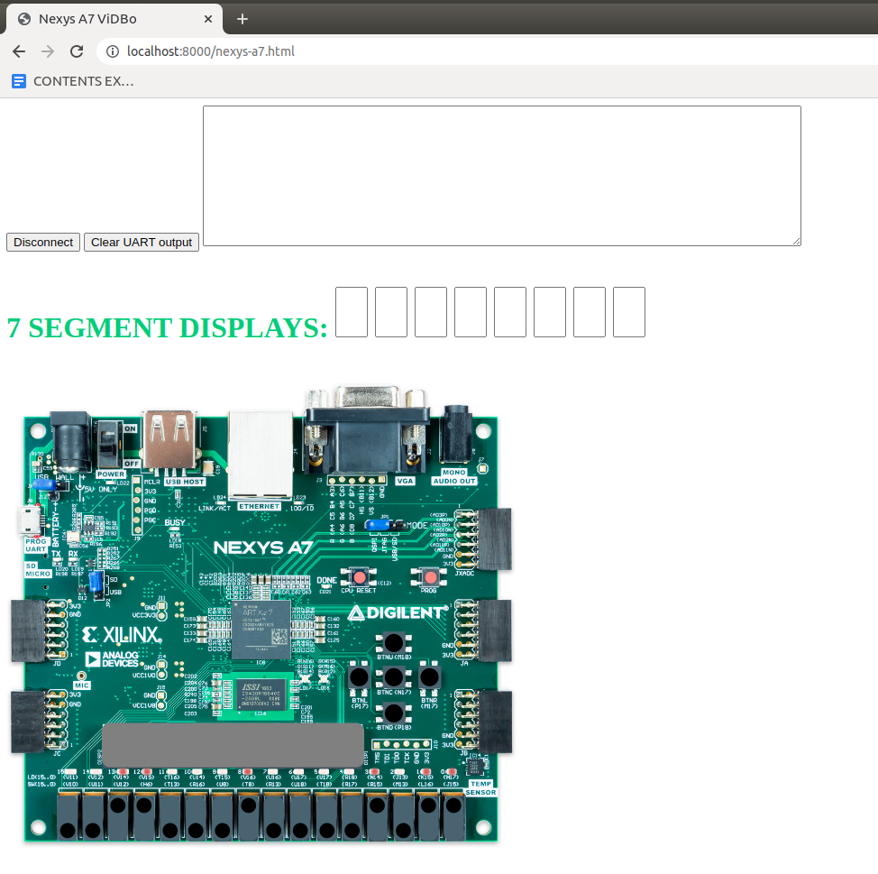
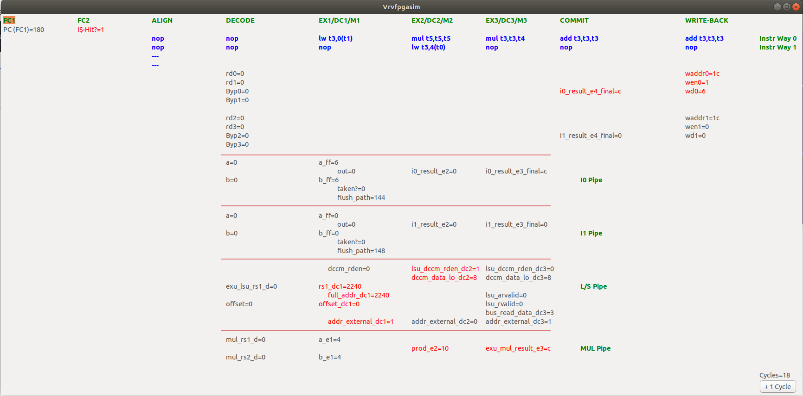

+ RVfpga-ViDBo: It performs a Verilator-based simulation of the RVfpga System and connects it with a Nexys A7 simulated board based on ViDBo, that allows you to communicate with some simulated peripherals on the board (at this moment the following peripherals are supported: 16 switches, 16 LEDs, UART, 5 pushbuttons, 8 7-Segment Displays). This new simulation tool is especially useful for RVfpga labs 6-10.

  

+ RVfpga-Pipeline: It performs a Verilator-based simulation of the RVfpga System that allows you to visualize different signals of the SweRV EH1 pipeline. This new simulation tool is especially useful for RVfpga labs 11-20.

  

